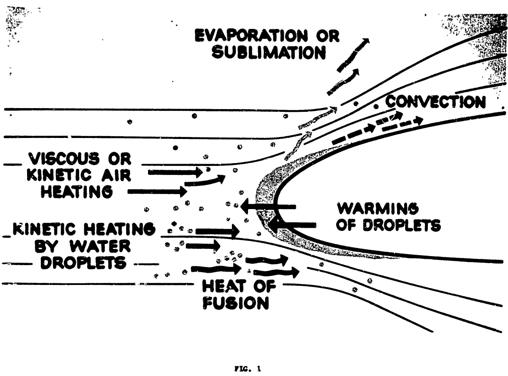
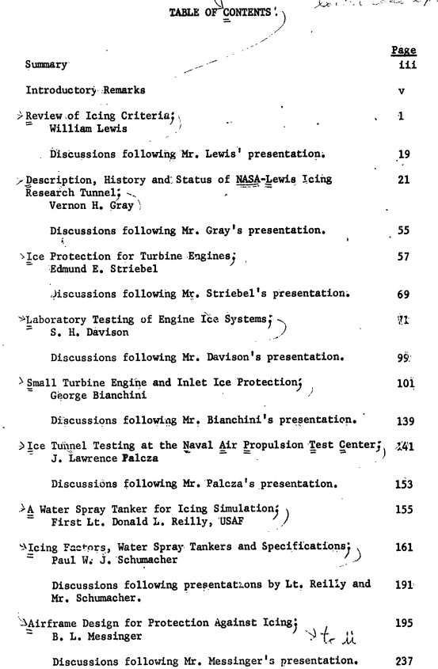
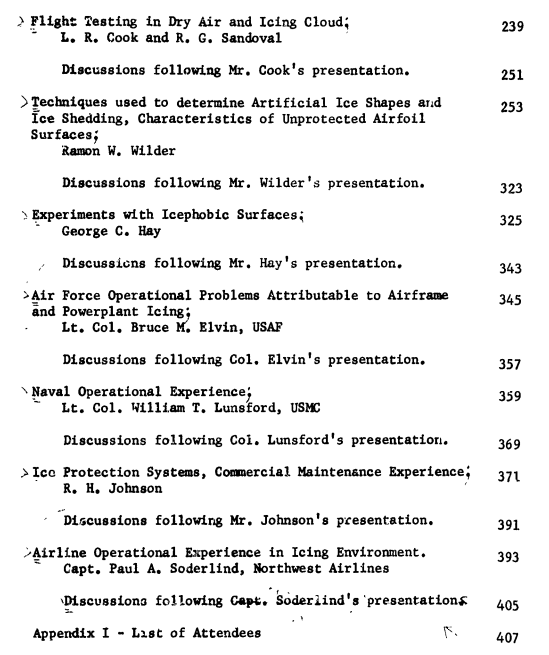

Title: The Greatest Thing That You Have (Probably) Never Read: 1969 Aircraft Ice Protection Report of Symposium
Date: 2022-12-13 13:00  
Category: Diversions
tags: diversions, icing conference  
 
### _"The subject of aircraft ice protection has provoked much controversy and discourse among theorists, designers, laboratory and test engineers, and flight operations people."_ [^1]

## Summary  

The state of the art in 1969 of aircraft icing is documented in 16 presentations.

## Abstract

> The subject of aircraft ice protection has provoked much controversy
and discourse among theorists, designers, laboratory and test
engineers, and flight operations people. In view of this diversity
of opinion and variety of approach, some difficulty has been
experienced in applying current standards and in maintaining
uniformity in the substantiation of aircraft ice protection.
This symposium recognized the need to exchange ideas and it
provided a general review of icing criteria, ice protection
standards, methods of compliance, and service experience. It
also served as a general refresher for Federal Aviation Administration
personnel involved in the evaluation of aircraft ice protection.
Technical papers were presented by government research and test
organizations, aircraft engine and aircraft manufacturers, military
services. and airline operators. The symposium presentations were
given by government and industry representatives with particular
expertise in the development, testing, operation, and maintenance
of aircraft ice protection systems.

> This report is intended to serve as a reference document to
supplement other information on the subject since it contains
current information on the icing environment and aircraft ice
protection.

>Technical papers were presented by government research and test
organizations, aircraft engine and aircraft manufacturers, military
services. and airline operators. The symposium presentations were
given by government and industry representatives with particular
expertise in the development, testing, operation, and maintenance
of aircraft ice protection systems.  

> This report is intended to serve as a reference document to
supplement other information on the subject since it contains
current information on the icing environment and aircraft ice
protection.

## Key points

1. The ["Selected Bibliography of NACA-NASA Aircraft Icing Publications"]({filename}/The Historical Selected Bibliography of NACA-NASA Icing Publications.md) makes its first appearance  
2. "[Safe operatons of aircraft in icing] should be accomplished through the inherent capability of the aircraft design rather than to rely upon operational restrictions ..."  
3. This was the first major meeting on aircraft icing since the NACA era.  

## Discussion

### Agenda

There is a rather full agenda, and there is something for everyone:  

Here is the Table of Content text transcribed, to be legible and searchable:
> TABLE OF CONTENTS  
Introductory Remarks  
Review of Icing Criteria; William Lewis  
Description, History and Status of NASA-Lewis Icing Research Tunnel; Vernon H. Gray  
Ice Protection for Turbine Engines; Edmund E. Striebel  
Laboratory Testing of Engine Ice Systems; S. H. Davison  
Small Turbine Engine and Inlet Ice Protection'; George Bianchini  
Testing at the Naval Air Propulsion Test Center; J. Lawrence Palcza  
A Water Spray Tanker for Icing Simulation; First Lt. Donald L. Reilly, USAF  
Icing Factors, Water Spray Tankers and Specifications; Paul W. J. Schumacher  
Airframe Design for Protection Anti-Icing; B. L. Messinger  
Flight Testing in Dry Air and Icing Cloud; L. R. Cook and R. G. Sandoval   
Techniques used to determine Artificial Ice Shapes and Ice Shedding, Characteristics of Unprotected Airfoil Surfaces; Ramon W. Wilder  
Experiments with Icephobic Surfaces; George C. Hay  
Air Force Operational Problems Attributable to Airframe and Powerplant Icing; Lt. Col. Bruce M. Elvin, USAF 345  
Naval Operational Experience; Lt. Col. William T. Lunsford, USM  
Ice Protection Systems, Commercial Maintenance Experience; R. H. Johnson  
Airline Operational Experience in Icing Airlines Environment.; Capt. Paul A. Soderlind, Northwest  
Appendix I - List of Attendees  

### Introductory remarks

> Mr. Stephen H. Rolle; Chief, Propulsion Branch, Engineering and
Manufacturing Division, in his capacity as symposium chairman,
extended a welcome to all industry, airline, military and
government representatives participating in the Federal Aviation
Administration symposium on aircraft ice protection. He then
introduced Mr. Sliff, Deputy Director, Flight Standards Service.

> Mr. Sliff advised the participants in the symposium that they
face a challenge in providing protection for the aircraft so that
it can be operated safely in any icing environment that may be
encountered. He also recommended that this should be accomplished
through the inherent capability of the aircraft design rather than
to rely upon operational restrictions to assure crew and passenger
safety. It was also stated by Mr. Sliff, that development aircraft,
such as the jumbo jets and supersonic transport, also pose a
challenge when it is realized that, in addition to the technical
problems associated with this advance in the state-of-the-art,
they must also have the capability to cope safely with such
adverse weather conditions as freezing rain, hail, icing, and
lightning. Mr. Sliff then emphasized the need for a review of
current design criteria and standards for aircraft ice protection,
and he expressed the hope that the symposium would be productive.
He also extended the support of his office in the accomplishment
of this objective.

> Mr. Slaughter, Chief, Engineering and Manufacturing Division,
agreed that the participants in the symposium should accept the
challenge presented to them. He also remarked that this symposium
recognized the need to develop aircraft ice protection criteria
on a sound and technical basis. He briefly reviewed the topics
listed in the planned technical program and expressed the
appreciation of the Federal Aviation Administration for the
presentations. It was noted that the technical papers for this
symposium were prepared by experts in icing phenomena and aircraft
ice protection from industry, the airlines, the military services,
and various government organizations.

> Mr. Rolls explained that a document will be published containing
all of the symposium technical papers and the discussions following
each presentation. These publications will be made available to
all of the attendees and to all interested parties who did not
have an opportunity to attend.

I emphasise:
> **"Mr. Sliff advised the participants in the symposium that they face a challenge in providing protection for 
the aircraft so that it can be operated safely in any icing environment that may be encountered. 
He also recommended that this should be accomplished through the inherent capability of the aircraft design 
rather than to rely upon operational restrictions to assure crew and passenger safety."**

I propose that a subtext here was the impending roll-out of new regulations (Amendment 135-12, December 3 1969), as described in [^2]. 
Jeck explains:
> Apparently, some operators complained that their airplane(s) were already certificated for flight
in icing but that Amendment 135-12 would not allow them to fly in icing conditions until four
months later in April after the icing season was practically over. The FAA responded
immediately with Amendment 135-13 which allowed the new exemptions to go into effect on
December 24, 1969. It also revised the wording again to nearly the form that it has today. 

The symposium does not appear to have gotten everyone on the same page (regulators, airlines, manufacturers, etc.) for the forthcoming regulations. 
Aircraft ice protection was "controversial" both before and after the symposium.

### The first icing meeting in an long time  

In his presentation "Airframe Design for Protection Anti-Icing" Messinger notes that 

> INTRODUCTION
It is many years since the subject of aircraft ice protection has been accorded
a place on the program of a technical society meeting, let alone designated the
sole topic of an entire meeting.
Like the ill-fated NACA Subcommittee on Icing
Problems which (was disbanded in 1957), it was at least temporarily displaced by
space age technical activities and budgets before all the necessary answers to
its problems had become completely evident.

### Predictions  

In his presentation "Airframe Design for Protection Anti-Icing" Messinger also notes that 

> One of the first things the writer/(speaker) did after being invited to make
this presentation was to comb through his file of reference material, and found
there a prior paper which he presented in 1952 at the S.A.E. National Aeronautics
Meeting in Los Angeles.
Design - 1952" (Ref. 1)*.
The title was "Ice Prevention as Related to Airframe".
As the title Implies, it was a progress report on the
state of the art as of that specific time period.
Except for certain deficiencies
in the prediction of aircraft design trends, this seventeen-year old paper is
reasonably applicable to most of today's problems in this field. One notable
example of the fuzziness of the 1952 crystal ball was the statement: "transport
aircraft seem to have reached their maximum size, probably as the result of airport 
and other economic considerations". In today's presentation, I shall try
to avoid such hazardous prognostications and limit myself to a presentation of
the state-of-the-art as we know it from our experience to this date.  

In the audience was Ramon Wilder, who two presentations 
later would discuss data on the ice shapes for the 747 jumbo jet, 
which was about to receive certification and enter service.

I have not been able to find Messinger's 1952 presentation, but I speculate that it was similar to [^3], 
which is the second most cited of all papers on aircraft icing (cited 733 times [^4]), 
second only to Langmuir and Blodgett [^5] (cited 740 times [^6]).  
 
Messinger could not resist at least expressing an aspiration, if not a prediction:

> In closing this 1969 state-of-the-art review, the writer/speaker feels that the
most important need in the present stage of the technology is the development of
a reliable method of predicting the size and shape of glaze ice formations for
both straight and swept wing leading edges...

It would take many years before the substantive ice shape predictions analysis programs would be available. 
Active development of ice shape prediction programs is still ongoing [^7].

### Must-reads

There is much to see here (388 pages).

We have already seen the ["Selected Bibliography of NACA-NASA Aircraft Icing Publications"]({filename}/The Historical Selected Bibliography of NACA-NASA Icing Publications.md) 
(not listed in the Table of Contents) that follows "Description, History and Status of NASA-Lewis Icing Research Tunnel".

I select the following as "must-reads":  

- Review of Icing Criteria; William Lewis  
- Airframe Design for Protection Anti-Icing; B. L. Messinger  
- ["Techniques Used to Determine Artificial Ice Shapes and Ice Shedding, Characteristics of Unprotected Airfoil Surfaces"; Ramon W. Wilder]({filename}wilder.md)  

These are likely candidates for future [Diversions]({filename}/diversions.md)

## Notes:
[^1]:
Anon., "Aircraft Ice Protection", the report of a symposium held April 28-30, 1969, by the FAA Flight Standards Service;  Federal Aviation Administration, 800 Independence Ave., S.W., Washington, DC 20590. [apps.dtic.mil](https://apps.dtic.mil/sti/pdfs/AD0690469.pdf)    
[^2]:
Jeck, Richard K.: A History and Interpretation of Aircraft Icing Intensity Definitions and FAA Rules for Operating in Icing Conditions. DOT/FAA/AR-01/91, November 2001. [faa.gov](https://www.faa.gov/sites/faa.gov/files/aircraft/air_cert/design_approvals/small_airplanes/aceReportAR-01-91.pdf)  
[^3]:
Messinger, B. L.: "Equilibrium Temperature of an Unheated Icing Surface as a Function of Air Speed", J. Aeronaut. Sci., 20, 29-41, 1953.  
[^4]: [scholar.google.com](https://scholar.google.com/scholar?hl=en&as_sdt=0%2C48&q=Equilibrium+Temperature+of+an+Unheated+Icing+Surface+as+a+Function+of+Air+Speed&btnG=)  
[^5]:
Langmuir, Irving, and Blodgett, Katherine B.: A Mathematical Investigation of Water Droplet Trajectories. Tech. Rep. No. 5418, Air Materiel Command, AAF, Feb. 19, 1946. (Contract No. W-33-038-ac-9151 with General Electric Co.)  
[^6]:
[scholar.google.com](https://scholar.google.com/scholar?hl=en&as_sdt=0%2C48&q=Mathematical+investigation+of+water+droplet+trajectories&btnG=)  
[^7]:
1st AIAA Ice Prediction Workshop in Conjunction with the AIAA AVIATION 2021 Forum All Virtual/Remote Participation 26-29 July 2021, [icepredictionworkshop.wordpress.com](https://icepredictionworkshop.wordpress.com/)  

