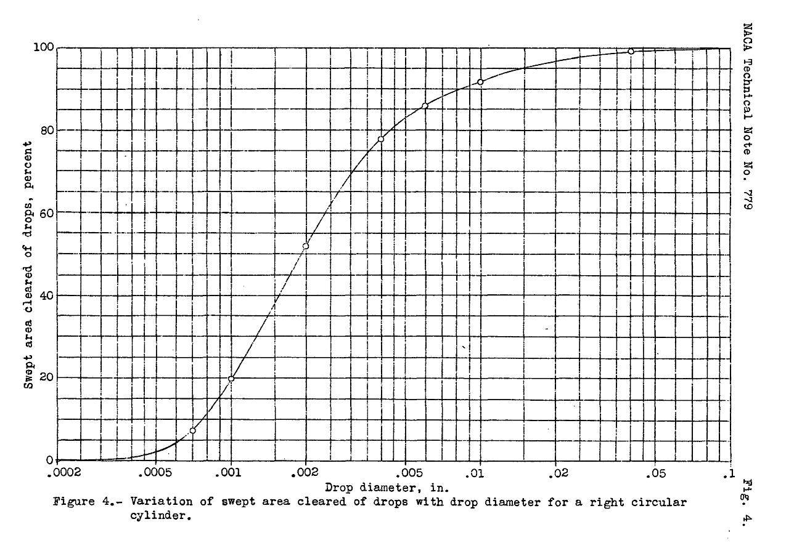
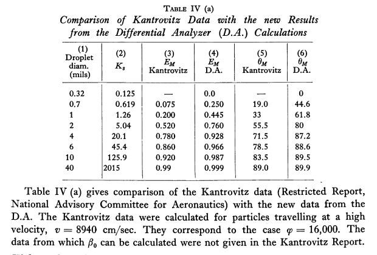
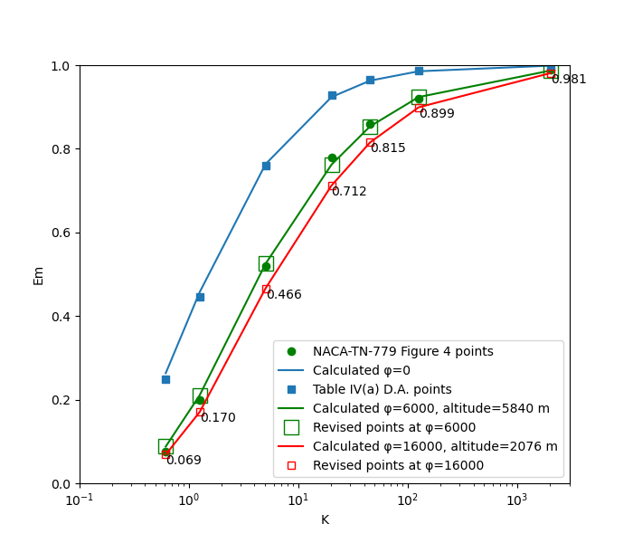

Title: A Detailed Comparison of Water Drop Impingement Calculations    
Date: 2022-01-25 12:00  
Category: NACA  
tags: cylinder, python  

### _"The discrepancies are of the magnitude to be expected from ... the step by step integration"_  

## Summary
Water drop impingement calculations on a cylinder from 
"Mathematical Investigation of Water Droplet Trajectories" [^1]
and NACA-TN-779 [^2] are compared.

## Key Points
1. There are differences in conditions in Table IV(a) of "Mathematical Investigation of Water Droplet Trajectories" compared to NACA-TN-779.
2. When the conditions are revised to match, the comparison with NACA-TN-779 data improves.

## Discussion

### NACA-TN-779

In [NACA-TN-779]({filename}NACA-TN-779.md), the water drop impingement on a cylinder 12 inch in diameter, 
with an airspeed of 200 mph, was analyzed. 
The altitude was not noted. Water drop diameters from 0.002 inch (about 8 micrometer) to 0.1 inch 
(about 4000 micrometer) were considered, as shown below.

The “swept area of cleared drops” represents what fraction of the water drops in the 
forward projected area of the cylinder impinge on the cylinder. 
In more modern terms, this is the total water impingement efficiency, Em, of reference [^1].

### Comparison to NACA-TN-779

"Mathematical Investigation of Water Droplet Trajectories" includes a comparison to the NACA-TN-779 data 
("Kantrovitz" [sic] in Table IV(a)). (see [^1] for an explanation of terms such as φ)

Note that Table IV(a) is in a section titled "φ = 0. Stokes' Law Applies", 
so presumably the values in Table IV are also for φ = 0.

In Table IV(a), it is stated that of the column (3) data "They correspond to the case φ = 16000". 
As NACA-TN-779 did not state an altitude or pressure value it is not clear how the φ value was determined.  
The pressure altitude for that case would be 2076 m. 

For the row with "Droplet diam. (mils)" = 2, the "Em D.A." value is 0.76. 

When Figure 2 is used to determine the Em value at K=5 as shown below, 
the Em = 0.76 value is found at φ = 0. 
So, it appears that the "Em D.A." column of Figure IV do indeed correspond to φ = 0.

It is not clear what was intended by comparing results from one method with results from another method 
at conditions that do not correspond.

For φ = 16000 the Em value is 0.47.

### Correlations Implementation

"Mathematical Investigation of Water Droplet Trajectories" [^1] has equations for correlations of the values in Figure 2. 
Those were implemented in a computer program [^3].

### Conditions Corresponding to NACA-TN-779

When conditions corresponding to NACA-TN-779 conditions are used, the comparison improves. 
To match conditions well, a value of φ = 6000 is used.

If [^2] was correct in that the value φ = 16000 for the NACA-TN-779 conditions, 
then there appears to be some difference in the initial conditions for the integration, 
or perhaps values of the air properties. Nonetheless, there is a fair match.

The python code used to produce the figure is available in the file "naca-tn-779.py". [^4]

## Notes:
[^1]:
[NACA-TN-779]({filename}/NACA-TN-779.md)
[^2]:  
[Mathematical Investigation of Water Droplet Trajectories]({filename}Mathematical Investigation of Water Droplet Trajectories.md)
[^3]: [Implementation of cylinder impingement correlations in Python]({filename}/Implementation of cylinder impingement correlations in Python.md)
[^4]: [https://github.com/icinganalysis/icinganalysis.github.io](https://github.com/icinganalysis/icinganalysis.github.io)  
