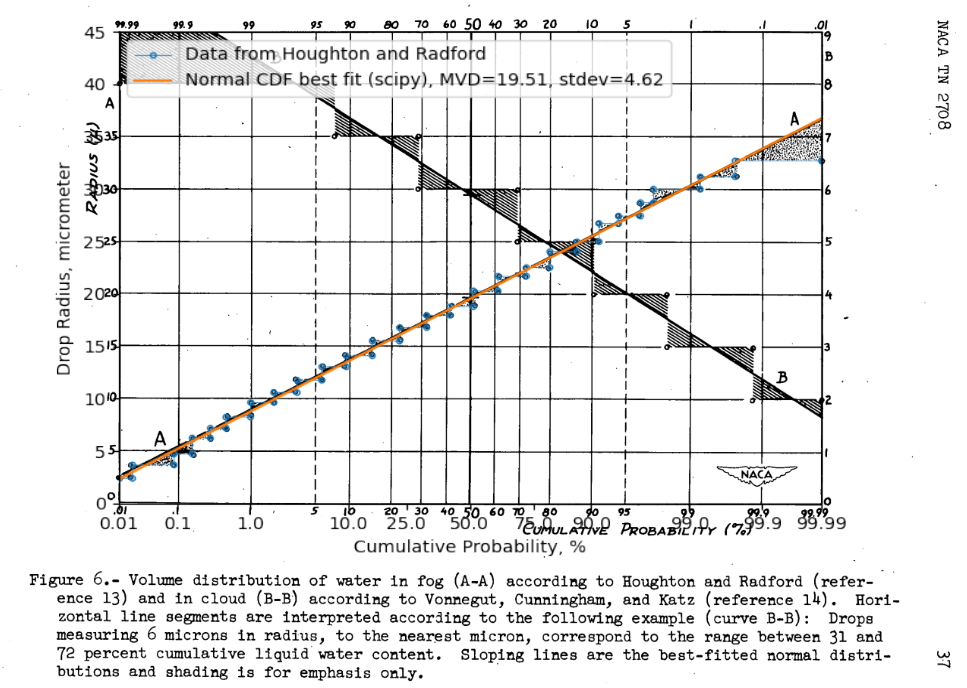
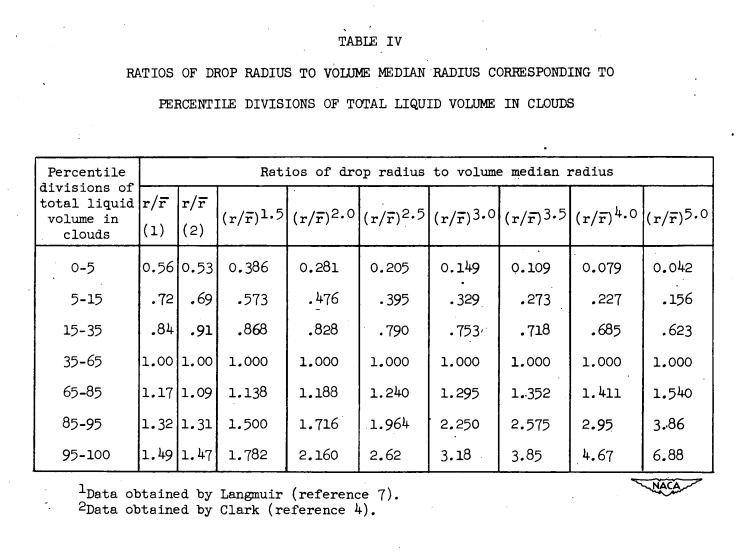

Title: A Langmuir B drop size distribution is (almost) a normal distribution   
Date: 2022-03-14 12:00  
Category: python  
tags: cylinders, python  

### _"Upon comparing this chart with Langmuir's tables, it was found that his selections of the representative radii for the various sub-divisions of the volume were in error." [^1]_  

## Summary  

The Langmuir B drop size distribution is almost a normal distribution.

## Key points  

1. The Langmuir B drop size distribution is almost a normal distribution.  
2. Perhaps it was originally intended that it be exactly a normal distribution.
3. The proposed alternatives in NACA-TN-2708 appears to have larger errors, rather than correcting errors.
4. The other Langmuir distributions (C, D, E) do not fit a normal distribution as well.

## Discussion

### Normal drop size distributions

[Normal distributions](https://en.wikipedia.org/wiki/Normal_distribution) show up many places in nature, 
so it is not surprising that drop sizes in clouds can approximate a normal distribution.  

In NACA-TN-2708 [^1], it was "presumed" that water-volume distribution with the
drop size is a Gaussian [normal] distribution:

> Drop-Size Distribution. - In the present report it is presumed,
following Howell (reference 6), that water-volume distribution with the
drop size is a Gaussian distribution, the breadth of which may be characterized 
by a modulus of distribution m that is defined by the relation:  

    m = (2)**0.5 * sigma / R_bar  

> where sigma is the standard deviation and R_bar is the volume median radius.
The distributions postulated by Langmuir (reference 7) and used in the
multicylinder method may be given numerical values as follows:

|Langmuir letter |A   |B   |C   |D   |E   |F   |G   |H   |J  |
|----------------|----|----|----|----|----|----|----|----|---|
|Modulus         |0.00|0.50|0.75|1.00|1.25|1.50|1.75|2.00|2.5|

NACA-TN-2708 [^1] noted that the Houghton and Radford data [^2] which Langmuir [^3] used did fit a normal distribution well. 
The data were digitized, and the normal fit was confirmed, as shown in the overlaid figure below.

However, the calculated value of m for this fit is 0.335, not the 0.5 value from the table above for a Langmuir B. 
As explained in wikipedia [^4], different constants have been used historically in the definition of the normal distribution. 
Here, the values differ by about sqrt(2), and sqrt(2) is one of the factors sometimes included or omitted in the definition. 

Clark [^5] recommended a different fit of the Houghton and Radford data in the column denoted by (2) than that found by Langmuir (1).  
 

NACA-TN-2708 states:
> Upon
comparing this chart with Langmuir's tables (reference 7), it was found
that his selections of the representative radii for the various sub-divisions 
of the volume were in error. The matter was not pursued further at the time, 
but as a part of the present study it was decided to
investigate the effect this error might have on the collection-efficiency
graphs, based on Langmuir's data, that have been used by virtually all
workers with the multicylinder method.

We will pursue this further herein. 

Langmuir [^6] did not state what distribution he used, other than 

> In our analysis (pages 264-265 of Part I) of the Houghton and Radford data
on size distribution it was concluded that their measurements were correct
when the covering fraction a was less than 0.1. In their paper they give a "volume
distribution curve" (Fig. 7), based on the microphotograph of the Fig. 4 for
which a = 0.072. As ordinates they plot the relative volumes (liquid water
content, Δw) of the droplets for equal increments of droplet radius.

However, a normal distribution was shown above to be a good fit of the Houghton and Radford data. 
So, using the Houghton and Radford data is in effect using a normal distribution. 

When the different distributions are compare to the normal fit of the Houghton and Radford data, 
there are differences from the ideal fit, but the values from Clark have the largest differences, 
particularly for the "15-35" and "65-85" bins. 

With normal distribution stdev = 0.237 (fit to Houghton and Radford):

| Percentile divisions of total liquid volume in clouds | Expected midpoint cumulative % | Drop size ratios to match midpoint cumulative % (normal distribution) | Drop size ratios (Langmuir B) | Calculate cumulative volume (Langmuir B), % | Drop size ratios (Clark) | Calculate cumulative volume (Clark), % |
|-------------------------------------------------------|--------------------------------|-----------------------------------------------------------------------|-------------------------------|---------------------------------------------|--------------------------|----------------------------------------|
| 0-5                                                   | 2.5                            | 0.54                                                                  | 0.56                          | 3.2                                         | 0.53                     | 2.4                                    |
| 5-15                                                  | 10                             | 0.7                                                                   | 0.72                          | 11.9                                        | 0.69                     | 9.5                                    |
| 15-35                                                 | 25                             | 0.84                                                                  | 0.84                          | 25.0                                        | 0.91                     | 35.2                                   |
| 35-65                                                 | 50                             | 1.0                                                                   | 1.0                           | 50.0                                        | 1.0                      | 50.0                                   |
| 65-85                                                 | 75                             | 1.16                                                                  | 1.17                          | 76.3                                        | 1.09                     | 64.8                                   |
| 85-95                                                 | 90                             | 1.3                                                                   | 1.32                          | 91.2                                        | 1.31                     | 90.5                                   |
| 95-100                                                | 97.5                           | 1.46                                                                  | 1.49                          | 98.1                                        | 1.47                     | 97.6                                   |

With normal fit distribution rounded to stdev = 0.25, the Langmuir B matches some of the bins exactly, 
while the large differences for the Clark values remain.

| Percentile divisions of total liquid volume in clouds | Expected midpoint cumulative % | Drop size ratios to match midpoint cumulative % (normal distribution) | Drop size ratios (Langmuir B) | Calculate cumulative volume (Langmuir B), % | Drop size ratios (Clark) | Calculate cumulative volume (Clark), % |
|-------------------------------------------------------|--------------------------------|-----------------------------------------------------------------------|-------------------------------|---------------------------------------------|--------------------------|----------------------------------------|
| 0-5                                                   | 2.5                            | 0.51                                                                  | 0.56                          | 3.9                                         | 0.53                     | 3.0                                    |
| 5-15                                                  | 10                             | 0.68                                                                  | 0.72                          | 13.1                                        | 0.69                     | 10.7                                   |
| 15-35                                                 | 25                             | 0.83                                                                  | 0.84                          | 26.1                                        | 0.91                     | 35.9                                   |
| 35-65                                                 | 50                             | 1.0                                                                   | 1.0                           | 50.0                                        | 1.0                      | 50.0                                   |
| 65-85                                                 | 75                             | 1.17                                                                  | 1.17                          | 75.2                                        | 1.09                     | 64.1                                   |
| 85-95                                                 | 90                             | 1.32                                                                  | 1.32                          | 90.0                                        | 1.31                     | 89.3                                   |
| 95-100                                                | 97.5                           | 1.49                                                                  | 1.49                          | 97.5                                        | 1.47                     | 97.0                                   |

I do not have a copy of Clark's paper to check if things were transcribed accurately in NACA-TN-2708. 
Perhaps the values from Clark used different bin sizes, that were not noted in Table IV, 
and perhaps they were more accurate.

Rather than correcting errors, including the values from Clark in NACA-TN-2708 appears to have introduced larger errors.

¯\\_(ツ)_/¯

Perhaps it is just as well that the alternative distributions from NACA-TN-2708 were not widely adopted.

We can compare a Langmuir B distribution to the normal distribution fit of the data:
Both the "step" representation of the Langmuir distribution (first seen in NACA-TN-1393 [^7]) 
and a line representation are shown.  

The other Langmuir distributions do not match a normal distribution well. 
A significant portion of the LWC has negative drop sizes with the broader normal distributions.  

The code producing the normal fit charts and the comparison tables is available in the file "NACA-TN-2708.py" [^8]

You may find a more general discussion of NACA-TN-2708 in the review [NACA-TN-2708]({filename}NACA-TN-2708.md). 

## Notes  

[^1]: 
Howell, Wallace E.: Comparison of Three Multicylinder Icing Meters and Critique of Multicylinder Method. NACA-TN-2708, 1952. [ntrs.nasa.gov](https://ntrs.nasa.gov/citations/19810068732) [ntrs.nasa.gov](https://ntrs.nasa.gov/citations/19810068732)  
[^2]: 
Houghton, H. G., and Radford, W. H.: On the Measurement of Drop Size and Liquid Water Content in Fogs and Clouds. Papers in Phys. Oceanography and Meteorol., M.I.T. and Woods Hole Oceanographic Inst., vol. VI, no. 4, Nov. 1938.  
[^3]: 
[Mathematical Investigation of Water Droplet Trajectories]({filename}Mathematical%20Investigation%20of%20Water%20Droplet%20Trajectories.md)  
[^4]:
[Normal distribution at en.wikipedia.org](https://en.wikipedia.org/wiki/Normal_distribution#Standard_normal_distribution)  
[^5]:
Clark, Victor F.: The Multicylinder Method. Mt. Wash. Observatory Monthly Res. Bull., vol. II, no. 6, June 1946.  
[^6]:
Langmuir, Irving: Super-Cooled Water Droplets in Rising Currents of Cold Saturated Air, Pt. I. Res. Lab., General Electric Co., Oct. 1943-Aug. 1944. (Army Contract W-33-106-sc-65.)  
[^7]: Lewis, William: A Flight Investigation of the Meteorological Conditions Conducive to the Formation of Ice on Airplanes. NACA-TN-1393, 1947. [ntrs.nasa.gov](https://ntrs.nasa.gov/citations/19930082038)
[^8]: [github.com](https://github.com/icinganalysis/icinganalysis.github.io)  
