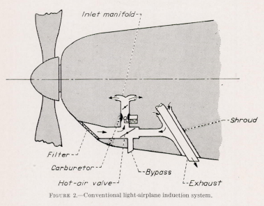
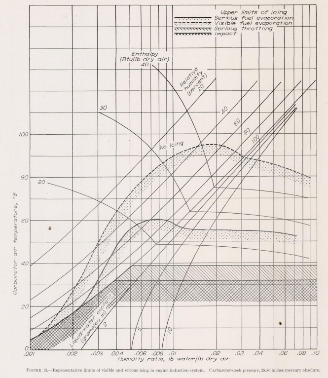
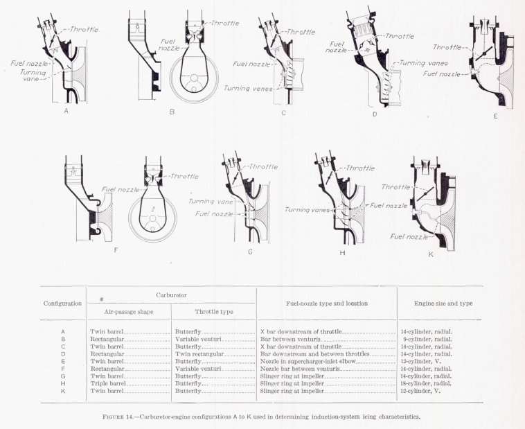
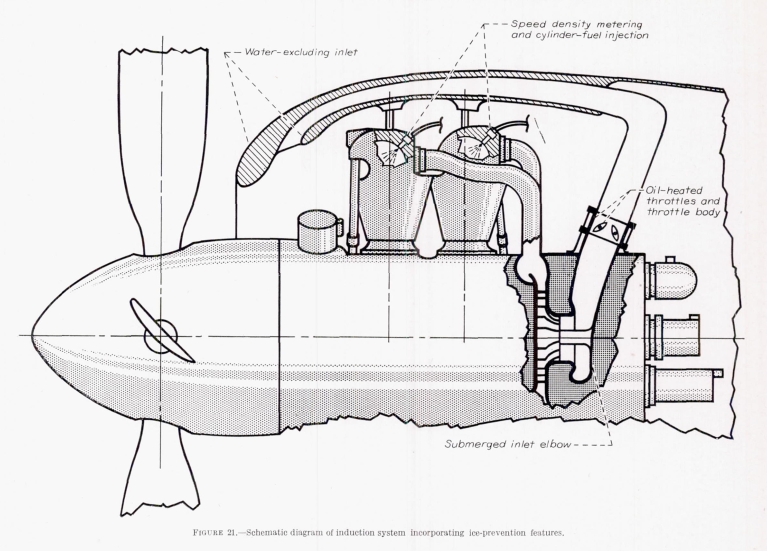

title: Carburetor and Induction Systems  
Date: 2023-02-02 12:00  
tags: ice protection, carburetors  

### _"A demon was operating the throttle." S. W. Sparrow, 1920. [^1]_  

  
_From NACA-TR-982._

## Summary  

Carburetor icing has been a known hazard for over 100 years, and
many protection strategies were studied in the NACA-era.  

## Key Points  

1. Carburetor icing has been a known hazard for over 100 years.  
2. Part of the hazard can occur in clear air (throttling icing and fuel-evaporation icing).  
3. "The NACA induction-system icing program at the National Bureau of Standards was initiated in January 1941. The project is financed jointly by the Army, the Navy, and the National Advisory Committee for Aeronautics."  
4. Numerous tests and studies were conducted in the NACA-era.  
5. Many aircraft today have carburetor protection similar to that developed in the NACA-era.  

## Discussion  

The spark ignition, Otto cycle engines 
commonly used on airplanes in the NACA-era 
typically had carburetors to control the air and fuel entering the cylinders for combustion. 
These could be affect by ice formation. 

However, ice could form not just by supercooled water drops
impinging ("impact" ice), but also by humidity in the air
condensing as air flow expanded through the throttle plate or carburetor venturi ("throttle ice"). 
Also, the injection of the volatile fuel (typically gasoline), 
causes a further temperature drop (fuel-evaporation ice). 
So, ice can form even if the ambient air temperature is warm 
(well above freezing) and in clear air.  

Sometimes the ice froze the throttle plate in one position. 
Enough ice could accumulate in severe cases to seriously impede the air flow, 
limiting engine power and thrust.  

>The history of carburetor icing dates back over 20 years. 
The earliest report is a paper published in 1920 by S. W. Sparrow, 
then of the National Bureau of Standards, in which he described 
the phenomena and pointed out that many unexplained airplane crashes
almost certainly could be attributed to this cause. 
He described the icing action as giving the pilot the impression that: 
"A demon was operating the throttle." [^2]  

## "Airplane Crashes: Engine Troubles. A Possible Explanation". S. W. Sparrow, NACA-TN-55, 1921. [^3]  

>The real blow to aviation comes when no satisfactory explanation 
for the accident is forthcoming. 
Knowledge of what is wrong must precede any intelligent effort 
to make a thing right.  
...  
To bring attention to one possible cause of such unexplained accidents 
this note has been prepared for the National Advisory Committee for Aeronautics.  

>In testing airplane engines at the Bureau of Standards 
it has happened frequently that the engine performance becomes erratic 
when the temperature is between 0 C (32 F) and 20 C (68 F). 
Investigation revealed the collection of snow 
somewhere between the entrance of the carburetor and the manifold, 
probably at the throttle. 
Experiments in the carburetor test plant had shown the possibility of this trouble. 
In fact, a glass portion of the induction system made it possible
for one actually to see the snow as it collected. 

Note that these tests were made with "dry" air 
(no water drops, but with apparently natural humidity levels).  

>Discussion thus far may have emphasized unduly loss of power 
instead of what is probably the more serious effect, 
excessive fluctuations in power [due to snow forming and shedding]. 
Under these conditions a pilot is exactly in the same position 
as though his engine were controlled by a lunatic, 
opening and closing the throttle at will. 
Yet, in the case of an accident, 
before an examination could be made 
the snow would have melted leaving no evidence to 
confirm the pilot's report of trouble. 

Heating the air into the carburetor can prevent the ice formation, 
but that also reduces thrust (by lowering the air density). 
Sparrow urges caution when seeking solutions:

> This note is not intended as a sweeping recommendation 
of additional air heating for every airplane engine. 
Such a course would be akin to prescribing medicine for a patient 
without first being assured that he was really sick. 
The aim is to call attention to a 'disease' to which aviation engines are subject, 
to describe its symptoms, and to emphasize its seriousness. 
Methods of prevention or cure can be consigned with safety to those vitally concerned.  

## NACA induction-system icing program, 1941  

_"The NACA induction-system icing program at the National Bureau of Standards was initiated in January 1941. The project is financed jointly by the Army, the Navy, and the National Advisory Committee for Aeronautics."_ [^2]  

Several publications resulted from this program. 
Some are listed below, but I doubt that I found all of them. 
Many are not included in [The Historical Selected Bibliography of NACA-NASA Icing Publications]({filename}The Historical Selected Bibliography of NACA-NASA Icing Publications.md).    

- "The Icing Problem in Aircraft Induction Systems", SAE Transactions, Vol 50, 1942.  
- "Icing Tests of Aircraft-Engine Induction Systems", NACA-WR-W-97, Jan. 1943.  
- "De-Icing of an Aircraft Engine Induction System", NACA-ARR-3H13, 1943.  
- "A Laboratory Investigation of Icing and Heated-Air De-Icing of a Chandler-Evans 1900 CPB-3 Carburetor Mounted on a Pratt & Whitney R-1830-C4 Intermediate Rear Engine Section", NACA-ARR-E4J03, 1944.  
- "A Laboratory Investigation of the Icing Characteristic of the Bendix-Stromberg Carburetor Model PD-12F5 with the Pratt & Whitney R-1830-C4 Intermediate Rear Engine Section", NACA-ARR-E4J18 , 1944.  
- "Laboratory Investigation of Icing in the Carburetor and Supercharger Inlet Elbow of an Aircraft Engine, I- Description of Setup and Testing Technique", NACA-MR-E5L19, 1945.  
- "Laboratory Investigation of Icing in the Carburetor and Supercharger Inlet Elbow of an Aircraft Engine, III- Heated Air as a Mean of De-Icing the Carburetor and Inlet Elbow", NACA-MR-E5L19, 1945.  
- "Laboratory Investigation of Ice Formation and Elimination in the Induction Systems of a Large Twin-Engine Cargo Aircraft", NACA-TN-1427, 1947.
- "Investigation of Icing Characteristics of Typical Light-Airplane Engine Induction System", NACA-TN-1790, 1949.  
- "Icing-Protection Requirements for Reciprocating-Engine Induction Systems", NACA-TR-982, 1950. (Supersedes NACA-TN-1993.)  
- "Investigation of Aerodynamic and Icing Characteristics of Flush Alternate-Inlet Induction-Systems Air Scoop", NACA-RM-E53E07, 1953.  

I will briefly review selected publications.  

## The Icing Problem in Aircraft Induction Systems [^2]  

>Heat and alcohol are the most common de-icing mediums, 
but they offer the disadvantages of loss in power and increased weight. 
The protected air intake is effective if the rate of water ingestion 
can be reduced during precipitation and the air temperature raised high enough 
to be effective during severe icing conditions.  
The ideal induction system requires none of these, 
and work is being done in hopes of reaching this goal.  
The research program was initiated by the Special Subcommittee on
Induction Systems De-Icing of the NACA. The project was setup at the 
Bureau of Standards, as there were well equipped to handle this sort of work. 
The apparatus is described and the method outlined for establishing the icing conditions.  
Types of induction ice are described and pictures of ice during formation are shown. 
Preliminary results are summarized as follows:  
>1. The rate of ice accretion was roughly proportional to the rate of water ingestion.  
>2. Through the lower temperature range, the smaller the droplet size, 
the faster the rate of ice accretion for a given rate of ingestion.  
>3. The most dangerous condition was found to be around 30 F air temperature 
and small droplet size.  
>

## "De-Icing of an Aircraft Engine Induction System", NACA-ARR-3H13, 1943. [^4]  

This investigated fluid de-icing and hot air de-icing. 
Fluids included "Sclox D-I, isopropyl alcohol,
anhydrous ethyl alcohol, S. D. 30, and Shellacol". 
Fluids on the order of 60 pounds per hour were 
required to be injected into the carburetor to achieve adequate 
deicing. Alternatively, 
introducing enough hot air to raise the intake temperature to 
80 F was effective. 

## "Icing-Protection Requirements for Reciprocating-Engine Induction Systems", NACA-TR-982, 1950. [^5]  

This publication serves as an excellent summary of the previous decade of studies.  

>SUMMARY  
>Despite the development of relatively ice-free fuel-metering
systems, the widespread use of alternate and heated-air intakes,
and the use of alcohol for emergency de-icing, icing of aircraft-engine 
induction system is a serious problem. Investigations
have been made to study and to combat all phases of this icing
problem. From these investigations, criterion for safe operation 
and for design of new induction systems have been established.  
The results were obtained from laboratory investigations of
carburetor-supercharger combinations, wind-tunnel investigations 
of air scoops, multicylinder-engine studies, and flight
investigations. Characteristics of the three forms of ice, impact,
throttling, and fuel evaporation, were studied. The effects of
several factors on the icing characteristics were also studied and
included (1) atmospheric conditions, (2) engine and air-scoop
configurations, including light-airplane systems, (3) type of
fuel used, and (4) operating variables, such as power condition,
use of a manifold pressure regulator, mixture setting, carburetor
heat, and water-alcohol injection. In addition, ice-detection
methods were investigated and methods of preventing and removing 
induction-system ice were studied. Recommendations
are given for design and operation with regard to induction-system icing.  
>
>INTRODUCTION  
Ice formation within an aircraft-engine induction system
are serious hazards because:  
>(1) the critical areas may be
sufficiently restricted to reduce considerably the flow of
combustion air to the engine;  
>(2) the fuel-metering process
may be upset and cause erratic engine operation; or  
>(3) the movable part, such as the throttle or the heat damper, may
freeze and become inoperative.  

>The icing problem remains a serious hazard, despite the
fact that the induction systems on most licensed aircraft are
capable of providing sufficient protection in all weather
conditions if the protection is correctly applied and at the
proper time. Because the symptoms of carburetor icing are
often similar to those associated with other engine operating
difficulties, the pilot must be familiar with the aspect of
induction-system icing if proper protection is to be promptly
applied with most protective systems now in use.

 

 

>Representative limiting curve of serious and visible icing
are plotted on the basis of carburetor-air temperature with
relation to humidity ratio in figure 13. Lines of constant
enthalpy, relative humidity, and liquid-water content are also
shown. Although the term humidity ratio applies strictly
to the ratio of water vapor and air, for convenience the
liquid-water content has also been included in the humidity-
ratio term herein.  

 

 

>An induction system incorporating features to reduce the
intake of free water into the system, to prevent throttling
icing, and to eliminate fuel-evaporation icing is illustrated
in figure 21.  

  

>Elimination of impact ice. Impact icing can be prevented
if the free water is eliminated from the air that contacts or
flows through the induction system. A pointed out in the
discussion of icing of inlets and duct, a system that incorporates 
some type of inertial separation can be made to
eliminate most of the free water from the inlet air. The
elimination of free water in the system will eliminate the
icing conditions represented by the area to the right of the
saturation line in figure 13. Complete water elimination is
very difficult to achieve, but sufficient protection can be
afforded by careful and proper design of an inertia-separation
system that will maintain high ram recovery and insure safe
engine operation in impact-icing conditions.  
> 
>Elimination of throttling ice. Throttling ice can be eliminated 
by locating the throttling device in a warmed region,
such a between the engine-stage supercharger and the
cylinders, or by the application of heat to the conventional
throttle, throttle body, and downstream surface (fig . 21).
Double opposed throttle or variable venturi throttle in
rectangular carburetors were found to be relatively free from
throttling ice as compared with the butterfly-type throttle.
Many British carburetors and throttle bodies with butterfly-
type throttles, however, are automatically protected from
icing by the forced circulation of hot engine oil through
carburetor jacket and hollow throttle plate. Throttling
ice can be eliminated without resorting to special heating by
locating the more desirable type of throttle in a warm
region of the induction system.  
>
>Elimination of fuel-evaporation ice. Fuel-evaporation
ice, which occurs when the removal of the latent heat of vaporization of 
fuel cool the airstream and surrounding metal parts
below freezing, may be effectively prevented by injecting the
fuel at any location beyond which the passage surface are
maintained above freezing. Thus, injection of the fuel
directly into each cylinder (fig. 21) will obviously preclude
the possibility of fuel-evaporation icing. In engine with
centrifugal superechargers, fuel-evaporation ice can be
eliminated by introducing the fuel at or downstream of the
face of tbe impeller in a manner that will avoid splashback
of tbe fuel from the impeller blades, such as can occur if the
injection device is stationary (reference 18). The use of
impeller fuel injection limit icing to throttling and impact
type that occur below 40° F (fig. 18).

  

## Conclusions  

Carburetor icing remains a potential hazard for aviation. 
Many aircraft that are not intended for flight in icing conditions 
have carburetor heating to protected against icing in clear air conditions 
(throttling ice and fuel-evaporation ice).  

## Citations  

An online search (scholar.google.com) found  
no citations for "Icing Problems in Aircraft Induction Systems", 
one citation for NACA-TN-55, 
four citations for NACA-ARR-3H13,
and 10 citations of NACA-TR-982.  

I view "Icing Problems in Aircraft Induction Systems" and 
NACA-TN-55 as under-appreciated, "almost lost gems" of the NACA-era.  

## Notes  

[^1]: Attributed to S. W. Sparrow in 
"Icing Problems in Aircraft Induction Systems" [^2]. 
However, a citation was not included, and I have not been able to find the 1920 publication. 
NACA-TN-55, by Sparrow and published in 1921, did not include the quote.  
[^2]: Kimball, Leo B.: "Icing Problems in Aircraft Induction Systems". SAE Transactions
Vol. 50 (1942), pp. 40-51 (12 pages).  
[^3]: Sparrow, Stanwood S.: "Airplane Crashes: Engine Troubles. A Possible Explanation". NACA-TN-55, 1921.  
[^4]: Essex, Henry A.: De-Icing of an Aircraft Engine Induction System. NACA-ARR-3H13, 1943.  
[^5]: Coles, Willard D., Rollin, Vern G., and Mulholland, Donald R.: Icing-Protection Requirements for Reciprocating-Engine Induction Systems. NACA-TR-982, 1950. (Supersedes NACA-TN-1993.)  

