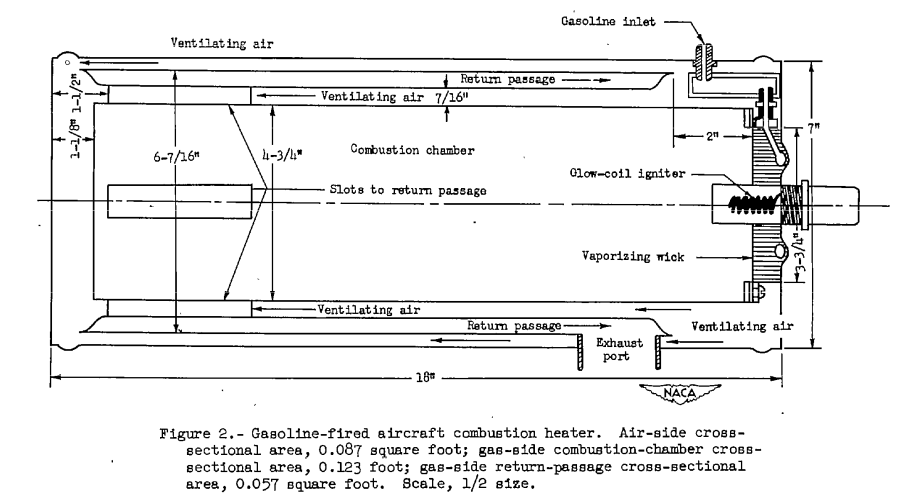

Title: Combustion heated air and heat transfer coefficients  

###_"an effective system for ... wing surfaces to prevent the formation of ice requires knowledge"_  

  
_Figure 2 of NACA-ARR-A506_  

##Summary  

Combustion heated air, independent of the engines, was used on some aircraft.  

##Key Points  

1. Combustion heaters were developed independently of NACA.  
2. 38 NACA publications detail technical aspects of aircraft heaters, 
including many details on heat exchangers, maturing engineering designs.  
3. Three publications deal with heat transfer for ice protection.  

##Discussion  

There were numerous NACA publications on aircraft heaters. 
For the combustion heaters, air was scooped in, 
heated by burning aviation gasoline, 
and used for cabin heating, and wing ice protection on some airplanes
(The DC-6, for example). 

Combustion heaters were developed independently of NACA 
prior to these NACA publications. 
However, the NACA publications very much detailed 
the design of not just the heaters, 
but also associated heat exchangers and components, 
as well as data needed for analysis 
(such as "An Investigation of Aircraft Heaters, II - Properties of Gases", NACA-WR-W-9).  

The publications are numbered up to XXXVIII (38).
I think that the large number of publications reflects 
the importance of the technology at the time.  

While none of the Aircraft Heaters publications are in the 
["Selected Bibilography of NACA-NASA Aircraft Icing Publications"
]({filename}/The Historical Selected Bibliography of NACA-NASA Icing Publications.md), 
some pertain directly to ice protection:  

- Martinelli, R. C., Guibert, A. G., Morrin. E. H., and Boelter, L. M. K.: An Investigation of Aircraft Heaters VIII - A Simplified Method for the Calculation of the Unit Thermal Conductance over Wings. NACA-WR-W-14, Mar. 1943. [^1]  
- Boelter, L. M. K., Grossman, L. M., Martinelli, R. C., and Morrin, E. H.: An Investigation of Aircraft Heaters XXIX - Comparison of Several Methods of Calculating Heat Losses from Airfoils. NACA-TN-1453, 1948. [^2]  
- Boelter, L. M. K., Sanders, V. D., Romie, F. E.: An Investigation of Aircraft Heaters XXXVIII : Determination of Thermal Performance of Rectangular- and Trapezoidal-shaped Inner-skin Passages for Anti-icing Systems. NACA-TN-2524, 1951. [^3]   

These three publications detail aspects of heat transfer 
that are important to the analysis and design of heated ice protection systems. 

##NACA-WR-W-14 [^1]  

>SUMMARY  
>
>A simplified approximate method of calculating 
the unit thermal conductance along an airfoil as a function
of distance from the leading edge, by use of heat
transfer
data for smooth cylinders and smooth flat plates,
is presented. 
Heat transfer rates experimentally obtained by several 
investigators on models of airfoil sections 
R.A.F. 25, R.A.F. 30, Clark Y, and NACA M-6 are compared with results
predicted by the use of this method. 
Calculation of heat transfer rates to be expected 
from a full-scale airplane wing are also given.

The "unit thermal conductance" here is the convective heat transfer coefficient.  

>INTRODUCTION  
>The design of an effective
system for the distribution.
of heat over wing surfaces to prevent the formation
of ice requires a knowledge
of the unit thermal conductances
along such surfaces.  
>In order to utilize existing heat-transfer data 
to calculate these unit conductance,
the following ideal system is defined:  
The leading edge of the airfoil is replaced
by a right circular cylinder with a radius approximately
equal to the radius of curvature
of the leading edge and the
upper and the lower surfaces of the airfoil are replaced by
smooth flat plates. 
The mechanism
of heat transfer along the 
leading edge of the airfoil then corresponds
to that existing over smooth right circular cylinders,
and the mechanism
along the remainder
of the airfoil is postulated
to be equivalent to that existing over smooth flat plates.  

The later "Modern Icing Technology" [^4] has a figure that 
somewhat matches the idealized system:

  

The equations for "existing heat-transfer data" are noted on Figure 2.   

   

The idealized system works well at low angles of attack:  

   

But the method is more approximate at higher angles of attack:  

   

>CONCLUSIONS  
>1. The variation of the unit thermal conductance
along a wing can be estimated fairly accurately
by an approximate method from known heat-transfer data on
smooth cylinders and flat plates.  
>2. An exact computation of the distribution of the unit 
conductance along a wing requires the determination
of the position of the transition of the boundary layer
from laminar to turbulent flow.
Such knowledge is necessary for the proper determination 
of the heat-distribution system in the leading edges.  
>3. A precise agreement between the predicted and experimental
results data taken on small airfoil models is not
to be expected because the transition point may occur over
a large parentage of the chord in the case of models,
depending on the conditions of flow; but this change in
position comprises a small part of the chord in the case
of full-size wings.
>4. The method proposed herein is satisfactory,
however, for a conservative
estimate of the thermal capacity
of a de-icing system.
The accuracy of the method is greater
for high velocities
and for heating sections that extend
over a larger part of the profile.
The velocity along the
airfoil can be obtained from static-pressure
measurements or, if these data are not available,
can be estimated from an equation given herein.  

##NACA-TN-1453 [^2]  

>SUMMARY  
A critical comparison and summary is given of the various methods
proposed to date for calculating the unit thermal conductance on the
outer surface of a heated wing involving both laminar and turbulent
boundary layers,
and a new equation is suggested which should indicate
the effect of the pressure gradient on the laminar heat transfer to a
greater degree than do the expressions presented heretofore. For
purposes of comparison 
the different equations are applied to a Joukowski 
profile for which the necessary
data are accurately known and the results
are plotted graphically. The unit thermal conductance in the laminar
and turbulent regimes computed by the different methods are found to be
in good agreement.
A procedure whereby the equations for heat transfer
from airfoil surfaces may be applied to a propeller shape is presented
by means of an illustrative example.

Five methods of calculation were compared.  
  

  

  

<!--
  
-->

There are numerous pages detailing the boundary layer theories used.  

However, in the end, there is little data to select one method over another, 
as they yield similar results. 

##NACA-TN-2524 [^3]  

This provides detailed data for use if one wishes to analyze and 
design double skin passages.  

>INTRODUCTION
Values of the unit thermal conductance for air flowing inside the
double-skin passages must be known in order to design a heated-air,
leading-edge, anti-icing system.
Most of the available data on the thermal conductances for flow of
air inside ducts concern the values at points far downstream fram the
duct entrance.
(Reference 1, however, contains values of the local
thermal conductance near the entrance of a circular tube.) Data which
define the local heat-transfer rate throughout the length of heated
straight ducts are presented herein.

  

  

  

>CONCLUSIONS
From an investigation of the thermal performance of rectangular- 
and trapezoidal-shaped inner-skin passages for anti-icing systems, the
following conclusions are drawn:  
>1. In the turbulent region, the average unit thermal conductance
for both the trapezoidal and rectangular ducts is about 35 percent less
than the values obtained from commonly used equations.  
>2. Heat-transfer and pressure data obtained for the trapezoidal
duct over a range of Reynolds moduli between 1300 and 16,000 indicate
that the flow was turbulent.  
>3. Data obtained for rectangular ducts reveal that the flow may be
laminar at values of Reynolds modulus below 1800. Examination of the
local heat-transfer rates indicates that the flow may be laminar near
the entrances of the double-skin passages even for large values of
Reynolds modulus.  
>4. Measurements of the temperature of the inner-skin surfaces
indicate that the inner skin is effective in transferring heat to the
outer skin and that perfect bonding of the two surfaces is not necessary.
>5. Isothermal pressure drops are predictable within about 20 percent.  
>6. Additional data should be obtained to establish the effect of
various types of entrance (such as are used in actual systems) on the
heat-transfer and pressure-drop characteristics of the double-skin
passages.  

##Conclusions  

These publications mark some of the maturation of ice protect 
from being largely empirical to an engineering discipline 
where thermal systems could be designed with analysis, 
with good confidence that the results were reproducible. 

The leading edge cylinder and flat plate approximation for
airfoil heat transfer is not credited to a reference in NACA-WR-W-14. 
I am not entirely certain, however, that it originated there. 
[ADS-4]({filename}ads4.md) perpetuates its use 
(and the origins are not credited there, either), 
and I would not be surprised if it is still in use today.  

>  

One may note that L. M. K. Boelter was an author on the three publications above, 
as well as many of the 38 Aircraft Heater publications. 
He was a Professor of Mechanical Engineering at the University of California, Los Angeles, 
and founding Dean of its UCLA Henry Samueli School of Engineering and Applied Science. 
He is also known for the Dittus-Boelter equation. In 1957 he was awarded the ASME Medal. 
[wikipedia](https://en.wikipedia.org/wiki/Llewellyn_M._K._Boelter)  

##Citations  

An online search (scholar.google.com) found citations for  
NACA-WR-W-14 8 times,  
NACA-TN-1453 4 times,  
NACA-TN-2524 4 times,  
and "Modern Icing Technology" one time. 

One may note that publications where L. M. K. Boelter is an author 
are cited thousands of times. 
This may be part of the reason these NACA publications are not cited often, 
as there were many other Boelter publications on heat transfer to cite. 

##Notes  

[^1]: Martinelli, R. C., Guibert, A. G., Morrin. E. H., and Boelter, L. M. K.: An Investigation of Aircraft Heaters VIII - A Simplified Method for the Calculation of the Unit Thermal Conductance over Wings. NACA-WR-W-14, Mar. 1943.  
[^2]: Boelter, L. M. K., Grossman, L. M., Martinelli, R. C., and Morrin, E. H.: An Investigation of Aircraft Heaters XXIX - Comparison of Several Methods of Calculating Heat Losses from Airfoils. NACA-TN-1453, 1948.  
[^3]: Boelter, L. M. K., Sanders, V. D., Romie, F. E.: An Investigation of Aircraft Heaters XXXVIII : Determination of Thermal Performance of Rectangular- and Trapezoidal-shaped Inner-skin Passages for Anti-icing Systems. NACA-TN-2524, 1951.    
[^4]: Tribus, Myron: Modern Icing Technology - Lecture Notes. Eng. Res. Inst., Univ. of Michigan, Jan. 1952. (Air Res. and Dev. Command, USAF Contract AF 18(600)-51, E.O. No. 462 Br-1, Proj. M992-E.) https://deepblue.lib.umich.edu/bitstream/handle/2027.42/7990/bad2682.0001.001.pdf?sequence=5  
