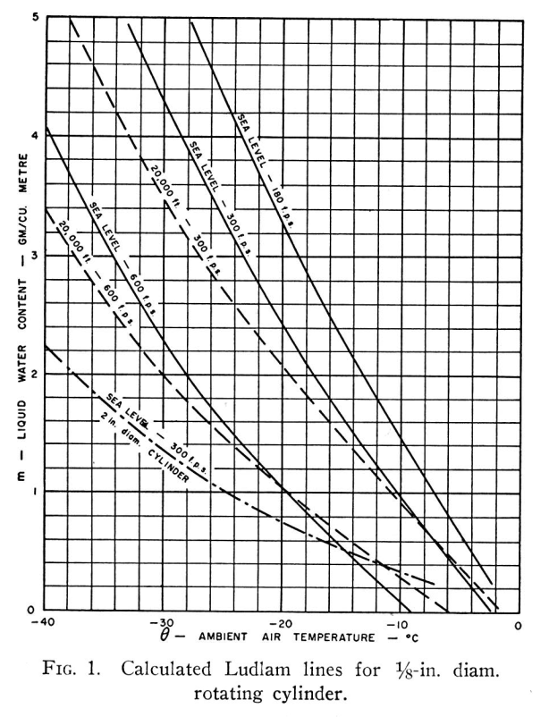
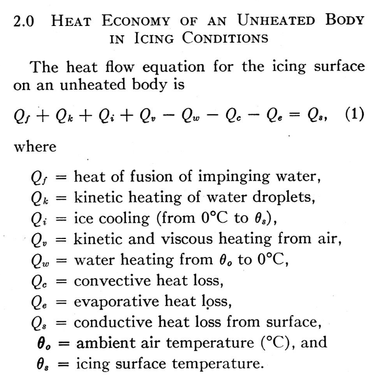
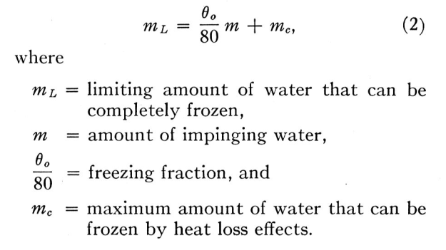
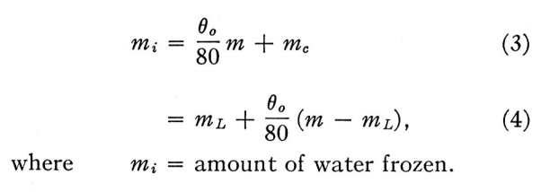
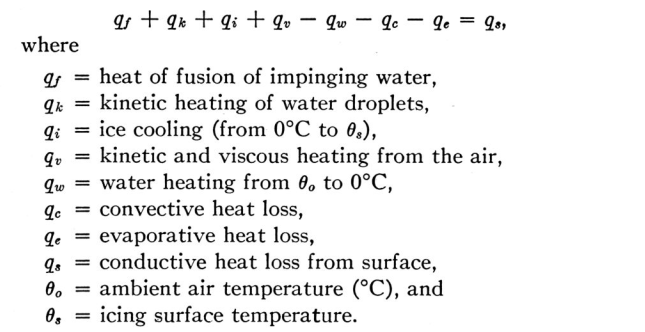
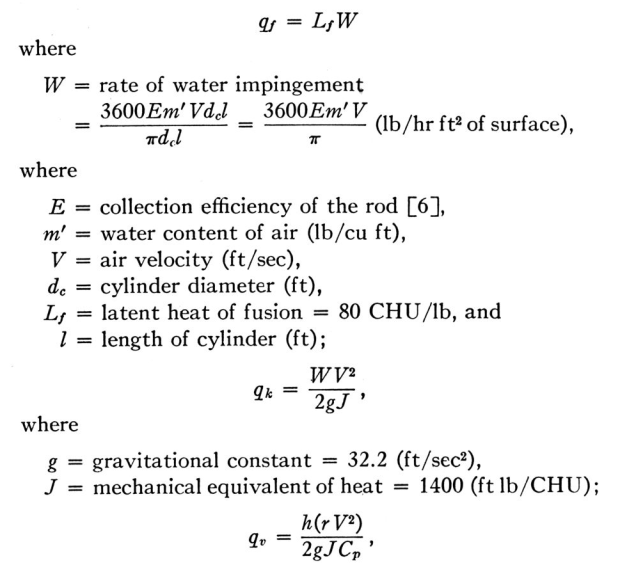
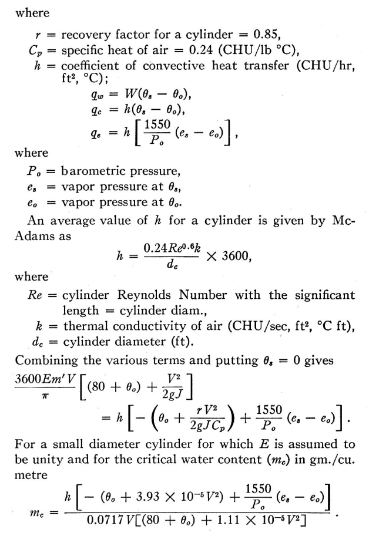
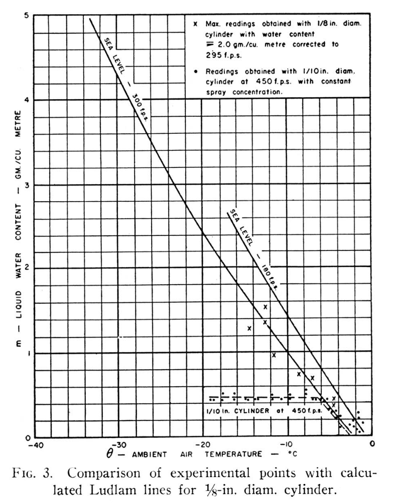
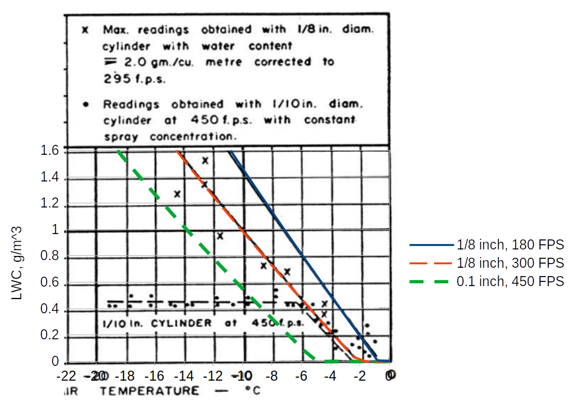
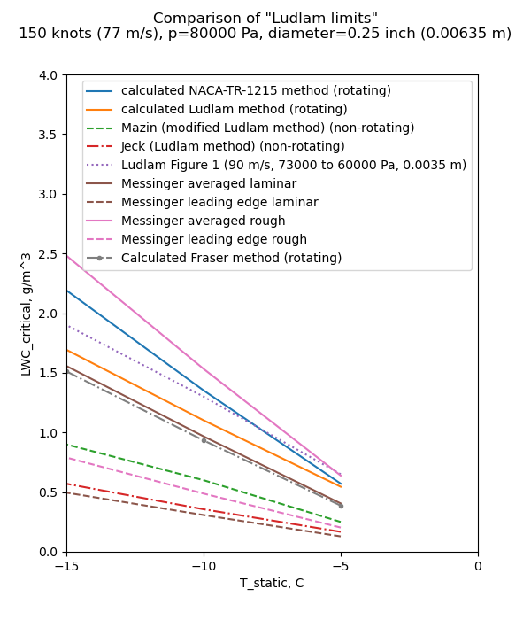

Title: Fraser  
Date: 2022-04-28 12:00  
Category: NACA    
tags: thermodynamics  

### _"[LWC] limits have been calculated for a rotating cylinder.., and the results show that rotating cylinder measurements are of limited usefulness and may, in fact, prove entirely misleading as regards both water content and droplet size."_  

# Fraser, et al., "Thermodynamic Limitations of Ice Accretion Instruments" [^1]

 

## Summary
The term "freezing fraction" is defined (but probably not the one that you expected). 

## Key points

1. The term "freezing fraction" is defined (but probably not the one that you expected). 
1. "Ludlam limits" for instruments are calculated.

## Abstract

> A number of instruments used for determining the supercooled water content of an icing
cloud depend on measuring the rate of accretion of ice on an unheated body. It has been shown
by Ludlam that, since only part of the supercooled water freezes on impact, and the rest
cannot always be frozen by the limited convective and evaporative heat losses which are avail-
able, there are limiting water contents beyond which such methods of measurement are unreliable. 
These limits have been calculated for a rotating cylinder at normal and high flight
speeds, and the results show that rotating cylinder measurements are of limited usefulness and
may, in fact, prove entirely misleading as regards both water content and droplet size. 
Experimental results show agreement with the calculated values. The limits for a conventional
rotating-disc rate-of-icing meter and for an NAE-Smith ice detector head have also been obtained 
experimentally.
It is concluded that apart from the possibility of using refrigerated ice-accretion instruments,
it is necessary to use a thermal method of measuring high values of water concentration, but
that an ice-accretion method must also be employed to distinguish between warm water,
supercooled water and ice crystals.
    
## Discussion

> However, under conditions of high water catch
and high temperature, and also under conditions
of high flight speed, the heat balance of a small-
scale body becomes such that only part of the water 
is retained as ice, the rest running or blowing
off in the liquid state.  
This is well-known to be a limitation of such
instruments, but until the recent publication of
a paper by Ludlam, "The Heat Economy of a Rimed Cylinder", 
apparently no attempt had
been made to define it. Following the appearance
of Ludlam's theoretical analysis, brief tests were
made in the icing tunnel of the NAE, and general
agreement was found between his calculated values 
and the experimental results from the tunnel.
As a result, Ludlam's analysis was examined further 
and modified to include the kinetic effects of
high flight speeds, and further tests were made in
the icing tunnel and engine test-beds to provide
experimental verification for the case of rotating
cylinders, and to determine the "Ludlam limits"
for a rotating disc and an NAE-Smith ice detector.

 

We see extensions of the Ludlam analysis [^2], 
including the addition of kinetic and viscous heating, 
and conductive heat loss. 

>Another way of looking at it is this. The
amount of water that can be frozen on a body in
a given time consists of:—
(a) that fraction of the water catch that
freezes on impact, plus
(b) the amount that can be frozen by heat
loss effects.
At any given speed, temperature and pressure
there is an upper limit to the latter amount,
which will depend on the conduction from the
icing surface. Thus the limiting amount of
water that can be totally frozen after impinge-
ment on the body is

 

Fraser is using a unit system where 
cpw = 1 cal/g-C, L_freeze = 80 cal/g.

More generally, equation 2 is:

    freezing_fraction = cpw * (t_surface-t_ambient) / L_freeze
    
    ml = freezing_fraction * m + mc         (2)

>Up to this limit, the amount of ice collected
by the body is the same as the amount of super-
cooled water impinging on it. If the amount
of impinging water, m, is greater than this limit,
ml the only additional ice formed is that fraction 
which freezes on impact. So that if m > ml

 

    mi = freezing_fraction * m + mc          (3)
    mi = ml + freezing_fraction * (m - ml)   (4)
    freezing_fraction = (mi - ml) / (m - ml)

In Fraser, "freezing fraction" is a fraction of water 
in excess of the limiting LWC (m-ml) that is frozen. 
This differs from Messinger [^3], 
where freezing fraction is the fraction of impinging water that is frozen (mi / m).

>The excess water, (m — mi) is blown off in
the liquid state, or included as liquid water in
the collected ice. 

### Appendix
>The heat flow equation for the icing surface on a cold
body, assuming all impinging water freezes, is  
  
>For the specific case of a rotating, non-conducting cylinder, 
with surface temperature at 0°C, and fully wetted,
the equation simplifies to 
  
>where q is measured in CHU/hr. (The term CHU denotes 
a centigrade heat unit which is the heat required to
raise one lb of water through one degree Celsius.) 
Examining the individual terms:—

  

  

To get the 1550 value on the evaporation term:
    
    L_evap = 598 CHU/g
    Ratio_molecular_masses = 0.662
    cp = 0.24 CHU/g
    
    1550 = L_evap * Ratio_molecular_masses / cp
    1550 = 598 * 0.622 / 0.24

So the "1.12" factor was not included. 

In our unit system: 

    qf = wcr * L_freeze
    wcr = E * LWC / g_per_kg * u / pi 
    qk = wcr * u**2 / 2
    qv = hc * r * u**2 / (2 * cp)
    qw = cwp * wcr * (t_surface - t_ambient)
    qc = hc * (t_surface - t_ambient)
    qe = hc * L_evaporation * 0.622 / cp * (es - eo) / p
    hc = 0.24 * re**0.6 * k_air / d_cylinder
    L_freeze = 334640 J/kg
    L_Eevap = 2500900 J/kg
    cp = 1000 J/kg-K
    cpw = 4168 J/kg-K

    E * LWC / g_per_kg * u / pi * (L_freeze - cpw * (ts - to) + u**2 / 2)
    = hc * ((ts - to) - u**2 / (2 * cp) + L_evaporation * 0.622 / cp * (es - eo) / p)

    LWC / g_per_kg * E * u / pi * (L_freeze - cpw * (ts - to) + u**2 / 2)
    = hc * ((ts - to) - u**2 / (2 * cp) + L_evaporation * 0.622 / cp * (es - eo) / p)

    LWC = hc * ((ts - to) - u**2 / (2 * cp) + L_evaporation * 0.622 / cp * (es - eo) / p) 
          / (g_per_kg * E * u / pi * (L_freeze - cpw * (ts - to) + u**2 / 2))

>Further experimental evidence of the existence
of the Ludlam Limit was obtained during tests
on an engine icing test-bed. A
1/8-in. diameter cylinder was used to obtain water contents
while a spray concentration giving about 2 gm/m 3
was being used. The highest readings obtained
by the rotating cylinder are shown in FIGURE 3.

  

>A further check of the calculated limits was
made by using a 0.1 inch diameter cylinder in an
icing tunnel, at 450 fps, with a constant flow of
water to the sprays, while the temperature was
varied. The readings obtained are shown in
FIGURE 3, and indicate a Ludlam Limit of 0.5
gm/m 3 at -7°C. ambient temperature. This is in
reasonable agreement with the theoretical limit.

However, Fraser appears to be comparing 0.1 inch, 450 fps data to the 1/8 inch, 300 fps line
When we add a limit line for 0.1 inch diameter and 450 fps, 
the apparent limit does not agree as well with the test readings. 
There is a limit characteristic, 
but the theory and data do not match so well in this case. 
The test data show that there is a "Ludlam limit", 
but these calculations only approximate that value. 

An implementation of Fraser's equations is in the file "fraser.py" [^4], 
which was used to add the "0.1, 450 FPS" line:

  

### Comparison to "Ludlam limit"

We now have yet another "Ludam-ish limit" to add to our collection. 

 

Fraser gives a similar result to Messinger (averaged laminar). 
The chief difference between them is Messinger includes the 1.12 factor on evaporation, 
while Fraser does not. 

## Citations

Fraser cites 6 publications:  

- Ludlam, F. H . : "The heat economy of a rimed cylinder." Quarterly Journal Royal Met. Soc., V. 77, No. 334, pp. 663-666, Oct. 1951.  
- Fraser, D., Pettit, K. G., and Bowler, E. H . : "Criteria for the design, assessment and control of icing protection systems." Inst, of Aero. Sciences Preprint No. 369 (1952)  
- Pettit, K. G.: "Nephelometric instrumentation for aircraft icing research." N.R.C. Report MD-33 (1950).  
- Internal communication from the N.A.E. Engine Testing Laboratory, Feb., 1952.  
- Neel, C. B., and Steinmetz, C. P . : "The calculated and measured performance characteristics of a heated-wire liquid-water-content meter for measuring icing severity." NACA-TN-2615 (1952).  
- Langmuir, I., and Blodgett, K. B.: " A mathematicalinvestigation of water droplet trajectories." A.A.F. Tech. Report 5418 (1946).  

Fraser is cited by 2 publications in the NACA Icing Publications Database [^5]: 

- Gray, Vernon H., Bowden, Dean T., and von Glahn, Uwe H.: Preliminary Results of Cyclical De-icing of a Gas-Heated Airfoil. NACA-RM-E51J29, 1952  
- Neel, Carr B., Jr.: A Heated-Wire Liquid-Water-Content Instrument and Results of Initial Flight Tests in Icing Conditions. NACA-RM-A54I23, 1955.  

Fraser is cited 31 times in the literature [^6].

## Notes: 

[^1]: 
Fraser, D., Rusk, C. K., and Baxter, D.: Thermodynamic Limitations of Ice Accretion Instruments, 1953.  
[^2]: 
Ludlam, F. H.: The Heat Economy of a Rimed Cylinder. Quart. Jour. Roy. Meteorological Soc., vol. 77, no.334., Oct. 1951.  
[^3]: 
Messinger, B. L.: Equilibrium Temperature of an Unheated Icing Surface as a Function of Airspeed. Preprint No. 342, Presented at I.A.S. Meeting, June 27-28, 1951.  
[^4]: 
[https://github.com/icinganalysis/icinganalysis.github.io](https://github.com/icinganalysis/icinganalysis.github.io)  
[^5]: 
[NACA Icing Publications Database]({filename}naca icing publications database.md)  
[^6]: 
https://scholar.google.com/scholar?hl=en&as_sdt=0%2C48&q=Thermodynamic+Limitations+of+Ice+Accretion+Instruments&btnG=  
