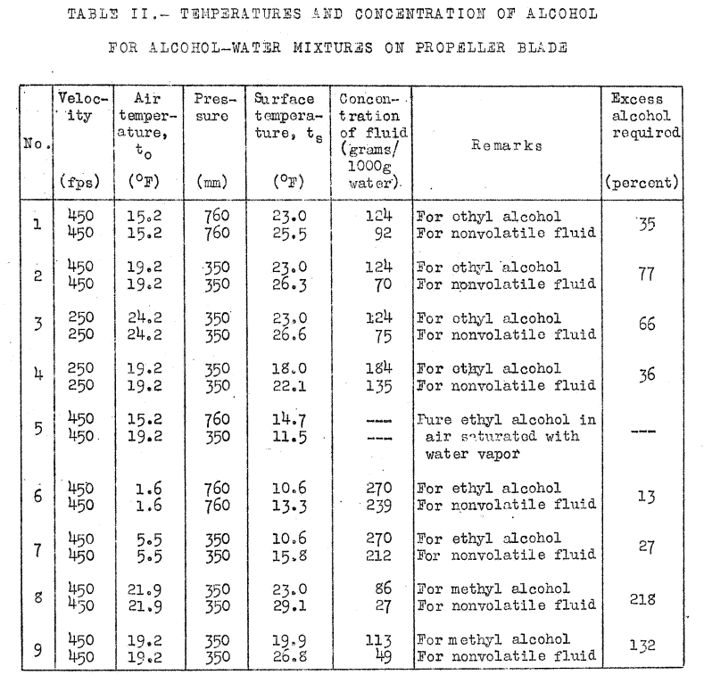

title: Freezing Point Depressant Fluids  
Date: 2023-02-26 12:00  
tags: ice protection   

### _"Alcohol as a means of protection against ice formation on propeller blades is widely used by commercial air lines on transport airplanes."_ [^1]  

  
_Figure 2 from NACA-RB-4F06._  

## Summary  

Freezing point depressant fluids were used widely in the NACA-era.  

## Key points  

1. The use of freezing point depressant fluids were not pioneered by NACA, NACA studied improvements.  
2. Analysis methods were developed in the NACA-era.  
3. Freezing point depressant fluids are still used today.  

## Discussion  

This is a technology that was not invented by NACA. 
NACA studies sought to improve the use of freezing point depressant fluids. 

When mixed with water, a freezing point depressant fluids lowers 
the freezing/melting temperature of the mixture, 
and enough fluid can lower that temperature below the equilibrium wet surface temperature, 
preventing or removing ice. 

There are many potential freezing point depressant fluids. 
In the NACA-era, alcohols were the most widely used. 
Today, for aircraft deicing on the ground, glycols are widely used. 
(However, we will not detail ground deicing herein.)  

We already saw some uses of alcohol as a deicing and ice prevention fluid in 
[Carburetor and Induction Systems]({filename}Carburetor and Induction Systems.md). 

Here, we will detail a study of improving propeller deicing, 
and a study of calculations to determine how much fluid is required. 

## "An Investigation of the Characteristics of a Propeller Alcohol Feed Ring", NACA-RB-4F06 [^1]  

By 1941, NACA had airplanes with robust ice protection 
(see ["Engine Exhaust Heat"]({filename}engine exhaust heat.md)), 
and so could do natural icing flight tests, like the ones described here. 

>INTRODUCTION  
Alcohol as a means of protection against ice formation on 
propeller blades is widely used by commercial
air lines on transport airplanes.
The usual propeller alcohol anti-icing system consists of 
nozzles fixed to
the propeller hub which discharge alcohol onto feed shoes
mounted on the propeller blades.
Delivery of alcohol
through the discharge nozzles normally used often results
in inadequate protection, since any one location of the
discharge nozzle will not provide optimum distribution
for all possible propeller-blade angles.  
The present investigation was undertaken to determine 
if improved protection at various blade angles could
be obtained through the use of a propeller alcohol feed
ring developed by the B. F. Goodrich Rubber Company,
Comparative alcohol-distribution tests of one propeller
fitted with discharge nozzles and the other propeller
fitted with alcohol feed rings were made on a Curtiss-Wright 
C-46 cargo airplane during flights in clear air.
Tests also were made of the effectiveness of the system
incorporating feed rings in preventing ice formation
during flights in natural icing conditions at the Materiel
Command Ice Research Base, Minneapolis, Minn.  

  

  

>Representative sketches of the flow patterns obtained
on the camber face of the propeller blades during these
tests are shown in figure 4.
There was very little flow
over the thrust face of the blades.
A flow of alcohol to
the end of the propeller feed shoes was obtained with
both the feed-ring and discharge-nozzle installations as
shown in figure 4, except in test 1 when the alcohol
reached the feed-shoe tip only on one blade of the standard 
nozzle-equipped propeller.
The alcohol-flow patterns
were partially obliterated during tests 2 and 3 when the
coating was removed by unexpected agencies.
However, faint traces in the cleared zones and reference to the
flow lines outside the cleared areas permitted extension
of the flow lines with reasonable accuracy.

  

>The tests of the
ice protection afforded by the feed-ring
installation were made in conjunction with tests of
the thermal ice-prevention equipment installed on the C-46
airplane.
The alcohol feed rings were installed on both
propellers and the airplane was flown in a wide variety
of natural icing conditions.
During all icing tests alcohol flow to the propellers was started before entering
icing conditions.
Protection against loss of airplane
performance was obtained in all flights except one without 
increasing the propeller speed above 950 rpm, which
corresponds to 1900 rpm engine speed.
The alcohol-flow
rate was maintained at approximately 5 gallons per hour 
per propeller during all the icing flights.
Observations
with the stroboscope indicated that the formation of ice
was not entirely prevented, but that periodic accumulations
of ice were satisfactorily removed by the flow of alcohol
along the blade leading edges.
During one flight in icing conditions at 13,500 feet
pressure altitude, propeller ice prutection was not adequate 
at the cruising propeller speed.
Ice formed on the
blade leading edges, as evidenced by decreased airspeed
and rate of climb.
Normal rate of climb and airspeed were
restored by increasing the propeller speed to 1200 rpm.
which is the ice-emergency propeller-operating speed for
the C-46 airplane.
After 100 hours of flight service, visual inspection
of the feed rings showed no evidence of failure and no
maintenance was required.  

>The comparative alcohol-distribution tests indicated
that better blade leading-edge coverage was obtained at
all propeller speeds and flight conditions investigated
with the feed rings than was possible with the standard
alcohol-discharge nozzles.
Figure 4 shows that a more
efficient use of alcohol was obtained with the alcohol
feed-ring installation for all conditions tested.
The
distribution tests also indicated that alcohol was satisfactorily 
provided to the blade leading edges at the ice-emergency propeller 
speed only by the use of the feed rings.

Some engines today have an ice protection procedure 
that increases the engine speed temporarily, 
but they are not typically labeled "ice-emergency".  

>Although the tests in icing conditions indicate that
an effort must be made to develop a method of propeller
ice protection superior to the alcohol system, the use of
feed rings in lieu of the standard discharge nozzle resulted 
in a definite improvement of the propeller alcohol
system. 
It should be noted that good alcohol distribution
and coverage of the propeller-blade leading edge are very
difficult to obtain with as large a diameter propeller as
were used in the tests and therefore the alcohol system
could not have been
expected to remove ice accumulations
under all conditions,
even though an improvement in the 
system had been made.

>CONCLUSIONS  
>1. The use of the propeller alcohol feed ring resulted in a 
more satisfactory distribution of alcohol along the leading edge 
of the propeller blade than did
the standard alcohol-discharge nozzles, indicating a
greater degree of ice protection and a more efficient
use of alcohol.  
>2. The alcohol feed-ring equipment required no maintenance 
in 100 hours of flight service.  
>3. The manufacturer's recommendations for
installation of the feed rings were satisfactory.  

## "Kinetic Temperature of Wet Surfaces A Method of Calculating the Amount of Alcohol Required to Prevent Ice, and the Derivation of the Psychrometric Equation", NACA-ARR-5G13 [^2]  

We saw the calculations wet surface temperatures in the review in the Thermodynamics Thread, 
[NACA-ARR-5G13]({filename}NACA-ARR-5G13.md).  

Here, we will look at the effect of freezing point depressant fluid, 
such as ethyl alcohol. 

> A method is given for calculating the temperature of a
surface wetted either by a pure liquid, such as water, or by
a mixture, such as alcohol and water.
The method is applied
to the problem of protecting, by alcohol, propellers and the
induction system of the engine against ice. The minimum
quantity of alcohol required is calculated for a number of 
arbitrarily chosen conditions. The effect of evaporation of 
alcohol is shown repeating the calculations for a nonvolatile
fluid. The method can be applied to other problems in evaporation,
for instance, to the evaporation of fuel in the
induction system of the engine. 
The psychometric equations, 
used in wet-bulb hygrometry, is deduced in its general form.
The effect of kinetic heating is included.

>These calculations are given by way of illustrating the 
method. Their primary use, it appears, is in calculating 
the rate of heating required to prevent ice by the method of
references 1 and 2. The problem in protection by fluids is 
to distribute the fluid efficiently. In this case, the 
method of calculation can be used to find the minimum rate 
of supply required, or to compare the merits of fluids of 
different composition, on the assumption of perfect distribution.  

>Blade Temperatures with Alcohol-Water Mixtures  
>
>Calculations have been made for the case in which ice 
is prevented by supplying ethyl alcohol to the blades of 
the propeller. The calculations have been repeated for a 
nonvolatile fluid having the same depressant effect on the 
freezing point as ethyl alcohol. The difference in the 
quantity of fluid required gives the excess alcohol which 
must be supplied in order to neutralize the refrigerating 
effect caused by its evaporation. A similar calculation 
has been made for methyl alcohol to show how volatile fluids
of different compositions may be compared.  
>
>Calculations have been made for a speed of 450 feet 
per second assuming laminar flow, for blade temperatures of 
23 F (-5 C) and also 10.6 F (-12 C), and for barometric 
pressures of 760 millimeters and 350 millimeters [of mercury]. 
Two calculations have been made at a speed of 250 feet per second. 
The results are given in Table II. As an instance of the 
method, the calculations of the blade temperature of 23 F 
at 760 millimeters pressure, the first in table II 
[at an air temperature of 15.2 F], may be 
cited. For this condition, the concentration of alcohol
required to depress the freezing point to 23 F, from the 
data of the International Critical Tables, is 124 grams per 
liter of water.
>
>  

>The effect of evaporation is found by calculating the 
temperature that the blade would assume in air temperature of 15.2 F 
with a nonvolatile fluid, and calculating the concentration of 
fluid required. The fluid is assumed to have the same 
depressant effect on the freezing point as alcohol.  
...  
the concentration of the [assumed nonvolatile] fluid of the same
molecular weight as ethyl alcohol is 92 grams per liter of water. 
The excess of ethyl alcohol required to neutralize the refrigerating effect 
produce by its evaporation, therefore, is 35 percent.  

## See also  

- Smith, E. L.: "The Design of Fluid Anti-Icing Systems". Engine Laboratory, National Aeronautical Research Establishment, Ottawa, Canada, Lecture No. 11, University of Michigan Airplane Icing Information Course, 1953.  (32 pages) (includes errata sheet)  
- Smith, E. L.: "The design of fluid anti-icing systems". National Aeronautical Establishment (Canada) LR-64, 1953. [nrc-publications.canada.ca](https://nrc-publications.canada.ca/eng/view/object/?id=f64c5521-eb28-4569-9ff6-32b038394078)    

These provide more design details, 
and an interesting Figure 15, 
"Proposed Meteorological Design Requirements for Aircraft Anti-Icing Equipment", 
which we may detail later in a Meteorology thread or the University of Michigan Airplane Icing Information Course thread.  

- Bowden, D.T, et.al., “Engineering Summary of Airframe Icing Technical Data”, FAA Technical Report ADS-4, General Dynamics/Convair, San Diego, California, 1964 [apps.dtic.mil](https://apps.dtic.mil/sti/citations/AD0608865)  

In the thermodynamics thread we previously reviewed [ADS-4]({filename}ads4.md).  

ADS-4 has a section on fluid ice protection systems, 
and comparisons to other ice protection systems, 
such as thermal anti-ice. 

  
_Figure 3-10 from ADS-4._  

## Conclusions  

Freezing point depressant fluids are still used on airplanes today. 
For the larger jet transports, the use is not common. 
ADS-4 goes into some of the advantages and disadvantages of 
fluids versus other protection methods. 

## Citations  

An online search (scholar.google.com) found citations for   
NACA-RB-4F06 zero times, and  
NACA-ARR-5G13 18 times.  

## Notes  

[^1]: Neel, Carr B: An Investigation of the Characteristics of a Propeller Alcohol Feed Ring. NACA-RB-4F06, NACA-WR-A-50, June, 1941. [ntrs.nasa.gov](https://ntrs.nasa.gov/citations/19930093060)  
[^2]: Hardy, J. K.: Kinetic Temperature of Wet Surfaces A Method of Calculating the Amount of Alcohol Required to Prevent Ice, and the Derivation of the Psychrometric Equation. NACA-ARR-5G13, 1945. [ntrs.nasa.gov](https://ntrs.nasa.gov/citations/19930093546)  
