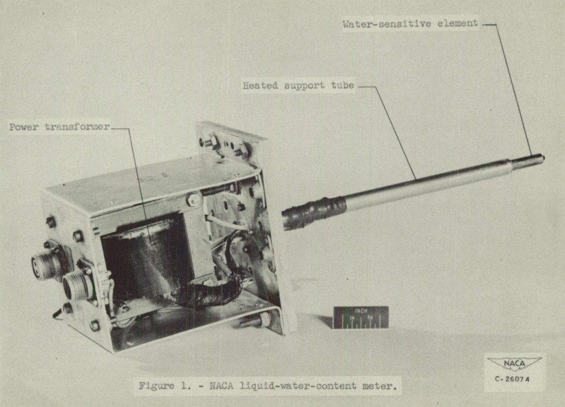
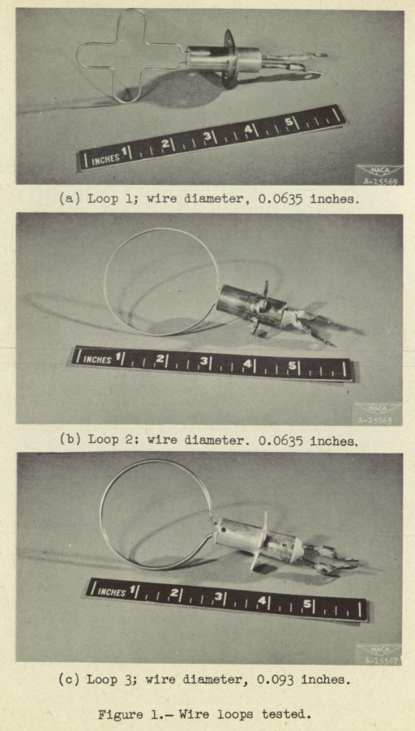
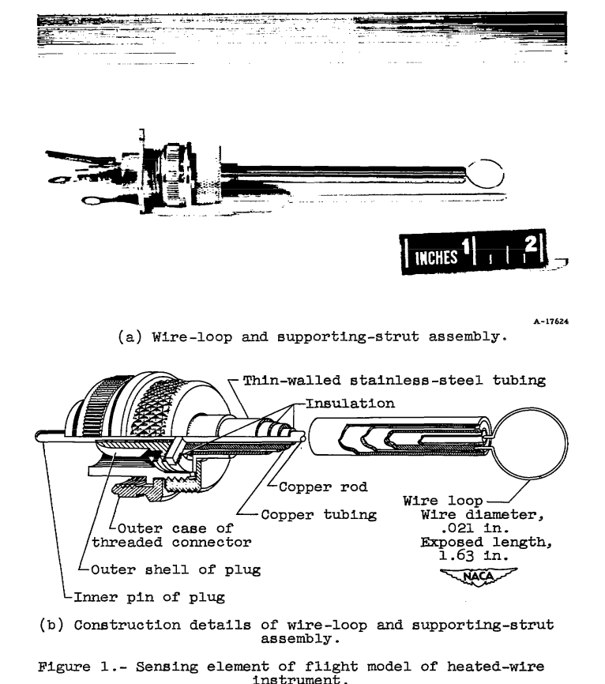
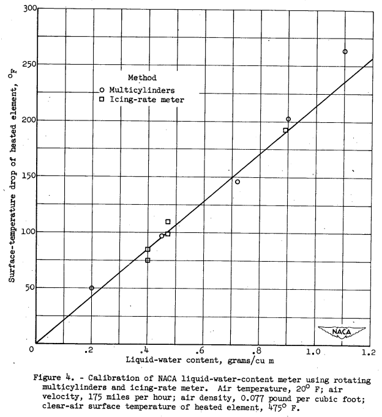
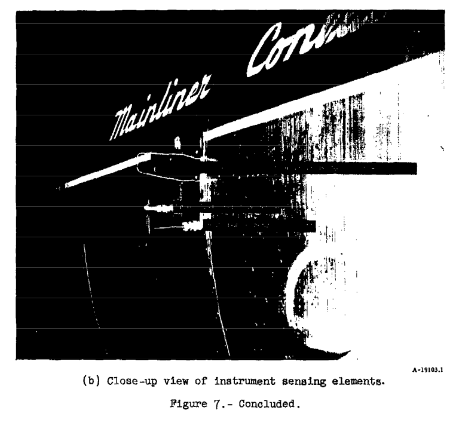
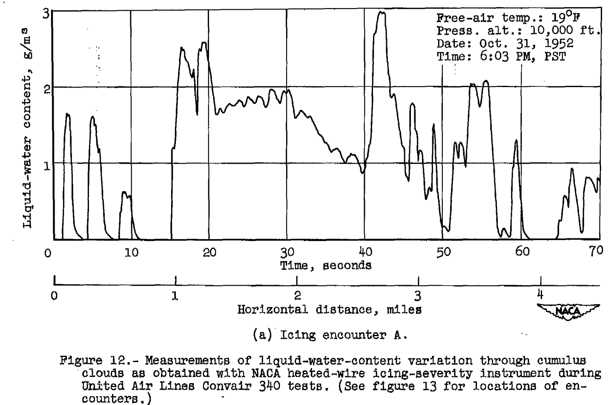
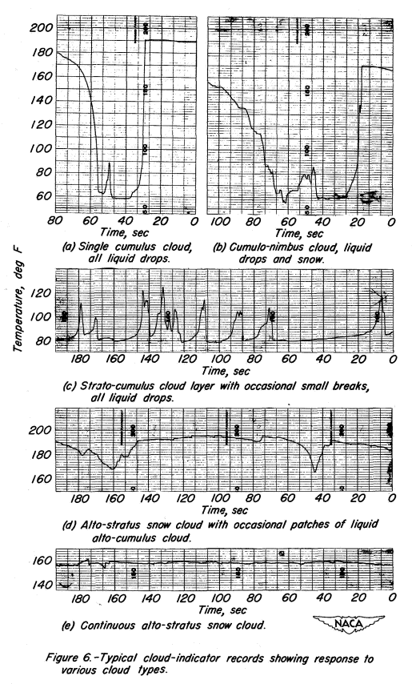

title: Heated Probes  
Category: NACA  
tags: instruments  

###_"a simple and rapid means for measuring the liquid-water content of clouds"_  [^1]  

#NACA-RM-E50J12a, "Flight Instrument for Measurement of Liquid-Water Content in Clouds at Temperatures Above and Below Freezing"  
#NACA-TN-2615, "The Calculated and Measured Performance Characteristics of a Heated-Wire Liquid-Water-Content Meter for Measuring Icing Severity"  
#NACA-RM-A54I23, "A Heated-Wire Liquid-Water-Content Instrument and Results of Initial Flight Tests in Icing Conditions"  

We will detail NACA-RM-A54I23 herein, as that was the final in the series
of publications detailing the development, 
and will include some detail from the earlier NACA-RM-E50J12a and NACA-TN-2615. 

##Summary  
Electrically heated probes can measure water exposure rate, 
from which LWC can be calculated.  

##Key points
1. The technology evolved over the span of the three publications.  
2. A heated wire probe can provide measurements with low lag (~1 second), 
faster than other technologies available in the NACA-era.  
3. There was an earlier "cloud indicator" based on similar technology.  
4. The technology is still used today.  

##Abstract  

NACA-RM-A54I23:  
>In the conduct of research directed toward the development of a simple 
instrument suitable for the measurement of icing severity,
a flight version of the NACA heated-wire liquid-water-content
instrument was constructed and flight tested in natural icing conditions.
Data obtained simultaneously with rotating multicylinders indicated that 
reliable flight measurements of liquid-water content could be made with the 
heated-wire instrument. The rate of response of the instrument to variations
in water content was sufficiently high to enable a detailed study of cloud
structure. Tests in a cloud duct during development of the instrument
indicated that measurements could be performed
at speeds up to at least 700 mph. Although the flight tests revealed
certain deficiencies in the present form of the instrument,
it appeared that, with the inclusion of several modifications,
the heated-wire device could serve as a useful and practical flight instrument.  
Results of the flight substantiated the high values of liquid-water content
predicted in a previous statistical analysis. The highest value measured was
3.7 grams per cubic meter.  

##Discussion  

NACA-RM-A54I23:  
>An instrument which appears to be useful in meteorological research
and which might also be adapted for direct indication of icing severity
has been developed by the Ames Laboratory of the NACA. 
This investigation was a continuation of the initial development reported
in reference 1.
The instrument consists basically of a loop of resistance wire which is
mounted in the air stream and is heated electrically by passing current
through it. 
Its change in resistance from the clear-air condition, resulting from 
cooling due to evaporation of impinging water droplets, is used
as a measure of the liquid-water content, or icing severity.
Ground tests were performed to effect a number of improvements
to the instrument developed in reference 1. Subsequently,
two flight models of the instrument were constructed,
one of which was flight tested in natural icing conditions.
This report describes the flight instrument and presents data
obtained during the flight and ground experimentation.
Also included is an analysis of measurements made in the most severe 
icing conditions encountered.

_["reference 1" is NACA-TN-2615.]_  

The first implementation utilized a 5/8 inch diameter metal tube for sensing. 
While this was robust, it had a fair amount of thermal capacity, 
and sensed LWC values could lag on the order of 20 seconds in rapidly changing conditions. 

  
_Figure 1 from NACA-RM-E50J12a_  

  
_Figure 2 from NACA-RM-E50J12a_  

The later implementations used smaller diameter wires, which had better response time. 

  
_Figure 1 from NACA-TN-2615_  

  
_Figure 1 from NACA-RM-A54I23_  

A cloud duct was constructed for some development tests.  
  
_Figure 4 from NACA-TN-2615_  

The method was also calibrated in the NACA Icing Research Tunnel against other instruments that we have seen before 
(multicylinders and the icing-rate meter [[rotating disk]({filename}NACA-RM-A9C09_instruments.md)]).

  
_Figure 4 from NACA-RM-E50J12a_  

Flight tests were conducted, along with other instruments. 
>Figure 7 shows the location in which the heated-wire
sensing element and the free-air-temperature probe were-mounted
on the U.A.L. airplane.
An NACA pressure-type icing-rate meter of the type described in reference 3
was also installed on the airplane,
as indicated in figure
7(b). (The results obtained with the pressure instrument
are presented in reference 2.)
These instruments were located immediately above the airplane airspeed
static-pressure vent, just forward of the propeller plane.
The remainder of the components for the heated wire instrument,
with the exception of direct-reading meters, 
were mounted in the baggage compartment, adjacent to the sensing elements.
Two direct-reading meters were employed in the tests, one located
on the pilots' instrument panel and one at the observer's station.

  
_Figure 7 from NACA-RM-A54I23_  
_(image quality in the online version of NACA-RM-A54I23 is poor)_  

(We will see more about the "NACA pressure-type icing-rate meter"
in an upcoming post).

The implementation using a small diameter wire had a response time on the order of one second
to changes in LWC values. 
  
_Figure 12a from NACA-RM-A54I23_  

The measure maximum LWC values corresponded well to predicted values. 

>It is of interest to compare the data of icing encounter C (fig.
12(c)) with the predictions of Lewis and Bergrun (ref. 9) for maximum
values of liquid-water content likely to be encountered in Pacific
coast cumulus clouds. ...

  
_Table of LWC values from NACA-RM-A54I23_  

>The agreement is seen to be very good throughout the entire cloud.
As noted, the values obtained from reference 9 are for an exceedance probability, Pe, 
of 1 in 1000, which appears reasonable in this case, since
the condition consisted of an isolated cumulus cloud that was flown
through deliberately.
Hence, the likelihood of encountering such a condition
during a routine flight would be very small.
The water-drop size in the cloud was not known, and since the predicted
liquid-water content varies with drop diameter
for a given exceedance probability,
it was necessary to assume the drop size in taking
the values from reference 9.
The size chosen was 17 microns,
which is suggested in reference
4 as a reasonable value to assign to cumulus clouds.

###Origin of the instrument  

NACA-RM-E50J12a provides an origin of the instrument as "a cloud detector":  
>This principle was originally used as a cloud detector to
indicate entrance and exit from a cloud during flight (reference 3).
The instrument was not used for the measurement of quantitative values
of liquid water because the surface temperatures during operation were
insufficient.

The "reference 3" above is NACA-TN-1904 [^4]:    
>THE CLOUD INDICATOR
It had become apparent during previous years that an instrumental 
method of supplementing visual observations of the time of entering 
and leaving clouds, and the patchy or uniform characteristics of
the cloud masses was desirable, The cloud indicator was designed to
meet this need. This instrument consists of a heated cylinder 5/8
inch in diameter exposed at right angles to the air stream, with a
thermocouple installed to measure the surface temperature at the
stagnation point. To provide a continuous surface-temperature
record, the thermocouple is connected to a self-balancing potentiometer 
equipped to provide a continuous ink trace of the variations
in temperature. In use, the heating power supplied to the cylinder
is adjusted to maintain a surface temperature of from 170° F to
200° F when flying in clear air. Immediately upon entering a cloud,
the temperature drops very rapidly, sometimes by as much as 50° F
in 1 second. Similarly, a rapid rise of temperature is observed
on leaving a cloud. Small areas of clear air within a cloud and
variations of cloud density are indicated by irregularities in the
temperature trace. Figure 6 is an example of the response of this
instrument during passage through various types of clouds. As indicated 
in the figure, the instrument is more sensitive to liquid-
water drops than to snow. Thus, it is possible to identify regions
containing liquid water in a continuous snow cloud.   

  

Unfortunately, NACA-TN-1904 does not provide a picture of the instrument, 
nor a reference with further detail 
(it is perhaps in their references 8 or 9, 
but I have not been able to find copies of those to verify).  

##Conclusions  

NACA-RM-A54I23:  
>As a result of an investigation to develop a flight version of the
NACA heated-wire instrument, the following conclusions were reached:  
>1. The instrument was shown to be suitable for the measurement of
liquid-water content (icing severity) in flight at water-drop
sizes normally encountered in icing conditions.  
>2. The rate of response of the instrument
to variations in liquid-water content was sufficiently
high to enable the detailed study of cloud structure.  
>3. Tests in a cloud duct indicated that the instrument
could be used for the measurement of liquid-water
content at speeds up to at least 700 mph.  
>4. Results of flight measurements in natural icing conditions
substantiated the high values of liquid-water content predicted
in a previous statistical analysis. 
The highest measurement was 3.7 grams per
cubic meter.  

The instrument was perhaps the best suited means available in the NACA-era to measure short duration, 
high liquid-water content encounters. 
However, we will see in the upcoming post "Conclusions of the Meteorological Instruments Thread"
that it did not appear to have had a direct influence on the later development of icing regulations. 

The basic technology, measuring a current or voltage difference of a heated element exposed to icing, 
is used in several instruments in use currently, including the Johnson-Williams LWC probe.  

##Citations:

NACA-RM-E50J12a cites five references:  
- Clark, Victor F.: The Multicylinder Method. The Mount Washington Monthly Res. Bull., vol. II, no. 6, June 1946.  
- Vonnegut, B., Cunningham, R. M., and Katz, R. E.: Instruments for Measuring Atmospheric Factors Related to Ice Formation on Airplanes. De-Icing Res. Lab., Dept. Meteorology, M.I.T., April 1946.  
- Lewis, William, and Hoecker, Walter H., Jr.: Observations of Icing Conditions Encountered in Flight During 1948. NACA-TN-1904, 1949.  
- Jones, Alun R., and Lewis, William: A Review of Instruments Developed for the Measurement of the Meteorological Factors Conducive to Aircraft Icing. NACA-RM-A9C09, 1949.  
- Langmuir, Irving, and Blodgett, Katherine B.: A Mathematical Investigation of Water Droplet Trajectories. Tech. Rep. No. 5418, Air Materiel Command, AAF, Feb. 19, 1946. (Contract No. W-33-038-ac-9151 with General Electric Co.)  

NACA-RM-E50J12a is cited once in the NACA Icing Publications Database [^5]:  
- Neel, Carr B., Jr., and Steinmetz, Charles P.: The Calculated and Measured Performance Characteristics of a Heated-Wire Liquid-Water-Content Meter for Measuring Icing Severity. NACA-TN-2615, 1952.  

An online search [^6] found NACA-RM-E50J12a cited two times.  

NACA-TN-2615 cites 16 references:  
- Jones, Alun R., and Lewis, William: A Review of Instruments Developed for the Measurement of the Meteorological Factors Conducive to Aircraft Icing. NACA-RM-A9C09, 1949.  
- Perkins, Porter J., McCullough, Stuart, and Lewis, Ralph D.: A Simplified Instrument for Recording and Indicating Frequency and Intensity of Icing Conditions Encountered in Flight. NACA-RM-E51E16, 1951.  
- Lewis, William: A Flight Investigation of the Meteorological Conditions Conducive to the Formation of Ice on Airplanes. NACA-TN-1393, 1947.  
- Lewis, William, and Hoecker, Walter H., Jr.: Observations of Icing Conditions Encountered in Flight During 1948. NACA-TN-1904, 1949.  
- Bowers, R. D., ed.: Icing Report by the University of California, Fiscal Year 1946. AAF Tech. Rep. 5529, Section VI, Nov. 6, 1946. (Issued as Boelter's Rep., Univ. of Calif., Dept. of Eng., Aug. 1, 1946.)  
- Perkins, Porter J.: Flight Instrument for Measurement of Liquid-Water Content in Clouds at Temperatures Above and Below Freezing. NACA-RM-E50J12a, 1951.  
- Boelter, L. M. K., Martinelli, R. C., Romie, F. E., and Morrin, E. H.: An Investigation of Aircraft Heaters, Part XVIII - A Design Manual for Exhaust Gas and Air Heat Exchangers. NACA-ARR-5A06, 1945.  
- Hardy, J. K.: An Analysis of the Dissipation of Heat in Conditions of Icing from a Section of the Wing of the C-46 Airplane. NACA-TR-831, 1945. (Formerly NACA-ARR-4I11a.)  
- Langmuir, Irving, and Blodgett, Katherine B.: A Mathematical Investigation of Water Droplet Trajectories. Tech. Rep. No. 5418, Air Materiel Command, AAF, Feb. 19, 1946. (Contract No. W-33-038-ac-9151 with General Electric Co.)  
- Katz, R. E., and Cunningham, R. M.: Aircraft Icing Instruments. Instruments for Measuring Atmospheric Factors Related to Ice Fornation on Airplanes - II. Dept. Meteorology, M.I.T., March 1948. (Final Rep. under Air Force Contract No. W-33-038-ac-14165, July 1,. 1945-Dec. 31, 1947.)  
- Jones, Alun R., and Lewis, William: Recommended Values of Meteorological Factors to be Considered in the Design of Aircraft Ice-Prevention Equipment. NACA-TN-1855, 1949.  
- Lewis, William, Kline, Dwight B., and Steinmetz, Charles P.: A Further Investigation of the Meteorological Conditions Conducive to Aircraft Icing. NACA-TN-1424, 1947.  
- Kline, Dwight B.: Investigation of Meteorological Conditions Associated with Aircraft Icing in Layer-Type Clouds for 1947-48 Winter. NACA-TN-1793, 1949.  
- Kline, Dwight B., and Walker, Joseph A.: Meteorological Analysis of Icing Conditions Encountered in Low-Altitude Stratiform Clouds. NACA-TN-2306, 1951.  
- Bowers, R. D., ed.: Basic Icing Research by General Electric Company, Fiscal Year 1946. AAF Tech. Rep. 5539, Sec. 3, Jan. 1947.  
- Eckert, E. R. G.: Temperature Recording in High-Speed Gases. NACA-TM-983, 1941.  

NACA-TN-2615 is cited three times in the NACA Icing Publications Database [^5]:     
- von Glahn, Uwe H.: The Icing Problem, presented at Ottawa AGARD Conference. AG 19/P9, June 10-17 1955.    
- Dorsch, Robert G., and Brun, Rinaldo J.: Variation of Local Liquid-Water Concentration about an Ellipsoid of Fineness Ratio 5 Moving in a Droplet Field. NACA-TN-3153, 1954.  
- Neel, Carr B., Jr.: A Heated-Wire Liquid-Water-Content Instrument and Results of Initial Flight Tests in Icing Conditions. NACA-RM-A54I23, 1955.  

An online search [^7] found NACA-TN-2615 cited 21 times.  

NACA-RM-A54I23 cites 11 references:  
- Neel, Carr B., Jr., and Steinmetz, Charles P.: The Calculated and Measured Performance Characteristics of a Heated-Wire Liquid-Water-Content Meter for Measuring Icing Severity. NACA-TN-2615, 1952.  
- Bullard, A. F.: Convair Model 340 Airfoil Anti-Icing System Test. Plane N-73104. United Air Lines, Inc., Engineering Dept., Rept. No. F-345, May 1953.  
- Perkins, Porter J., McCullough, Stuart, and Lewis, Ralph D.: A Simplified Instrument for Recording and Indicating Frequency and Intensity of Icing Conditions Encountered in Flight. NACA-RM-E51E16, 1951.  
- Lewis, William: A Flight Investigation of the Meteorological Conditions Conducive to the Formation of Ice on Airplanes. NACA-TN-1393, 1947.  
- Fraser, D., Rush, C. K., and Baxter, D. C.: Thermodynamic Limitations of Ice Accretion Instruments. Nat. Aero. Establishment, Ottawa (Canada), LR-71, Aug. 22, 1952.  
- Lewis, William, Kline, Dwight B., and Steinmetz, Charles P.: A Further Investigation of the Meteorological Conditions Conducive to Aircraft Icing. NACA-TN-1424, 1947.  
- Weickmann, H. K., and aufm Kampe, H. J.: Physical Properties of Cumulus Clouds. Jour. of Meteorology, vol. 10, no. 3, June 1953, pp. 204-211.  
- Zaitsev, V. A. (G. Belkov, trans.): Liquid Water Content and Distribution of Drops in Cumulus Clouds. NRC Tech. Translation TT-395, from Trudy Glavnci Geofizicheskoi Observatorfi No. 19(81), 1950, pp. 122-132.  
- Lewis, William, and Bergrun, Norman R.: A Probability Analysis of the Meteorological Factors Conducive to Aircraft Icing in the United States. NACA-TN-2738, 1952.  
- Jones, Alun R., and Lewis, William: Recommended Values of Meteorological Factors to be Considered in the Design of Aircraft Ice-Prevention Equipment. NACA-TN-1855, 1949.  
- Fraser, D.: Analysis of Meteorological Design Requirements for Icing Protection Systems. University of Michigan Airplane Icing Information Course, Lecture No. l2a, 1953.  

NACA-RM-A54I23 is cited twice in the NACA Icing Publications Database [^5]:  
- Bowden, D. T., Gensemer, A. E., and Speen, C. A.: Engineering Summary of Airframe Icing Technical Data. Federal Aviation Agency, [FAA-ADS-4](ads4.md), 1964.    
- Hacker, Paul T.: An Oil-Stream Photomicrographic Aeroscope for Obtaining Cloud Liquid-Water Content and Droplet Size Distribution in Flight. NACA-TN-3592, 1956.  

An online search [^8] found NACA-RM-A54I23 cited 22 times.   

##Notes  
[^1]: Perkins, Porter J.: Flight Instrument for Measurement of Liquid-Water Content in Clouds at Temperatures Above and Below Freezing. NACA-RM-E50J12a, 1951.  
[^2]: Neel, Carr B., Jr., and Steinmetz, Charles P.: The Calculated and Measured Performance Characteristics of a Heated-Wire Liquid-Water-Content Meter for Measuring Icing Severity. NACA-TN-2615, 1952.  
[^3]: Neel, Carr B., Jr.: A Heated-Wire Liquid-Water-Content Instrument and Results of Initial Flight Tests in Icing Conditions. NACA-RM-A54I23, 1955.  
[^4]: Lewis, William, and Hoecker, Walter H., Jr.: Observations of Icing Conditions Encountered in Flight During 1948. NACA-TN-1904, 1949.  
[^5]: [NACA Icing Publications Database]({filename}naca icing publications database.md)  
[^6]: https://scholar.google.com/scholar?hl=en&as_sdt=0%2C48&q=Flight+Instrument+for+Measurement+of+Liquid-Water+Content+in+Clouds+at+Temperatures+Above+and+Below+Freezing&btnG=  
[^7]: https://scholar.google.com/scholar?hl=en&as_sdt=0%2C48&q=NACA-TN-2615&btnG=  
[^8]: https://scholar.google.com/scholar?hl=en&as_sdt=0%2C48&q=A+Heated-Wire+Liquid-Water-Content+Instrument+and+Results+of+Initial+Flight+Tests+in+Icing+Conditions&btnG=  
