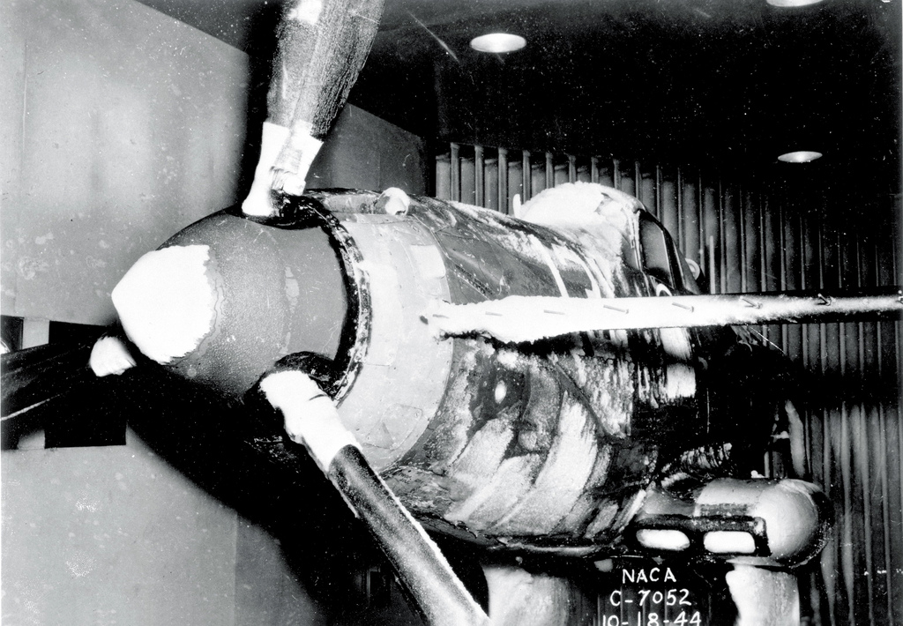

title: Icing Wind Tunnel Test Thread 
Date: 2022-07-15 12:00  
category: icing tunnels  

  
_from NACA-TN-1246_

### _"Icing wind tunnels can simulate natural icing with water-spray and refrigeration systems ... to permit safe, convenient and relatively inexpensive testing."_ [^1]  

## Summary

While there were extensive publications on how to use aerodynamic wind tunnels in the NACA-era 
(for example, Pope's "Wind Tunnel Testing" [^2]), 
there was no reference for using icing wind tunnels that I could find, 
and I cannot think of a current publication that provides comprehensive guidance 
(there are publications that cover specific aspects, as we shall see in the thread). 

This thread will not by itself correct that problem, but it will summarize uses, 
and perhaps provide some guidance by examples. 

As there are numerous NACA publications (40+) that describe specific icing wind tunnel tests,
but only a little about the icing wind tunnel itself in each one, 
I will not have a detailed review of most of the individual publications in this thread. 
Instead, I will use the collective themes below about icing wind tunnels. 

There are significant icing wind tunnel test method improvements in the post-NACA era that will also be covered. 

Readers are also encouraged to see ["We Freeze to Please": A History of NASA's Icing Research Tunnel and the Quest for Flight Safety](https://ntrs.nasa.gov/citations/20020066162), 
which includes information from NACA-era internal memos and interviews that I have not seen published elsewhere. 

The NACA Cleveland (now NASA Glenn) Icing Research Tunnel has an enduring legacy. 
The ASME recognized the Icing Research Tunnel as an 
"International Historic Mechanical Engineering Landmark" in 1987 [^3]. 

## NACA-Era:

### [NACA-TN-339, "Refrigerated Wind Tunnel Tests on Surface Coatings for Preventing Ice Formation"]({filename}NACA-TN-339.md)  
>An early icing wind tunnel and test are described

### [Uses of the NACA Icing Wind Tunnels]({filename}uses_of_naca_icing_tunnels.md)  
>A wide variety of test articles were used in the NACA-era Icing Research Tunnel (IRT)  

### [Calibration of the NACA icing wind tunnels]({filename}calibration_of_naca_icing_tunnels.md)  
>Calibration methods evolved during the NACA-era

### [Scaling in NACA tests]({filename}scaling_in_naca_tests.md)  
>Early examples of icing test scaling are noted  

## Post NACA-Era:

### [AEDC-TR-85-30, "Analysis and Verification of the Icing Scaling Equations"]({filename}aedc_tr_85_30.md)    
>"It would be beneficial to the icing community if the feasibility of using scale models in these tests could be proven."  

### [AEDC-TR-87-23, "An Empirical Look at Tolerances in Setting Icing Test Conditions with Particular Application to Icing Similitude"]({filename}aedc_tr_87_23.md)   
>"In most icing similitude reports, the criteria for successful similitude are rarely discussed. ...[Here] drag coefficient (Cd) was used as an index of similitude by quantitatively indicating how much the shape or ice surface changed."  

<!--
NASA-TM-106827, "Methods for Scaling Icing Test Conditions"
>"This study has established the import of correctly analyzing the leading-edge heat balance in establishing scaling methods."  
-->

### [Bilanin Pi-Terms and the Weber Number]({filename}bilanin_pi_terms.md)  
>"While aircraft size and speed have increased, tunnel facilities have not, making subscale geometric tests a necessity."  

### [NASA/CR-2004-212875 "Manual of Scaling Methods"]({filename}NASA-CR-2004-212875.md)  
>"... it was not surprising that scale ice shapes were again a good match for the reference"  

### [The Effects of Humidity]({filename}effects_of_humidity.md)   
>"a condition of supersaturation, which promotes the growth of frost deposits"   

### [Anti-Ice Test Similarity, AIAA-2017-3927, "Evaluation of Alternative Altitude Scaling Methods for Thermal Ice Protection System in NASA Icing Research Tunnel"]({filename}aiaa_2017_3927.md)    
>"With a thermal IPS, energy reduction can be achieved by operating in a ‘running wet’ mode under more extreme icing conditions."  

### [Large Drop Icing Conditions in Icing Wind Tunnels]({filename}large_drop_icing.md)  
>""effects are scaled appropriately between Appendix C and SLD conditions using the existing scaling methods"  

## Related  

The next thread in the NACA review series is the [Icing Instruments Thread]({filename}instruments.md).  

## Notes 

[^1]: Anderson, David N.: Manual of scaling methods. No. E-14272, NASA/CR-2004-212875. 2004.  [ntrs.nasa.gov](https://ntrs.nasa.gov/api/citations/20040042486)   
[^2]: Pope, A.: Wind Tunnel Testing. John Wiley and Sons, Inc., New York, 1947.  
[^3]: Anon.: "An International Historic Mechanical Engineering Landmark ICING RESEARCH TUNNEL", ASME, May, 1987. [asme.org](https://www.asme.org/wwwasmeorg/media/resourcefiles/aboutasme/who%20we%20are/engineering%20history/landmarks/117-icing-research-tunnel-nasa-lewis-research-ce.pdf)  

