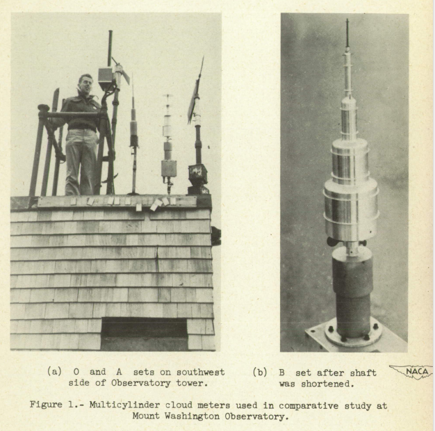
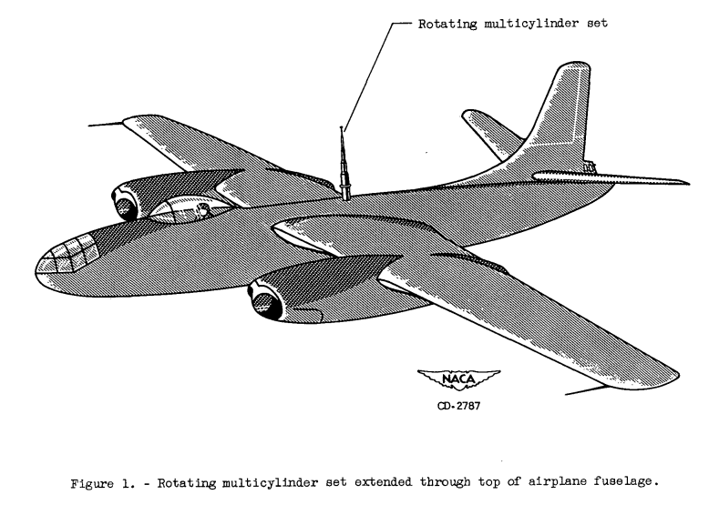
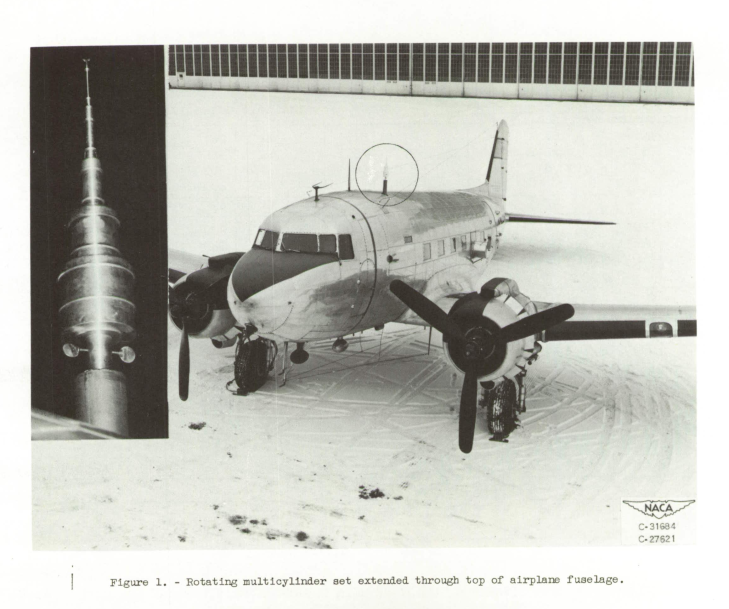

Title: Icing on Cylinders   
Category: NACA
Date: 2022-01-15 14:00  
tags: cylinders

### _"The collection of ice by the cylinders is similar to the collection of ice by airplane components." [^1]_  

  

  
  
 <em>Calculating water drop trajectories with a <a href="https://en.wikipedia.org/wiki/Differential_analyser">differential analyzer</a> analog </em>
  
 <em>(from NACA-TN-2904) </em>

## Summary 

The cylinder has a wide range of current uses in aviation

## Abstract 

The cylinder has a wide range of current uses in aviation:  
- Meteorological instruments for flight and icing wind tunnel tests  
- Aircraft in-flight ice detectors and indicators  
- Structural elements (such as landing gear and cables)  
- An approximation of an airfoil leading edge (used in thermal design and icing wind tunnel test conditions determination [^2])   

Icing conditions measurements with instruments based on cylinders were key to developing the 
current aircraft flight in icing certification regulations.

One hundred and thirty-two NACA publications related to aircraft icing were 
identified in ["The Historical Selected Bibliography of NACA-NASA Icing Publications"]({filename}/The Historical Selected Bibliography of NACA-NASA Icing Publications.md), 
and categorized into 16 topics.

Publications related to icing on a cylinder will include several of the 16 topics, 
such as “Meteorology of Icing Clouds”, “Meteorological Instruments” 
and “Impingement of Cloud Droplets” (as cylinders were and still are used as icing measurement instruments), 
as well as “Heat Transfer”. With a firm foundation in those concepts, 
one may then move on to other topics, including ice protection.

The cylinder is geometrically simple, but is aerodynamically complex with flow separation for many conditions, 
and so it will present worthy challenges. 

## The Cylinder Thread

These reviews will focus on water drop impingement and icing on cylinders. 
However, as cylinders were important instruments for meteorological measurements, some measurement results will be included. 
The accuracy of the cylinder when used as an instrument for determining icing conditions will be re-evaluated several times 
in the publications. 
While such instruments had limitations, they were often the best available technology at the time. 
(Also see the [Meteorological Instruments Thread]({filename}instruments.md)). 

Some typical multicylinder meteorological instruments (from NACA-TN-2708):  
  

### Topic _(key points noted)_  

### [NACA-TN-779 “Aerodynamic Heating and Deflection of Drops by an Obstacle in an Airstream in Relation to Aircraft Icing"]({filename}/NACA-TN-779.md)  
>   1. The effect of aerodynamic heating is predictable  
>   2. Water drop impingement on a cylinder is calculated  

### ["Mathematical Investigation of Water Droplet Trajectories"]({filename}Mathematical Investigation of Water Droplet Trajectories.md)  
>   1. The Langmuir drop size distributions are defined  
>   2. The water drop impingement terms E, Beta, K, and Ko are defined  
>   3. The use of cylinders of different sizes and detailed calculations to determine water drop sizes  

### [Implementation of cylinder impingement correlations in Python]({filename}/Implementation of cylinder impingement correlations in Python.md)  
>   1. The cylinder impingement correlations were implemented and reproduced values from "Mathematical Investigation of Water Droplet Trajectories"  
>   2. A subtlety about calculations with drop size distributions is noted.  

### [A Detailed Comparison of Water Drop Impingement Calculations]({filename}/A Detailed Comparison of NACA-TN-779 and Mathematical Investigation of Water Droplet Trajectories.md)  
>   1. There are differences in conditions in Table IV(a) of "Mathematical Investigation of Water Droplet Trajectories" compared to NACA-TN-779.  
>   2. When the conditions are revised to match, the comparison with NACA-TN-779 data improves.  

### [Implementation of multicylinder calculations in Python]({filename}/Implementation of multicylinders cylinders.md)
>  1. A manual method of multicylinder calculation is illustrated.  
>  2. The drop median effect diameter is reproduced well from a multicylinder example in "Mathematical Investigation of Water Droplet Trajectories"  

### [NACA-TN-1393 “A Flight Investigation of the Meteorological Conditions Conducive to the Formation of Ice on Airplanes"]({filename}/NACA-TN-1393.md)  
>   1. The accuracy of multicylinder instruments used to determine liquid water content and median water drop size is assessed.  
>   2. An icing intensity index as related to the ice growth rate on a 3-inch diameter cylinder is detailed.  
>   3. Results from agree well with the Python implementation of the cylinder analysis.  
>   4. "Tentative" values for icing design conditions were determined.  
>   5. An effect of distance on icing conditions is noted.  

### [NACA-TN-1424 "A Further Investigation of the Meteorological Conditions Conducive to Aircraft Icing"]({filename}/NACA-TN-1424.md)  
>  1. Two methods for determining drop size distributions are compared.  
>  2. The difference in water drop concentration around an aircraft body is proposed as an explanation for results from the two methods.  
>  3. A temperature dependence of icing conditions is noted.  

### [NACA-RM-A9C09 "A Review of Instruments Developed for the Measurement of the Meteorological Factors Conducive to Aircraft Icing"]({filename}/NACA-RM-A9C09.md)  
>  1. Nine instruments, including the fixed cylinder and rotating multicylinder, are qualitatively assessed.  
>  2. "The [multicylinder] method has assumed the position of a standard against which other instruments are calibrated, and is apt to remain so..."  
>  3. The effect of mass measurements errors on multicylinder results were assessed.  
>  4. "A reliable method for the measurement of drop-size distribution should be developed"  

### [NACA-TN-1904 "Observations of Icing Conditions Encountered in Flight During 1948"]({filename}/NACA-TN-1904.md)  
>  1. The average liquid water content varies over distance traveled in icing.  
>  2. The value of the multicylinder method for determining drop size distributions is questioned.   

### [NACA-TN-2708 "Comparison of Three Multicylinder Icing Meters and Critique of Multicylinder Method"]({filename}/NACA-TN-2708.md)  
>  1. Three multicylinder instruments had good agreement for liquid water content and median effective drop diameter, 
but poor agreement for the distribution type  
>  2. The Langmuir drop size distributions were revised (but the revised versions were not widely adopted)  

### ["A Langmuir B drop size distribution is almost a normal distribution"]({filename}A Langmuir B distribution is almost a normal distribution.md)  
>  1. The Langmuir B drop size distribution is almost a normal distribution.  
>  2. Perhaps it was originally intended that it be exactly a normal distribution.
>  3. The proposed alternatives in NACA-TN-2708 appears to have larger errors, rather than correcting errors.
>  4. The other Langmuir distributions (C, D, E) do not fit a normal distribution as well.  

### [NACA-TN-2903 "Impingement of cloud droplets on aerodynamic bodies as affected by compressibility of air flow around the body"]({filename}/NACA-TN-2903.md)  
> 1. The effect of the compressibility of air on the water-drop impingement calculations is found to be "negligible"  

### [NACA-TN-2904 "Impingement of Water Droplets on a Cylinder in an Incompressible Flow Field and Evaluation of Rotating Multicylinder Method for Measurement of Droplet-Size Distribution, Volume-Median Droplet Size, and Liquid-Water Content in Clouds"]({filename}/NACA-TN-2904.md)
>  1.  Detailed water drop impingement analysis (independent of prior analysis) is presented
>  2.  Error estimates are detailed.
>  3.  Detailed Beta curves are provided.
>  4.  A difference from Langmuir and Blodgett for drop size distributions calculations is noted.

  

### [NACA-RM-E53D23 "Procedure for Measuring Liquid-Water Content and Droplet Sizes in Super-cooled Clouds by Rotating Multicylinder Method"]({filename}NACA-RM-E53D23.md)  
>  1. Detailed procedures for the in-flight use of multicylinders are described.  
>  2. Detailed procedures for analyzing results from of multicylinders are described, with a flight data case.  
>  3. Differences in analysis method details can drive MVD and LWC differences in the range of 5% to 10%.  

  

### [NACA-TR-1215 "Impingement of Cloud Droplets and Procedure for Measuring Liquid-Water Content and Droplet Sizes in Supercooled Clouds by Rotating Multicylinder Method"]({filename}/NACA-TR-1215.md)  
> 1. NACA-TN-2903, NACA-TN-2904, and NACA-RM-E53D23 are "superseded" (collected together).  
> 2. Conditions where not all water drops freeze on the multicylinder instrument are considered.  
> 3. The terms "freezing fraction" is introduced into the NACA publications.  

### [NACA-TN-3338 "A Dye-Tracer Technique for Experimentally Obtaining Impingement Characteristics of Arbitrary Bodies and a Method for Determining Droplet Size Distribution"]({filename}NACA-TN-3338.md)  
> 1. A dye-tracer blotter-paper water drop impingement measurement technique is described. 
> 2. An analysis of test results to determine the water spray drop size distribution is described. 
> 3. The analysis method accuracy is unknown due to the lack of an independent measurement of drop sizes. 
> 4. We see the use of the Icing Research Tunnel for the first time in the Cylinders thread. 

## [Conclusions of the Cylinder Thread]({filename}Conclusions of the Cylinder Thread.md)  
> 1. The Cylinders thread is summarized 
> 2. Post-NACA era data is used to resolve some open questions 
> 3. NACA era data that are still used today are summarized 

## Related  

The next thread in the NACA review series is the [Thermodynamics Thread]({filename}thermodynamics.md).  

## Notes:
[^1]: 
von Glahn, Uwe H.: The Icing Problem, presented at Ottawa AGARD Conference. AG 19/P9, June 10-17 1955, reprinted in Selected Bibliography of NACA-NASA Aircraft Icing Publications, NASA-TM-81651, August, 1981  I could not locate this on the NTRS. It is available at (https://core.ac.uk/reader/42858720) (circa November, 2021)  
[^2]:
Anderson, David N., Manual of Scaling Methods. NASA/CR-2004-212875, March 2004. https://ntrs.nasa.gov/citations/20040042486 .  
