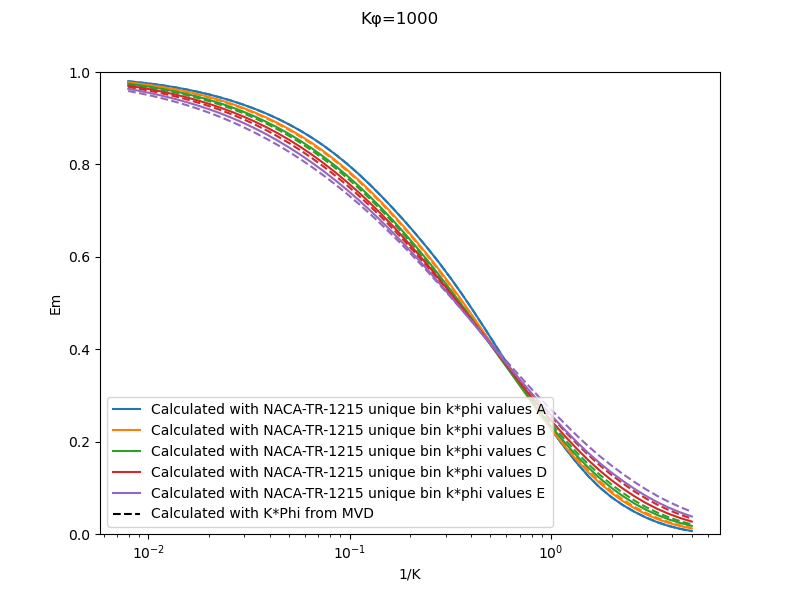

Title: Implementation of cylinder impingement correlations in Python   
Date: 2022-01-23 12:00  
Category: python  
tags: cylinders, python  

> ### "The equations were found to fit the experimental data over a wider range of values..." [^1]  

## Summary  
The correlations for water drop impingement on a cylinder from 
"Mathematical Investigation of Water Droplet Trajectories" [^1] 
are implemented in the Python programming language. 

## Key points
1. The cylinder impingement correlations were implemented and reproduced values from "Mathematical Investigation of Water Droplet Trajectories"
2. A subtlety about calculations with drop size distributions is noted.

## Discussion

### Implementation of cylinder impingement correlations

Alas, I do not have access to a [differential analyzer](https://en.wikipedia.org/wiki/Differential_analyser) as was used in [^1], 
so I will have to use a modern, digital computer. Also, we will not be integrating the water drop equations of motion; 
we will be using the data in [^1] to determine water drop impingement on a cylinder.

The Anaconda distribution of Python version 3.7 was used [^2], 
as this includes the third party modules matplotlib, numpy, and scipy.

The drag for a sphere and the drop range parameter values from Table I are implemented in the file langmuir_blodgett_table_i.py 
in the github repository [^3].
The values for cylinder water catch efficiency Em Table II are implemented in the file langmuir_blodgett_table_ii.py. 
A 2D interpolation of Table II values was used. 

Other correlations were considered, as detailed in the file, but the
interpolation was selected as the most accurate over the entire range of parameters (K, Phi) considered. 
The range of values in Table II are rather broad, and should fit every combination of drop size and cylinder diameter 
of interest in aviation.
 
In the file langmuir_cylinder_values.py, several functions are implemented to calculate dimensionless values such as K and Phi 
from dimensional values, such as airspeed, drop size, and cylinder diameter. 
The Langmuir drop size distributions are implemented. 
The calculated cylinder water catch efficiency Em values compare to Table XI values quite well.

### A subtlety about implementing drop size distributions

As noted in NACA-TN-2904 [^4], for drop size distributions Langmuir and Blodgett used an approximation, 
using the k\*phi value for the MVD for every drop size bin when calculating the weighted Em value. 
This means essentially that for part of the calculation (the k\*phi value) the MVD drop size was used for every bin, 
and for the other part (the k value) the drop size was unique for each bin. 
A more technically correct implementation is to have a unique k\*phi value for each bin (both the k and the k\*phi parts). 
I could not find in Langmuir and Blodgett where they were explicit about this detail of their method, 
and it was an astute observations made in [NACA-TN-2904]({filename}NACA-TN-2904.md) to notice this. 
A comparison to Table XI values verifies that the "k\*phi value for the MVD" method was used. 

<!--- note the "*" in k*phi is escaped k\*phi to prevent unwanted markdown formatting between "*"s --->

Both methods were implemented herein. 
There are only a small differences between values calculated with the two implementations. 

I doubt that the approximation was a source of any significant errors in analysis using the 
Langmuir-Blodgett methods.

The original version of the impingement calculation with a drop size distribution will be used from here on unless noted otherwise. 

## Notes  

[^1]: 
[Mathematical Investigation of Water Droplet Trajectories]({filename}Mathematical%20Investigation%20of%20Water%20Droplet%20Trajectories.md)  
[^2]:
Anon: Anaconda Software Distribution. version 2021-11 (Python 3.7), Anaconda Inc. Available at:   
[^3]: [github.com](https://github.com/icinganalysis/icinganalysis.github.io)  
[^4]: Brun, Rinaldo J., and Mergler, Harry W.: Impingement of Water Droplets on a Cylinder in an Incompressible Flow Field and Evaluation of Rotating Multicylinder Method for Measurement of Droplet-Size Distribution, Volume-Median Droplet Size, and Liquid-Water Content in Clouds. NACA-TN-2904, 1953 [ntrs.nasa.gov](https://ntrs.nasa.gov/citations/19930083606).  

