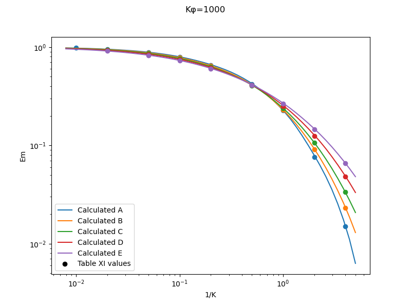

Title: Implementation of cylinder impingement correlations in Python   
Category: python tools
tags: cylinder

> ###"The equations were found to fit the experimental data over a wider range of values..." [^1]

##Summary  
The correlations for water drop impingement on a cylinder from 
"Mathematical Investigation of Water Droplet Trajectories" [^1] 
are implemented in the Python programming language. 

##Key points
1. The cylinder impingement correlations were implemented and reproduced values from "Mathematical Investigation of Water Droplet Trajectories"
2. A subtlety about calculations with drop size distributions is noted.

##Discussion

Alas, I do not have access to a [differential analyzer](https://en.wikipedia.org/wiki/Differential_analyser), 
so I will have to use a modern, digital computer.

The Anaconda distribution of Python version 3.7 was used [^2], 
as this includes the third party modules matplotlib, numpy, and scipy.

The drag for a sphere and the drop range parameter values from Table I are implemented in the file langmuir_blodgett_table_i.py.
The values for cylinder water catch efficiency Em Table II are implemented in the file langmuir_blodgett_table_ii.py.
A 2D interpolation of Table II values was used. Other correlations were considered, as detailed in the file, but the
interpolation was selected as the most accurate over the entire range of parameters (K, Phi) considered.

In the file langmuir_cylinder.py, several functions are implemented to calculate dimensionless values such as K and Phi
from dimensional values, such as airspeed, drop size, and cylinder diameter.
The Langmuir-Blodgett drop size distributions are implemented.
The calculated cylinder water catch efficiency Em values compare to Table XI values quite well.

As noted in NACA-TR-1215 [^3], Langmuir and Blodgett used an approximation of using the k\*phi value for the MVD
for every drop size bin when calculating the weighted Em value with a drop size distribution. 
A more technically correct implementation is to have a unique k\*phi value for each bin. 
Langmuir and Blodgett were not explicit about the details of their method, 
and it was an astute observations made in NACA-TR-1215 to notice this.
A comparison to Table XI values verifies that the k\*phi value for the MVD method was used.

<!--- note the the "*" in k*phi is escaped k\*phi to prevent unwanted formatting between "*"s --->

Both methods were implemented herein. 
There are only a small differences between values calculate with the two implementations. 

I doubt that the approximation was a source of any significant errors in analysis using the 
Langmuir-Blodgett methods.

The unique k\*phi for each bin method is considered more technically correct, 
and will be used hereafter.

##Notes:
[^1]:  
[Mathematical Investigation of Water Droplet Trajectories]({filename}/Mathematical Investigation of Water Droplet Trajectories.md)  
[^2]:
Anon: Anaconda Software Distribution. version 2021-11 (Python 3.7), Anaconda Inc. Available at: https://www.anaconda.com/
[^3]: Brun, Rinaldo J., Lewis, William, Perkins, Porter J., and Serafini, John S.: Impingement of Cloud Droplets and Procedure for Measuring Liquid-Water Content and Droplet Sizes in Supercooled Clouds by Rotating Multicylinder Method. NACA-TR-1215, 1955. (Supersedes NACA TN’s 2903, 2904, and NACA-RM-E53D23)  
