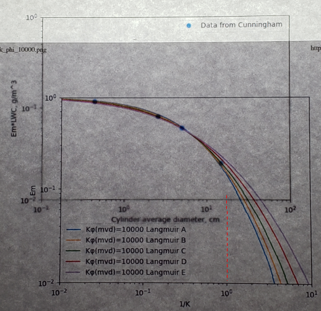

Title: Implementation of multicylinder calculations in Python   
Category: python tools
tags: cylinder

> ###"This effect would be expected if the droplets were of non-uniform size, since the largest droplets could reach the largest collector while those of average size could not." [^1]

##Summary  
The calculations to determine drop median volumetric diameter with a multicylinder instrument are implemented in Python. 

##Key points
1. A manual method of multicylinder calculation is illustrated.
2. The drop median effect diameter is reproduced well from a multicylinder example in "Mathematical Investigation of Water Droplet Trajectories"

##Discussion

###Manual method of drop size analysis

By measuring the differential rates of ice collection on cylinders of different sizes the drop median volumetric diameter (MVD) can be determined.

Some typical multicylinder instruments (from [^1]):

"Mathematical Investigation of Water Droplet Trajectories" [^2] provides an example of the mutlicylinder calculations method in 
the section "Example of the Application of the D.A. Data to Experimental Data".

> The method has been revised as a result of the work done with the D.A.
We shall describe the revised method and illustrate its use by analyzing some
recent data that were obtained by R. M . Cunningham in an airplane.

> Amounts of ice were collected on four cylinders of different diameters,
each 10 cm in length. The liquid water content of the fog in g/m^3 was ω.
The mean value of the initial diameter of a cylinder and the diameter coated
with ice at the finish of an experiment was 2C . The true speed of the airplane
was 207 mi/hr, the temperature measured by a thermometer —3°C .

    TABLE X
    
    Em ω (g)  2 C (cm)
    -------   ------
    0.118     0.43
    0.0808    2.60
    0.0603    5.09
    0.0250    15
    
Note: units on Em ω should be (g/m^3)

> By combining Eqs. (12) and (25) we obtain  

    Κφ = (2 ρa U a / η)**2  (50)  
      
Note: there was already an equation (50), (70) was probably what was intended as it would be next in the sequence.

> Therefore Κφ is independent of the cylinder radius. The values of Κφ were
found to be between 13,000 and 6000, for all of Cunningham's data.
A curve was prepared in which Em was plotted against 1/K on double logarithmic 
paper for a constant value of Κφ which was taken to be 10^6.

>The experimental data are compared with the theoretical curve by superimposing one
sheet on the other, sliding the upper sheet (with the axis of coordinates parallel
for the two sheets) until the two curves coincide at the end where C is small.

I do not have log-log graph paper anymore, so I printed the data in log-log coordinates with maptplotlib. 

> A convenient way to illuminate the sheets is to hold them against a window
pane.

I lined up the printed graphs on an artist's light box.

It was tedious to keep the graphs sides parallel as I aligned them. 
I imagine it was more difficult on a vertical window pane. 
I admit that the photo is not of good quality, but the view was not much better on the light box.

> When the set of Cunningham's data that we
have given as an example were compared with the curves B, C, D, Ε it was
found that all four experimental points lay on curve C if the two sheets
were superimposed in such a way that the values 2 C = 17.0 and Emw = 0.132
on the experimental curve coincided respectively with 1/K = 1 and Em = 1
on the theoretical curve.

As close as I can read it for my graphs, a "C" curve was the best match, 
and the 1/K=1 vertical line crosses the diameter line between 17 and 18 cm,
so I have fair agreement with Langmuir and Blodgett.

> The value of the radius a of the fog particles was calculated by means of
Eq. (12), as follows:

     Κ = 2 ρs a^2 U / (9 η C), (12)  

Since K and C are now known (1/K=1, 2C=17 cm), airspeed U is known, the water density is known, 
and the air viscosity can be calculated, the value of drop radius a can be calculated.

> From Eq. (12) we obtain a = 8.33μ.

It seems rather optimistic to report the drop radius to one one-hundredth of a micrometer. 
Estimating the accuracy of the multicyinder method will be a recurring theme in the publications on meteorology and icing instruments. 

#Code implementation of the multicylinder drop size analysis

Fortunately, this laborious process is implemented in the file "multicylinder.py" [^3]. 
The determination of the best fit Κφ value and distribution type is also automated. 
When the drop size is calculated with the automated process, the MVD calculated was 16.5 micrometer, 
so the drop radius was 8.25 micrometer, which compares well to Langmuir and Blodgett value of 8.33 micrometer.

The above result used the original Langmuir-Blodgett approximate method "Κφ value for the MVD applied to each drop size bin", 
as explained in [Implementation of cylinder impingement correlations in Python]({filename}Implementation of cylinder impingement correlations in Python.md). 

When the more technically correct "unique Κφ value for each drop size bin" method is used, the calculated MVD=17.1 micrometer.

I will consider this implementation to be "good enough", but we will look for more comparison data in other publications.

##Notes:
[^1]: 
Howell, Wallace E.: Comparison of Three Multicylinder Icing Meters and Critique of Multicylinder Method. NACA-TN-2708, 1952.  
[^2]:  
[Mathematical Investigation of Water Droplet Trajectories]({filename}/Mathematical Investigation of Water Droplet Trajectories.md)
[^3]: [https://github.com/icinganalysis/icinganalysis.github.io](https://github.com/icinganalysis/icinganalysis.github.io)  
