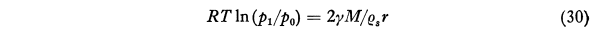
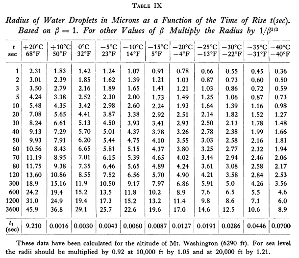

Title: Super-Cooled Water Droplets in Rising Currents of Cold Saturated Air  
Date: 2022-05-23 12:00  
Category: NACA  
tags: evaporation  

### _"It is possible to develop this theory to cover also growth of water droplets during the adiabatic expansion of a rising mass of saturated air."_  

  

# Irving Langmuir, "Super-Cooled Water Droplets in Rising Currents of Cold Saturated Air"  

## Summary 
Evaporation and condensation rates on water drops are calculated. 

## Key Points

1. A theory of water drop growth by condensation in the atmosphere is developed.  
2. The drop size measurement by oiled-slide and multicylinder instruments is improved.  
3. The evaporation rates of stationary water drops is analyzed.  

## Abstract

As this is an extensive work (130 pages), 
and as Langmuir did not provide an abstract or introductory summary, 
we will begin with the Langmuir's conclusions as a summary.

>**Summary of Main Conclusions of Part I to April 1, 1944**

>Before analyzing the new data it is desirable to summarize the main conclusions 
reached from the foregoing parts of this report:

>1. The Glauert theory of the deposition of rime on a cylinder, giving the
weight, width, and thickness of rime as a function of the wind velocity, the
particle size and the cylinder radius, gives reasonably consistent values for
the droplet radius when the theory is applied to the March, 1943 Mt. Washington 
data. Unfortunately, only one rotating cylindrical rime collector was
used, the other two being stationary. As the rime deposited on the stationary
collectors these soon became non-circular in cross section. In many cases
it was necessary to reject data for this reason. The droplet radius calculated
by the application of the Glauert riming theory will be denoted by r_R.  
>2. A theory of the growth of droplets in rising saturated air was developed,
according to which the smaller drops in the fog evaporate even while the
liquid water content of the fog continues to increase. As the drops grow in
size their number steadily decreases. A quantitative development leads to
the conclusion that the radius of the droplets depends only on the temperature
and age of the fog, i.e. the time during which the fog particles have been in
existence. The droplet radius does not depend directly on the liquid water
content but rather on the ratio of this to the vertical component of the velo-
city of the air entering the base of the cloud. The droplet radius calculated
from this time of rise or aging theory we will call r_t.  
>3. A comparison of r_R and r_t , given by the riming and the time of rise
theories from the same data show excellent agreement. The logarithmic correlation 
coefficient (LCC) which measures the correlation between log r_R
and the log r_t was found to be +.92 (see pages 235 to 236 of this Report). The
average deviation between the values of r_t and r_R is only slightly over 20 per
cent although the radius varied over a range over 1 to 10. Actually it was found
that r increased a little more rapidly than in proportion to r_R. This high correlation 
between r_R and r_t gives strong support to the Glauert theory of rime
deposition and to the proposed theory of droplet growth.  
>4. A theory was developed by which the droplet size is related to the product 
of the liquid water content of the fog and the visibility in feet. A semi-empirical 
equation was developed (Eq. 96) to express this relationship.  
>5. Microscopic observations and microphotographs to determine droplet
radius by the Houghton-Radford method have been made by the Mt. Washington 
Observatory. It was believed that the microphotographs gave direct
measurement of droplet radius. However, the radii determined in this way
averaged 3.1 times as great as the value r_R given by the riming theory. In the
case of the higher wind velocities and the larger droplet sizes the ratio was
sometimes as high as 9.5. Others w ho have been familiar with the Mt. Washington 
droplet size determinations have concluded that the Glauert theory
for some unknown reason gave particle sizes that were too small. Our conclusion 
in this Report is that the microscopic observations are faulty. The
droplets appear too large because of coalescence of droplets on the vaseline
covered slide. We wished particularly to test out this conclusion by further
observations on Mt. Washington. Empirically we found that the quantity
(55 M/v)^0.59, Eq. (99) shows a correlation (LCC) of 0.956 with r_R. In this
relation M is the radius determined by direct microscopic observation and
v is the wind velocity in miles per hour. The nonlinear relation between M
and r_R and its dependence on wind velocity are both satisfactorily explainable
by the coalescence of drops which strike the grease covered slide particularly
at high velocities.  
>6. By using soot-covered glass surfaces or by observing the scattering
of light from vaseline-coated surfaces, splash patterns were obtained when
the droplets strike a surface. These experiments not only gave a quantitative
relation between the splash patterns, wind velocity, and the droplet radius
but they give a quantitative explanation of the reasons for the nonlinear relationship 
between M and r_R and the dependence on wind velocity.

>**Part II. New Mt. Washington Data**

Part II includes two aspects that first appeared in this report, 
that are key to the widely cited "["Mathematical Investigation of Water Droplet Trajectories"]({filename}Mathematical Investigation of Water Droplet Trajectories.md)" [^2].

1. "Langmuir" drop size distributions (see [A Langmuir B drop size distribution is (almost) a normal distribution]({filename}A Langmuir B distribution is almost a normal distribution.md)).  
2. The Langmuir and Blodgett implementation of the equations of motion of water drop impingement on cylinders (see ["Mathematical Investigation of Water Droplet Trajectories"]({filename}Mathematical Investigation of Water Droplet Trajectories.md)).  

To summarize, Langmuir wanted to compare measured drop sizes to his water drop growth theory, 
found that current drop measurement methods (oiled slide, mutlicylinders) to be of limited accuracy, 
and so went on to develop better implementations of both methods. 

##Discussion

In this review, we will concentrate only on the evaporation and condensation of water vapor from and to the surface of a water drop. 

The oiled-slide method of measuring water drops is described: 

>Estimates of radius of water droplets in a cloud were made by a method
developed by H. G. Houghton and W. H. Radford. A small glass plate 5 x 5
millimeters square was exposed for a period varying from 1/2 to 2 seconds
by a trigger operated shutter to the full force of the wind on the tower of
the Observatory at Mt. Washington. The surface of the slide had been made
hydrophobic by covering with a thin film of vaseline which was then heated
to 300°C in an oven. The prepared slide, after exposure to the rime was examined 
microscopically. In nearly all cases the moisture was present on the
slide in the form of droplets that ranged from about 5 to 75 microns radius,
the average radius being roughly 40 microns. The observation of the slides
was made in a little room at the tower which was at the outdoor temperature.
Usually by the time the observation was made the droplets of water deposited
on the slide had turned to ice.

Evaporation rates of water drops on the slide was a concern, 
as drop sizes could change, and small drops in particular could disappear, 
during the time it took to photograph the sample. 

The effect of surface tension on the internal pressure of a water drop 
was calculated: 

>  
For a water droplet of 5μ radius at -5°C the value p1/po
is 1.000247. Because
of the increased vapor pressure there is a tendency for the small droplet to
evaporate even in air saturated with vapor.

After much development, an equation for the time required to evaporate a drop was found. 
The calculated life of small drops outside of the conditions where they were formed is short.

>  
where t is the life of a droplet which initially has the radius r. The symbol
F45 denotes the function represented by the second member of Eq. (45) as
tabulated in Col. 9 of Table VII. This equation is designed to facilitate the
calculation of the life of a water droplet in air of any specified relative humidity
Since the pressure increment Δp is the difference between the saturation
vapor pressure ew and the partial pressure of water vapor in the surrounding
atmosphere, 1-Δp/ew is the relative humidity. Consider, for example, a water
droplet of 3μ radius in air of 60 per cent relative humidity at -10°C. We
then have Δp/ew = 0.40, r = 3x10-4 cm and F45 = 7.98x105 and thus from
Eq (45) Τ = 0.180 second. For particles of other sizes the life can be calculated
readily since it varies in proportion to r^2. It is evident from this result that
if widely separated droplets of this small size were deposited on a glass slide
for microscopic examination they would disappear before observations could
be made if they were brought into air of low relative humidity.

>Thus the life of a droplet
of 3 μ radius in air saturated with respect to snow at -10°C is only 0.79 second.
The minimum value of 10-8F46 is 0.086 at -11°C but even at -40°C the life
is only 4.4 times as great as at this minimum. With particles of 13 microns
radius, which I believe were about the largest primary fog particles that occurred
in the Mt. Washington observations as given, for example, in Col. 7 of Table
III, the life at -10°C would be only 17 seconds and at -25°C, 23 seconds. The
difficulty in using the Houghton Radford microscopic measurement on Mt.
Washington for particles as small as this is thus apparent.

A water drop in an environment more similar to the conditions that it was formed in 
has a longer life: 

>Life of Moderately Small Droplets in Saturated Air.
Thus, although the life of a particle of one micron radius at -15° would be
only 6.2 seconds, a particle of 10 microns radius would be 6200 seconds, or
1.72 hours.

The growth rate of a drop in rising air was calculated.

>Theory of Growth of Particles in Expanding Saturated Air.   
At any stage
in the formation of a cloud the droplets are not of uniform size but there is
a distribution of particle sizes above and below a mean value. The smaller
drops have a higher vapor pressure than the larger drops. Therefore the small
drops evaporate and the moisture they contain deposits on the large drops.
There is thus a continual decrease in the number of droplets. Those that
remain become increasingly large. Let us assume that while this process is
going on, the distribution of the particles among the various size groups,
(each being defined in terms of the radius), expressed as a fraction of the
mean radius, remains substantially unchanged. Thus, for example, the percentage 
of the particles that have radii less than 0.8 of the mean radius remains
constant while the particles gradually increase in diameter. It is not probable
that this condition is strictly fulfilled, but rough analysis indicates that the
effects we are looking for are not very sensitive to moderate changes in the
distribution function. We shall, therefore, assume that the distribution function 
remains constant. In any given time interval the fraction of the particles
that disappears should then vary inversely in proportion to the life-time of the
droplets of average size.

>It is possible to develop this theory to cover also growth of water droplets
during the adiabatic expansion of a rising mass of saturated air. 

Langmuir considered the case of mass transfer by diffusion (only), 
and so for the evaporation calculations the relative airspeed of the water drop is considered to be zero, 
so a convective mass coefficient is not used. 

An equation for the time required to evaporate a drop was found. 
The calculated life of small drops outside of the conditions where they were formed is short.

>  
where t is the life of a droplet which initially has the radius r. The symbol
F45 denotes the function represented by the second member of Eq. (45) as
tabulated in Col. 9 of Table VII. This equation is designed to facilitate the
calculation of the life of a water droplet in air of any specified relative humidity
Since the pressure increment Δp is the difference between the saturation
vapor pressure ew and the partial pressure of water vapor in the surrounding
atmosphere, 1-Δp/ew is the relative humidity. Consider, for example, a water
droplet of 3μ radius in air of 60 per cent relative humidity at -10°C. We
then have Δp/ew = 0.40, r = 3x10-4 cm and F45 = 7.98x105 and thus from
Eq (45) Τ = 0.180 second. For particles of other sizes the life can be calculated
readily since it varies in proportion to r^2. It is evident from this result that
if widely separated droplets of this small size were deposited on a glass slide
for microscopic examination they would disappear before observations could
be made if they were brought into air of low relative humidity.

>Thus the life of a droplet 
of 3 μ radius in air saturated with respect to snow at -10°C is only 0.79 second.
The minimum value of 10-8F46 is 0.086 at -11°C but even at -40°C the life
is only 4.4 times as great as at this minimum. With particles of 13 microns
radius, which I believe were about the largest primary fog particles that occurred
in the Mt. Washington observations as given, for example, in Col. 7 of Table
III, the life at -10°C would be only 17 seconds and at -25°C, 23 seconds. The
difficulty in using the Houghton Radford microscopic measurement on Mt.
Washington for particles as small as this is thus apparent.

For conditions similar to those the drop developed in, 
the calculated life is longer: 

>Life of Moderately Small Droplets in Saturated Air.
Thus, although the life of a particle of one micron radius at -15° would be
only 6.2 seconds, a particle of 10 microns radius would be 6200 seconds, or
1.72 hours.

Predicted drop sizes r_t are shown in Table IX.  

  

Adiabatic lift theory was then used to determine the time value t. 

##Conclusions 

Care must be taken when using the oiled-slide method to ensure that drops do not 
evaporate or coalesce. 

Water drops of "typical" cloud sizes (10 micrometer diameter) at low relative airspeeds in saturated humidity have 
low evaporation rates, with a calculated life of almost 2 hours. 

##Citations

Langmuir cites 8 references: 

- Glauert, Muriel: A Method of Constructing the Paths of Raindrops of Different Diameters Moving in the Neighbourhood of (1) a Circular Cylinder, (2) an Aerofoil, Placed in a Uniform Stream of Air; and a Determination of the Rate of Deposit of the Drops on the Surface and the Percentage of Drops Caught. R. & M. No. 2025, British A.R.C., 1940.  
- "On the measurement of drop size in liquid water content in fogs and clouds", Papers in Physical Oceanographic Institute and Meteorology, published by Mass. Inst. of Tech. and Woods Hole Oceanographic Institute, Volume 4 , November 1938.  
- Albrecht, F.: Theoretical investigation of accretion of aerosol particles in an air, stream and an application of the theory of the aerosol filter. Phys. Z 32 (1931): 48-56.  
- Langmuir, Irving: OSRD report on Screening Smokes No. 490, Dated October 5, 1942 [apps.dtic.mil](https://apps.dtic.mil/sti/pdfs/ADB811463.pdf)  
- Houghton, H. G., and Radford, W. H.: On the Measurement of Drop Size and Liquid Water Content in Fogs and Clouds. Papers in Phys. Oceanography and Meteorol., M.I.T. and Woods Hole Oceanographic Inst., vol. VI, no. 4, Nov. 1938.  
- Humphreys, W. J.: Physics of the Air. J. B. Lippincott Co., 1920.  
- Kantrowitz, Arthur: Aerodynamic Heating and the Deflection of Drops by an Obstacle in an Air Stream in Relation to Aircraft Icing. NACA-TN-779, 1940.  
- Zahm, A. F.: Flow and Drag Formulas for Simple Quadrics, NACA-TR-253, 1927.  

An online search [^3] found "Super-Cooled Water Droplets in Rising Currents of Cold Saturated Air" cited by 24 publications.

##Notes
[^1]: 
Langmuir, Irving: Super-Cooled Water Droplets in Rising Currents of Cold Saturated Air, Pt. I. Res. Lab., General Electric Co., Oct. 1943-Aug. 1944. (Army Contract W-33-106-sc-65.)  
[^2]:
Langmuir, Irving, and Blodgett, Katherine B.: "Mathematical Investigation of Water Droplet Trajectories". Report. No. RL-224, January 1945, in "The Collected Works of Irving Langmuir", Vol. 10, 1961.  
[^3]: 
[scholar.google.com](https://scholar.google.com/scholar?cites=16453079719584137883&as_sdt=5,48&sciodt=0,48&hl=en)  
