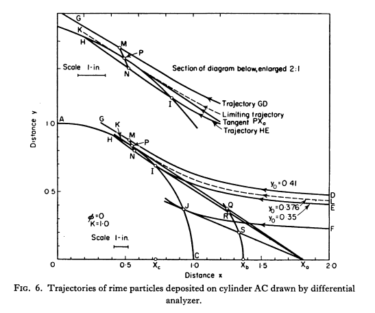

Title: "Mathematical Investigation of Water Droplet Trajectories"    
Date: 2022-01-21 12:00  
Category: Army Air Force
tags: cylinders, water drops

### _"IT IS DESIRED to calculate the trajectories of small water droplets (fog) in air moving at high velocities across a cylinder."_  

  

## Summary  

Langmuir drop size distributions are defined, and water drop impingement on a collection of cylinders for use as an icing instrument is described.
    
## Key points

1. The Langmuir drop size distributions are defined
2. The water drop impingement terms E, Beta, K, and Ko are defined
3. The use of cylinders of different sizes and detailed calculations to determine water drop sizes

## Abstract

>  Calculations are given of the trajectories of small water droplets 
moving in air at high velocities across a cylinder. The calculations were 
made by means of a differential analyzer (D.A.). A few calculations are
also given for the case of a sphere and a ribbon.

>  Each D. A. trajectory represents the motion of a single particle. The theoretical curves for
the efficiency of deposition of very large numbers of particles were derived from the D. A. data
on the assumption that all the particles in a given fog were of uniform size.

>  The theoretical curves can be used to analyze experimental data. For example, if measurements
are made of the rate of rime deposition on two or more cylinders under the same fog conditions,
the cylinders having different radii, a comparison of these data with the theoretical curves 
provides a method of calculating the size of the particles that were collected and the liquid water
content of the fog.

>  It is known, however, that in general the particles in fogs are not of uniform size. The effect
which a distribution of particle size has on the results became apparent when measurements
made with three or more cylinders having different radii were compared with the theoretical
data. It was usually found that the curvature of the experimental plot was not quite the same
as that of the theoretical curve. A method was devised for taking into account certain assumed
distributions of particle size. It was found that the experimental data fitted the theoretical data
much better after this had been done.

>  An example is given of the analysis of experimental data by means of the theoretical curves.
It is shown that when three or more cylinders are used it is possible to estimate the distribution
of particle size by graphical methods. The experimental data used in the example were obtained
by R. M . Cunningham in an airplane. The application of the method is given for the case of data
taken under other conditions, such as those at the attitude of Mt. Washington [New Hampshire, USA]. 

## Discussion

This is not a NACA publication, but it is an important link in the chain of NACA citations. 
It is an example of important, contemporary work done outside NACA.
This is the most cited icing publication that I know of (700+ citations on scholar.google [^4]).
This reference merits much study, 
but at this time I will limit the discussion to the pertinent points in the NACA citation chain. 

### A note on publications
This work was published three times, in [^1], [^2], and [^3] (with slightly different titles). 
The first was a preliminary version, and the second was the final version, which is more extensive. 
The third appears to be substantially similar to [^2], with a slight change in title. 
Many citations are specifically for [^3].

The images in an online version of [^3] are of poor quality, so selected text and tables were transcribed herein. 

### Drop size distribution

Table IX defines "assumed" water drop size distributions. 
Reference [^5] clarifies that the "B" distribution comes from, apparently, 
a single case of drop size measurement in [^6] (apparently by an oil slide method). 
The post ["A Langmuir B distribution is (almost) a normal distribution"
]({filename}A%20Langmuir%20B%20distribution%20is%20almost%20a%20normal%20distribution.md) 
will examine the data more thoroughly. 

For an assumption, these distributions have taken hold for more than 75 years, 
and are still cited in recent publications 
(for example, AC 20-73A [^7] [2006] recommends the use of a Langmuir D distribution). 

>Table IX
Four Assumed Distributions of Droplet Size

| Liquid Water Content Percent | a/ao B | (a/ao)^1.5 C | (a/ao)^2.0 D | (a/ao)^2.5 E |
|------------------------------|--------|--------------|--------------|--------------|
| 5                            | 0.56   | 0.42         | 0.31         | 0.23         |
| 10                           | 0.72   | 0.61         | 0.52         | 0.44         |
| 20                           | 0.84   | 0.77         | 0.71         | 0.65         |
| 30                           | 1.00   | 1.00         | 1.00         | 1.00         |
| 20                           | 1.17   | 1.26         | 1.37         | 1.48         |
| 10                           | 1.32   | 1.51         | 1.74         | 2.00         |
| 5                            | 1.49   | 1.81         | 2.22         | 2.71         |

I suspect that most recent citations have been for the drop size distributions and not other aspects,
but I have not read through 700+ references to confirm this.

### Water drop impingement terms

While [NACA-TN-779]({filename}NACA-TN-779.md) [^8] presented results as dimensional, this publication put values in non-dimensional terms.
The non-dimensional form allows the tables to be applied to a wide variety of cases.

Large portions will be reproduced here, as the online version freely available is of limited image quality.  

> The quantity β which serves as a measure of the thickness of the rime at
any point characterized by θ may thus be defined by  

     β = dE/dθ,  (27)  
>where 0 must be measured in radians. For the case of Κ = ∞ there is uniform
deposition over the projected area of the cylinder. For this case  

     Ε = Y,  (28)  

For more current definitions, see [^9].

> The Stokes' Law equation is

    f = β π η ν a, (1)

> where f is the force acting on the drop, ρa is the density of air (g/cm^3),  
η the viscosity of air in poises (g/cm sec),    
ν the velocity with which the droplet moves through the air (cm/sec),  
and a the droplet radius (cm).  

> With the velocities encountered in airplanes and with droplet sizes frequently 
present in clouds, Stokes' Law does not apply and the force acting
on the droplet can be determined only from the knowledge of the drag coefficient 
Cd for spheres which can be expressed in terms of the Reynolds number R defined by  

    R = 2 a ρa v/ n,  (2)  
>where ρa is the density of air (g/cm). The coefficient Cd is given by

    Cd R / 24 = f / (6 π η ν a), (3)  

> The quantity Ru occuring in Eq. (8) is defined by:  

    Ru = 2 a ρa U / η, (9)  

> The quantity Κ that occurs in Eqs. (4) and (5) measures the inertia of the
droplet and varies in proportion to the density of the particle and increases
with its size. It is defined by  

    K = λs / C,  (10)  
> where C is the radius of the cylinder and λs is the "Range" which the droplet
would have as a projectile released in still air with the velocity U, assuming
that Stokes* law holds. The advantage of using this quantity, which has the
dimensions of a length, is that it permits us to put the equations into convenient form.  

>The value of λs is given by  

     λs = (2/9) ρs a^2 U / η,  (11)  
> where ρs is the density of the droplet in g/cm^3 and U the free air velocity in cm/sec. Therefore Κ is given by  

     Κ = 2 ρs a^2 U / (9 η C), (12)  
 
> To present the data in such form that this problem as well as that
of the first type can be conveniently handled, it is desirable to introduce another
dimensionless parameter which we shall call φ, defined as follows:  

    φ = Ru^2/K = 18 ρa^2 C U / (η ρs),  (25)  

> From the actual values of Κ calculate Ko as defined by the equation  
  
    (Κo - 1/8) = (λ / λs) (K - 1/8), (40)  

> The ratio λ/λs can be calculated from Ru by the equation  
  
    λ/λs = (1/R ) integral[0:Ru](dR/(Cd R / 24)),  (41)    
> A full table of values of λ/λs was given in Table I.

The definitions of K and Ko above are specific to the cylinder, and the definitions in [^9] 
are different.

### Multi-cylinder icing instruments
 
The water drop collection efficiency E for a given icing condition is a function of water drop size.
If all the water freezes, then the mass gathered on different size cylinder can be measured 
and the water drop median size and size distribution inferred.

The "if all the water freezes" assumption will be examined in the 
[Icing Thermodynamics Thread]({filename}thermodynamics.md).  

> Example of the Application of the D.A. Data to Experimental Data:  
In the early work that was done before the D.A. study was made, a method
was developed for analyzing the experimental data that were obtained at the
Mt. Washington Observatory. These data were measurements of the ice collected 
on two or more rotating cylinders under various conditions. This work
has been described in the Report to the A.R.L. 
"Super-Cooled Droplets in Rising Currents of Cold Saturated Air", Parts I and II by Irving Langmuir.

For a single cylinder with a single water drop size, 
Langmuir compared results from his analysis with those of Kantrowitz [^8].

> TABLE IV (a)
Comparison of Kantrovitz [sic] Data with the new Results from the Differential Analyzer (D.A.) Calculations  

| (1) Droplet diam. (mils) | (2) Ks | (3) EM | (4) EM Kantrovitz | (5) Kantrovitz Θm | (6) D.A. Θm |
|--------------------------|--------|--------|-------------------|-------------------|-------------|
| 0.32                     | 0.125  | -      | 0                 | -                 | 0           |
| 0.7                      | 0.619  | 0.075  | 0.250             | 19.0              | 44.6        |
| 1                        | 1.26   | 0.200  | 0.445             | 33                | 61.8        |
| 2                        | 5.04   | 0.520  | 0.760             | 55.5              | 80          |
| 4                        | 20.1   | 0.780  | 0.928             | 71.5              | 87.2        |
| 6                        | 45.4   | 0.860  | 0.966             | 78.5              | 88.6        |
| 10                       | 125.9  | 0.920  | 0.987             | 83.5              | 89.5        |
| 40                       | 2015   | 0.99   | 0.999             | 89.0              | 89.9        |

> Table IV (a) gives comparison of the Kantrovitz data (Restricted Report,
National Advisory Committee for Aeronautics) with the new data from the
D.A. The Kantrovitz data were calculated for particles travelling at a high
velocity, ν = 8940 cm/sec. They correspond to the case φ = 16,000. The
data from which βo can be calculated were not given in the Kantrovitz Report.

However, as this is in a section label "φ = 0", and the reference [^8] data is purportedly at φ = 16000, 
this is perhaps not the most meaningful comparison. 
See [A Detailed Comparison of Water Drop Impingement Calculations]({filename}/A Detailed Comparison of NACA-TN-779 and Mathematical Investigation of Water Droplet Trajectories.md) for a more detailed comparison.

## Citations

This publication has few formal, conventional citations. 
However, some are mentioned only in passing, such as "Cunningham's data".
I have inferred what was meant by these and resolved them to conventional citations.

Note that some data from Cunningham and Glauert may be found in [^5].

- Wien, W., and Harms, F., eds.: Handbuch der Experimentalphysik. Teil 4, Bd. 2, Akademische Verdagsgesellschaft M.B.H. (Leipzig), 1932.
- Goldstein, S.: Modern Developments in Fluid Dynamics. The Clarendon Press, Oxford, 1938.
- Green, S. L.: Hydro- and Aerodynamics. Pitman and Sons, 1937, p. 26.
- Kantrowitz, Arthur: Aerodynamic Heating and the Deflection of Drops by an Obstacle in an Air Stream in Relation to Aircraft Icing. NACA-TN-779, 1940.
- Glauert, Muriel: A Method of Constructing the Paths of Raindrops of Different Diameters Moving in the Neighbourhood of (1) a Circular Cylinder, (2) an Aerofoil, Placed in a Uniform Stream of Air; and a Determination of the Rate of Deposit of the Drops on the Surface and the Percentage of Drops Caught. R. & M. No. 2025, British A.R.C., 1940.
- Langmuir, Irving: Super-Cooled Water Droplets in Rising Currents of Cold Saturated Air, Pt. I. Res. Lab., General Electric Co., Oct. 1943-Aug. 1944. (Army Contract W-33-106-sc-65.)
- Cunningham, R. M.: Instructions for Calculating the Liquid Water Content, Effective Drop Size and Effective Drop Distributions from Rotating Cylinder Data Obtained from Average Speed Aircraft. Informal rep., De-Icing Res. Lab., Dept. of Meteorol., M.I.T., 1945.

This publication is cited over 700 times in the literature [^4]. I will not attempt to list them all here.
Recent publications continue to cite this work (such as [^7]).

In the NACA Icing Publication Database [^10], it is cited 43 times:

- Bergrun, Norman R.: A Method for Numerically Calculating the Area and Distribution of Water Impingement on the Leading Edge of an Airfoil in a Cloud. NACA-TN-1397, 1947 [ntrs.nasa.gov](https://ntrs.nasa.gov/citations/19810068678).
- Jones, Alun R., Holdaway, George H., and Steinmetz, Charles P.: A Method for Calculating the Heat Required for Windshield Thermal Ice Prevention Based on Extensive Flight Tests in Natural—Icing Conditions. NACA-TN-1434, 1947. [ntrs.nasa.gov](https://ntrs.nasa.gov/citations/19810068715)
- Lewis, William: A Flight Investigation of the Meteorological Conditions Conducive to the Formation of Ice on Airplanes. NACA-TN-1393, 1947.
- Neel, Carr B., Jr., Bergrun, Norman R., Jukoff, David, and Schlaff, Bernard A.: The Calculation of the Heat Required for Wing Thermal Ice Prevention in Specified Icing Conditions. NACA-TN-1472, 1947.
- Guibert, A. G., Janssen, E., and Robbins, W. M.: Determination of Rate, Area, and Distribution of Impingement of Waterdrops on Various Airfoils from Trajectories Obtained on the Differential Analyzer. NACA-RM-9A05, 1949.
- Lewis, William, and Hoecker, Walter H., Jr.: Observations of Icing Conditions Encountered in Flight During 1948. NACA-TN-1904, 1949.
- von Glahn, Uwe H., and Blatz, Robert E.: Investigation of Aerodynamic and Icing Characteristics of Water-Inertia-Separation Inlets for Turbojet Engines. NACA-RM-E50E03, 1950.
- Bergrun, Norman R.: An Empirical Method Permitting Rapid Determination of the Area, Rate, and Distribution of Water-Drop Impingement on an Airfoil of Arbitrary Section at Subsonic Speeds. NACA-TN-2476, 1951.
- Brun, Rinaldo J., Levine, Joseph, and Kleinknecht, Kenneth S.: An Instrument Employing a Coronal Discharge for the Determination of Droplet-Size Distribution in Clouds. NACA-TN-2458, 1951.
- Hacker, Paul T., and Dorsch, Robert G.: A Summary of Meteorological Conditions Associated with Aircraft Icing and a Proposed Method of Selecting Design Criterions for Ice-Protection Equipment. NACA-TN-2569, 1951.
- Kline, Dwight B., and Walker, Joseph A.: Meteorological Analysis of Icing Conditions Encountered in Low-Altitude Stratiform Clouds. NACA-TN-2306, 1951.
- Levine, Joseph, and Kleinknecht, Kenneth S.: Adaptation of a Cascade Impactor to Flight Measurement of Droplet Size in Clouds. NACA-RM-E51G05, 1951.
- Perkins, Porter J.: Flight Instrument for Measurement of Liquid-Water Content in Clouds at Temperatures Above and Below Freezing. NACA-RM-E50J12a, 1951.
- Perkins, Porter J., and Kline, Dwight B.: Analysis of Meteorological Data Obtained During Flight in a Supercooled Stratiform Clouds of High Liquid-Water Content. NACA-RM-E51D18, 1951.
- Perkins, Porter J., McCullough, Stuart, and Lewis, Ralph D.: A Simplified Instrument for Recording and Indicating Frequency and Intensity of Icing Conditions Encountered in Flight. NACA-RM-E51E16, 1951 [ntrs.nasa.gov](https://ntrs.nasa.gov/citations/19810068729).
- von Glahn, Uwe H., Callaghan, Edmund E., and Gray, Vernon H.: NACA Investigations of Icing-Protection Systems for Turbojet-Engine Installations. NACA-RM-E51B12, 1951.
- Bergrun, Norman R.: An Empirically Derived Basis for Calculating the Area, Rate, and Distribution of Water-Drop Impingement on Airfoils. NACA-TR-1107, 1952.
- Howell, Wallace E.: Comparison of Three Multicylinder Icing Meters and Critique of Multicylinder Method. NACA-TN-2708, 1952.
- Lewis, James P., and Bowden, Dean T.: Preliminary Investigation of Cyclic De-Icing of an Airfoil Using an External Electric Heater. NACA-RM-E51J30, 1952. [ntrs.nasa.gov](https://ntrs.nasa.gov/citations/19810068711)
- Neel, Carr B., Jr., and Steinmetz, Charles P.: The Calculated and Measured Performance Characteristics of a Heated-Wire Liquid-Water-Content Meter for Measuring Icing Severity. NACA-TN-2615, 1952.
- Brun, Rinaldo J., Gallagher, Helen M., and Vogt, Dorothea E.: Impingement of Water Droplets on NACA 651-208 and 651-212 Airfoils at 4° Angle of Attack. NACA-TN-2952, 1953.
- Brun, Rinaldo J., and Mergler, Harry W.: Impingement of Water Droplets on a Cylinder in an Incompressible Flow Field and Evaluation of Rotating Multicylinder Method for Measurement of Droplet-Size Distribution, Volume-Median Droplet Size, and Liquid-Water Content in Clouds. NACA-TN-2904, 1953 [ntrs.nasa.gov](https://ntrs.nasa.gov/citations/19930083606).  
- Brun, Rinaldo J., Serafini, John S., and Gallagher, Helen M.: Impingement of Cloud Droplets on Aerodynamic Bodies as Affected by Compressibility of Air Flow Around the Body. NACA-TN-2903, 1953.
- Dorsch, Robert G., and Brun, Rinaldo J.: A Method for Determining Cloud-Droplet Impingement on Swept Wings. NACA-TN-2931, 1953.
- Hacker, Paul T., Brun, Rinaldo J., and Boyd, Bemrose: Impingement of Droplets in 90° Elbows with Potential Flow. NACA-TN-2999, 1953.
- Lewis, James P.: Investigation of Aerodynamic and Icing Characteristics of Flush Alternate-Inlet Induction-Systems Air Scoop. NACA-RM-E53E07, 1953. [ntrs.nasa.gov](https://ntrs.nasa.gov/citations/19930087831)  
- Lewis, James P.: An Analytical Study of Heat Requirements for Icing Protection of Radomes. NACA-RM-E53A22, 1953.
- Lewis, James P., and Blade, Robert J.: Experimental Investigation of Radome Icing and Icing Protection. NACA-RM-E52J31, 1953.
- Lewis, William, Perkins, Porter J., and Brun, Rinaldo J.: Procedure for Measuring Liquid-Water Content and Droplet Sizes in Super-cooled Clouds by Rotating Multicylinder Method. NACA-RM-E53D23, 1953.
- Lowell, Herman H.: Maximum Evaporation Rates of Water Droplets Approaching Obstacles the Atmosphere under Icing Conditions. NACA-TN-3024, 1953
- Dorsch, Robert G., and Brun, Rinaldo J.: Variation of Local Liquid-Water Concentration about an Ellipsoid of Fineness Ratio 5 Moving in a Droplet Field. NACA-TN-3153, 1954.
- Serafini, John S.: Impingement of Water Droplets on Wedges and Double- Wedge Airfoils at Supersonic Speeds. NACA-TR-1159, 1954. (Supersedes NACA-TN-2971.)
- Brun, Rinaldo J., Lewis, William, Perkins, Porter J., and Serafini, John S.: Impingement of Cloud Droplets and Procedure for Measuring Liquid-Water Content and Droplet Sizes in Supercooled Clouds by Rotating Multicylinder Method. NACA-TR-1215, 1955. (Supersedes NACA TN’s 2903, 2904, and NACA-RM-E53D23)
- Dorsch, Robert G., Saper, Paul G., and Kadow, Charles F.: Impingement of Water Droplets on a Sphere. NACA-TN-3587, 1955. [ntrs.nasa.gov](https://ntrs.nasa.gov/citations/19810068694)  
- von Glahn, Uwe H., Gelder, Thomas F., and Smyers, William H., Jr.: A Dye-Tracer Technique for Experimentally Obtaining Impingement Characteristics of Arbitrary Bodies and a Method for Determining Droplet Size Distribution. NACA-TN-3338, 1955.
- Gelder, Thomas F., Smyers, William H., Jr., and von Glahn, Uwe H.: Experimental Droplet Impingement on Several Two-Dimensional Airfoils with Thickness Ratios of 6 to 16 Percent. NACA-TN-3839, 1956.
- Hacker, Paul T., Saper, Paul G., and Kadow, Charles F.: Impingement of Droplets in 60° Elbows with Potential Flow. NACA-TN-3770, 1956.
- Lewis, William, and Brun, Rinaldo J.: Impingement of Water Droplets on a Rectangular Half Body in a Two-Dimensional Incompressible Flow Field. NACA-TN-3658, 1956. [ntrs.nasa.gov](https://ntrs.nasa.gov/citations/19930084877)  
- von Glahn, Uwe H.: Use of Truncated Flapped Airfoils for Impingement and Icing Tests of Full-Scale Leading-Edge Sections. NACA-RM-E56E11, 1956.
- Brun, Rinaldo J., and Vogt, Dorothea E.: Impingement of Cloud Droplets on 36_5-Percent-Thick Joukowski Airfoil at Zero Angle of Attack and Discussion of Use as Cloud Measuring Instrument in Dye-Tracer Technique. NACA-TN-4035, 1957.
- Lewis, James P., and Ruggeri, Robert S.: Experimental Droplet Impingement on Four Bodies of Revolution. NACA-TN-4092, 1957.
- Gelder, Thomas F.: Droplet Impingement and Ingestion by Supersonic Nose Inlet in Subsonic Tunnel Conditions. NACA-TN-4268, 1958.
- von Glahn, Uwe H., and Blatz, Robert E.: Investigation of Power Requirements for Ice Prevention and Cyclical De-Icing of Inlet Guide Vanes with Internal Electric Heaters. NACA-RM-E50H29, Dec. 1950.

## Related works  

NACA-TN-2708 [^11] has comments on the origins of the Langmuir drop size distributions, and proposes revised values.

## Notes  

[^1]:
Langmuir, Irving, and Blodgett, Katherine B.: "Mathematical Investigation of Water Droplet Trajectories". Report. No. RL-224, January 1945, in "The Collected Works of Irving Langmuir", Vol. 10, 1961. Note: Neither Langmuir nor Bodgett are specifically credited in this publication.  
[^2]:
Langmuir, Irving, and Blodgett, Katherine B.: "Mathematical Investigation of Water Droplet Trajectories". Report. No. RL-224, December 1945 - July 1946, in "The Collected Works of Irving Langmuir", Vol. 10, 1961. Note: Neither Langmuir nor Bodgett are specifically credited in this publication. Note: some references cite this as "RL-225", but it is RL-224 in this publication.  
[^3]:
Langmuir, Irving, and Blodgett, Katherine B.: A Mathematical Investigation of Water Droplet Trajectories. Tech. Rep. No. 5418, Air Materiel Command, AAF, Feb. 19, 1946. (Contract No. W-33-038-ac-9151 with General Electric Co.)  
[books.google.com](https://books.google.com/books?hl=en&lr=&id=mJySYM32cHUC&oi=fnd&pg=PA11&dq=Katherine+Blodgett+icing&ots=QYP5gFyEiz&sig=djzAHtpIZuT_OlbopRsNYyUhUdc#v=onepage&q=Katherine%20Blodgett%20icing&f=false)  
[^4]:
[scholar.google.com](https://scholar.google.com/scholar?hl=en&as_sdt=0%2C48&q=A+Mathematical+Investigation+of+Water+Droplet+Trajectories&btnG=).  
[^5]:
Langmuir, Irving: Super-Cooled Water Droplets in Rising Currents of Cold Saturated Air, Pt. I. Res. Lab., General Electric Co., Oct. 1943-Aug. 1944. (Army Contract W-33-106-sc-65.)  
[^6]:
Houghton, H. G., and Radford, W. H.: On the Measurement of Drop Size and Liquid Water Content in Fogs and Clouds. Papers in Phys. Oceanography and Meteorol., M.I.T. and Woods Hole Oceanographic Inst., vol. VI, no. 4, Nov. 1938.  
[^7]:
FAA Advisory Circular AC No. 20-73A: Aircraft Ice Protection. August 16, 2006. [faa.gov](https://www.faa.gov/regulations_policies/advisory_circulars/index.cfm/go/document.information/documentID/22031)  
[^8]:
Kantrowitz, Arthur: Aerodynamic Heating and the Deflection of Drops by an Obstacle in an Air Stream in Relation to Aircraft Icing. NACA-TN-779, 1940.  
[^9]:
Heinrich, A.; Ross, R.; Zumwalt, G.; Provorse, J.; Padmanabhan, V.: Aircraft Icing Handbook. Vol. 1, DOT/FAA/CT-88/8-1. 1991.  
[^10]:
[NACA icing publications database]({filename}naca%20icing%20publications%20database.md)  
[^11]: 
Howell, Wallace E.: Comparison of Three Multicylinder Icing Meters and Critique of Multicylinder Method. NACA-TN-2708, 1952 [ntrs.nasa.gov](https://ntrs.nasa.gov/citations/19810068732).  
