Title: NACA-ARR-5G13  
Date: 2022-04-11 13:00  
Category: NACA  
tags: thermodynamics, python  

### _"A method is given for calculating the temperature of a surface wetted ... by a pure liquid, such as water"_  

# "Kinetic Temperature of Wet Surfaces A Method of Calculating the Amount of Alcohol Required to Prevent Ice, and the Derivation of the Psychrometric Equation" [^1]

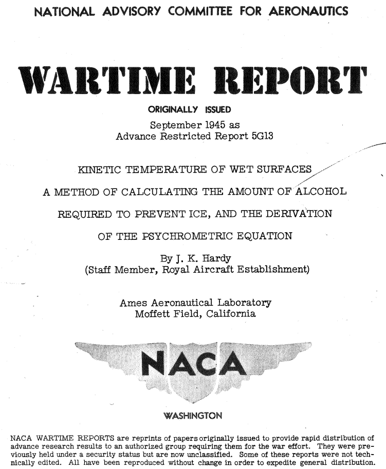  

## Summary 
Psychrometric equations are presented to calculate the thermal effects of 
evaporation from wet surfaces at high air speeds. 

## Key Points
1. The wet surface equilibrium "datum" temperature is defined. 
2. Psychrometric equations are presented to calculate the thermal effects of 
evaporation from wet surfaces. 
3. The calculations are implemented in python code.  

## Abstract

> A method is given for calculating the temperature of a
surface wetted either by a pure liquid, such as water, or by
a mixture, such as alcohol and water.
The method is applied
to the problem of protecting, by alcohol, propellers and the
induction system of the engine against ice. The minimum
quantity of alcohol required is calculated for a number of 
arbitrarily chosen conditions. The effect of evaporation of 
alcohol is shown repeating the calculations for a nonvolatile
fluid. The method can be applied to other problems in evaporation,
for instance, to the evaporation of fuel in the
induction system of the engine. 
The psychometric equations, 
used in wet-bulb hygrometry, is deduced in its general form.
The effect of kinetic heating is included.

## Discussion

(Note: the image quality of the pdf of NACA-ARR-5G13 did not allow readily capturing the text, 
so much of this post is images, not searchable text.)

Here we see cooperation between NACA and the RAE (Royal Aircraft Establishment), 
as author J. K. Hardy was from the RAE, as were several of the references. 

As noted on the coversheet above:
>NACA WARTIME REPORTS are reprints of papers originally issued to provide rapid distribution of
advance research results to an authorized group requiring them for the war effort. They were 
previously held under a security status but are now unclassified. Some of these reports were not 
technically edited. All have been reproduced without change in order to expedite general distribution.

While "Some of these reports were not technically edited", this report has excellent technical content. 

The nomenclature may be challenging, so peruse the symbols used: 
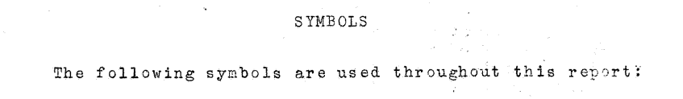  
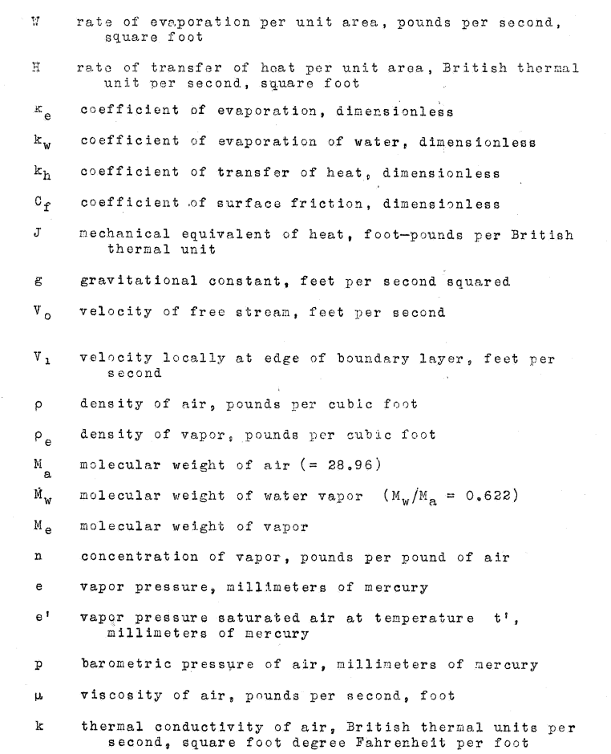  
  

This will be complicated enough with just water considered
if one has not seen psychrometrics before, 
so see the document if you want to do calculations with alcohol
(or the implementation in the Python programming language file naca_arr_5g13.py at [^2]).  

A term "datum temperature" is defined, 
it will take several equations to get to the formal definition. 

> In the case of a surface wetted with water, the equation
derived is the psychrometric equation in its complete form. 
Since the effect of kinetic heating is included, this equation
may be used in the measurement of humidity, by the wet bulb
method, at high speeds. This equation is of use, also,
in calculating the rate of heating required to protect a 
surface exposed to conditions of icing. The **datum temperature**,
in calculating the rate of dissipation of heat from 
the surface by the method given in references 1 and 2, is
the wet-kinetic temperature of the surface.
This may be calculated from the psychometric equation, in the form
given in this report.

The mass rate of evaporation from a wet surface can be calculated. 

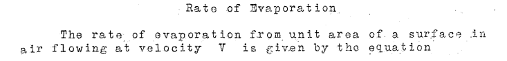  
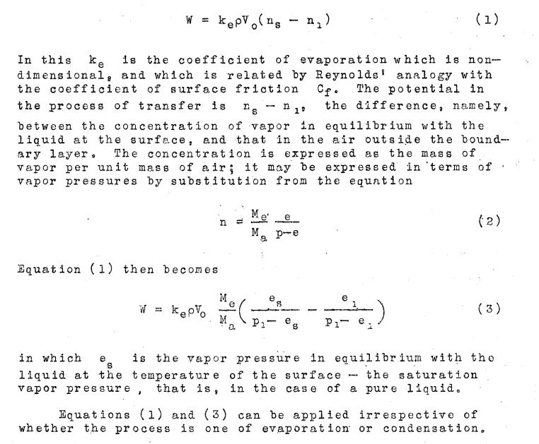  

The heat gain by convection and kinetic heating can be calculated: 

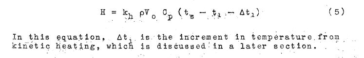  

The heat required to evaporate water water at the given surface temperature is calculated: 
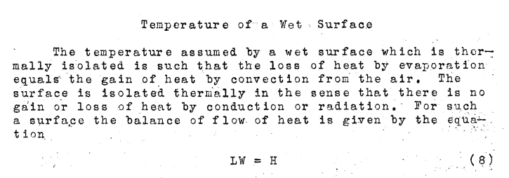  

The heat values may be equated to yield:
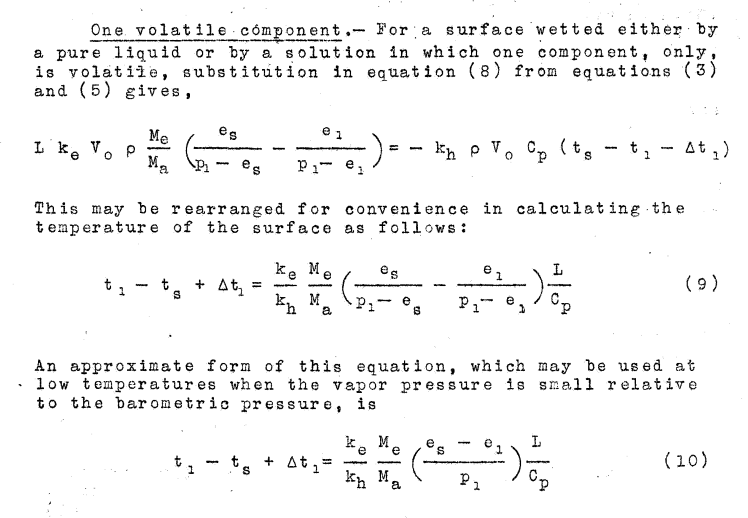  

There is an extensive discussion about the ratio of k_e/k_h, 
and it was determined that the ratio is close to unity, so 1 was used.

Dry air values of kinetic heating are defined

  

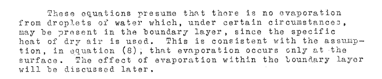  

Now conditions with a wet surface are considered. 

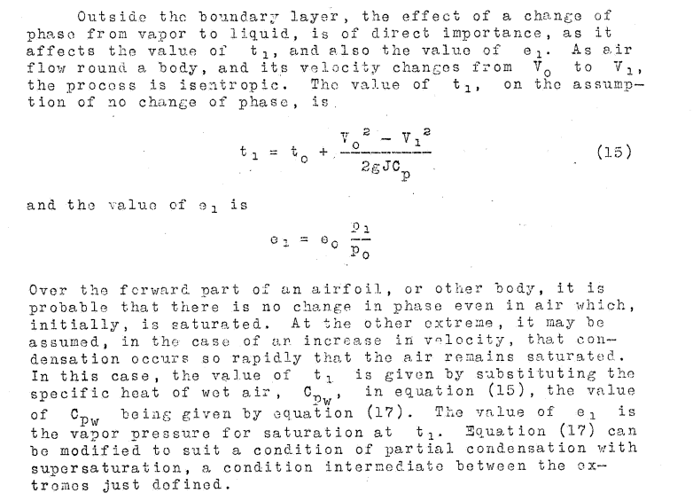  

Hardy outlined a condition where the water drops 
are not in equilibrium with the local air temperature, 
(the equation e1= eo*p1/po, after (15)), but then adopts the 
temperature equilibrium, which is used in the example calculations he presented. 

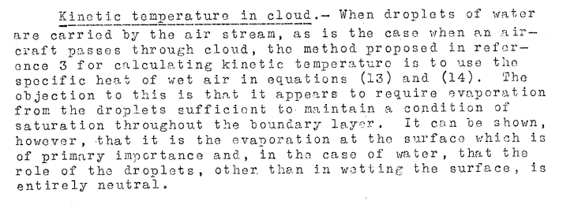  
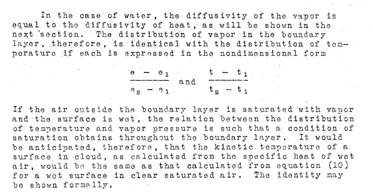  
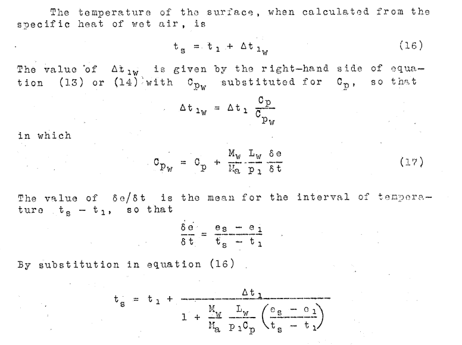  
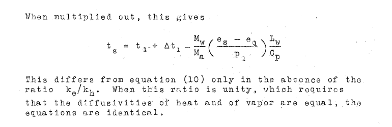  

We finally have a definition of the "datum temperature" 
t_s, equilibrium wet surface temperature, with a set of assumptions. 
Major assumptions include that water drops are in equilibrium with the air 
as they approach an object, which requires evaporation from the drops. 

Note that in the revised version of equation 10, 
one does not have to evaluate k_h or k_e. 
This is because the ratio k_h/k_e was evaluated, and found the 
ratio to be close to unity, so 1 was used, 
and the term disappears from the equation.

Note also that the impingement rate is not evaluated. 
The rate of water catch is assumed to be adequate to keep the surface wet. 
The heat effect of cold water impinging is not included. 

## Results of Calculations 

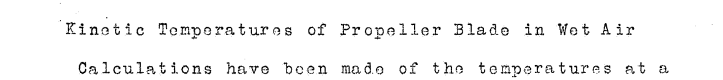 
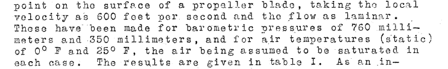
  
 

Table I summarizes the calculations for several cases:
  
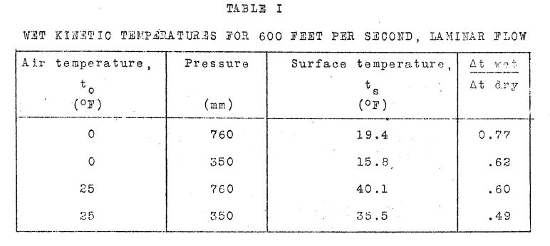  

An implementation in the Python programming language yielded similar results 
(file naca_arr_5g13.py at [^2]).  

Comparison to Table I:  

| T, F | P, mm_hg | NACA-ARR-5G13 T_surface, F | Calculated T_surface, F | NACA-ARR-5G13 Ratio, Cp/Cp_wet | Calculated Ratio, Cp/Cp_wet |
|------|----------|----------------------------|-------------------------|--------------------------------|-----------------------------|
| 0    | 760      | 19.4                       | 19.5                    | 0.77                           | 0.77                        |
| 0    | 350      | 15.8                       | 15.8                    | 0.62                           | 0.62                        |
| 25   | 760      | 40.1                       | 39.9                    | 0.6                            | 0.59                        |
| 25   | 350      | 35.5                       | 35.5                    | 0.49                           | 0.42                        |

## Citations

NACA-ARR-5G13 cites 7 references.

- Hardy, J. K., and Mann, G.: Prediction of the Rate of Formation of Ice, and the Rate of Heating Necessary to Prevent Ice. TN No. Acre. 1010, R. A. E., Aug. 1942. 
- Hardy, J. K.: An Analysis of the Dissipation of Heat in Conditions of Icing from a Section of the Wing of the C-46 Airplane. NACA-TR-831, 1945. (Formerly NACA-ARR-4I11a.) [ntrs.nasa.gov](https://ntrs.nasa.gov/citations/19930091908) 
- Anon.: Note on Kinetic Heating with Particular Reference to Conditions of Icing. Tech. Note No. 674, R.A.E., June 1942. (NACA Reprint October 1942). 
- Goldstein, S.: Modern Developments in Fluid Dynamics. The Clarendon Press, Oxford, 1938. 
- Squire, H. B.: Heat Transfer Calculation for Aerofoils. NACA-MRR-3E29 (R. A. E., Aero 1783), 1943. [abbottaerospace.com](https://www.abbottaerospace.com/downloads/arc-rm-1986-heat-transfer-calculation-for-aerofoils/) 
- Brooks, Donald B.: Psychometric Charts for High and Low Pressures, Misc. Pub. M146, Nat. Bur. of Standards, Jan. 18, 1938. 
- Kimball, Leo B.: Icing Tests of Aircraft-Engine Induction Systems. NACA-WR-W-97, Jan. 1943. [ntrs.nasa.gov](https://ntrs.nasa.gov/citations/19930093057) 

NACA-ARR-5G13 is cited 8 times in the NACA Icing Publications Database [^3].

- Darsow, John F., and Selna, James: A Flight Investigation of the Thermal Performance of an Air-Heated Propeller. NACA-TN-1178, 1947. [ntrs.nasa.gov](https://ntrs.nasa.gov/citations/19930081946)
- Gray, Vernon H., and Campbell, B. G.: A Method for Estimating Heat Requirements for Ice Prevention on Gas-Heated Hollow Propeller Blades. NACA-TN-1494, 1947. [ntrs.nasa.gov](https://ntrs.nasa.gov/citations/19810068622)
- Coles, Willard D., Rollin, Vern G., and Mulholland, Donald R.: Icing-Protection Requirements for Reciprocating-Engine Induction Systems. NACA-TR-982, 1950. (Supersedes NACA-TN-1993.) [ntrs.nasa.gov](https://ntrs.nasa.gov/citations/19810068627)
- Gray, Vernon H.: Simple Graphical Solution of Heat Transfer and Evaporation from Surface Heated to Prevent Icing. NACA-TN-2799, 1952. [ntrs.nasa.gov](https://ntrs.nasa.gov/citations/19930083505)
- Callaghan, Edmund E., and Serafini, John S.: Analytical Investigation of Icing Limit for Diamond Shaped Airfoil in Transonic and Supersonic Flow. NACA-TN-2861, 1953. [ntrs.nasa.gov](https://ntrs.nasa.gov/citations/19810068583)
- Callaghan, Edmund E., and Serafini, John S.: A Method for Rapid Determination of the Icing Limit of a Body in Terms of the Stream Conditions. NACA-TN-2914, 1953. [ntrs.nasa.gov](https://ntrs.nasa.gov/citations/19810068713)  
- Coles, Willard D., and Ruggeri, Robert S.: Experimental Investigation of Sublimation of Ice at Subsonic and Supersonic Speeds and its Relation to Heat Transfer. NACA-TN-3104, 1954. [ntrs.nasa.gov](https://ntrs.nasa.gov/citations/19810068725)
- Coles, Willard D.: Icing Limit and Wet-Surface Temperature Variation for Two Airfoil Shapes under Simulated High-Speed Flight Conditions. NACA-TN-3396, 1955. [ntrs.nasa.gov](https://ntrs.nasa.gov/citations/19930084131)  

An online search found that NACA-ARR-5G13 is cited 21 times in the literature [^4].  

## Notes:  
[^1]: Hardy, J. K.: Kinetic Temperature of Wet Surfaces A Method of Calculating the Amount of Alcohol Required to Prevent Ice, and the Derivation of the Psychrometric Equation. NACA-ARR-5G13, 1945. [ntrs.nasa.gov](https://ntrs.nasa.gov/citations/19930093546) 
[^2]: [github.com](https://github.com/icinganalysis/icinganalysis.github.io)  
[^3]: 
[NACA icing publications database]({filename}naca%20icing%20publications%20database.md)  
[^4]: 
[scholar.google.com](https://scholar.google.com/scholar?hl=en&as_sdt=0%2C48&q=Kinetic+Temperature+of+Wet+Surfaces+A+Method+of+Calculating+the+Amount+of+Alcohol+Required+to+Prevent+Ice%2C+and+the+Derivation+of+the+Psychrometric+Equation&btnG=)  
