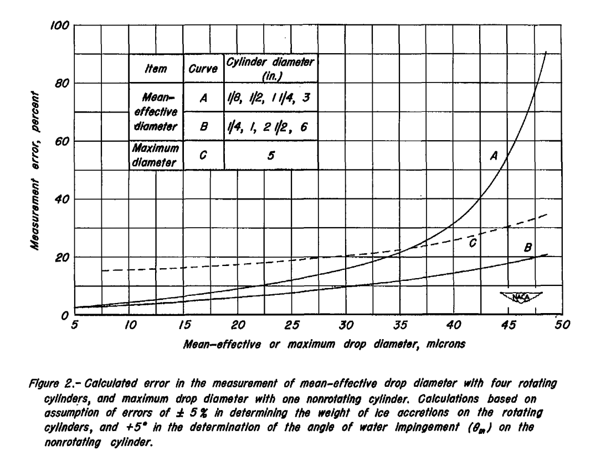

Title: NACA-RM-A9C09   
Date: 2022-02-22 12:00  
Category: NACA
tags: cylinders

### _"The [multicylinder] method has assumed the position of a standard against which other instruments are calibrated, and is apt to remain so..."_  

  

# "A Review of Instruments Developed for the Measurement of the Meteorological Factors Conducive to Aircraft Icing"  
[^1]

## Summary 

The multicylinder is the "standard against which other instruments are calibrated"

## Key points  

1. Nine instruments, including the fixed cylinder and rotating multicylinder, are qualitatively assessed.  
2. "The [multicylinder] method has assumed the position of a standard against which other instruments are calibrated, and is apt to remain so..."  
3. The effect of mass measurements errors on multicylinder results were assessed.  
4. "A reliable method for the measurement of drop-size distribution should be developed"  

## Abstract

>  The status of instrument suitable for the measurement of the 
meteorological factors conducive to aircraft icing is reviewed. The
meteorological factors to be evaluated are listed, and tentative 
values for the desired and acceptable accuracy of measurement for 
each factor are suggested.

>  Nine instruments which appear to be the most promising for the 
procurement of the meteorological data are discussed with respect to 
the quantities they measure, principle of operation, range and accuracy, 
duration of a single reading, and advantages and disadvantages 
associated with their use.  Recommendations are presented for the 
continued research and development of icing meteorological instruments. 

## Discussion  

Nine instruments were assessed:  
- Rotating Multicylinders  
- Fixed Cylinder  
- Rotating-Disk Icing-Rate Meter  
- Capillary Collector  
- Rainbow Recorder  
- Dew-Point Recorder  
- Visibility Meter  
- Sooted Slides  
- Drop Photography  

While photos of each instrument were included, the image quality of the pdf scan is poor, 
so I will not include them here.

While there is much of interest here, we focus on the cylinders.

Accuracy targets were determined:

  

### Rotating Multicylinder

Depending on the accuracy threshold desired, with the assumed mass measurement variations of 5%, 
the rotating multicylinder method may be applicable up to 
median effective drop diameters of 20 to 45 micrometers with the "A" set of cylinders:

There were few details given on how these values were determined. 
Some inference was required to largely reproduce the values, see the file naca_rm_a9c09.py at [^2] for details. 
In the figure below, it appears that the variance was over-estimated for larger drop size cases for cylinder set A. 

Several advantages and disadvantages are listed for rotating multicylinders:

 

Note the conclusion: 
>  **The [multicylinder] method has assumed the position of a standard against which other instruments are calibrated, and is apt to remain so...**

### Fixed Cylinder

Several advantages and disadvantages are listed for the fixed cylinder:

### Conclusions

In the conclusions, several actions are recommended:

>  1. Development of the rotating disk should be continued. This
device should prove very useful in both the formative and statistical 
investigations just discussed, since it gives evidence of being 
capable of producing a continuous record of liquid-water content,
with small lag, practically independent of drop size.
>  2. The visibility meter should be investigated as a possible
statistical instrument for use with the rotating disk to provide
average drop-size information.
>  3. Development of the rainbow recorder as a potential single
instrument for providing both liquid-water content and drop-size
data should be continued.
>  4. A reliable method for the measurement of drop-size distribution 
should be developed.

## Citations

NACA-RM-A9C09 cites 15 publications:

- Jones, Alun R., Holdaway, George H., and Steinmetz, Charles P.: A Method for Calculating the Heat Required for Windshield Thermal Ice Prevention Based on Extensive Flight Tests in Natural Icing Conditions. NACA TN No. 1434, 1947.
- Neel, Carr B., Jr., Bergrun, Norman R., Jukoff, David, and Schlaff, Bernard A.: The Calculation of the Heat Required for Wing Thermal Ice-Prevention in Specified Icing Conditions. NACA TN No. 1472, 1947;
- Lewis, William: A Flight Investigation of the Meteorological Conditions Conducive to the Formation of Ice on Airplanes. NACA TN 1393, 1947.
- Lewis, William, Kline, Dwight B., and Steinmetz, Charles P.: A Further Investigation of the Meteorological Conditions Conducive to Aircraft Icing. NACA TN 1424, 1947.
- Jones, Alun R., and Lewis, William: Recommended Values of Meteorological Factors to be Considered in the Design of Aircraft Ice-Prevention Equipment. NACA-TN-1855, 1949. [ntrs.nasa.gov](https://ntrs.nasa.gov/citations/19930082528)
- Langmuir, Irving, and Blodgett, Katherine B.: A Mathematical Investigation of Water Droplet Trajectories. General Electric Co. Rep., 1943. (Also available as Army Air Forces Tech. Rep. No. 5418 and as Dept. of Commerce Pub. PB No. 27565.)
- Vonnegut, B., Cunningham, R. M., and Katz, R. E.: Instruments for Measuring Atmospheric Factors Related to Ice Formation on Airplanes. De-Icing Res. Lab., Dept. Meteorology, M.I.T., April 1946.
- Katz, R.E., and Cunningham, R.M.: Instruments for Measuring Atmospheric Factors Related to Ice Formation on Airplanes- II, Aircraft Icing Instruments M.I.T. Icing Research Laboratory Report. Contract No. W-33-038-ac-14165. Mar.1948.
- Schaefer, Vincent J.: The Liquid Water Content of Summer Clouds on the Summit of Mt. Washington. General Electric Research Laboratory Report. Contract W-33-038-ac-9151. Apr. 1946.
- Falconer, R. E., and Schaefer, V. J, : A New Plane Model Cloud Meter. General Electric Research Laboratory Occasional Report No. 2, Project Cirrus. Contract No. W-3&03pSC-32427.May 15, 1948.
- Malcus, Willem V. R., Bishop, Richard H., and Briggs, Robert O.: Analysis and Preliminary Design of an Optical Instrument for the Measurement of Drop Size and Free-Water Content of Clouds. NACA TN No. 1622, 1948.
- Friswold, Frank A., Lewis, Ralph D., and Wheeler, R. Clyde, Jr.: An Improved Continuous-Indicating Dew-Point Meter. NACA TN No. 1215, 1947.
- Orthel, John C.: Visibility Indicator. Aeronautical Ice Research Laboratory Report, serial number AIRL 6034 48-14-7. Mar. 1948. Prepared under contract W-33-038-ac-18024 for Air Materiel Command, U. S. Air Force, Wright Field, Dayton, Ohio
- Schaefer,Vincent J.: The Preparation and Use of Water Sensitive Coatings for Sampling Cloud Particles. General Electric Research Laboratory Report. Contract W-33-038-ac-9151. Apr. 1946.
- Elliott, H. W.: Cloud Droplet Camera. National Research Laboratories Report No. M.I.-7O1. National Research Council of Canada, Ottawa, Canada. Dec. 1947.

NACA-RM-A9C09 is cited 4 times in the NACA Icing Publications Database [^3]:

- Perkins, Porter J.: Flight Instrument for Measurement of Liquid-Water Content in Clouds at Temperatures Above and Below Freezing. NACA-RM-E50J12a, 1951. [ntrs.nasa.gov](https://ntrs.nasa.gov/citations/19810068728)
- Howell, Wallace E.: Comparison of Three Multicylinder Icing Meters and Critique of Multicylinder Method. NACA-TN-2708, 1952.
- Lewis, William, and Bergrun, Norman R.: A Probability Analysis of the Meteorological Factors Conducive to Aircraft Icing in the United States. NACA-TN-2738, 1952.
- Brun, Rinaldo J., Serafini, John S., and Moshos, George J.: Impingement of Water Droplets on an NACA 651-212 Airfoil at an Angle of Attack of 4°. NACA-RM-E52B12, 1952. [ntrs.nasa.gov](https://ntrs.nasa.gov/citations/19810068679)

An online search [^4] found NACA-RM-A9C09 cited 13 times.  

## Related  

The other instruments are reviewed in the Meteorological Instruments thread 
[NACA-RM-A9C09 Instruments]({filename}NACA-RM-A9C09_instruments.md).  

## Notes  

[^1]:
Jones, Alun R., and Lewis, William: A Review of Instruments Developed for the Measurement of the Meteorological Factors Conducive to Aircraft Icing. NACA-RM-A9C09, 1949 [ntrs.nasa.gov](https://ntrs.nasa.gov/citations/19810068733).  
[^2]: [github.com](https://github.com/icinganalysis/icinganalysis.github.io)   
[^3]: 
[naca icing publications database]({filename}naca%20icing%20publications%20database.md)  
[^4]: [scholar.google.com](https://scholar.google.com/scholar?hl=en&as_sdt=0%2C48&q=A+Review+of+Instruments+Developed+for+the+Measurement+of+the+Meteorological+Factors+Conducive+to+Aircraft+Icing&btnG=)  
