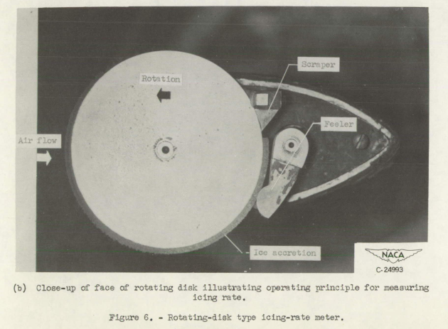
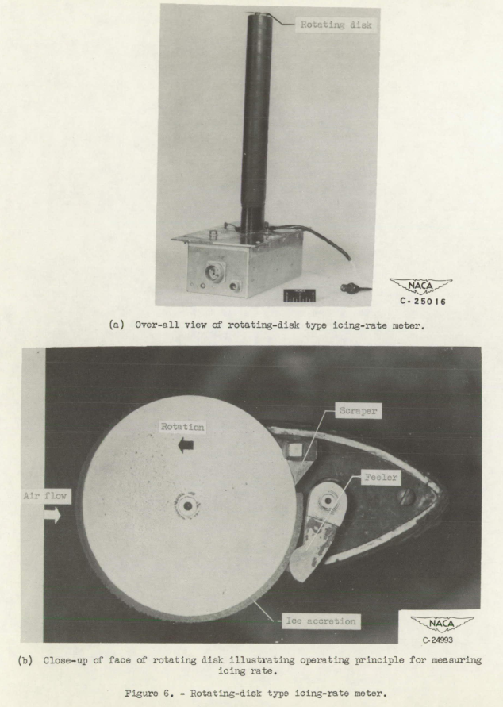
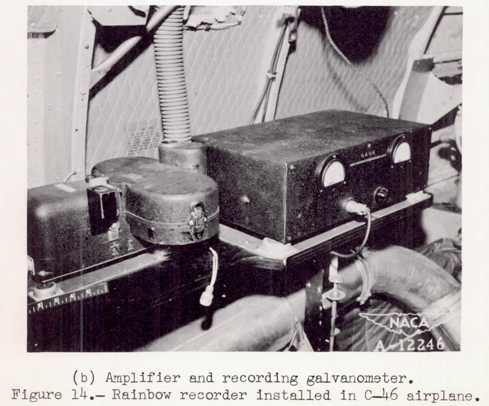
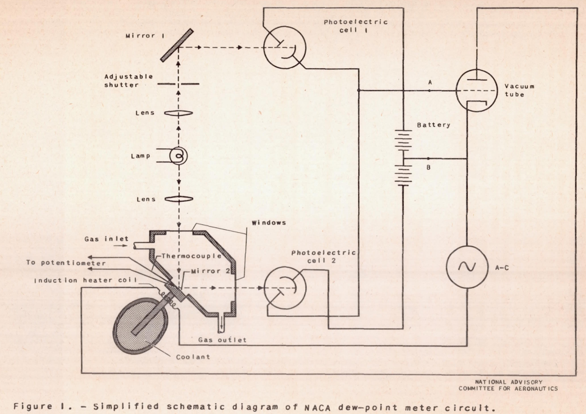
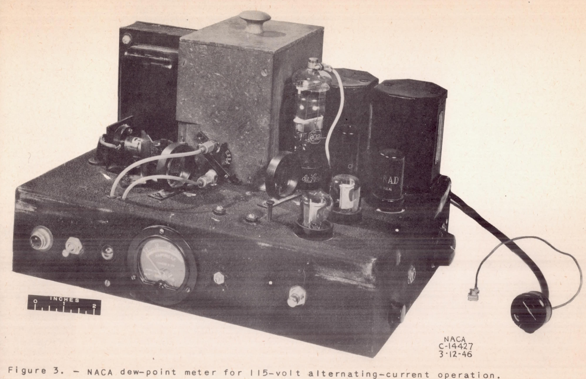
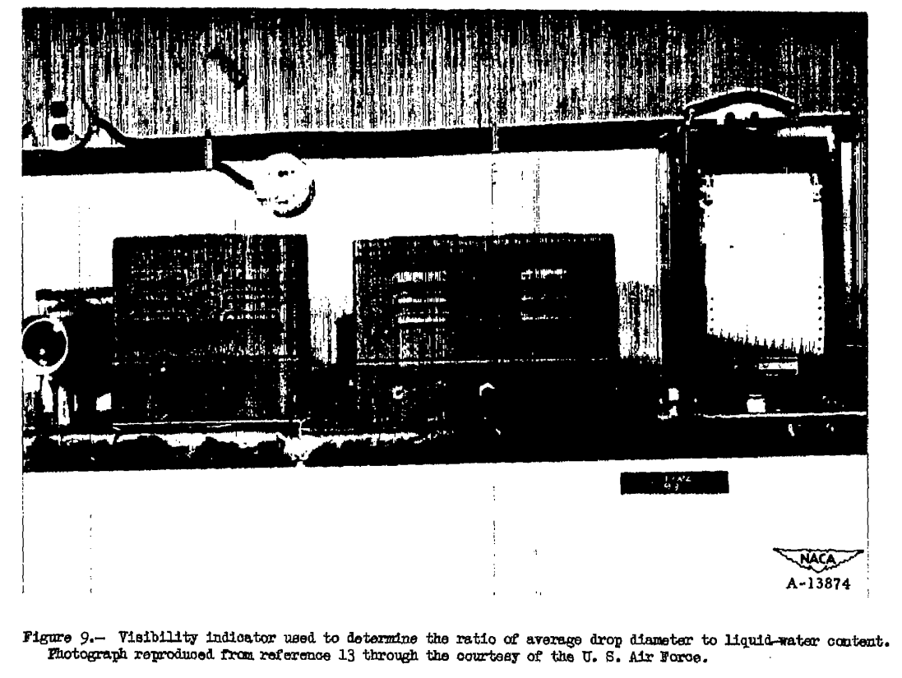
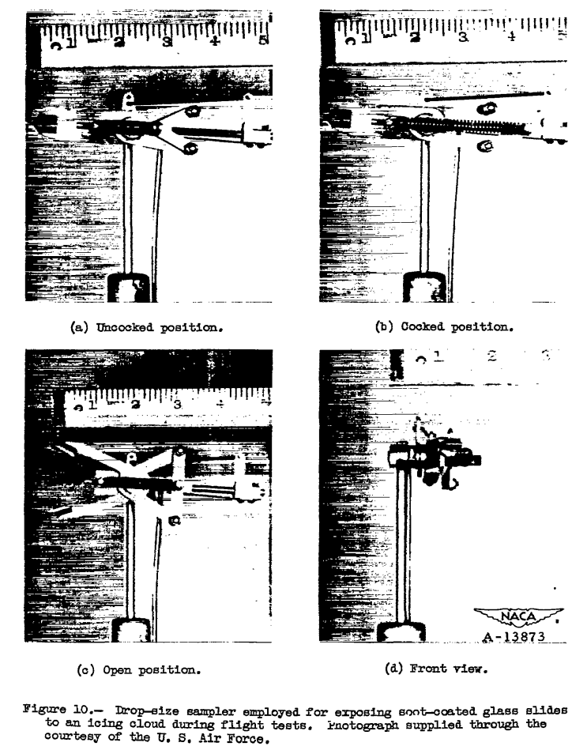

Title: NACA-RM-A9C09 Instruments  
Date: 2022-11-28 12:00  
Category: NACA  
tags: instruments  

### "This [rotating disk] device should prove very useful in both the formative and statistical investigations."  

# "A Review of Instruments Developed for the Measurement of the Meteorological Factors Conducive to Aircraft Icing"  [^1]  

  
_from NACA-RM-E51E16 [^2]_  

## Summary 
"A review ... of meteorological factors conducive to aircraft icing reveals outstanding needs" for icing instrumentation.  

## Key points  
1. Nine instruments, based on differing technologies, are qualitatively assessed.  
2. "The [multicylinder] method has assumed the position of a standard against which other instruments are calibrated, and is apt to remain so..."  
3. "This [rotating disk] device should prove very useful in both the formative and statistical investigations."  
4. "A reliable method for the measurement of drop-size distribution should be developed"  

## Abstract

>  The status of instrument suitable for the measurement of the 
meteorological factors conducive to aircraft icing is reviewed. The
meteorological factors to be evaluated are listed, and tentative 
values for the desired and acceptable accuracy of measurement for 
each factor are suggested.

>  Nine instruments which appear to be the most promising for the 
procurement of the meteorological data are discussed with respect to 
the quantities they measure, principle of operation, range and accu-
racy, duration of a single reading, and advantages and disadvantages 
associated with their use.  Recommendations are presented for the 
continued research and development of icing meteorological instruments. 

## Discussion

This publication gives us a view into the state of the art in 1947 
of icing instrumentation. 

Nine instruments were assessed:  
- Rotating Multicylinders  
- Fixed Cylinder  
- Rotating-Disk Icing-Rate Meter  
- Capillary Collector  
- Rainbow Recorder  
- Dew-Point Recorder  
- Visibility Meter  
- Sooted Slides  
- Drop Photography  

The cylinder based instruments are discussed in detail in the review ([NACA-RM-A9C09]({filename}NACA-RM-A9C09.md)).  

While the multicylinder is the "standard against which other instruments are calibrated", 
the other eight instruments will be discussed herein.  

Some images in the online version of NACA-RM-A9C09 are of poor quality. 
I have found clearer, substitute images of the instruments for some cases from 
other NACA publications.  

### Fixed Cylinder  

>Factor measured.-  
The fixed cylinder is employed for the determination of the maximum drop diameter.  
>
>Principle of operation and description.-  
The area of impingement of water drops on a nonrotating cylinder is taken as an
indication of the maximum diameter of the drops present. A large
cylinder is used to assure a collection efficiency less than 100
percent. One form of the device consists of a 4-inch diameter
cylinder with blueprint paper stretched over the surface.
(See fig. 3 and reference 3.) The cylinder is exposed for a brief period
of time and the area of impingement, easily discernible on the blue-print paper, 
provides an indication of the maximum diameter of the
drops which were present in sufficient quantity to leave a trace.
Another form consists of a cylinder with markings on the surface
which are used to estimate the extent of the ice accretion.
The accretion is removed periodically by rotating the cylinder against
a knife-edge scraper. 
(See fig. 4 and reference 4.)  

  

  

>Range and accuracy.-  
As discussed in reference 4, considerable
discrepancy has been noted between the minimum drop diameter as
indicated by the fixed cylinder and that computed from the rotating-cylinder data. 
This discrepancy is again present in the 1947-48
meteorological data obtained during the C-46 airplane icing operation 
by the Ames Aeronautical Laboratory and has not been resolved
at the present writing. The most probable source of error in the
deteration of the maximum drop diameter by the fixed-cylinder
method is the measurement of the extent of the ice accretion on the
cylinder. This extent is commonly expressed as the included angle
between the two radii of the cylinder which define the extremities of the ice accretion. 
To obtain an indication of the effect
of an error in the determination of θ on the value of maximum drop
diameter, calculations have been made for the 5 inch-diameter cylinder
and an assumed maximum error of 5° in the value of θ. The result
of these computations is presented as curve C in figure 2, which
represents the maximum percent error in the maximum drop diameter
for a error in θ. On the basis of curve C in figure 2, it
would appear reasonable to assign the following accuracies to a
5-inch fixed cylinder:

```text
Actual maximum drop diameter    Maximum measurement error
(microns)                       (microns)
 5 to 15                         2
15 to 25                         4
25 to 35                         7
35 to 50                        15
```
>At the present time it appears that the principal source of
error in the fixed-cylinder method as used at Ames Aeronautical
Laboratory during 1948 (fig. 4) lies in the inability of the observer
to detect the extreme edge of the ice formation. Another contributing 
factor is probably the effect of the slight change in profile
due to the presence of the ice layer. Reasonable agreement between
the rotating-cylinder and fixed-cylinder data may be obtained by
adding a constant correction of 5° to the observed value of θ,
These considerations suggest that the method of measuring the angle
by means of a trace on blueprint paper (fig. 3) is more accurate and
dependable than by visual observation of the ice formation. The
range of the device is limited only by the practical aspect of the
maximum cylinder size that can be employed in any projected investigation.

### Rotating-Disk Icing-Rate Meter  

>Principle of operation and description.-  
A thin disk about 2
inches in diameter, 1/8 inch thick at the center, and beveled to
1/32 inch at the edge is mounted with the plane of the disk parallel
to the direction of the free stream. (See fig. 5.) The disk is
rotated at about two revolutions per minute. The thickness of the
ice accretion on the rim is continuously indicated by a feeler at
the back of the disk and the accretion is then removed by a scraper
located behind the thickness feeler. Observations of the profile
of ice collected while the disk was stationary indicate that 95
percent of the ice is collected in an angle of 120°, thus the
effective exposure time at a rotation rate of two rpm is about 10
seconds. On the Ames Aeronautical Laboratory instrument the feeler
is located 140° from the forward point, giving rise to a lag of 12
seconds at two rpm. Use of a variable rate of rotation, for example,
from one-third to five rpm, would give more accurate measurement of
very low values of water content and a more detailed record during
periods of heavy icing. The effective exposure time would then vary
from 1 minute to 4 seconds. More detailed information is contained
in references 7 and 8.
>
>Range and accuracy.-  
The motion of the feeler is actually an
indication of the rate of ice accretion on the rim of the disk.
This indication can be converted to a continuous record of liquid-water 
content by assuming, or obtaining empirically, the ratio
E/ρ
where E represents the collection efficiency
of the disk and ρ
the density of the ice accretion. Based
on 150 simultaneous readings
of the rotating disk and the rotating cylinders, for the same exposure time, 
an average value of 1.1 for E/ρ
has been established.<sup>8</sup> 
The drop size range during these 150 readings varied from 8 to 50
microns. The value of 1.1 is an arithmetic average, with the root
mean square deviation being 0.22 and the maximum deviation between 10
and 40 microns being 0.6.
It should be pointed out that the measured
values of E/ρ are influenced by errors in the rotating-cylinder
observations and errors due to the difficulties in synchronization;
hence, the actual variation of E/ρ is probably considerably less
than indicated by these data. Based on these
results it is believed
that the use of a constant value of E/ρ equal to 1.1 would result
in the computation of values of liquid-water content with a probable
error of +/-12 percent or less over the entire icing range of table I
reference 5.
>
><sup>8</sup> data obtained during the 1947-48 icing research flights conducted
by the Ames Aeronautical Laboratory.

  
_[I did not know it was this small.]_  

  
_from NACA-RM-E51E16_  

>Advantages.-  
>1. The rotating-disk icing meter provides a continuous
indication of liquid-water content with reasonable accuracy
over the drop-diameter range associated with icing conditions.
>2. The instrument is reliable and can be converted readily
to a recording device.
>3. The instrument is adaptable to flight.  
>  
>Disadvantages.-  
>1. The rotating-disk icing meter actually indicates rate of icing instead of the more desirable fundamental factor,
liquid water content. Further verification
of the independence
of the device with respect to drop size, for all practical
purposes, is desirable.
>2. The lag of the instrument is somewhat large for the
ideal determination of maximum instantaneous conditions.

The rotating-disk icing meter was later used in aircraft icing 
statistical studies. The flight data obtained in 1948-49 is documented in the later NACA-TN-1904 [^3]. 
The rotating-disk icing meter was used in conjunction with a multicylinder device, 
as it could provide a continuous, higher resolution record of LWC values. 
The rotating-disk icing meter reports continuous values averaged over several seconds with about a 12 second lag, 
while the multicylinder values are averaged over one to several minutes.  

I do not know of a current use of the technology. 

### Capillary Collector  

>Principle of operation and description.-  
A porous head is
exposed to the cloud and, by the application of suction to the aft
side of the head, water collecting on the forward side is drawn
through the porous material. The relation between the amount of
water passing through the head in unit time and the free-stream
liquid-water content is established by calibration under controlled
conditions. In the original collector,
as conceived by
B. Vonnegut
of M.I.T.,
references 7 and 8, the rate of water collection was
obtained by the visual observation of the movement of an air bubble
in a calibrated capillary. In a more recent development of the
instrument by the General Electric Company, references 9 and 10, the
collected water is deposited on a continuously moving glass tape,
impregnated with methylene blue dye powder. The width of the trace
on the tape is proportional to the rate of water interception by the
head. The General Electric instrument is shown in figure 6.

  
_(image quality is poor in the online version of NACA-RM-A9C09, I made my own scan for here.)_  

>Advantages  
>1. The capillary collector provides for the
continuous
automatic record
of liquid-water content at temperatures
above freezing.  
>2. The instrument is relatively simple in operation and
is dependable.  
>3. Accurate measurements at temperatures above freezing
are provided.  
>4. The instrument is adaptable to flight.  
>
>Disadvantages
>1. Evaporative errors seriously complicate the use of the
instrument in icing conditions.

There are some similarities to isokinetic sampling probes, 
which are currently available commercially.

You can see more from B. Vonnegut in the review of ["Supercooled Clouds"]({filename}Vonnegut.md).  

### Rainbow Recorder  

>Principle of operation and description.-  
The instrument is
based on the rainbow-forming properties of water drops. A
intensity, modulated beam of light is projected into the air stream
containing droplets, and the rainbow produced is scanned by an
oscillating mirror.
The varying intensity of the rainbow light is
recorded. From a plot of intensity against mirror angle, and the
basic optical theory of the rainbow, values of liquid-water content,
average drop diameter, and drop-size distribution can be calculated.
For the Ames instrument, figure 7 and reference 11, the rainbow
scanning rate is 1/2 second.  
>
>Range and accuracy.-  
Theoretically, the instrument should be
usable for the entire range of icing conditions in table I, 
reference 5.
Actually, difficulties in operation have resulted in very
few usable flight records. These problems are associated with
excessive background light, and discontinuities in the cloud
structure experienced in flight. During ground tests of the instrument, 
where the deleterious effects of background light and cloud
variation have been eliminated or minimized, the records from the
rainbow recorder have been much more encouraging than those obtained
in flight.  
...  
>It is estimated that basically the instrument
could produce data in flight accurate to +/-10 percent for average
drop diameter and +/-15 percent for liquid-water content if operation
similar to that experienced in the cloud chamber could be achieved.
Although the instrument is theoretically capable of measuring drop
size distribution, it is not considered likely that this can be
achieved in practice.  

  
_from NACA-TN-1622 [^4]_  

  
_from NACA-TN-1622_  

>Advantages  
>1. Potentially, the instrument could provide,
in flight,
a continuous automatic recording
of liquid water content, and
average area drop size.  
>2. The air stream is not disturbed by the instrument.  
>
>Disadvantages
>1. The device is electrically complicated.
>2. At the present scanning rate of the Ames Aeronautical
Laboratory instrument (1/2 sec), the rate of variation of
liquid-water content
and drop size in some clouds precludes
the procurement of a satisfactory record.
>3. Variations in background light in clouds seriously
affect the readings.
>4. At present, the instrument requires continuous attention
by personnel skilled in electronics.
>5. The instrument with attendant apparatus is bulky.

Some modern drop sizing instruments use the diffraction principle.  

### Dew-Point Recorder  

>Principle of operation and description.-  
A representative
sample of the cloud is inducted, heated to evaporate all of the
free water (liquid water plus snow) present, and the dew point of
the sample is measured. From this reading and the free-stream
temperature, the free-stream
content of the air stream can be calculated. 
The dew-point recorder is designed to provide a continuous
record of the dew point of the heated sample. The sample is caused
to impinge on a mirror surface, the temperature of which is continuously 
regulated to maintain equilibrium conditions at the dew point.
Control of the heating and cooling cycle is effected by utilizing
the first signs of dew forming on the mirror surface as a signal
to turn on the heating current.
The surface temperature is measured
with a thermocouple. Further details are available in reference 12,
and the instrument of that reference is shown in figure 8.

>Range and accuracy.-  
The accuracy with which liquid-water
content can be computed from the dew-point recorder readings is
directly proportional to the accuracy with which the difference
between the free-air temperature and the dew point of the free-stream 
air can be measured.
Experience in icing flights by the
Ames Aeronautical Laboratory has shown that, for the relatively low
values of liquid-water content associated with icing conditions, the
required degree of accuracy of temperature measurement is prohibitive.  

  
_from NACA-TN-1215 [^5]_  

  
_from NACA-TN-1215_  

>Advantages. The instrument provides a continuous record.
>1. The instrument operates
and records automatically.  
>
>Disadvantages.  
>1. The accuracy required in the determination of the 
dew-point and free-air temperatures for the computation of 
liquid-water content in icing conditions is too great.
>2. The dew point is not always clearly indicated,
sometimes confused with the ice point.
>3. Difficulties are encountered in obtaining a 
representative sample.  

### Visibility Meter  

>Principle of operation and description.-  
Operation is based on
the degree of absorption of light by water drops in the path between
a light source and a receiver. The reduction of illumination
observed by the receiver is inversely proportional to the ratio of
the average drop diameter based on projected area to the liquid-water 
> content. If either of these quantities is measured simultaneously 
by other means, the other quantity can be obtained from the
visibility meter record. An instrument based on the visibility
principle is described in reference 13, and shown in figure 9.  
> 
>Range and accuracy.-  
The authors have had no experience with
this instrument.
Dr. Houghton offers the following remarks: "This
is basically a simple and reliable instrument. However, many
problems arise in designing one suitable for use on aircraft. It
should be particularly useful as an over-all check of dependable
measurements of drop size and liquid-water content.
If a satisfactory mechanical and electrical design can be achieved, it should
be a reliable and useful research instrument.
The time lag can be
made very small and can be adjusted electrically to any desired
value."

>Advantages.-  
>1. A continuous record is supplied automatically.
>2. Operation of the instrument is based on simple
principles. 
>
>Disadvantages.-  
>1. An indication of the ratio between two factors is
provided, while the absolute values of each factor are the
more desirable quantities to measure.
>2. The device is moderately complicated electrically.  

"Houghton" above is mentioned in the introduction: 
"Appreciation is also extended to H. G. Houghton of the Massachusetts Institute of Technology", 
and is also mentioned in ["Super-Cooled Water Droplets in Rising Currents of Cold Saturated Air"]({filename}Langmuir Rising Currents.md) [^6].
 
  
_(image quality is poor in the online version of NACA-RM-A9C09)_  

I do not know of current uses for this technology.  

### Sooted Slides  
 
  
_(image quality is poor in the online version of NACA-RM-A9C09)_  

>Principle of operation and description.-    
>A small glass slide
covered with soot is momentarily exposed to free-stream conditions.
Drops impinging on the slide leave a trace and the drop diameters
are calculated from this record. The time of exposure is very
short, in the order of 1/100 second. One device used in flight
(reference 7) for exposing the sooted slide to the air stream is
shown in figure 10. In this device a sooted slide about 3/16 inch
square is supported (by means of a special mount not shown in
fig. 10) in the cylindrical cavity between the jaws of the shutter.
The instrument is held in the air stream and the trigger pulled.
The jaws then quickly open and close, exposing the slide for an
instant to the air stream. Further information on the details
of the sooted slide method, and representative photographs of drop
impingement traces are available in references 7 and 14.  
>  
>Range and accuracy.- 
>The accuracy has not been established
because the relationship between the sooted-slide traces and the
size of the drops making the traces, even under laboratory conditions,
is not completely established. The influence of the velocity of the
drop at impact on the resultant trace requires further investigation.  

>Advantages.-  
>1. The sooted slide technique represents one of few methods
available for measuring drop-size distribution.
>2. The method presents a quick means of making a spot
check of drop diameters.
>3. The method is simple in operation.
>
>Disadvantages.-  
>1. Drops larger than 20 microns splash upon
impact and do not leave a measurable trace.
>2. The method is inaccurate at high velocities.
>3. Evaluation of the data is very tedious.

In an earlier publication [^6], 
Langmuir has a discussion of the sooted slide and the related oil slide technique.  
Despite the challenges of using these devices, they became the basis of the 
Langmuir drop size distributions. 

I do not know of a recent use of the sooted slide method. 
I have performed the manual evaluation of oil slide data
(about 25 years ago, if that counts as "recent"), 
and I concur that it is indeed very tedious. 

### Drop Photography  
 
  
_(image quality is poor in the online version of NACA-RM-A9C09, I made my own scan for here.)_  

>Principle of operation and description.-  
A representative sample
of the cloud is photographed with a high-speed camera. The exposure
on the film is actually the shadow of the drop rather than a picture
of the drop itself . Became of the shape of the drops, the record
will be a line image with currently available light sources unless
a rotating prism is inserted in the optical system. Such a prism
was used by the Canadian National Research Council who pioneered the
photographing of cloud droplets in flight. (See reference 15.) The
National Research Council equipment is shown in figure 11(b) 
the light source unit is visible below the Fuselage
just ahead of the nose wheel.
>
>Range and accuracy.-  
The writers have no experience with this
method of measuring drop size distribution.
Houghton offers the following: 
"The line images are acceptable if they are too not
long. At the magnification necessary
to resolve the small drops,
the focal volume is very small as is also the depth of focus. 
In order to avoid errors to due
drops outside the focal volume, the
illumination should be confined to the focal volume. This is
difficult but not totally impossible.
The final straw is that the
in the focal volume at any one instant is of the
number of drops
order of 1 to 10 and, hence, a great number of photographs is
required to secure sufficient
data for a drop-size distribution.
we discarded this technique
many years ago."

>Advantages.-  
>1. Drop photography probably represents most
the direct method of determining
drop-size distribution.
>2. Operation of the photographic equipment is
normally a simple procedure.  
>
>Disadvantages.-  
>1. A large number of photographs are required.
>2. Evaluation of the data is very lengthy and tedious. 
>3. The photographic equipment is somewhat bulky.

We will see more about water drop imaging in the upcoming post "Water drop imaging".

While I know of no current uses of this particular device, 
the principles are used in several particle optical imaging and sizing 
devices currently available. 
Factors now available such as laser light for illumination and automated computer analysis 
of the images have alleviated some challenges to this method. 

## Conclusions  

>A review of the present status of research on the meteorological
factors conducive to aircraft icing reveals two outstanding needs:  
>(1) means for the continuous indication or recording of simultaneous
values of liquid-water content, free-air temperature, altitude, and,
if possible, average and maximum drop size; and  
>(2) for the
statistical determination of liquid-water content, free-air temperature, 
altitude, average drop size, and, if possible, maximum drop
size.  
The first need is a basic research requirement to supply
further data on instantaneous values of the icing parameters in order
that the instantaneous and intermittent icing classes (see table I,
reference 5) can be more accurately specified.  
The second requirement is to provide a broader basis for the specification of icing
parameters than was available in the preparation of reference 5.
To satisfy these needs the following recommendations are presented:
>1. Development of
the rotating disk should be continued. This
device should prove very useful in both the formative and statistical 
investigations just discussed, since it gives evidence of being
capable of producing a continuous record of liquid-water content,
with small lag, practically independent of drop size.
>2. The visibility meter should be investigated as a possible
statistical instrument for use with the rotating disk to provide
average drop-size information.
>3. Development of the rainbow recorder as a potential single
instrument for providing both liquid-water content and drop-ize
data should be continued.
>4. A reliable method for the measurement of drop-size distribution should be developed.  

The rotating disk saw further use in the NACA era, 
as we will see in the upcoming post "Conclusions of the Meteorological Instruments Thread". 

I do not know of further uses of the visibility meter.  

A distant descendant of the rainbow recorder is the "Malvern" instrument, 
which is currently available commercially. 

The search for "A reliable method for the measurement of drop-size distribution" 
would continue through the NACA era, but would not be fulfilled until 
various technologies with laser-based illumination and computer processing 
became available decades later. Some of these are direct imaging technologies, 
and may be thought of as distant descendants of the water drop photography from the NACA-era.  


## Citations

NACA-RM-A9C09 cites 15 publications:

- Jones, Alun R., Holdaway, George H., and Steinmetz, Charles P.: A Method for Calculating the Heat Required for Windshield Thermal Ice Prevention Based on Extensive Flight Tests in Natural Icing Conditions. NACA TN No. 1434, 1947.  
- Neel, Carr B., Jr., Bergrun, Norman R., Jukoff, David, and Schlaff, Bernard A.: The Calculation of the Heat Required for Wing Thermal Ice-Prevention in Specified Icing Conditions. NACA TN No. 1472, 1947;
- Lewis, William: A Flight Investigation of the Meteorological Conditions Conducive to the Formation of Ice on Airplanes. NACA TN 1393, 1947.  
- Lewis, William, Kline, Dwight B., and Steinmetz, Charles P.: A Further Investigation of the Meteorological Conditions Conducive to Aircraft Icing. NACA TN 1424, 1947.  
- Jones, Alun R., and Lewis, William: Recommended Values of Meteorological Factors to be Considered in the Design of Aircraft Ice-Prevention Equipment. NACA-TN-1855, 1949.  
- Langmuir, Irving, and Blodgett, Katherine B.: A Mathematical Investigation of Water Droplet Trajectories. General Electric Co. Rep., 1943. (Also available as Army Air Forces Tech. Rep. No. 5418 and as Dept. of Commerce Pub. PB No. 27565.)  
- Vonnegut, B., Cunningham, R. M., and Katz, R. E.: Instruments for Measuring Atmospheric Factors Related to Ice Formation on Airplanes. De-Icing Res. Lab., Dept. Meteorology, M.I.T., April 1946.  
- Katz, R.E., and Cunningham, R.M.: Instruments for Measuring Atmospheric Factors Related to Ice Formation on Airplanes- II, Aircraft Icing Instruments M.I.T. Icing Research Laboratory Report. Contract No. W-33-038-ac-14165. Mar.1948.  
- Schaefer, Vincent J.: The Liquid Water Content of Summer Clouds on the Summit of Mt. Washington. General Electric Research Laboratory Report. Contract W-33-038-ac-9151. Apr. 1946.  
- Falconer, R. E., and Schaefer, V. J, : A New Plane Model Cloud Meter. General Electric Research Laboratory Occasional Report No. 2, Project Cirrus. Contract No. W-3&03pSC-32427.May 15, 1948.  
- Malcus, Willem V. R., Bishop, Richard H., and Briggs, Robert O.: Analysis and Preliminary Design of an Optical Instrument for the Measurement of Drop Size and Free-Water Content of Clouds. NACA TN No. 1622, 1948.  
- Friswold, Frank A., Lewis, Ralph D., and Wheeler, R. Clyde, Jr.: An Improved Continuous-Indicating Dew-Point Meter. NACA TN No. 1215, 1947.  
- Orthel, John C.: Visibility Indicator. Aeronautical Ice Research Laboratory Report, serial number AIRL 6034 48-14-7. Mar. 1948. Prepared under contract W-33-038-ac-18024 for Air Materiel Command, U. S. Air Force, Wright Field, Dayton, Ohio  
- Schaefer,Vincent J.: The Preparation and Use of Water Sensitive Coatings for Sampling Cloud Particles. General Electric Research Laboratory Report. Contract W-33-038-ac-9151. Apr. 1946.  
- Elliott, H. W.: Cloud Droplet Camera. National Research Laboratories Report No. M.I.-7O1. National Research Council of Canada, Ottawa, Canada. Dec. 1947.  

NACA-RM-A9C09 is cited 4 times in the NACA Icing Publications Database [^7]:

- Perkins, Porter J.: Flight Instrument for Measurement of Liquid-Water Content in Clouds at Temperatures Above and Below Freezing. NACA-RM-E50J12a, 1951.  
- Howell, Wallace E.: Comparison of Three Multicylinder Icing Meters and Critique of Multicylinder Method. NACA-TN-2708, 1952 [ntrs.nasa.gov](https://ntrs.nasa.gov/citations/19810068732).  
- Lewis, William, and Bergrun, Norman R.: A Probability Analysis of the Meteorological Factors Conducive to Aircraft Icing in the United States. NACA-TN-2738, 1952.  
- Neel, Carr B., Jr., and Steinmetz, Charles P.: The Calculated and Measured Performance Characteristics of a Heated-Wire Liquid-Water-Content Meter for Measuring Icing Severity. NACA-TN-2615, 1952.  

An online search [^8] found NACA-RM-A9C09 cited 13 times.  

## Notes:
[^1]:
Jones, Alun R., and Lewis, William: A Review of Instruments Developed for the Measurement of the Meteorological Factors Conducive to Aircraft Icing. NACA-RM-A9C09, 1949 [ntrs.nasa.gov](https://ntrs.nasa.gov/citations/19810068733).  
[^2]: Perkins, Porter J., McCullough, Stuart, and Lewis, Ralph D.: A Simplified Instrument for Recording and Indicating Frequency and Intensity of Icing Conditions Encountered in Flight. NACA-RM-E51E16, 1951 [ntrs.nasa.gov](https://ntrs.nasa.gov/citations/19810068729).  
[^3]: Lewis, William, and Hoecker, Walter H., Jr.: Observations of Icing Conditions Encountered in Flight During 1948. NACA-TN-1904, 1949. [ntrs.nasa.gov](https://ntrs.nasa.gov/citations/19810068853)
[^4]: Malcus, Willem V. R., Bishop, Richard H., and Briggs, Robert O.: Analysis and Preliminary Design of an Optical Instrument for the Measurement of Drop Size and Free-Water Content of Clouds. NACA-TN-1622, 1948.  
[^5]: Friswold, Frank A., Lewis, Ralph D., and Wheeler, R. Clyde, Jr.: An Improved Continuous-Indicating Dew-Point Meter. NACA-TN-1215, 1947.  
[^6]: Langmuir, Irving: Super-Cooled Water Droplets in Rising Currents of Cold Saturated Air, Pt. I. Res. Lab., General Electric Co., Oct. 1943-Aug. 1944. (Army Contract W-33-106-sc-65.)  
[^7]: [NACA icing publications database]({filename}naca%20icing%20publications%20database.md)  
[^8]: [scholar.google.com](https://scholar.google.com/scholar?hl=en&as_sdt=0%2C48&q=A+Review+of+Instruments+Developed+for+the+Measurement+of+the+Meteorological+Factors+Conducive+to+Aircraft+Icing&btnG=)  

