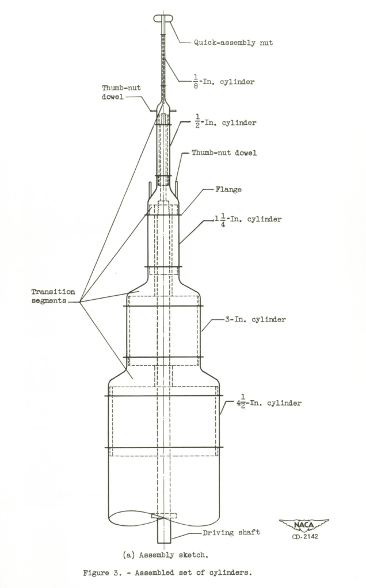
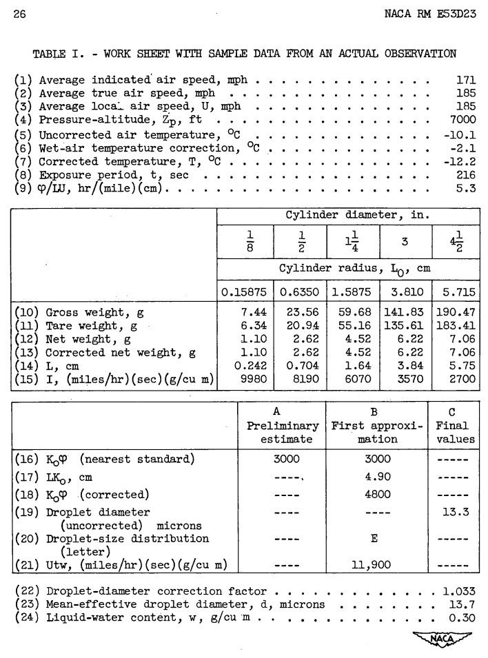
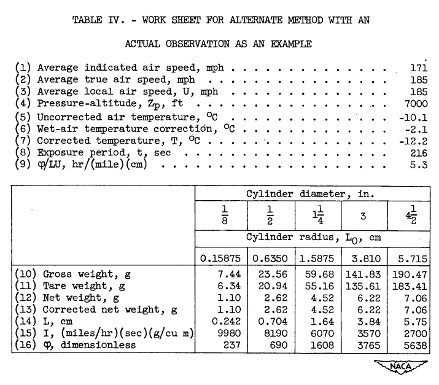
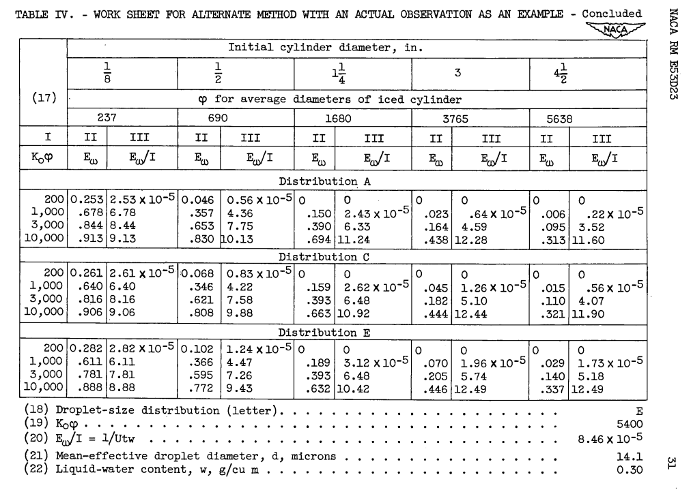

Title: NACA-RM-E53D23   
Date: 2022-03-22 12:00  
Category: NACA  
tags: cylinder, instruments  

### _"The meteorological data obtained with the multicylinder method are the only data available for the design of ice-protection equipment for aircraft"_  

# "Procedure for Measuring Liquid-Water Content and Droplet Sizes in Super-cooled Clouds by Rotating Multicylinder Method"[^1]

## Summary 
Detailed procedures for the use of multicylinders are described.

## Key points  
1. Detailed procedures for the in-flight use of multicylinders are described.
2. Detailed procedures for analyzing results from of multicylinders are described, with a flight data case.
3. Differences in analysis method details can drive MVD and LWC differences in the range of 5% to 10%.  

## Abstract

>  The rotating multicylinder method for in-flight determination of
liquid-water content, droplet size, and droplet-size distribution in
icing clouds is described. The theory of operation, the apparatus
required, the technique of obtaining data in flight, and detailed methods 
of calculating the results, including necessary charts and tables,
are presented.

## Discussion

### Procedures

A set of rotating cylinders were constructed for use in flight. 
A picture of the cylinders deployed on an aircraft is shown above. 

For this study, the assembly had five cylinders, as shown below.

  

The steps for in-flight measurements are detailed:

> The basic steps involved in the application of the multicylinder
method are essentially as follows:  
>  (1) Exposure of a set of cylinders of different sizes in the super-cooled 
cloud for a measured time at a known pressure-altitude,
true air speed, and ambient temperature  
>  (2) Disassembly of the cylinders and storage of the ice-covered
cylinders in separate water-proof containers  
>  (3) Weighing of the individual cylinders plus containers in both
the wet and dry condition to obtain the net weight of collected
ice  
>  (4) Determination of liquid-water content, droplet size, and
droplet-size distribution by comparing the measured weight of
ice collected on eacn cylinder with theoretical computations
for comparable cylinders and comparable flight and atmospheric conditions   

> These basic steps are discussed in detail in subsequent sections.

### Analysis

The impingement tables from the recently published [NACA-TN-2904]({filename}NACA-TN-2904.md) [^2] 
were used in the analysis of the measured cylinder data. 

The data in Tables I and IV provide an actual measured flight data case. 
This case is different from some of the other examples that we have seen, 
as the final outer diameter of the iced cylinder was not measured, 
but was calculated from an assumed ice density (850 kg/m^3).

The same cylinder data were processed in two different ways, yielding slightly different results (Tables I and IV). 

  

Table I final result: MVD=13.7 micrometer, LWC=0.30 g/m^3, Langmuir E distribution.  
  
  
  
  

Table IV final result: MVD=14.1 micrometer, LWC=0.30 g/m^3, Langmuir E distribution.  

For the implementation of the NACA-TN-2904 impingement data, the analysis yields slightly different best fit results 
(file naca_rm_e53d23.py in [^3]) (The "RSS" value noted is a measure of the error of the fit).

In the review of [NACA-TN-2904]({filename}NACA-TN-2904.md) impingement results were compared to Langmuir and Blodgett [^]. 
It was also noted that Langmuir and Blodgett had an approximation, which can be corrected. 
A comparison of results with the different methods is shown below.

| Method                      | MVD  | LWC  | Distribution |
|-----------------------------|------|------|--------------|
| Table I                     | 13.7 | 0.30 | Langmuir E   |
| Table IV                    | 14.1 | 0.30 | Langmuir E   |
| NACA-TN-2904 implementation | 14.6 | 0.28 | Langmuir E   |
| Langmuir implementation     | 15.2 | 0.30 | Langmuir D   |
| Langmuir corrected          | 15.2 | 0.30 | Langmuir E   |

Differences in analysis method details can drive MVD and LWC differences 
in the of 5% to 10%.  This is smaller than the differences drive by possible 
+/-5% mass errors analyzed in NACA-TN-2904 (inducing an MVD error of 10% and greater).

## Conclusions

The limitations of the multicylinder method were summarized in the Conculsions:

> The rotating multicylinder method for determining cloud-droplet
size and liquid-water content has several inherent disadvantages; however, 
it is considered to be the most reliable technique known at this
time that is adaptable to flight use. The meteorological data obtained
with the multicylinder method are the only data available for the design
of ice-protection equipment for aircraft. An important disadvantage of
the method lies in its insensitivity in discriminating among different
droplet-size distributions. An evaluation of the sensitivity is presented 
in reference 3. Another disadvantage is that the droplet-size
distribution obtained by the multicylinder method is not necessarily
the actual droplet-size distribution existing in the cloud but rather
an assumed droplet-size distribution (table III). Although the actual
droplet-size distribution in the cloud may affect the amount of ice
collected on the cylinders in the manner described by the theoretical
computations for an assumed droplet-size distribution, the area of
coverage on an airfoil, or on other nonrotating members, in the cloud
may differ from the area theoretically computed on the basis of the
assumed distribution indicated by the rotating multicylinder method.
The reason for the difference in area, or extent of coverage, is that
the size of the largest droplets in the assumed distribution (given as
a ratio to the volume median) is an arbitrarily assumed-value, and the
multicylinder method does not provide a means for obtaining this value
from the cloud data.

> In obtaining the flight data, the airplane speed should be maintained 
as low as possible, because the final results are most accurate
with low speeds. A discussion of the possible errors as a function of
airplane speed and other variables is presented in reference 3. The
limitations of the ice accretion rate caused by kinetic heating and
heat of fusion are less severe at low air speeds (ref. 6).

> A discussion of different forms of the multicylinder instruments
and the effects of yaw, ice density, and other factors on the reliability
of data and the reproducibility of measurements for conditions on a
mountain is contained in reference 4.

"(ref.6)" is Fraser [^4], and the 
"the limitations of the ice accretion rate caused by kinetic heating and heat of fusion" 
will be discussed in an upcoming review of NACA-TR-1215.

## Citations

NACA-RM-E52D23 cites 6 publications:

- Langmuir, Irving, and Blodgett, Katherine B.: A Mathematical Investigation of Water Droplet Trajectories. Tech. Rep. No. 5418, Air Materiel Command, AAF, Feb. 19, 1946. (Contract No. W-33-038-ac-9151 with General Electric Co.)
- Clark, Victor F.: The Multicylinder Method. The Mount Washington Monthly Res. Bull., vol. II, no. 6, June 1946.
- Brun, Rinaldo J., and Mergler, Harry W.: Impingement of Water Droplets on a Cylinder in an Incompressible Flow Field and Evaluation of Rotating Multicylinder Method for Measurement of Droplet-Size Distribution, Volume-Median Droplet Size, and Liquid-Water Content in Clouds. NACA-TN-2904, 1953.  
- Howell, Wallace E.: Comparison of Three Multicylinder Icing Meters and Critique of Multicylinder Method. NACA-TN-2708, 1952.
- Neel, Carr B., Jr., Bergrun, Norman R., Jukoff, David, and Schlaff, Bernard A.: The Calculation of the Heat Required for Wing Thermal Ice Prevention in Specified Icing Conditions. NACA-TN-1472, 1947.
- Fraser, D., Rush, C. K., and Baxter, D. C.: Thermodynamic Limitations of Ice Accretion Instruments. Nat. Aero. Establishment, Ottawa (Canada), LR-32, Aug. 22, 1952.

NACA-RM-E53D23 is cited 5 times in the NACA Icing Publications Database [^5]:

- Dorsch, Robert G., and Brun, Rinaldo J.: Variation of Local Liquid-Water Concentration about an Ellipsoid of Fineness Ratio 5 Moving in a Droplet Field. NACA-TN-3153, 1954.
- Gelder, Thomas F., Smyers, William H., Jr., and von Glahn, Uwe H.: Experimental Droplet Impingement on Several Two-Dimensional Airfoils with Thickness Ratios of 6 to 16 Percent. NACA-TN-3839, 1956.
- Hacker, Paul T., Saper, Paul G., and Kadow, Charles F.: Impingement of Droplets in 60° Elbows with Potential Flow. NACA-TN-3770, 1956.
- Brun, Rinaldo J., and Vogt, Dorothea E.: Impingement of Cloud Droplets on 36_5-Percent-Thick Joukowski Airfoil at Zero Angle of Attack and Discussion of Use as Cloud Measuring Instrument in Dye-Tracer Technique. NACA-TN-4035, 1957.
- Gelder, Thomas F.: Droplet Impingement and Ingestion by Supersonic Nose Inlet in Subsonic Tunnel Conditions. NACA-TN-4268, 1958.

An online search found that NACA-RM-E53D23 is cited 8 times in the literature [^6]. 

## Notes:
[^1]: Lewis, William, Perkins, Porter J., and Brun, Rinaldo J.: Procedure for Measuring Liquid-Water Content and Droplet Sizes in Super-cooled Clouds by Rotating Multicylinder Method. NACA-RM-E53D23, 1953.  
[^2]: 
Brun, Rinaldo J., and Mergler, Harry W.: Impingement of Water Droplets on a Cylinder in an Incompressible Flow Field and Evaluation of Rotating Multicylinder Method for Measurement of Droplet-Size Distribution, Volume-Median Droplet Size, and Liquid-Water Content in Clouds. NACA-TN-2904, 1953.  
[^3]: [https://github.com/icinganalysis/icinganalysis.github.io](https://github.com/icinganalysis/icinganalysis.github.io)   
[^4]:
Fraser, D., Rush, C. K., and Baxter, D. C.: Thermodynamic Limitations of Ice Accretion Instruments. Nat. Aero. Establishment, Ottawa (Canada), LR-32, Aug. 22, 1952.  
[^5]:
[NACA Icing Publications Database]({filename}naca icing publications database.md)  
[^6]: 
https://scholar.google.com/scholar?hl=en&as_sdt=0%2C48&q=NACA-RM-E53D23&btnG=  

