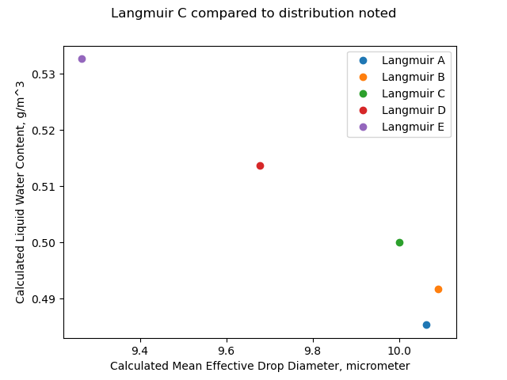
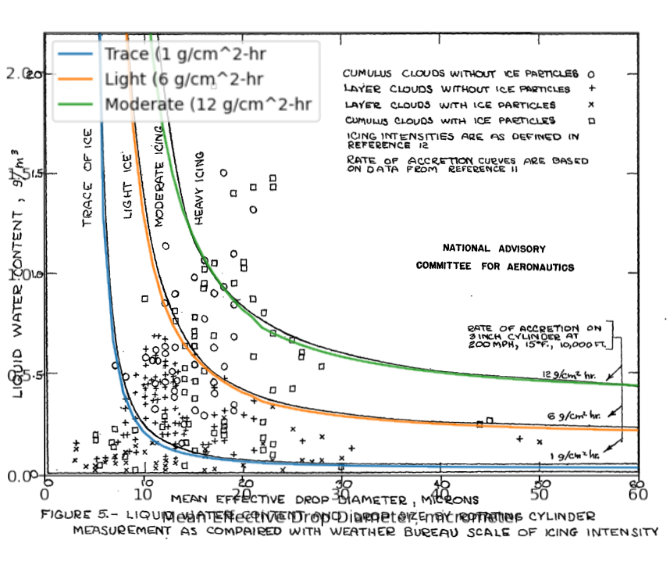

Title: NACA-TN-1393    
Date: 2022-01-29 12:00  
Category: NACA
tags: cylinder, natural icing, meteorology  

### _"The rotating-cylinder method of measuring liquid water content is generally regarded as being the most accurate and dependable procedure thus far developed"_  

  

# “A Flight Investigation of the Meteorological Conditions Conducive to the Formation of Ice on Airplanes"
[^1]

## Summary  
A multicylinder and other instruments measure natural icing conditions in flight.

## Key points  

1. The accuracy of multicylinder instruments used to determine liquid water content and median water drop size is assessed.  
2. An icing intensity index as related to the ice growth rate on a 3-inch diameter cylinder is detailed.  
3. Results from agree well with the Python implementation of the cylinder analysis.  
4. "Tentative" values for icing design conditions were determined.  
5. An effect of distance on icing conditions is noted.  

## Abstract  

>    Data from flight measurements of the meteorological factors
related to the intensity of icing conditions are presented. The
physical factors that establish the distribution of liquid water in
clouds of various types are discussed and the results of the analysis
aro used to formulate certain rules for the forecasting of icing
intensity. The problems of determining the range of values of the
significant factors defining icing intensity for the purpose of the
design of ice-protection equipment are discussed, and tentative values
are given.  

## Discussion

### Multicylinder instruments

Multi-cylinder probes were used to determine water drop sizes, and, in some cases, drop size distributions.  
A fixed cylinder was also used for an "area of catch" method of drop size determination.

The multicylinder method for liquid water content measurement is regarded as accurate:
>  The rotating-cylinder method of measuring liquid water content is generally regarded as being the most accurate 
>  and dependable procedure thus far developed. (Reference 8) [^2]

For the multicylinder calculations NACA-TN-1393 cites the methods of Langmuir and Blodgett [^3].

An assessment of the accuracy of the rotating cylinder method is included:

> The errors involved in calculating the liquid water content
and mean-effective diameter from the two-cylinder-data have been
estimated by considering the errors inherent in measuring the
quantities-used in the calculations. The results, which are shown
in the following table, are based on a liquid water content of 0.5
gram per cubic meter and an average drop diameter of 10 microns.

|                                                              |                           | Resulting percent error (E) | Resulting percent error (E) |
|--------------------------------------------------------------|---------------------------|-----------------------------|-----------------------------|
| Source of error                                              | estimated amount of error | Water content               | Drop diameter               |
| Weighing sample 1/8-in. cylinder                             | 0.02 gram                 | 2.6                         | 2                           |
| Weighing sample 1-in. cylinder                               | 0.03 gram                 | 1.0                         | 1                           |
| Assumed density of ice                                       | 0.08 g/cm^3               | 2.5                         | 2                           |
| Timing exposure                                              | 1.5 sec                   | 2.4                         | 0                           |
| True airspeed                                                | 2.5                       | 1.5                         | 0                           |
| Misculaneous errors                                          | ----                      | 1.0                         | 1                           |
| Error due to using "C" distribution for unknown distribution | ----                      | up to 3                     | up to 3                     |

| Total error                              | Water content (percent) | Drop diameter (percent) |
|------------------------------------------|-------------------------|-------------------------|
| Maximum total error sum(E)               | 14                      | 9                       |
| Estimated resultant error (sum(E^2))^0.5 | 5.7                     | 4.4                     |

Running the file "naca-tn-1393.py" [^4] yields different results, particularly for the 
'Error due to using "C" distribution curves for unknown distribution' part:

| Source of error                                                     | Estimated amount of error | Resultant percent error (E) Water content | Resultant percent error (E) Drop diameter |
|---------------------------------------------------------------------|---------------------------|-------------------------------------------|-------------------------------------------|
| Weighing sample 1/8-in. cylinder                                    | +/-0.02 gram              | 2.9                                       | 2.6                                       |
| Weighing sample 1-in. cylinder                                      | +/-0.03 gram              | 0.3                                       | 1.1                                       |
| Assumed density of ice                                              | -0.08 g/cm^3              | 0.4                                       | 0.3                                       |
| Timing exposure                                                     | +/-1.5 seconds            | 2.6                                       | 0.0                                       |
| True airspeed                                                       | +/-2.5 mph                | 1.5                                       | 0.6                                       |
| Miscellaneous other errors                                          | ----                      | 1.0                                       | 1                                         |
| Error due to using "C" distribution curves for unknown distribution | ----                      | 7.0                                       | 9.9                                       |

| Total error                            | Water content (percent) | Drop diameter (percent) |
|----------------------------------------|-------------------------|-------------------------|
| Maximum total error (sum(E))           | 15.8                    | 15.5                    |
| Maximum resultant error (sum(E^2)^0.5) | 8.2                     | 10.4                    |

Part of the challenge of reproducing prior results is the terse descriptions of the differing conditions used describe the line item. 
For the 'Error due to using "C" distribution curves for unknown distribution' item, 
I calculated the cylinder masses with each of Langmuir A, B, C, D, E distributions and then 
calculated a best fit assuming a Langmuir C distribution. 
This may or may not be what NACA-TN-1393 actually did. 
The results are shown below:

If the distribution was actually a Langmuir E, but we assumed a Langmuir C, 
the difference in calculated mean effective drop diameter is 7%.

Note also that calculated LWC values differ, except when the assumed and actual distributions are both Langmuir C. 
As the drop size is different, the collection efficiency is different, 
and to maintain the same mass the LWC must differ.

### Icing intensity index

Icing intensity definitions from "reference 12" [^5] are included.

>  The definition of icing intensity- 
It is now generally recognized 
that the principal factors determining the intensity of an
icing condition are the concentration of super-cooled liquid water 
and the diameter of the drops. In addition, when thermal methods 
of de-icing are considered, the air temperature and the amount of
snow in the air have an important effect upon the heat requirements.
Icing intensities have been defined by the U.S. Weather Bureau for
reports from mountain stations in terms of the rate of collection 
at 200 miles per hour on a 3-inch-diameter circular cylinder,
expressed as grams per hour per square centimeter of projected area.
(See reference 12.) The definitions are as follows:

    Trace ice: 0 to 1.0 grams per square centimeter hour  
    Light ice: 1.0 to 6.0 grams per square centimeter hour  
    Moderate ice: 6.0 to 12.O grams per square centimeter hour  
    Heavy ice: 12.0 and over grams per square centimeter hour  

The icing intensity definitions and cylinder water catch calculations from [^2] were used to make Figure 5.
  

### The effect of temperature  

>Since the temperature, as well as the liquid water content, is
of primary importance in the design of thermal systems for ice protection, 
the relation between temperature and maximum water content 
continuous icing conditions should be determined. It has been
pointed out that in icing conditions of very limited extent, as found 
in cumulus clouds, very low temperatures may occur with high values 
of liquid water content. In the case of the more extensive icing 
conditions in layer clouds, however, __a positive relationship appears 
to exist between temperature and maximum liquid water content.__ 
Proposals to define this relationship have been given in references
6 and 14, and are reproduced in figure 8.  

  
Reference 6 is [NACA-TN-1391]({filename}NACA-TN-1391.md).  
Reference 14 is Rodert [^6].  

### Comparison of impingement results

When I overlaid calculations with the implementation of the cylinder impingement calculations [^5] 
the results agreed quite well (the underlying pdf image of Figure 5 is slightly distorted). 

The code used to make the figure is available in the file "naca-tn-1393.py" [^7].

### Illustrating water drop size distributions

Figure 10 below illustrates a challenge when comparing Langmuir drop size distributions to other, measured distributions. 
There are 7 bins in a Langmuir distribution.
The figure has "stair steps" plotted to illustrate the cumulative distribution.
The "B" distribution appear to compare favorably with the "observed distribution", 
but with limitations due to the discrete nature of the Langmuir distributions. 
At the volume median drop diameter the vertical line jumps from 35 to 65 "percent of water in drop smaller than d".

### "Tentative" Design Values

> Analysis of the available observational data, supplemented by
considerations of the physical processes involved in the formation
of icing conditions has led to the following tentative estimates of
the most severe icing conditions likely to be encountered in the 
course of all-weather transport operations in the United States:

| Cloud type               | Duration             | Liquid water content | Average drop diameter | Temperature |
|--------------------------|----------------------|----------------------|-----------------------|-------------|
| cumulus                  | 1 minute             | 2.0 g/m^3            | 20 microns            | 0°F         |
| stratus or stratocumulus | 20 minutes or longer | 0.8 g/m^3            | 15 microns            | 20°F        |
| stratus or stratocumulus | 20 minutes or longer | 0.5 g/m^3            | 25 microns            | 20°F        |

The rationale for the stratus values is explained:  

> __Maximum continuous icing conditions__  
> The results of the fore-going discussion of the extent of icing 
> conditions as related to their intensity suggest a need to define 
> the maximum icing condition likely to occur over a large enough 
> area to make it necessary to provide for continuous operation in 
> this condition. This condition will exist in layer-type clouds 
> since cumulus clouds are by their nature discontinuous. 
> The maximum liquid water content observed in layer clouds during 
> this investigation was-about 0.7 gram per cubic meter, 
> which is the same as the maximum reported from the Army Air Forces 
> Ice Research Base at Minneapolis, Minn. These facts and the data in 
> figure 13 on the relation between liquid water content and duration 
> of flight in icing conditions suggest that a reasonable estimate of 
> the maximum water content likely to be encountered for periods of 
> 20 minutes or longer at a true airspeed of 160 miles per hour 
> would be approximately 0.8 gram per cubic meter. 
> Since this condition is expected to occur in layer clouds 
> (stratocumulus), a reasonable estimate of the concurrent values of 
> temperature and mean-effective drop diameter was made from an 
> examination of the data for layer clouds in figures 5 and 8. 
> The values chosen were 20° F and 15 microns.

For Figure 13 the argument appears to be reasonable:  
  

However, for Figure 5 the choice is not as clear:  
  

Also for Figure 8 the logic is not obvious:  

### Distance effect  

It was noted:

>  The duration of flight in 
continuous icing was therefore used as a measure of the extent of
the conditions although in several cases the airplane was flown back
and forth in a single cloud formation thus giving rise to larger
duration than would have been required for a straight flight.
Figure 13 shows the relation between the duration of periods of flight
in continuous icing conditions and the average liquid water content
during the periods.

## Citations

NACA-TN-1393 cites 14 references.

- Rodert, Lewis A., Clousing, Lawrence A., and McAvoy, William H.: Recent Flight Research on Ice Prevention. NACA-ARR, Jan. 1942.  
- Neel, Carr B., Jr., and Jones, Alun R.: Flight Tests of Thermal Ice-Prevention Equipment in the XB-24F Airplane. NACA-WR-A-7, Oct. 1943.  
- Look, Bonne C.: Flight Tests of the Thermal Ice-Prevention Equipment on the B-17F Airplane. NACA-ARR-4B02, 1944.  
- Selna, James, Neel, Carr B., Jr., and Zeiller, E. Lewis: An Investigation of a Thermal Ice-Prevention System for a C-46 Cargo Airplane, IV - Results of Flight Tests in Dry-Air and Natural-Icing Conditions. NACA-ARR-5A03c, 1945.  
- Hardy, J. K.: Measurement of Free Water in Cloud Under Conditions of Icing. NACA-ARR-4I11, 1944.  
- Lewis, William: Icing Properties of Noncyclonic Winter Stratus Clouds. NACA-TN-1391, 1947.  
- Lewis, William: Icing Zones in a Warm Front System with General Precipitation. NACA-TN-1392, 1947.  
- Tribus, Myron, and Tessman, J. R.: Report on the Development and Application of Heated Wings. AAF TR 4972, Add. I, Jan. 1946. (Available from Office of Technical Services, U. S. Department of Commerce as PB No. 18122.)  
- Findeisen, W.: Meteorological-Physical Limitations of Icing in the Atmosphere. NACA-TM-885, 1939.  
- Simpson, G. C.: On the Formation of Cloud and Rain. Quarterly Jour. of the Royal Meteorological Soc. Vol. 67, no. 290, Apr. 1941, pp.99-133.  
- Langmuir, Irving, and Blodgett, Katherine B.: A Mathematical Investigation of Water Droplet Trajectories. Tech. Rep. No. 5418, Air Materiel Command, AAF, Feb. 19, 1946. (Contract No. W-33-038-ac-9151 with General Electric Co.)  
- Anon: Amendment to Code for Transmission of Icing Data from Mountain Stations. Circular Letter No. 78-45. U.S. Weather Bureadu, Oct. 1945.  
- Harrison, L. A.: Lightning Discharges to Aircraft and Associated Meteorological Conditions. NACA-TN-1001, 1946.  
- Rodert, Lewis A.: Some Suggested Specifications for Thermal Ice-Prevention System for Aircraft. Trans. ASME vol. 68 no. 7, October, 1946, pp. 781-789.  

NACA-TN-1393 is cited 13 times in the NACA Icing Publications Database [^8].

- Bergrun, Norman R.: A Method for Numerically Calculating the Area and Distribution of Water Impingement on the Leading Edge of an Airfoil in a Cloud. NACA-TN-1397, 1947.  
- Lewis, William, Kline, Dwight B., and Steinmetz, Charles P.: A Further Investigation of the Meteorological Conditions Conducive to Aircraft Icing. NACA-TN-1424, 1947.  
- Jones, Alun R., Holdaway, George H., and Steinmetz, Charles P.: A Method for Calculating the Heat Required for Windshield Thermal Ice Prevention Based on Extensive Flight Tests in Natural—Icing Conditions. NACA-TN-1434, 1947.  
- Neel, Carr B., Jr., Bergrun, Norman R., Jukoff, David, and Schlaff, Bernard A.: The Calculation of the Heat Required for Wing Thermal Ice Prevention in Specified Icing Conditions. NACA-TN-1472, 1947.  
- Jones, Alun R., and Lewis, William: Recommended Values of Meteorological Factors to be Considered in the Design of Aircraft Ice-Prevention Equipment. NACA-TN-1855, 1949.  
- Lewis, William, and Hoecker, Walter H., Jr.: Observations of Icing Conditions Encountered in Flight During 1948. NACA-TN-1904, 1949.  
- Neel, Carr B., Jr., and Bright, Loren G.: The Effect of Ice Formations on Propeller Performance. NACA-TN-2212, 1950.  
- Hacker, Paul T., and Dorsch, Robert G.: A Summary of Meteorological Conditions Associated with Aircraft Icing and a Proposed Method of Selecting Design Criterions for Ice-Protection Equipment. NACA-TN-2569, 1951.  
- Kline, Dwight B., and Walker, Joseph A.: Meteorological Analysis of Icing Conditions Encountered in Low-Altitude Stratiform Clouds. NACA-TN-2306, 1951.  
- Perkins, Porter J., and Kline, Dwight B.: Analysis of Meteorological Data Obtained During Flight in a Supercooled Stratiform Clouds of High Liquid-Water Content. NACA-RM-E51D18, 1951.  
- Lewis, William, and Bergrun, Norman R.: A Probability Analysis of the Meteorological Factors Conducive to Aircraft Icing in the United States. NACA-TN-2738, 1952.  
- Neel, Carr B., Jr., and Steinmetz, Charles P.: The Calculated and Measured Performance Characteristics of a Heated-Wire Liquid-Water-Content Meter for Measuring Icing Severity. NACA-TN-2615, 1952.  
- Neel, Carr B., Jr.: A Heated-Wire Liquid-Water-Content Instrument and Results of Initial Flight Tests in Icing Conditions. NACA-RM-A54I23, 1955.  

## Related Works

- Jones, Alun R., and Lewis, William: Recommended Values of Meteorological Factors to be Considered in the Design of Aircraft Ice-Prevention Equipment. NACA-TN-1855, 1949.  
- Hacker, Paul T., and Dorsch, Robert G.: A Summary of Meteorological Conditions Associated with Aircraft Icing and a Proposed Method of Selecting Design Criterions for Ice-Protection Equipment. NACA-TN-2569, 1951.  
- Lewis, William, and Bergrun, Norman R.: A Probability Analysis of the Meteorological Factors Conducive to Aircraft Icing in the United States. NACA-TN-2738, 1952.  

Also, see Jeck's comments [^9] on the distance curve in NACA-TN-1393.  

## Notes:  
[^1]:
Lewis, William: A Flight Investigation of the Meteorological Conditions Conducive to the Formation of Ice on Airplanes. NACA-TN-1393, 1947.  
[^2]:
Tribus, Myron, and Tessman, J. R.: Report on the Development and Application of Heated Wings. AAF TR 4972, Add. I, Jan. 1946. (Available from Office of Technical Services, U. S. Department of Commerce as PB No. 18122.)  
[^3]:
Langmuir, Irving, and Blodgett, Katherine B.: A Mathematical Investigation of Water Droplet Trajectories. Tech. Rep. No. 5418, Air Materiel Command, AAF, Feb. 19, 1946. (Contract No. W-33-038-ac-9151 with General Electric Co.)  
[^4]: [https://github.com/icinganalysis/icinganalysis.github.io](https://github.com/icinganalysis/icinganalysis.github.io)  
[^5]:
Anon: Amendment to Code for Transmission of Icing Data from Mountain Stations. Circular Letter No. 78-45. U.S. Weather Bureadu, Oct. 1945.  
[^6]: Rodert, Lewis A.: Some Suggested Specifications for Thermal Ice-Prevention System for Aircraft. Trans. ASME vol. 68 no. 7, October, 1946, pp. 781-789.  
[^7]:
[Implementation of cylinder impingement correlations in Python]({filename}Implementation of cylinder impingement correlations in Python.md)  
[^8]: 
[NACA Icing Publications Database]({filename}naca icing publications database.md)  
[^9]:
Jeck, Richard K.: Advances in the Characterization of Supercooled Clouds for Aircraft Icing Applications. DOT/FAA/AR-07/4, Appendix C, November, 2008.  
