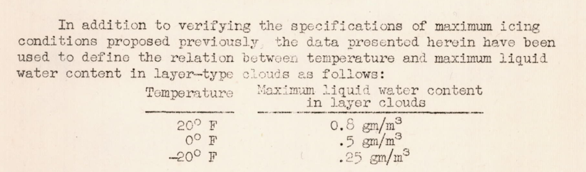

Title: NACA-TN-1424  
Category: NACA
Date: 2022-01-31 12:00  
tags: cylinder, natural icing

> ###"In spite of the inconsistency it is believed that the data on mean-effective diameters are fairly reliable."

# "A Further Investigation of the Meteorological Conditions Conducive to Aircraft Icing"
[^1]

## Summary
The value of the mutlicylinder data for determining drop size distribution is questioned.  

## Key points  
1. Two methods for determining drop size distributions are compared.  
2. The difference in water drop concentration around an aircraft body is proposed as an explanation for results from the two methods.  
3. A temperature effect of icing conditions is noted.  

## Abstract  

>  Meteorological data from flight observations in icing conditions 
during the winter of 1946-47 are presented. Data on liquid
water content, temperature, and mean-effective drop diameter are
shown to be consistent with values previously proposed for maximum
icing conditions. Data on drop-size distribution as obtained by
the rotating-cylinder method, although consistent with measurements
previously made, were found to be inconsistent with data on drop-
size distribution derived from the ratio of the maximum diameter
to the mean-effective diameter when the maximum diameter was
calculated from the area of impingement on a stationary cylinder.
The relation between temperature and maximum liquid water content
in layer clouds is discussed and estimates are given for the
highest values of water content to be expected in layer clouds at
various temperatures.

##Discussion

###Drops size distributions

The drop size distributions definitions and cylinder impingement analysis methods from [^2] are used

A comparison of two methods of determining the drop size distribution yielded rather different results.

###Effect of the aircraft body on drop concentrations

A possible explanation for the differences was the positions of the instruments:

For methods to assess the water drop concentration around a body, see [^3] and [^4].

Even with the differences in drop size distributions, it was noted in the conclusion that:

>   In spite of the inconsistency it is believed that the data on mean-effective diameters are fairly reliable.

###A temperature effect on icing conditions

An effect of temperature was noted.

The "maximum icing conditions proposed previously" are in [^5].

##Citations

NACA-TN-1424 cites 4 publications:

- Lewis, William: A Flight Investigation of the Meteorological Conditions Conducive to the Formation of Ice on Airplanes. NACA TN No. 1393, 1947.
- Tribus, Myron, and Tessman, J. R.: Report on the Development and Application of Heated Wings. AAF TR 4972, Add. I, Jan. 1946. (Available from Office of Technical Services, U. S. Department of Commerce as PB No. 18122.)
- Lewis, William: Icing Properties of Noncyclonic Winter Stratus Clouds. NACA TN No. 1391, 1947.
- Worthing, Archie G. and Geffner, Joseph: Treatment of Experimental Data. John Wiley and Sons, Inc. 1943.

NACA-TN-1424 is cited 19 times in an online search [^6].

NACA-TN-1424 is cited 14 times in the NACA Icing Publications Database [^7]: 

- Neel, Carr B., Jr., Bergrun, Norman R., Jukoff, David, and Schlaff, Bernard A.: The Calculation of the Heat Required for Wing Thermal Ice Prevention in Specified Icing Conditions. NACA-TN-1472, 1947.
- Jones, Alun R., and Lewis, William: Recommended Values of Meteorological Factors to be Considered in the Design of Aircraft Ice-Prevention Equipment. NACA-TN-1855, 1949.
- Lewis, William, and Hoecker, Walter H., Jr.: Observations of Icing Conditions Encountered in Flight During 1948. NACA-TN-1904, 1949.
- Dorsch, Robert G., and Hacker, Paul T.: Photomicrographic Investigation of Spontaneous Freezing Temperatures of Supercooled Water Droplets. NACA-TN-2142, 1950.
- Neel, Carr B., Jr., and Bright, Loren G.: The Effect of Ice Formations on Propeller Performance. NACA-TN-2212, 1950.
- Hacker, Paul T., and Dorsch, Robert G.: A Summary of Meteorological Conditions Associated with Aircraft Icing and a Proposed Method of Selecting Design Criterions for Ice-Protection Equipment. NACA-TN-2569, 1951.
- Kline, Dwight B., and Walker, Joseph A.: Meteorological Analysis of Icing Conditions Encountered in Low-Altitude Stratiform Clouds. NACA-TN-2306, 1951.
- Lewis, William, and Bergrun, Norman R.: A Probability Analysis of the Meteorological Factors Conducive to Aircraft Icing in the United States. NACA-TN-2738, 1952.
- Neel, Carr B., Jr., and Steinmetz, Charles P.: The Calculated and Measured Performance Characteristics of a Heated-Wire Liquid-Water-Content Meter for Measuring Icing Severity. NACA-TN-2615, 1952.
- Dorsch, Robert G., and Brun, Rinaldo J.: Variation of Local Liquid-Water Concentration about an Ellipsoid of Fineness Ratio 5 Moving in a Droplet Field. NACA-TN-3153, 1954.
- Brun, Rinaldo J., Lewis, William, Perkins, Porter J., and Serafini, John S.: Impingement of Cloud Droplets and Procedure for Measuring Liquid-Water Content and Droplet Sizes in Supercooled Clouds by Rotating Multicylinder Method. NACA-TR-1215, 1955. (Supersedes NACA TN’s 2903, 2904, and NACA-RM-E53D23)
- Neel, Carr B., Jr.: A Heated-Wire Liquid-Water-Content Instrument and Results of Initial Flight Tests in Icing Conditions. NACA-RM-A54I23, 1955.
- Perkins, Porter J.: Statistical Survey of Icing Data Measured on Scheduled Airline Flights over the United States and Canada from November 1951 to June 1952. NACA-RM-E55F28a, 1955.
- Gelder, Thomas F., Smyers, William H., Jr., and von Glahn, Uwe H.: Experimental Droplet Impingement on Several Two-Dimensional Airfoils with Thickness Ratios of 6 to 16 Percent. NACA-TN-3839, 1956.

##Related Works

NACA-TN-1424 is cited by the three NACA publications cited in Appendix C of the icing regulations [^8].

- Jones, Alun R., and Lewis, William: Recommended Values of Meteorological Factors to be Considered in the Design of Aircraft Ice-Prevention Equipment. NACA-TN-1855, 1949.
- Hacker, Paul T., and Dorsch, Robert G.: A Summary of Meteorological Conditions Associated with Aircraft Icing and a Proposed Method of Selecting Design Criterions for Ice-Protection Equipment. NACA-TN-2569, 1951.
- Lewis, William, and Bergrun, Norman R.: A Probability Analysis of the Meteorological Factors Conducive to Aircraft Icing in the United States. NACA-TN-2738, 1952.

##Notes:
[^1]:
Lewis, William, Kline, Dwight B., and Steinmetz, Charles P.: A Further Investigation of the Meteorological Conditions Conducive to Aircraft Icing. NACA-TN-1424, 1947.
[^2]:
Langmuir, Irving, and Blodgett, Katherine B.: A Mathematical Investigation of Water Droplet Trajectories. Tech. Rep. No. 5418, Air Materiel Command, AAF, Feb. 19, 1946. (Contract No. W-33-038-ac-9151 with General Electric Co.)
[^3]:
Dorsch, Robert G., and Brun, Rinaldo J.: Variation of Local Liquid-Water Concentration about an Ellipsoid of Fineness Ratio 5 Moving in a Droplet Field. NACA-TN-3153, 1954.
[^4]:
Brun, Rinaldo J., and Dorsch, Robert G.: Variation of Local Liquid-Water Concentration about an Ellipsoid of Fineness Ratio 10 Moving in a Droplet Field. NACA-TN-3410, 1955.
[^5]:
Lewis, William: A Flight Investigation of the Meteorological Conditions Conducive to the Formation of Ice on Airplanes. NACA-TN-1393, 1947.
[^6]:
search in December, 2021: https://scholar.google.com/scholar?hl=en&as_sdt=0%2C48&q=naca-tn-1424&btnG=
[^7]:
[NACA Icing Publications Database]({filename}/naca icing publications database.md)
[^8]: 14 CFR 25 Appendix C (updated periodically) [https://www.ecfr.gov/current/title-14/chapter-I/subchapter-C/part-25/appendix-Appendix%20C%20to%20Part%2025]
