title: NACA-TN-1598   
Date: 2022-06-14 12:00  
Category: NACA  

###_"It is significant that the control response of the airplane approached the point of being marginal when all of the airplane except the propeller had accreted ice"_  

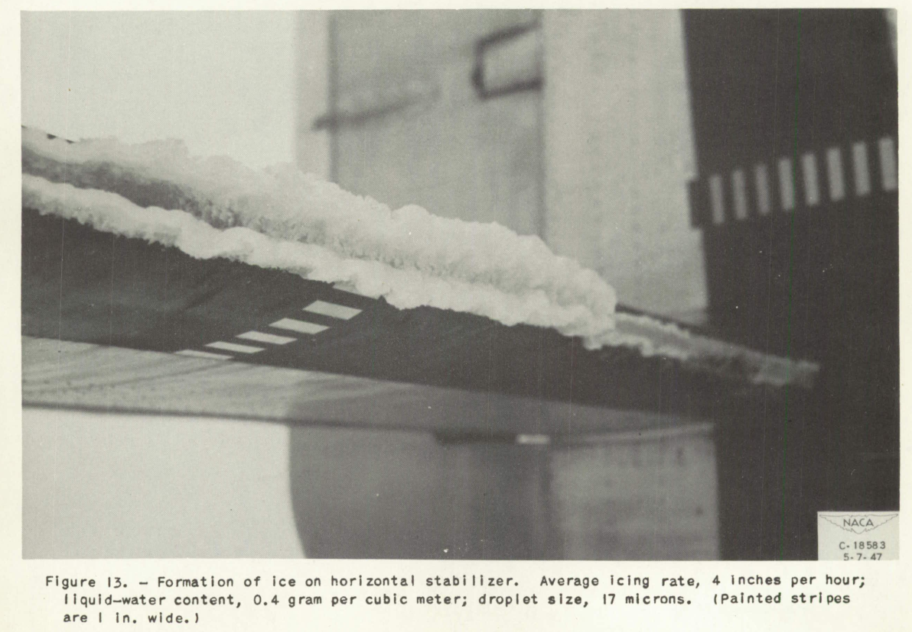  

#NACA-TN-1598, "Effects of Ice Formations on Airplane Performance in Level Cruising Flight" [^1]  

##Summary
>Airplane levels effects of icing are measured, and broken into major components.  

##Key Points
1. Numerous, excellent quality photos show how icing flight test "should be done".  
2. Airplane levels effects of icing are measured, and broken into major components. 
3. "It is significant that the control response of the airplane approached the point of being marginal when all of the airplane except the propeller had accreted ice."  

##Abstract  

>A flight investigation in natural icing conditions was conducted 
by the NACA to determine the effect of ice accretion on airplane performance.

>The maximum loss in propeller efficiency encountered due to
ice formation on the propeller blades was 19 percent. During
87 percent of the propeller icing encounters, losses of 10 percent
or less were observed. Ice formations on all of the components of
the airplane except the propellers during one icing encounter
resulted in an increase in parasite drag of the airplane of 81 percent. 
The control response of the airplane in this condition was
marginal.

##Discussion  

This publication looks at the airplane level effects of ice, 
and then it breaks down down to a major component level. 

The online version of NACA-TN-1598 has many excellent quality images, 
several are included here. 

Like [NACA-TN-313]({filename}NACA-TN-313.md) I found much of my own icing flight test experience was reflected in NACA-TN-1598,
published 70+ years ago.  I saw similar ice shapes on other airplanes, decades later. 

For brevity, I will omit the discussion about propeller icing. 

>The flight investigation by the Cleveland laboratory was conducted 
with a twin-engine airplane (fig. 1). This airplane was
originally used by the Army Air Forces in the preliminary investigation 
of propeller icing reported in reference 2. The ice-prevention equipment 
provided by the manufacturer consists of a
thermal heated-air system that protects the outboard wings, the
horizontal and vertical tail surfaces, and the windshields. For
this investigation, the anti-icing system was augmented by thermal
electric anti-icing equipment for the fuselage foresection, the
propellers, the inboard wings, the cowling, and the antenna masts.
Liquid-water content, droplet size, and droplet-size distribution
were determined by means of rotating cylinders. The installation
of the rotating cylinders and a disk-type icing-rate meter is shown
in figure 2. The principles of operation of these instruments are
explained in references 3 and 4. Special research equipment
installed in the airplane is listed in table I.  
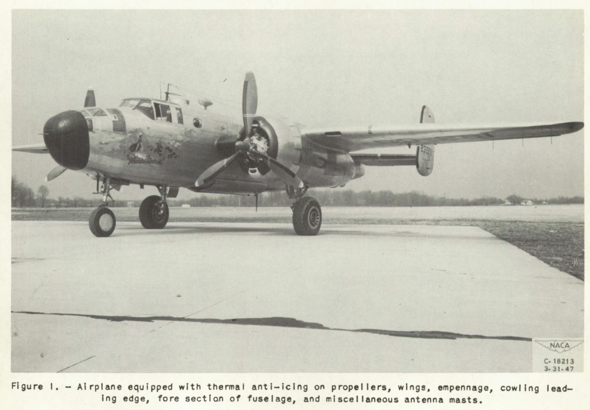  

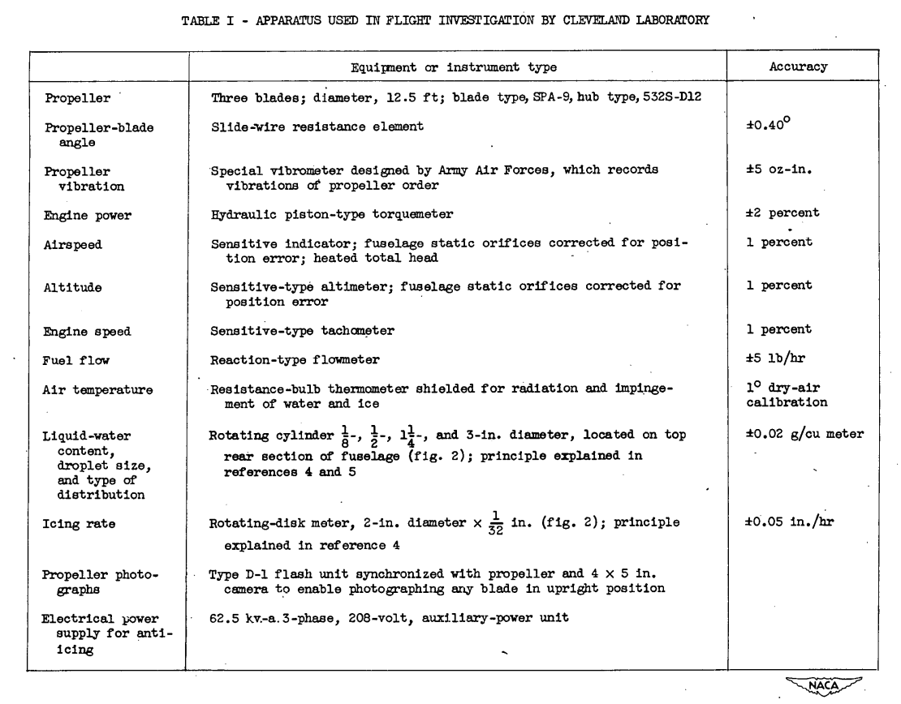  

You can see more about the ice protection equipment of the XB-25E "Flamin' Maimie" at [https://www.nasa.gov/specials/NACA/#c19](https://www.nasa.gov/specials/NACA/#c19). 
I would fly in icing conditions in this airplane, unlike the VE-7 from [NACA-TN-313]({filename}NACA-TN-313.md). 

Figure 2 shows a view of the rotating cylinders instrument 
(which we have seen much of in the [Icing on Cylinders thread]({filename}Icing on Cylinders.md)), and the rotating disk:
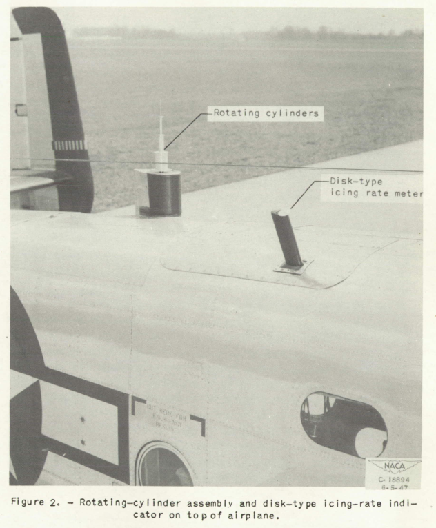  
(The line crossing the rotating cylinders is a wire antenna, not an image flaw.)

>Component Icing  

>One flight at Cleveland was made to determine the effect on
airplane performance of ice accretions on components of the airplane 
other than the propeller. The time history of the icing
condition shown in figure 6 indicates that the average icing rate
was approximately 4 inches per hour and that a maximum icing rate
of approximately 12 inches per hour existed for a fraction of a
minute. A comparison of the rotating-cylinder data with the icing-rate 
data for the corresponding period indicated that the average
liquid-water content was approximately 0.4 gram per cubic meter
with an average droplet diameter of 17 microns. These meteorological 
conditions are almost equal to the severest conditions
that might be encountered in a stratus cloud as determined by
reference 7.  
Photographs of the resulting ice formations are shown in
figures 7 to 13. Front and side views of the ice formation on the
loop-antenna housing are shown in figure 7. Equally heavy ice
collected on the antenna mast and on instrument-landing-system
receiving antennas (fig. 8). Ice on the nose of the airplane was
photographed on the ground after 15 minutes of flight in temperatures 
above freezing (fig. 9). Thin, rough, glaze-ice deposits
extended well beyond the principal ice accretion. Several large
isolated pieces indicate that the total formation was much larger
during the flight. Ice on the leading edge of the engine cowling
(fig. 10) was uniform but noticeably smaller than ice formations
on the other components of the airplane. The ice formations on
the inboard-wing panels were relatively small (fig. 11). The size
of the formation can be judged by the 1-inch reference stripes on
the wing surface. Some ice was lost from the outboard-wing panels.

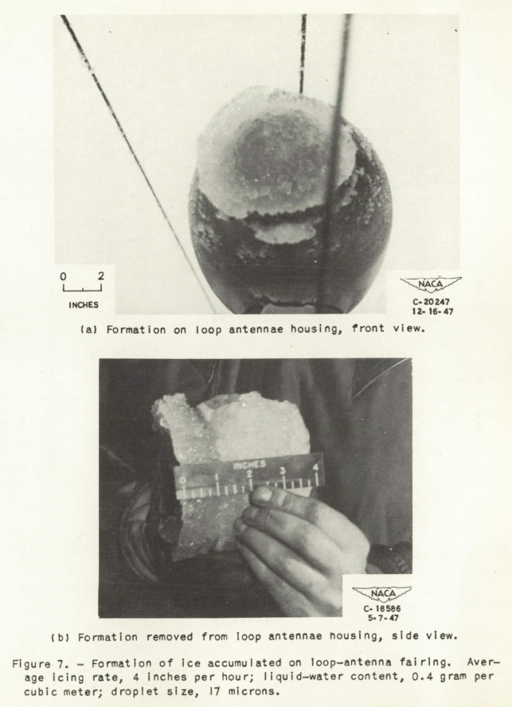  

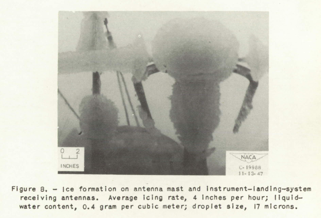  

The forward radome, appears to have not retained all of the ice on landing:
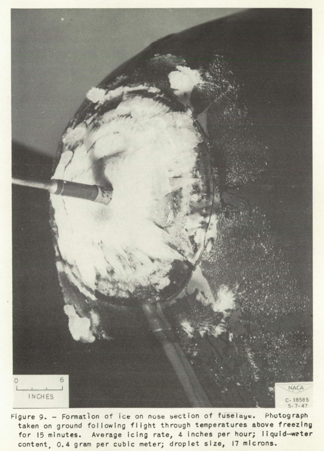  

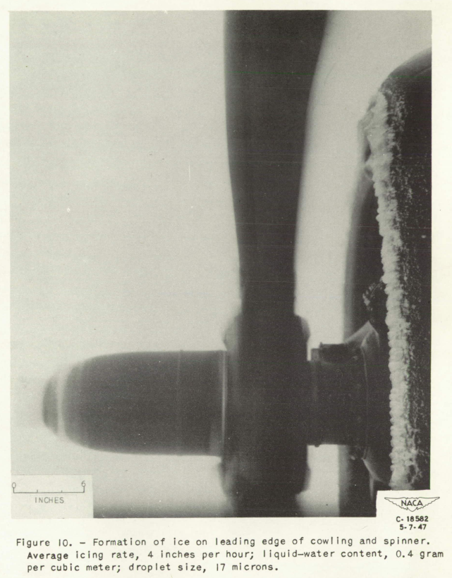  

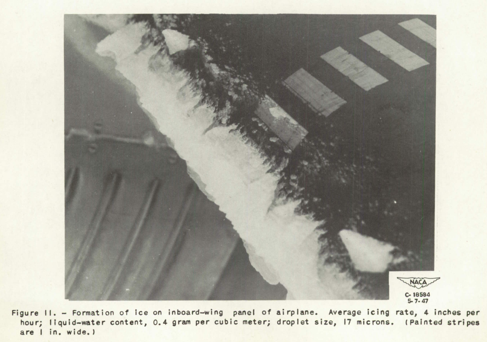  

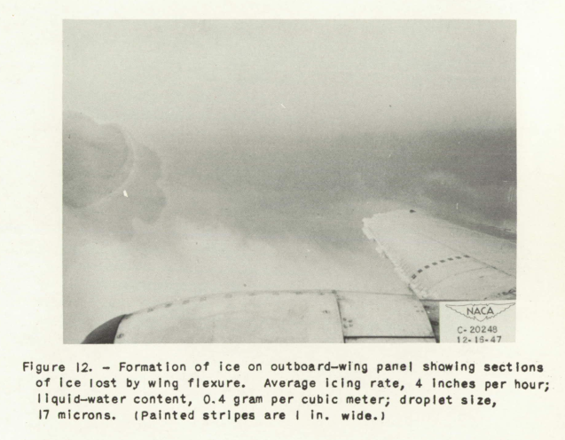  

  

>De-icing the components in the following order resulted in the
corresponding changes in indicated airspeed at 1400 brake horse-power:  
Inboard-wing panel, 163 to 166 miles per hour; tail surfaces,
166 to 170 miles per hour; outboard-wing panels, 170 to 182.5 miles
per hour; engine cowling, 182.5 to 187 miles per hour; and miscellaneous 
components, 187 to 204 miles per hour. (See fig. 14.)

  

>These data were interpreted in terms of parasite drag and are
shown in figure 15 in percentage of total drag of the ice-free airplane. 
A drag increase of 8 percent was produced by ice accretion
on the inboard-wing panels; empennage, 11 percent; outboard-wing
panels, 27 percent; engine cowling, 10 percent; and miscellaneous
components, 25 percent.
This investigation did not include the determination of such
factors as stalling speed, minimum single-engine speed, and low-speed 
flying qualities. __It is significant that the control response
of the airplane approached the point of being marginal when all of
the airplane except the propeller had accreted ice.__

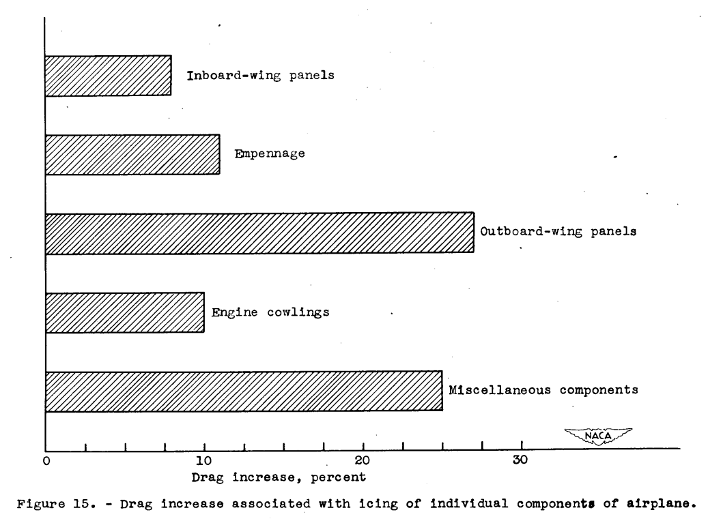  

So, even if the drag and level flight lift with icing are tolerable, 
the control response may not be. 

##Conclusions  

>SUMMARY OF RESULTS  
From a flight investigation to determine the effect of ice
formations on airplane performance in level cruising flight, the
following results were obtained:  
>1. The maximum loss in propeller efficiency due to ice formation 
on the propeller blades in trace-to-light-icing conditions was
19 percent.  
>2. During this investigation, 87 percent of the icing encountered 
resulted in propeller-efficiency losses of 10 percent or less
due to ice formation on the propeller blades.  
>3. Ice formations on all of the components of the airplane,
except the propellers during one icing encounter, resulted in an
increase in parasite drag of the airplane of 81 percent. 
The control response of the airplane in this condition was marginal.  
>4. The maximum propeller unbalance due to ice formations on
the propeller blades was 85 ounce-inches.  

##Citations  

NACA-TN-1598 cites 7 publications:  

- Corson, Blake W. Jr., and Maynard, Julian D.: The Effect of Simulated Icing or Propeller Performance. NACA-TN-1084, 1946.  
- Kanter, M.: Flight Performance on XB-25E Airplane No. 42-32281 In Natural Ice During February, March and April 1945. AAF TR No. 5403, Air Materiel Command, Array Air Forces, Dec. 17, 1945. (Available from Office of Technical Services, U. S. Dept. of Commerce, as PB No. 27065.)  
- Clark, Victor F.: The Multicylinder Method. Mt. Wash. Observatory Monthly Res. Bull., vol. II, no. 6, June 1946.  
- Vonnegut, B., Cunningham, R. M., and Katz, R. E.: Instruments for Measuring Atmospheric Factors Related to Ice Formation on Airplanes. De-Icing Res. Lab., Dept. Meteorology, M.I.T., April 1946.  
- Jones, Alun R., and Spies, Ray J., Jr.: An Investigation of a Thermal Ice-Prevention System for a C-46 Cargo Airplane, III - Description of Thermal Ice-Prevention Equipment for Wings, Empennage, and Windshield. NACA-ARR-5A03b, 1945.  
- Reed, Albert C.: Airplane Performance Testing at Altitude. Jour. Aero. Sc., vol. 8; no. 4. Feb. 1941, pp . 135-150.  
- Lewis, William: A Flight Investigation of the Meteorological Conditions Conducive to the Formation of Ice on Airplanes. NACA-TN-1393, 1947.  

NACA-TN-1598 is cited once in the [NACA Icing Publications Database]({filename}naca icing publications database.md)[^2]  

- Neel, Carr B., Jr., and Bright, Loren G.: The Effect of Ice Formations on Propeller Performance. NACA-TN-2212, 1950.  

An online search [^3] found 23 citations of NACA-TN-1598. 

##Notes  

[^1]: Preston, G. Merritt, and Blackman, Calvin C.: Effects of Ice Formations on Airplane Performance in Level Cruising Flight. NACA-TN-1598, 1948.  
[^2]: [NACA Icing Publications Database]({filename}naca icing publications database.md)   
[^3]: https://scholar.google.com/scholar?hl=en&as_sdt=0%2C48&q=Effects+of+Ice+Formations+on+Airplane+Performance+in+Level+Cruising+Flight&btnG=  
