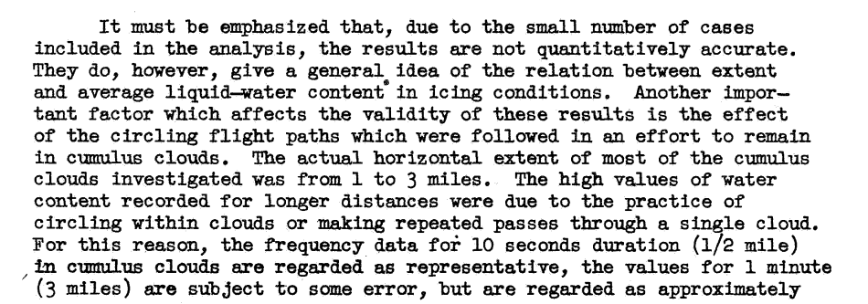
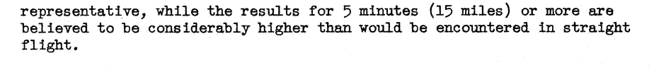
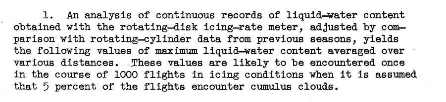

Title: NACA-TN-1904  
Category: NACA
tags: cylinder, natural icing

> ###"... the rotating-cylinder indications of drop-size distribution are so unreliable that they are of little or no value"

#"Observations of Icing Conditions Encountered in Flight During 1948"  
[^1]

##Key points

1. The average liquid water content varies over distance traveled in icing.
2. The value of the multicylinder method for determining drop size distributions is questioned.

##Abstract

>    Meteorological data from flight observations in icing conditions
during the first 5 months of 1948 are presented. A total of 335
measurements of liquid-water content and mean-effective drop diameter
were obtained by the multicylinder method in the course of 40 flights
in icing conditions covering most of northern United States. Cumulus
clouds were predominant during approximately two-thirds of the flights.
A continuous record of liquid-water content covering a major portion
of the operations was obtained by means of a rotating-disk icing-rate
meter. This record was used to investigate the relation between average 
liquid-water content and the horizontal extent of icing conditions.
An analysis of values of maximum drop diameter calculated from the
area of drop impingement on a stationary cylinder and corresponding
values of mean-effective drop diameter and dropsize distribution as
obtained from the rotating cylinders led to the conclusion that the
rotating-cylinder indications of drop-size distribution are so unre-
liable that they are of little or no value. The data indicate that
average and maximum values of drop size are significantly greater
and more variable near the Pacific coast than in the other parts of
the United States included in this investigation.
    

##Discussion

###Variation in liquid water content with distance

Data was gathered in icing clouds in flight, with flight paths that were often not straight lines.

The data were summarized in a table.

The data were shown in Figure 5.  

###Drop size distributions

Note above _"the conclusion that the rotating-cylinder indications of drop-size distribution are so unreliable that they are of little or no value"_ (!)

This was based on a comparison of maximum drop size a determined by a stationary cylinder to the mean-effective drop diameter and best fit distribution determined by the multicylinder method.
The mean-effective drop diameter is noted as "The amount of water in all of the drops greater than the mean-effective diameter is equal to the ".

    γ = (maximum drop size from fixed) / (mean-effective drop diameter from rotating multicylinder)
    

However, as we saw in [NACA-RM-A9C09]({filename}NACA-RM-A9C09.md) [^2], 
the error in estimating maximum drop size from maximum impingement limit on a fixed cylinder 
is as large as the error determining the MVD from the multicylinder method, 
so the maximum drop size determined may not be so reliable of a value to compare with.  

In the later NACA-TR-1215 [^3] (of which William Lewis was also an author of) a more nuanced view of the drop size distribution 
determination will be found.

Also note that the determination of the mean-effective drop diameter (MED) is not disputed, only the distribution determination is disputed.

###Multicylinder accuracy

Figure 7 essentially reproduces Figure 2 of [NACA-RM-A9C09]({filename}NACA-TN-1904.md) [^2], 
the results of which are largely reproducible as noted in that review.  

###Citations

NACA-TN-1904 cites 9 publications:

- Lewis, William: A Flight Investigation of the Meteorological Conditions Conducive to the Formation of Ice on Airplanes. NACA-TN-1393, 1947.
- Lewis, William, Kline, Dwight B., and Steinmetz, Charles P.: A Further Investigation of the Meteorological Conditions Conducive to Aircraft Icing. NACA-TN-1424, 1947.
- Jones, Alun R., and Lewis, William: Recommended Values of Meteorological Factors to be Considered in the Design of Aircraft Ice-Prevention Equipment. NACA-TN-1855, 1949.
- Jones, Alun R.: An Investigation of a Thermal Ice-Prevention System for a Twin-Engine Transport Airplane. NACA-TR-862, 1946.
- Gumbel, E. J.: On the Frequency of Extreme Values in Meteorological Data. Bulletin of the American Meteorological Society, vol. 23, March 1942, pp. 95-105.
- Peppler, Wilhelm: Unterkuhlte Wasserwolken und Eiswolken. (Supercooled water and ice clouds.) Forschungsund Erfahrungsberichte des Reichswetterdienstes, Ser. B, No. 1, Berlin, 1940. (Brief Summary in Bulletin of the American Meteorological Society. Vol. 29, Nov.1948, p.458.)
- Langmuir, Irving, and Blodgett, Katherine B.: A Mathematical Investigation of Water Droplet Trajectories. Tech. Rep. No. 5418, Air Materiel Command, AAF, Feb. 19, 1946. (Contract No. W-33-038-ac-9151 with General Electric Co.)
- Vonnegut, B., Cunningham, R. M., and Katz, R. E.: Instruments for Measuring Atmospheric Factors Related to Ice Formation on Airplanes. De-Icing Res. Lab., Dept. Meteorology, M.I.T., April 1946.
- Katz, R. E., and Cunningham, R. M.: Aircraft Icing Instruments. Instruments for Measuring Atmospheric Factors Related to Ice Fornation on Airplanes - II. Dept. Meteorology, M.I.T., March 1948. (Final Rep. under Air Force Contract No. W-33-038-ac-14165, July 1,. 1945-Dec. 31, 1947.)

NACA-TN-1904 is cited by 10 publications in the NACA Icing Publications Database [^4]:

- Dorsch, Robert G., and Hacker, Paul T.: Photomicrographic Investigation of Spontaneous Freezing Temperatures of Supercooled Water Droplets. NACA-TN-2142, 1950.
- Neel, Carr B., Jr., and Bright, Loren G.: The Effect of Ice Formations on Propeller Performance. NACA-TN-2212, 1950.
- Hacker, Paul T., and Dorsch, Robert G.: A Summary of Meteorological Conditions Associated with Aircraft Icing and a Proposed Method of Selecting Design Criterions for Ice-Protection Equipment. NACA-TN-2569, 1951.
- Perkins, Porter J.: Flight Instrument for Measurement of Liquid-Water Content in Clouds at Temperatures Above and Below Freezing. NACA-RM-E50J12a, 1951.
- Howell, Wallace E.: Comparison of Three Multicylinder Icing Meters and Critique of Multicylinder Method. NACA-TN-2708, 1952.
- Lewis, William, and Bergrun, Norman R.: A Probability Analysis of the Meteorological Factors Conducive to Aircraft Icing in the United States. NACA-TN-2738, 1952.
- Neel, Carr B., Jr., and Steinmetz, Charles P.: The Calculated and Measured Performance Characteristics of a Heated-Wire Liquid-Water-Content Meter for Measuring Icing Severity. NACA-TN-2615, 1952.
- Brun, Rinaldo J., Lewis, William, Perkins, Porter J., and Serafini, John S.: Impingement of Cloud Droplets and Procedure for Measuring Liquid-Water Content and Droplet Sizes in Supercooled Clouds by Rotating Multicylinder Method. NACA-TR-1215, 1955. (Supersedes NACA TN’s 2903, 2904, and NACA-RM-E53D23)
- Perkins, Porter J.: Statistical Survey of Icing Data Measured on Scheduled Airline Flights over the United States and Canada from November 1951 to June 1952. NACA-RM-E55F28a, 1955.
- Gelder, Thomas F., Smyers, William H., Jr., and von Glahn, Uwe H.: Experimental Droplet Impingement on Several Two-Dimensional Airfoils with Thickness Ratios of 6 to 16 Percent. NACA-TN-3839, 1956.
- Lewis, William, and Brun, Rinaldo J.: Impingement of Water Droplets on a Rectangular Half Body in a Two-Dimensional Incompressible Flow Field. NACA-TN-3658, 1956.

###Related

NACA-TN-1904 is cited by the two NACA publications cited in Appendix C of the icing regulations [^5].

- Hacker, Paul T., and Dorsch, Robert G.: A Summary of Meteorological Conditions Associated with Aircraft Icing and a Proposed Method of Selecting Design Criterions for Ice-Protection Equipment. NACA-TN-2569, 1951.
- Lewis, William, and Bergrun, Norman R.: A Probability Analysis of the Meteorological Factors Conducive to Aircraft Icing in the United States. NACA-TN-2738, 1952.

See Jeck's [^6] comments about the relationship of liquid water content and distance noted in NACA-TN-1904.

##Notes:
[^1]:
Lewis, William, and Hoecker, Walter H., Jr.: Observations of Icing Conditions Encountered in Flight During 1948. NACA-TN-1904, 1949.  
[^2]: 
Jones, Alun R., and Lewis, William: A Review of Instruments Developed for the Measurement of the Meteorological Factors Conducive to Aircraft Icing. NACA-RM-A9C09, 1949.  
[^3]: 
Brun, Rinaldo J., Lewis, William, Perkins, Porter J., and Serafini, John S.: Impingement of Cloud Droplets and Procedure for Measuring Liquid-Water Content and Droplet Sizes in Supercooled Clouds by Rotating Multicylinder Method. NACA-TR-1215, 1955. (Supersedes NACA TN’s 2903, 2904, and NACA-RM-E53D23)  
[^4]:
[NACA Icing Publications Database]({filename}naca icing publications database.md)  
[^5]: 
14 CFR 25 Appendix C (updated periodically) [https://www.ecfr.gov/current/title-14/chapter-I/subchapter-C/part-25/appendix-Appendix%20C%20to%20Part%2025]   
[^6]: 
Jeck, Richard K.: Advances in the Characterization of Supercooled Clouds for Aircraft Icing Applications. DOT/FAA/AR-07/4, Appendix C, November, 2008.  

