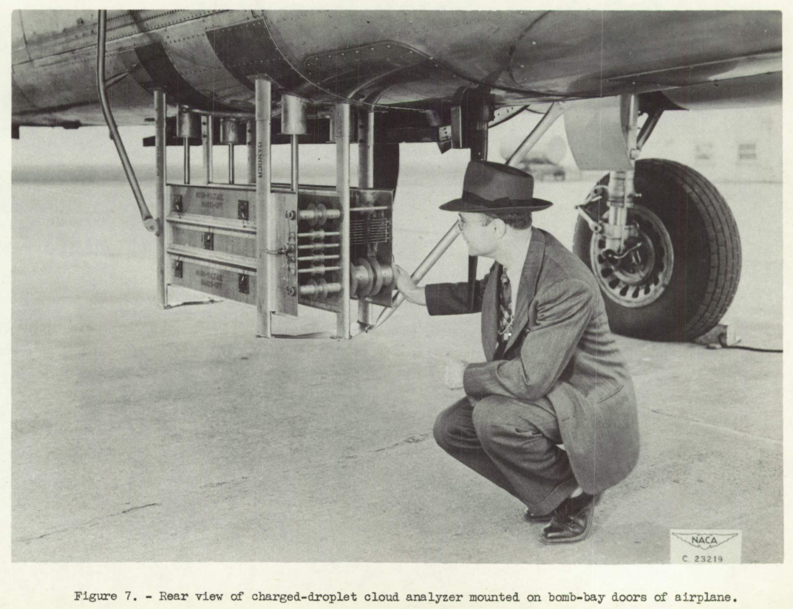
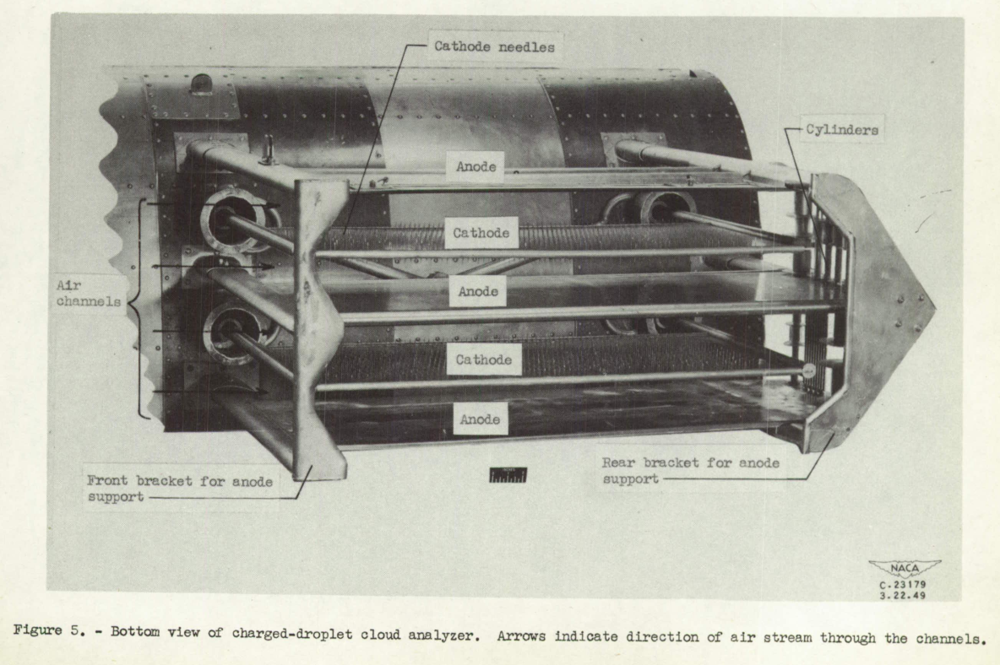
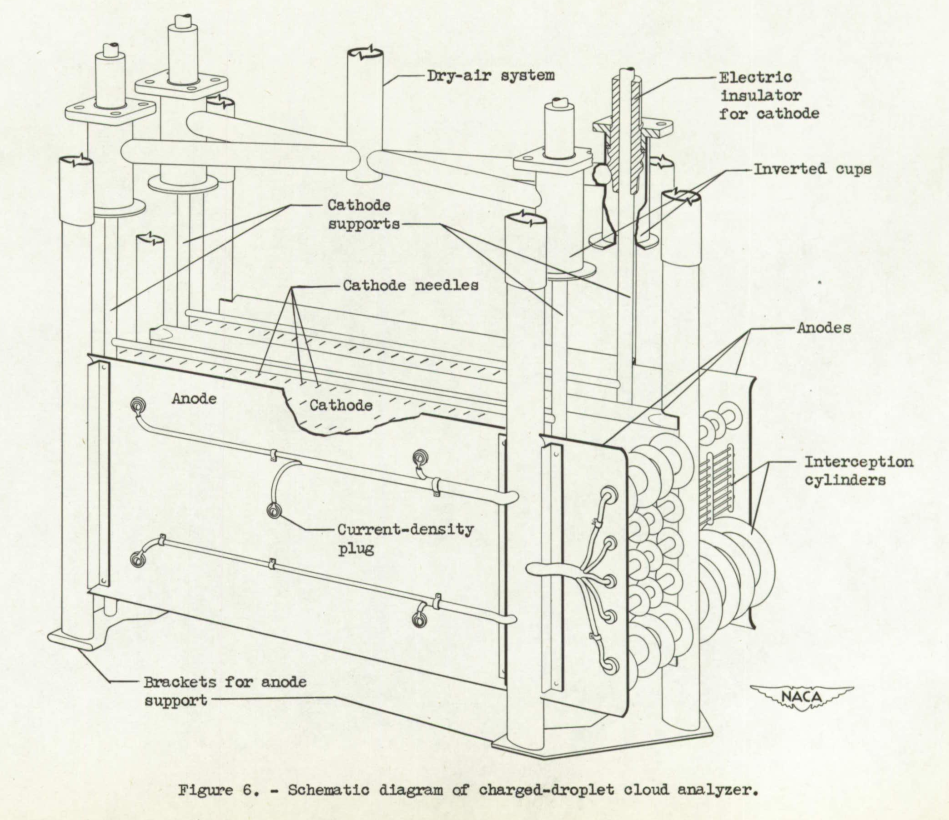
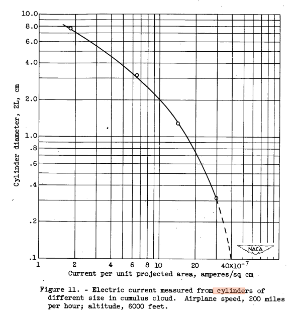
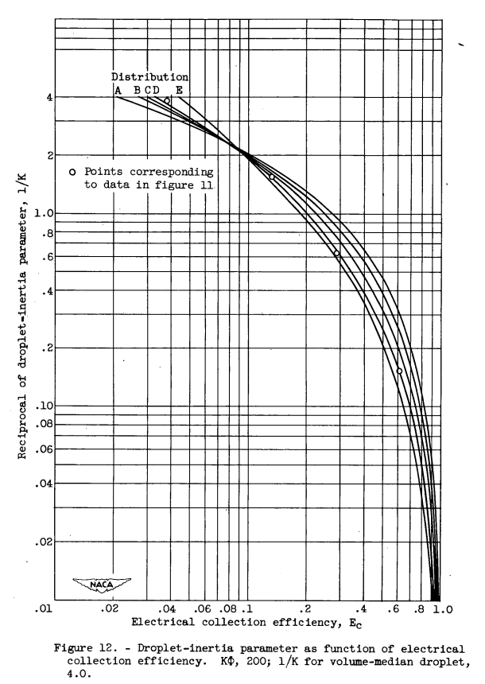

title: NACA-TN-2458  
Date: 2022-12-15 12:00  
Category: NACA  
tags: instruments  

### _"Because the charge placed on the droplets is a function of the droplet size, the size spectrum can be determined ..."_ [^1]  

# "An Instrument Employing a Coronal Discharge for the Determination of Droplet-Size Distribution in Clouds"

## Summary  

Electrical charges imparted to water drops allowed easier measurement of impingement on cylinders.  

## Key Points  
1. This was a multicylinder instrument that relied on the differential collection efficiency of different cylinder sizes.  
2. The measurement of electrical charge allowed easier measurement of impingement rates.  
3. There does not appear to be further use or development of the instrument.  

## Abstract  
>A flight instrument that uses electric means for measuring the
droplet-size distribution in above-freezing clouds has been devised and
given preliminary evaluation in flight. An electric charge is placed
on the droplets and they are separated aerodynamically according to
their mass. Because the charge placed on the droplets is a function of
the droplet size, the size spectrum can be determined by measurement of
the charge deposited on cylinders of several different sizes placed to
intercept the charged droplets. An expression for the rate of charge
acquisition by a water droplet in a field of coronal discharge is
derived. The results obtained in flight with an instrument based on the
method described indicate that continuous records of droplet-size spectrum 
variations in clouds can be obtained. The experimental instrument
was used to evaluate the method and was not refined to the extent
necessary for obtaining conclusive meteorological data.  
The desirable features of an instrument based on the method
described are (1) The instrument can be used in clouds with temperatures 
above freezing; (2) the size and the shape of the cylinders do
not change during the exposure time; (3) the readings are instantaneous
and continuous; (4) the available sensitivity permits the study of
variations in cloud structures of less than 200 feet in extent.

## Discussion  

This method uses the physics of the differential collection efficiency of water drops on
cylinders of different diameters. 

The cylinder diameters used (1/8, 1/2, 1, and 3 inches) were typical 
of the NACA-era multicylinders instruments. 

However, rather than weighing the ice accumulated on cylinders, 
the rate of electric charge from the charged water drops impinging 
could be measured, which was proportional to the water mass. 

More information on multicylinder instruments can be found in the 
[Icing on Cylinders Thread]({filename}Icing on Cylinders.md).   

Note that:  
>A part of the method presented in this report has appeared in a
dissertation titled "Some Aspects of Aircraft Icing Problem and an
Instrument for Its Study" by Rinaldo J. Brun presented to the faculty
of the Yale School of Engineering in June 1949 in candidacy for the
degree of Doctor of Engineering.

I have not been able to find a copy of that dissertation. 
However, even though the instrument is described as a 
"means for measuring the droplet-size distribution in above-freezing clouds", 
the dissertation title indicates that the intended use was for icing research (eventually).  

>DESCRIPTION OF INSTRUMENT
An instrument based on the principle of operation described in the
preceding section was constructed. The instrument comprised four air-stream 
channels back to back as shown in figure 5. Needles were
inserted through the cathode plate to aid in obtaining a uniform coronal
discharge. The needles protruded through both sides of the cathode
plates; thus each plate acted as a cathode for two air-stream channels.
Cylinders of four different sizes were installed directly behind the
region of coronal discharge (fig. 6). The assembly was hung from the
under side of the fuselage of a twin-engine light-bomber-type airplane
(fig. 7).

  
_Figure 7 from NACA-TN-2458_  

Details of the circuits are not shown, but the device could produce 
25,000 VDC to charge the water drops entrained in the air flowing through it. 

  
_Figure 5 from NACA-TN-2458_  

>The cylinder diameters used were 1/8, 1/2, 1, and 3 inches. The
number of cylinders used of each particular size was governed by the
total charge intercepted by each size of cylinder. A larger number of
the smaller-sized cylinders was required in order to obtain a measurable
current of 2 microamperes. The cylinders of any one size group were
wired in parallel. The spacing between cylinders was large enough to
avoid aerodynamic interference of the cylinders with each other.
Cylinders of the same diameter where ganged together were spaced
14 radii from center to center.  

  
_Figure 6 from NACA-TN-2458_  

Flight tests measured the different electrical charges accumulating 
on the cylinders.  

  
_Figure 8 from NACA-TN-2458_  

The measured charges for each cylinder size were plotted.

  
_Figure 11 from NACA-TN-2458_  

From the electrical charge values measured on the cylinders 
(proportional to the water mass impinging),
the collection efficiency for each cylinder diameter could be calculated.

  
_Figure 12 from NACA-TN-2458_  

From that information the best fit drop size distribution could be calculated. 
For more details on the multicylinder method calculations, see 
[Implementation of multicylinder calculations in Python]({filename}/Implementation of multicylinders cylinders.md).  

## Conclusions  

>CONCLUDING REMARKS
The charged-droplet cloud analyzer is based on a principle that
depends in part on the air flow past the instrument. In this respect
the instrument fits naturally into the condition encountered when it
is used with an airplane. The location of the instrument on the airplane 
may be improved perhaps to obtain a more representative sample
of the clouds. The first model was placed on the bomb-bay doors for
convenience in installation.  

The relocation of the instrument would be challenging, given its size.  

>A difficulty soon realized in the interpretation of the data is
the lack of other independent methods for checking the results. The
accuracy in determining the liquid-water content and droplet-size 
distribution depends on: (1) the error in measuring true airspeed, from
which the total charge on each droplet, as well as the rate of cloud
interception is obtained; (2) the error in measuring electrical values,
particularly the galvanometer readings obtained in the form of traces
on films (figs. 8 and 9); and (3) the errors in the assumed distributions 
presented in table I as compared with the natural conditions found
in clouds. With the instrumentation on the airplane used for the tests
reported herein, the error in measuring true airspeed is about 2.5 miles
per hour, which results in a negligible error in determining liquid-water 
content and volume-median droplet diameter. For the tests with
the instrument described, the errors in measuring and reading electrical
values varied depending on the type of cloud encountered, because the
and the applied errors involved in measuring the current density
voltage Vt were insignificant as compared with those involved in
reading the film records of the galvanometer. Between the lines WW
and XX of figure 8, the distribution actually varied from A to C. At
any one point a difference of one distribution was possible when read
by different observers. At the peak conditions of the cumulus portion
of the cloud (fig. 8), the distribution was C or D, depending on the
observer. Whether the distribution was C or D changed the liquid-water
content by less than 0.1 grain per cubic meter (less than 10 percent of
the original). The errors are much larger in resolving the data where
the rate of change of cloud conditions is great, such as at the fringes
of a cumulus cloud. Under such conditions it is often difficult to
distinguish an E distribution from a B distribution. An improvement in
the instrumentation and technique of measuring the current from the
cylinders will improve the accuracy.  

  
_Figure 9 from NACA-TN-2458_  

You can find out more about the drop size distribution designations 
(A, B, C, D, E) in the post ["Mathematical Investigation of Water Droplet Trajectories"]({filename}Mathematical Investigation of Water Droplet Trajectories.md).  

We saw similar laments many times about the 
"lack of other independent methods for checking the results" 
for drop sizes in the [Icing on Cylinders Thread]({filename}Icing on Cylinders.md). 
We saw options for measuring drop sizes and size distribution 
earlier in this [Meteorological Instruments Thread]({filename}instruments.md),
such as the sooted or oiled slide method, 
or the [water drop camera]({filename}water drop imaging.md) 
that was also undergoing development at this time (1951). 
It is not entirely clear why there was not another instrument used for comparison.   

However, it is noted that 
>>Because the instrument was designed without anti-icing equipment,
flights were necessarily conducted at atmospheric temperatures above
the freezing point.  

And
>>The experimental instrument
was used to evaluate the method and was not refined to the extent
necessary for obtaining conclusive meteorological data.  

So perhaps this was more of a "proof of concept" test than a 
flight instrument calibration test.  

>The differences in resolving the data by different observers often
lie in that the data obtained from the films do not precisely match any
calculated distribution curve. The difficulty in matching the curves
is caused in part by the scattering of the data and in part by the 
difference between the assumed distributions presented in table I and the
natural conditions existing in the cloud measured. The addition of
cylinders larger than 3 inches in diameter may lessen the uncertainty
caused by the scattering of the data.

This was another challenge seen several times with the multicylinder method. 
The largest cylinder was not always large enough to clearly differentiate 
drop sizes distributions. 
Cylinder diameters up to 5 and 6 inches were used in the 
NACA-era multicylinder instruments, 
but would make for a more unwieldy instrument. 

>An instrument based on the method of charging the cloud droplets
has the following desirable features:  
>1. The method can be applied in clouds with temperatures above
freezing and perhaps in subfreezing temperatures with proper anti-icing 
equipment.  
>2. The size and the shape of the cylinders do not change during
the exposure time as in the rotating-multicylinder method.  
>3. The uncertainty caused by the bouncing off of droplets should
be much less than if the rotating-multicylinder method because the
transfer of charge from the droplets to the cylinders is nearly
instantaneous and what happens to the droplets after the charge is
transferred is unimportant.  
>4. The readings are instantaneous and continuous.  
>5. The available sensitivity permits the study of the local variations 
in clouds.  
>6. Weighing errors are eliminated.  

>The analysis of clouds is very difficult with any method requiring
cylinders or other obstacles to separate the droplets according to
their mass, because both the liquid-water content and the droplet sizes
in the clouds are unknowns expressed implicitly in the equations
employed. An independent method for measuring liquid-water content in
the clouds would permit a simplification in the reduction of the data
to droplet size distribution.

I do not know of further development or uses of this instrument.  

## Citations  

NACA-TN-2458 cites 13 publications.  
- Langmuir, Irving, and Blodgett, Katherine B.: A Mathematical Investigation of Water Droplet Trajectories. Tech. Rep. No. 5418, Air Materiel Command, AAF, Feb. 19, 1946. (Contract No. W-33-038-ac-9151 with General Electric Co.)  
- Katz, R. E., and Cunningham, R. M.: Aircraft Icing Instruments. Instruments for Measuring Atmospheric Factors Related to Ice Fornation on Airplanes - II. Dept. Meteorology, M.I.T., March 1948. (Final Rep. under Air Force Contract No. W-33-038-ac-14165, July 1,. 1945-Dec. 31, 1947.)  
- Thomson, J. J., and Thomson, G. P.: Conduction of Electricity through Gases. Vols. I and II. Cambridge Univ. Press, 3d ed., 1928.  
- Loeb, Leonard B.: Fundamental Processes of Electrical Discharge in Gases. John Wiley & Sons, Inc., 1939.  
- Cobine, James Dillon: Gaseous Conductors. McGraw-Hill Book Co., Inc., 1941.  
- Townsend, J. S.: Electricity in Gases. Clarendon Press (Oxford), 1915, p. 378.  
- Pauthenier, et Mallard: Contribution l etude du champ cylindrique dans l'air ionis & la pression ordinaire. Contr1e expe'rimentai. Coinptes Rendus, T. 189, Nr. 21, Nov. 18, 1929, P. 843-845.  
- Clark, Victor F.: The Multicylinder Method. The Mount Washington Monthly Res. Bull., vol. II, no. 6, June 1946.  
- Anon.: Handbook of Meteorology, F. A. Berry, E. Bollay, and Norman R. Beers, eds. McGraw-Hill Book Co., Inc., 1945.  
- Ladenburg, Rudolf: Untersuchungen iber die physikalischenVorgange bei der sogenannten elektrischen Gasreinigung. Teil I. Uber die maximale Aufladung von Schwebeteilchen. Ann. d. Phys., Bd. 4, Heft 7, Folge 5, 1930, S. 863-897.  
- Deutsch, Walther: Bewegung und Ladung der E1ektrizitatstrager im Zylinderkondensator. Ann. d. Phys., Bd. 68, No. 12, Folge 4, 1922, 5. 335-344.  
- Richtmeyer, F. K., and Kennard, E. H.: Introduction to Modern Physics. McGraw-Hill Book Co., Inc., 4th ed., 1947.  
- Lamb, Horace: Hydrodynamics. Dover Pub., 6th ed., 1945.  

NACA-TN-2458 is cited once in the NACA Icing Publications Database [^2]:  
- Hacker, Paul T.: An Oil-Stream Photomicrographic Aeroscope for Obtaining Cloud Liquid-Water Content and Droplet Size Distribution in Flight. NACA-TN-3592, 1956.  

An online search found NACA-TN-2458 cited three times. [^3]  

## Notes  

[^1]: Brun, Rinaldo J., Levine, Joseph, and Kleinknecht, Kenneth S.: An Instrument Employing a Coronal Discharge for the Determination of Droplet-Size Distribution in Clouds. NACA-TN-2458, 1951 [ntrs.nasa.gov](https://ntrs.nasa.gov/citations/19810068730).  
[^2]: [NACA icing publications database]({filename}naca%20icing%20publications%20database.md)  
[^3]: [scholar.google.com](https://scholar.google.com/scholar?hl=en&as_sdt=0%2C48&q=NACA-TN-2458&btnG=)  

