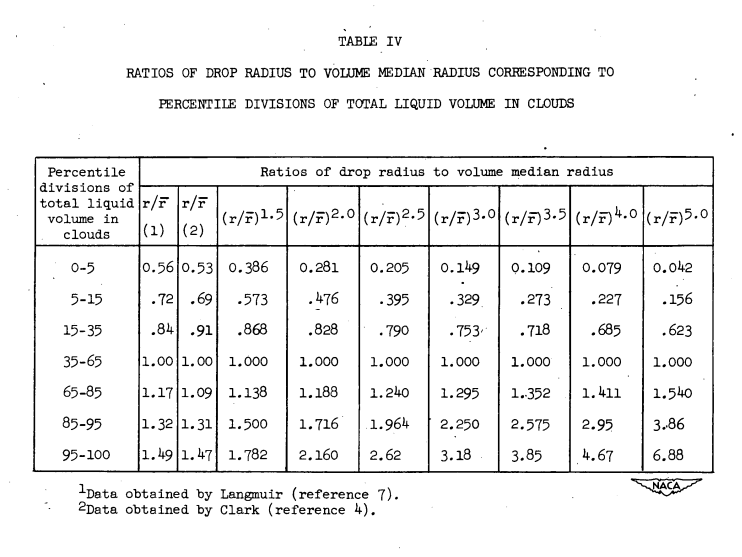

Title: NACA-TN-2708 
Date: 2022-03-08 12:00  
Category: NACA
tags: cylinders, instruments

### _"...At low airspeeds and with large cylinders, the determination should be relatively good."_  

# "Comparison of Three Multicylinder Icing Meters and Critique of Multicylinder Method" [^1]

## Summary  

Multicylinder instruments had good agreement for liquid water content and median effective drop diameter, 
but poor agreement for the distribution type.

## Key points  

1. Three multicylinder instruments had good agreement for liquid water content and median effective drop diameter, 
but poor agreement for the distribution type
2. The Langmuir drop size distributions were revised (but the revised versions were not widely adopted)

## Abstract

> Three multicylinder cloud meters, fundamentally similar but differing 
in important details, were compared in use at the Mount Washington
Observatory. Determinations of liquid water content were found to agree
within the limits of the probable error, but the two instruments designed
by the National Advisory Committee for Aeronautics indicated larger drop
sizes than did the Observatory's instrument, apparently because of
spurious ice catch on the rather rough surface of the larger cylinders.
Comparisons of drop-size distribution were largely indeterminate.  
 
> In a critique of the method, the probable error of determination of
liquid water content was found to be ±8 percent; of drop size, ±6 percent;
and of drop-size distribution, about ±0.7 unit of the modulus of distribution. 
Of the systematic errors, run-off of unfrozen water is most
important, blow-off and erosion seldom being hampering.  

> Revision of collection-efficiency computations for cylinders in
clouds with distributed drop sizes was found necessary and also revision
of one of the correction-factor graphs heretofore used. The assumption
of constant ice density in deriving cylinder size was found to be permissible 
for cylinders 1 inch or more in diameter.

## Discussion

### Instrument comparisons

Three multicylinder instruments were compared over several icing conditions measured at Mount Washington 
(a weather observatory situated at the top of a mountain). The instruments were similar, but not identical, 
with the largest cylinder diameter of 4.5 inch.

The LWC values from the three instruments (designate A, B, and O sets) agree well.

The drop size values agree well.

However, the distributions indicated do not agree well.

To me, this is the strongest indication we have seen so far in the cylinder thread 
that the drop size distributions are hard to determine accurately with the multicylinder method. 
As noted:
> If the cylinders
are small and the speed of flight is high, very great accuracy of observation 
will be required to yield any significant values of drop-size
distribution; at low airspeeds and with large cylinders, the determination 
should be relatively good.  

The air speeds in this study were all relatively low (a maximum of 33.1 m/s) 
compared to most of the flight test data we have seen (160 to 230 mph, 70 to 100 m/s), 
where the water catch efficiency on a 4.5 inch diameter 
cylinder should have strongly differentiated values based on distribution type, 
and yet the distribution type determined did not 
correlate well. Other values, such as LWC and MVD, did correlate well, 
indicating that the three instruments received substantially similar exposures to the icing conditions.  

###The Langmuir drop size distributions were revised

Based on a detailed analysis of the Houghton and Radford [^2] data used to develop the Langmuir distributions, 
the distributions were revised:

> In the course of earlier work on the physical origin of the drop-size 
distribution in clouds, the volume distribution diagram of Houghton
and Radford (reference 13) for fog drops was redrawn in the form shown 
in figure 6 and the volume distribution found by Vonnegut, Cunningham,
and Katz (reference 11) in clouds was plotted on the same chart. Upon
comparing this chart with Langmuir's tables (reference 7), it was found
that his selections of the representative radii for the various sub-divisions 
of the volume were in error. The matter was not pursued further 
at the time, but as a part of the present study it was decided to
investigate the effect this error might have on the collection-efficiency
graphs, based on Langmuir's data, that have been used by virtually all
workers with the multicylinder method.

The "(reference 7)" above is [^3].

> Accordingly, table IX of
Langmuir's paper was revised and expanded to include the broader distributions 
that had been added later by Clark, and is presented here as
Table IV. 

The revised distributions are purported to be a better approximation of a normal distribution. 
This is examined in detail in 
["A Langmuir B drop size distribution is (almost) a normal distribution"]({filename}A Langmuir B distribution is almost a normal distribution.md). 

 

The revised distributions did not see much use for aviation, 
as neither of the NACA publications that cite NACA-TN-2708 use the revised distributions. 
(They may have seen some use in meteorological publications [^4]).

> The collection efficiencies corresponding to the revised
volume distributions were computed at KØ = 1000 and are shown in
Table V and Figure 7.

These are relatively small adjustments to the Langmuir and Blodgett values. 

## Citations

NACA-TN-2708 cites 17 publications:

- Schaefer, Vincent J.: Demountable Rotating Multicylinders for Measuring Liquid Water Content and Particle Size of Clouds in Above and Below Freezing Temperatures. Tech. Rep. No. 5539, Air Materiel Command, Army Air Forces, Jan. 24, 1947, pp. 59-67.
- Jones, Alun R., and Lewis, William: A Review of Instruments Developed for the Measurement of the Meteorological Factors Conducive to Aircraft Icing. NACA-RM-A9C09, 1949 [ntrs.nasa.gov](https://ntrs.nasa.gov/citations/19810068733).
- Howell, Wallace E.: Contribution to the Evaluation of the Multicylinder Icing Meter. Tech. Rep. No. 5676, Air Materiel Command, U. S. Air Force, June 22, 1948, pp. 269-296.
- Clark, Victor F.: The Multicylinder Method. Mt. Wash. Observatory Monthly Res. Bull., vol. II, no. 6, June 1946.
- Howell, Wallace E.: Instructions for Making Icing Observations by the Multicylinder Method. Mt. Wash. Observatory Monthly Res. Bull., vol. II, no. 12, Dec. 1946.
- Howell, Wallace E.: The Growth of Cloud Drops in Uniformly Cooled Air. Jour. Meteorol., vol. 6, no. 2, April 1949, pp. 134-149.
- Langmuir, Irving: Super-Cooled Water Droplets in Rising Currents of Cold Saturated Air, Pt. I. Res. Lab., General Electric Co., Oct. 1943-Aug. 1944. (Army Contract W-33-106-sc-65.)
- Clark, Victor F.: Conditions for Run-Off and Blow-Off of Catch on Multicylinder Icing Meter. Tech. Rep. No. 5676, Air Materiel Command, U. S. Air Force, June 22, 1948, pp. 190-218.
- Howell, Wallace E.: Effect of the Vertical Gradients of Wind Speed and Water Content on Measurements with the Multicylinder Icing Meter. Tech. Rep. No. 5676, Air Materiel Command, U. S. Air Force, June 22, 1948, pp. 297-303.
- Cunningham, R. M.: Instructions for Calculating the Liquid Water Content, Effective Drop Size and Effective Drop Distributions from Rotating Cylinder Data Obtained from Average Speed Aircraft. Informal rep., De-Icing Res. Lab., Dept. of Meteorol., M.I.T., 1945.
- Downie, C. S.: The Rotating Cylinder Method for Obtaining Icing Intensity Data. Eng. Rep. No. AIRL 48-3-2P, Aero. Ice Res. Lab. (Minneapolis), Sept. 1947.
- Langmuir, Irving, and Blodgett, Katherine B.: A Mathematical Investigation of Water Droplet Trajectories. Tech. Rep. No. 5418, Air Materiel Command, AAF, Feb. 19, 1946. (Contract No. W-33-038-ac-9151 with General Electric Co.)
- Houghton, H. G., and Radford, W. H.: On the Measurement of Drop Size and Liquid Water Content in Fogs and Clouds. Papers in Phys. Oceanography and Meteorology, publ. by M.I.T. and Woods Hole Oceanographic Inst., Cambridge and Woods Hole (Mass.), vol. VI, no. 4, Nov. 1938.
- Vonnegut, B., Cunningham, R. M., and Katz, R. E.: Instruments for Measuring Atmospheric Factors Related to Ice Formation on Airplanes. De-Icing Res. Lab., Dept. Meteorology, M.I.T., April 1946.
- Lewis, William, and Hoecker, Walter H., Jr.: Observations of Icing Conditions Encountered in Flight During 1948. NACA-TN-1904, 1949.
- Conrad, Victor: Preliminary Report on Statistical Investigation of the Mount Washington Series of Icing Observations. Tech. Rep. No. 5676, Air Materiel Command, U. S. Air Force, June 22, 1948, pp. 114-133.
- Loughborough, Dwight L., Greene, Howard E., and Roush, Paul A.: A Study of Wing De-Icer Performance on Mount Washington. Preprint No. 122, Inst. Aero. Sci., Jan. 1948.

NACA-TN-2708 is cited 2 times in the NACA Icing Publications Database [^5]:

- Lewis, William, Perkins, Porter J., and Brun, Rinaldo J.: Procedure for Measuring Liquid-Water Content and Droplet Sizes in Super-cooled Clouds by Rotating Multicylinder Method. NACA-RM-E53D23, 1953.
- Brun, Rinaldo J., Lewis, William, Perkins, Porter J., and Serafini, John S.: Impingement of Cloud Droplets and Procedure for Measuring Liquid-Water Content and Droplet Sizes in Supercooled Clouds by Rotating Multicylinder Method. NACA-TR-1215, 1955. (Supersedes NACA TN’s 2903, 2904, and NACA-RM-E53D23)

An online search [^4] found 5 more citations, mostly in meteorological publications.  

## Notes  

[^1]: 
Howell, Wallace E.: Comparison of Three Multicylinder Icing Meters and Critique of Multicylinder Method. NACA-TN-2708, 1952 [ntrs.nasa.gov](https://ntrs.nasa.gov/citations/19810068732).  
[^2]:
Houghton, H. G., and Radford, W. H.: On the Measurement of Drop Size and Liquid Water Content in Fogs and Clouds. Papers in Phys. Oceanography and Meteorol., M.I.T. and Woods Hole Oceanographic Inst., vol. VI, no. 4, Nov. 1938.  
[^3]:
Langmuir, Irving, and Blodgett, Katherine B.: A Mathematical Investigation of Water Droplet Trajectories. General Electric Co. Rep., 1943. (Also available as Army Air Forces Tech. Rep. No. 5418 and as Dept. of Commerce Pub. PB No. 27565.)  
[^4]: An online search found 5 more citations, mostly in meteorological publications.
[scholar.google.com](https://scholar.google.com/scholar?hl=en&as_sdt=0%2C48&q=naca-tn-2708&btnG=), January, 2022.  
[^5]: 
[NACA icing publications database]({filename}naca%20icing%20publications%20database.md)  

