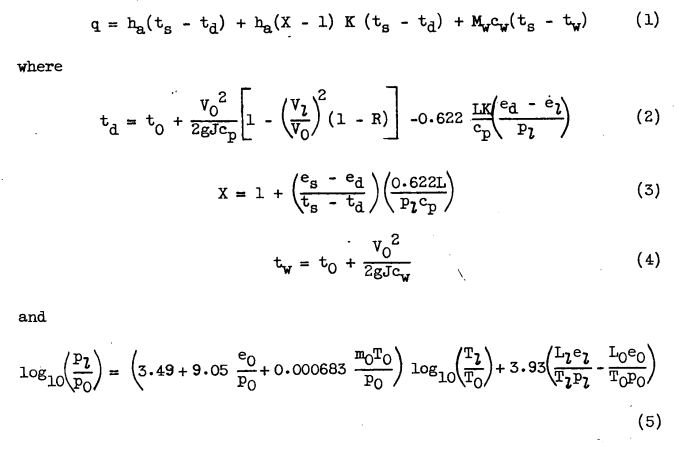

Title: NACA-TN-2799  
Date: 2022-04-24 12:00  
Category: NACA  
tags: thermodynamics, python  

### _"Solution of the heat and mass transfer from a wetted surface is quite involved and tedious."_  

# "Simple Graphical Solution of Heat Transfer and Evaporation from Surface Heated to Prevent Icing" [^1]

 
> Figure 1. - Graphical solution of anti-icing heat and mass transfer from surface subject to impingement and heated above freezing.

## Summary
Simplified ice protection equations allow graphical solutions.

## Key points

1. Simplified ice protection equations allow graphical solutions.
2. The effects of varying local surface pressure and velocity are included.

## Abstract

> Equations expressing the heat transfer and evaporation from wetted
surfaces during ice prevention have been simplified and regrouped to
permit solutions by simple graphical means. Working charts for quick
and accurate anti-icing calculations are also included. 
    
## Discussion

> INTRODUCTION
Solution of the general problem of heat and mass transfer from a
wetted surface in forced convection is quite involved and tedious.
The calculations that often must be made point by point along a surface
are complex even after the basic variables and ambient conditions have
been determined. The method of solution customarily performed involves
several trial-and-error calculations that are intermediate between the
final answer and the basic factors that define a particular anti-icing
situation.
This investigation was conducted at the NACA Lewis laboratory to
simplify the method of calculating heat and mass transfer after the basic
factors (such as ambient temperature, rate of water interception, and
relative velocity) are known. Calculations will be greatly simplified by
a fundamental rearrangement of terms in the conventional equations, which
will eliminate the trial-and-error calculations, and permit a rapid,
graphical solution. The solution will be limited to the normal range of
anti-icing conditions and to the case of surface temperatures above
32°F with liquid-water interception by the surface.

> Heat transfer. - The heat transfer in forced convection from a surface 
subjected, to water impingement and. heated above 32°F has been represented 
by the total heat transferred. by convection and by evaporation
of surface water, plus the sensible heat change of the impinging water.
These heat-transfer processes are discussed in detail in references 1 to
5 and are summarized, in the following five conventional equations: 

 

Readers may recognize forms of equations 1 through 4 from [NACA-ARR-5G13]({filename}NACA-ARR-5G13.md) [^2]. 

Note that the evaporation equations (2) and (3) use the factor:

```text
    0.622 / cp
```    
which differs from [Messinger]({filename}messinger.md) [^3], which used:

```text
    (Pr/Tr)**(2/3) * 0.622 / cp
    (Pr/Tr)**(2/3) = 1.12
    1.12 * 0.622 / cp
```    

I think that equation (5) is a wet adiabatic calculation 
that assumes water drop temperatures are in equilibrium 
with the air as they approach a surface, 
although I could not find it in "references 1 to 5". 
I guess that I am not completely up on the "five conventional equations".

> (The symbols used herein are given in the appendix.)
A solution of equation (1) requires the prior calculation of equations 
(2) to (5). Because of the dependence of ed on td and of el
on tl, equations (2) and (5) are both trial-and-error solutions. In
order to eliminate these laborious calculations, a single equation will
be derived containing only a minimum number of basic variables.

> In order to obtain a simplified relation using the preceeding eight terms; 
the following assumptions are made:  
(1) In the air flow over a body, temperatures and pressures change
adiabatically too quickly to permit any change in the state of entrained
moisture; the local-stream vapor pressure (as shown in reference 2) is
then given by  
 

Reference 2 is NACA-ARR-5G13. 
It is an alternative that was considered (not the only scenario presented) 
to the assumption that the water drops are in equilibrium with the air 
as they approach an object. 
 
Equation 7 is an incompressible approximation of Bernoulli's Law.

The simplified equations are regrouped: 

 

Also note that equation (5) was quietly omitted. 

> Further simplification is obtained by expressing the following minor
variables as constants near the middle of their expected range in anti-icing 
calculations:  
(1) Recovery factor R, assumed as 0.85, corresponding to the conservative 
case of laminar flow  
(2) Latent heat of vaporization L, assumed as 1066 Btu per pound,
corresponding to an average surface temperature of 50F  
(3) Ambient absolute temperature (for air density calculation),
assumed as 464R

 

The text from Figure 1 gives an example of the use of the tau values:
```text
    Solutions:  q/ha = τ1 - τ2  + K(τ3 -τ4) + τ5, F
                 Mev = (hs K/1066)(τ3 - τ4), lb/(hr)(ft^2)
                     Abscissa         Sloping line
    τ1 = Intersection  Mw/ha    and     ts - to
    τ2 = Intersection  Mw/ha    and       vo
    τ3 = Intersection   pl      and       ts
    τ4 = Intersection   po      and       to
    τ5 = Intersection   pl      and       po
    Example:    
    Let:  
    ha = 50 Btu/(hr)(ft^2)(F)  
    Mw = 35 lb/(hr)(ft^2)  
    ts = 80 F 
    to = 20 F  
    vo = 700 ft/s  
    p0  = 12 in. Hg  
    pl  = 16 in. Hg 
    Then: 
    Mw/ha = 0.7  
        q = 50(102 - 41.4 - 179.5 - 23.5 - 6.8) =
            10,490 BTU/(hr)(ft^2)
      Mev = (50/1066)(179.5 - 23.5) = 
            7.32 lb/(hr)(ft^2)
            
    Figure 1. - Graphical solution of anti-icing heat and mass transfer from surface subject to impingement and heated above freezing.
    (A 17 1/2 x 22 inch print of this figure is attached.) 
```
Let us write the equations in (mostly) SI units:    

I will attempt to standardize (mostly) to the nomenclature of "Manual of Scaling Methods" [^4]. 

| Description                                   | symbol              | NACA-TN-2799 symbol                           |
|-----------------------------------------------|---------------------|-----------------------------------------------|
| air specific heat at constant pressure        | cp                  | cp                                            |
| unit system gravitation factor                | gc = 1 kg-m/(N-s^2) | g, acceleration due to gravity, 32.2 ft/sec^2 |
| heat transfer coefficient                     | hc                  | ha                                            |
| latent heat of evaporation                    | Le                  | L                                             |
| mass flux rate of water (mass/unit_area/time) | mw                  | Mw                                            |
| ambient static pressure                       | p                   | p                                             |
| ambient water vapor pressure                  | pv                  | eo                                            |
| surface water vapor pressure                  | pvs                 | el                                            |
| recovery factor                               | r                   | R                                             |
| ambient air static temperature                | ta                  | to                                            |
| surface temperature                           | ts                  | ts                                            |
| free stream airspeed                          | u                   | V                                             |

Calculations here will be in SI units, with the exceptions of:  
- LWC, g/m^3  
- drop diameter, micrometer   

A curious unit appears in the description of density:
 

From the units on g:
 

I infer that the mass in the density is the archaic unit "slug" in disguise
(see [A Brief Digression on Unit Systems]({filename}brief-digression-on-units.md)).  
```text
    slug = 32.2 lbm / (32.2 ft/s^2) => lbm-s^2/ft units     
    density = slug / vol = lbm-s^2/ft / (ft^3) = lbm-s^2/ft^4
```    
So, the tau values become (the units are temperature of the units system):  
```text
    τ1 = (ts - ta) * (1 + wm * cpw / ha)    
    τ2 = u**2 / 2 * (r / cp + wm / ha)  
    τ3 = 0.622 * Le / cp * (pvs / pl)  
    τ4 = 0.622 * Le / cp * (pv / po)  
    τ5 = (1-r) * R_AIR * ta / (2 *cp) * (1 - pl / p)  [evaluated at 464R=257.77K, r=0.85]  
```    

Since there is a graphical solution, I guess there is no need for a python implementation :(  

I made one anyway, file "naca_tn_2799.py" [^5]. 
Values calculated with the file "naca_tn_2799.py" agree well with the example values. 

| Value | Calculated, F | Example value, F |
|-------|---------------|------------------|
| τ1    | 102.3         | 102              |
| τ2    | 41.7          | 41.4             |
| τ3    | 180.6         | 179.5            |
| τ4    | 25.6          | 23.5             |
| τ5    | -6.7          | -6.8             |

| Value           | Calculated | Example |
|-----------------|------------|---------|
| q, BTU/h-ft^2   | 10453      | 10490   |
| Mev, lbm/h-ft^2 | 7.21       | 7.32    |

## Conclusions  

>In the preceding derivations, the assumption is made that the
moisture in the ambient air does not have time to change state during
the adiabatic pressure and temperature changes in the local air stream.
Because of the high speeds and short distances involved in most anti-
icing calculations, this assumption appears reasonable. Answers obtained
by use of this assumption do not differ appreciably from those using the
assumption of phase changes in equilibrium with the local air temperature. 
The difference between the two solutions is greatest when pl/p0
is most removed from unity and when low heating rates are used.  

>Errors in the present graphical solution may become appreciable at
high subsonic speeds because an incompressible-flow relation was used in
eliminating the velocity-ratio term from the equations. Recovery factors
for wetted surfaces at high speeds may also deviate from the value
assumed herein. The errors in solution due to the temperature factors
that were taken as constants near the mean of their expected ranges are
in the order of 3 percent for the range of graph presented. The fore-
going errors are negligible, however, compared with the uncertainty and
the latitude involved in estimating values of the basic variables,
especially the water-interception rate and the beat-transfer coefficient. 

>The form of solution presented herein is intentionally made general
for maximum usage. The solution is applicable to practically any body
shape for which the flow conditions are known, and is not dependent upon
any specific assumptions as to body geometry, location of transition,
wetness of surface, and method or extent of heating. 

NACA-TN-2799 presented a general solution, 
but it left to the user some of the hard parts of a complete solution, 
such as determining the 
heat transfer coefficient and the water catch rate. 

The "pressure and temperature changes in the local air stream" 
over the surface is a feature that will be used in the next publication review in the 
[Icing Thermodynamics thread]({filename}thermodynamics.md), NACA-TN-2914,
although in the compressible flow form.

## Citations

NACA-TN-2799 cites 12 publications:

- Neel, Carr B., Jr., Bergrun, Norman R., Jukoff, David, and Schlaff, Bernard A.: The Calculation of the Heat Required for Wing Thermal Ice Prevention in Specified Icing Conditions. NACA-TN-1472, 1947.  
- Hardy, J. K.: Kinetic Temperature of Wet Surfaces A Method of Calculating the Amount of Alcohol Required to Prevent Ice, and the Derivation of the Psychrometric Equation. NACA-ARR-5G13, 1945. [ntrs.nasa.gov](https://ntrs.nasa.gov/citations/19930093546) 
- Gelder, Thomas F., and Lewis, James P.: Comparison of Heat Transfer from Airfoil in Natural and Simulated Icing Conditions. NACA-TN-2480, 1951.  
- Gray, Vernon H., and Campbell, B. G.: A Method for Estimating Heat Requirements for Ice Prevention on Gas-Heated Hollow Propeller Blades. NACA-TN-1494, 1947.  
- Brunt, David: Physical and Dynamical Meteorology. Univ. Press (Cambridge), 2nd ed., 2nd reprint, Chap. III, 1944, pp. 49-68.  
- Boelter, L. M. K., Martinelli, R. C., Romie, F. E., and Morrin, E. H.: An Investigation of Aircraft Heaters, Part XVIII - A Design Manual for Exhaust Gas and Air Heat Exchangers. NACA-ARR-5A06, 1945.  
- Boelter, L. M. K., Grossman, L. M., Martinelli, R. C., and Morrin, E. H.: An Investigation of Aircraft Heaters, Part XIX - Comparison of Several Methods of Calculating Heat Losses from Airfoils. NACA-TN-1453, University of California, 1947.  
- Johnson, H. A., and Rubesin, M. W.: Aerodynamic Heating and Convective Heat Transfer - Summary of Literature Survey. Trans. ASME, vol. 71, no. 5, July 1949, pp. 447-456.  
- Frick, Charles W., Jr., and McCullough, George B.: A Method for Determining the Rate of Heat Transfer from a Wing or Streamline Body. NACA-WR-A-40, Dec. 1942.  
- Scherrer, Richard: The Effects of Aerodynamic Heating and Heat Transfer on the Surface Temperature of a Body of Revolution in Steady Supersonic Flight. NACA-TR-917, 1948. (Formerly NACA-TN-1300.)  
- Drexel, Roger E., and McAdams, William H.: Heat-Transfer Coefficients for Air Flowing in Round Tubes, In Rectangular Ducts, and around Finned Cylinders. NACA-ARR-4F28, 1945.  
- Lowdermilk, Warren H., and Grele, Milton D.: Influence of Tube-Entrance Configuration on Average Heat-Transfer Coefficients and Friction Factors for Air Flowing in an Inconel Tube. NACA-RM-E50E23, 1950.  

NACA-TN-2779 is cited once by publications in the NACA Icing Publications Database [^6]:

- Lewis, James P.: An Analytical Study of Heat Requirements for Icing Protection of Radomes. NACA-RM-E53A22, 1953.  

NACA-TN-2799 is cited 6 times in the literature [^7].

## Notes: 

[^1]: 
Gray, Vernon H.: Simple Graphical Solution of Heat Transfer and Evaporation from Surface Heated to Prevent Icing. NACA-TN-2799, 1952 [ntrs.nasa.gov](https://ntrs.nasa.gov/citations/19930083505).  
[^2]: Hardy, J. K.: Kinetic Temperature of Wet Surfaces A Method of Calculating the Amount of Alcohol Required to Prevent Ice, and the Derivation of the Psychrometric Equation. NACA-ARR-5G13, 1945. [ntrs.nasa.gov](https://ntrs.nasa.gov/citations/19930093546) 
[^3]: 
Messinger, B. L.: Equilibrium Temperature of an Unheated Icing Surface as a Function of Airspeed. Preprint No. 342, Presented at I.A.S. Meeting, June 27-28, 1951.  
[^4]: 
Anderson, David N.: Manual of scaling methods. No. E-14272, NASA/CR-2004-212875. 2004.  [ntrs.nasa.gov](https://ntrs.nasa.gov/api/citations/20040042486)    
[^5]: 
[github.com](https://github.com/icinganalysis/icinganalysis.github.io)  
[^6]: 
[NACA icing publications database]({filename}naca%20icing%20publications%20database.md)  
[^7]: 
[scholar.google.com](https://scholar.google.com/scholar?hl=en&as_sdt=0%2C48&q=Simple+Graphical+Solution+of+Heat+Transfer+and+Evaporation+from+Surface+Heated+to+Prevent+Icing&btnG=)  
