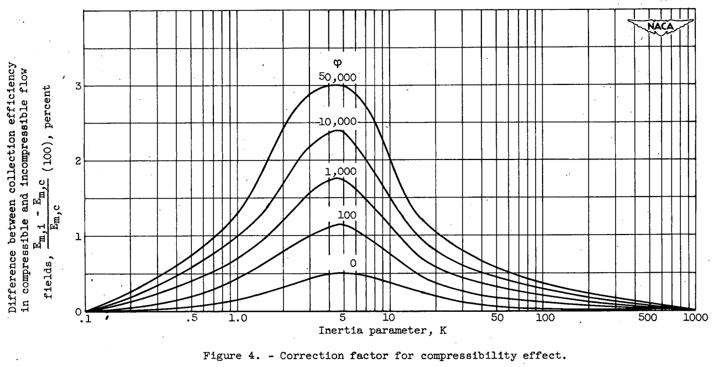

Title: NACA-TN-2903 
Date: 2022-03-20 12:00  
Category: NACA
tags: cylinders

### _"For most practical problems involving measurements of droplet impingement on cylinders, the compressibility effect may be ignored."_  

# "Impingement of Cloud Droplets on Aerodynamic Bodies as Affected by Compressibility of Air Flow Around the Body"

## Summary
The effect of the compressibility of air on the water-drop impingement calculations is found to be "negligible".

## Key points
1.  The effect of the compressibility of air on the water-drop impingement calculations is found to be "negligible"

## Abstract
> The trajectories of water droplets in a compressible-air flow field
around a cylinder were computed with a mechanical analog. The results of
the calculations at approximately the flight critical Mach number were
compared with calculations of trajectories in an incompressible flow
field. For a cylinder, the effect of compressibility of the air on the
droplet trajectories was negligible up to the flight critical Mach number.
The results obtained with the cylinder were extended to airfoils. This
extension is possible because the incompressible flow fields of both
cylinders and airfoils are similarly altered by compressibility.

## Discussion

This is one of the shortest reviews, as the conclusion was quite clear. 
However, there was a significant amount of computational work on a differential analyzer ("mechanical analog") 
to reach that conclusion. 
The use of the differential analyzer is well described in [^2].

The results for a flight case of Mach 0.4 are summarized in Figure 4:

A table was included summarizing results at 10,000 ft. altitude:

| Inertia parameter K | Cylinder diameter D (in.) | Droplet diameter d (microns) | Dimensionless parameter Phi | (Em_i-Em_c)/Em_c (percent) |
|---------------------|---------------------------|------------------------------|-----------------------------|----------------------------|
| 0.5                 | 1/2                       | 3                            | 740                         | 0.3                        |
| .5                  | 1                         | 4                            | 1,480                       | .4                         |
| .5                  | 3                         | 7                            | 4,440                       | .5                         |
| .5                  | 6                         | 9                            | 8,880                       | .5                         |
| 1                   | 1/2                       | 4                            | 740                         | .6                         |
| 1                   | 1                         | 5                            | 1,480                       | .8                         |
| 1                   | 3                         | 9                            | 4,440                       | .9                         |
| 1                   | 6                         | 13                           | 8,880                       | 1.0                        |
| 5                   | 1/2                       | 9                            | 740                         | 1.5                        |
| 5                   | 1                         | 12                           | 11480                       | 1.9                        |
| 5                   | 3                         | 21                           | 4,440                       | 2.1                        |
| 5                   | 6                         | 30                           | 8,880                       | 2.3                        |
| 5                   | 18                        | 50                           | 27,650                      | 2.8                        |
| 5                   | 30                        | 70                           | 44,400                      | 2.9                        |
| 20                  | 1/2                       | 17                           | 740                         | .5                         |
| 20                  | 1                         | 24                           | 1,480                       | .6                         |
| 20                  | 3                         | 40                           | 4,440                       | .7                         |
| 20                  | 6                         | 60                           | 8,880                       | .8                         |

It is noted that:
> The difference in the trajectories caused by the correction [for compressibility] was less than the probable error of the analog.

### Conclusions

> The following conclusions are based on the calculation of droplet
trajectories around a cylinder in both an incompressible flow field and
a compressible-air flow field at the flight critical Mach number and on
a study of the air velocities around airfoils:
> 1. For a cylinder the effect of compressibility of the air on the
droplet trajectories is not very great up to the flight critical Mach
number, and for most practical problems involving measurements of
droplet impingement on cylinders the compressibility effect may be
ignored.
> 2. The fact that the effect of compressibility on the impinging
droplet trajectories is negligible also applies to airfoils.

## Citations

NACA-TN-2903 cites 8 publications:
- Glauert, Muriel: A Method of Constructing the Paths of Raindrops of Different Diameters Moving in the Neighbourhood of (1) a Circular Cylinder, (2) an Aerofoil, Placed in a Uniform Stream of Air; and a Determination of the Rate of Deposit of the Drops on the Surface and the Percentage of Drops Caught. R. & M. No. 2025, British A.R.C., 1940.  
- Langmuir, Irving, and Blodgett, Katherine B.: A Mathematical Investigation of Water Droplet Trajectories. Tech. Rep. No. 5418, Air Materiel Command, AAF, Feb. 19, 1946. (Contract No. W-33-038-ac-9151 with General Electric Co.)  
- Brun, Rinaldo J., and Mergler, Harry W.: Impingement of Water Droplets on a Cylinder in an Incompressible Flow Field and Evaluation of Rotating Multicylinder Method for Measurement of Droplet-Size Distribution, Volume-Median Droplet Size, and Liquid-Water Content in Clouds. NACA-TN-2904, 1953.  
- Bergrun, Norman R.: A Method for Numerically Calculating the Area and Distribution of Water Impingement on the Leading Edge of an Airfoil in a Cloud. NACA-TN-1397, 1947.  
- Guibert, A. G., Janssen, E., and Robbins, W. M.: Determination of Rate, Area, and Distribution of Impingement of Waterdrops on Various Airfoils from Trajectories Obtained on the Differential Analyzer. NACA-RM-9A05, 1949.  
- Brun, Rinaldo J., Serafini, John S., and Moshos, George J.: Impingement of Water Droplets on an NACA 651-212 Airfoil at an Angle of Attack of 4°. NACA-RM-E52B12, 1952.  
- Eser, F. (N. Flint, Trans.): On the Flow of Compressible Fluids Past Solid Bodies at Subsonic Velocity. Luftfabrtforschung, vol. 20, no. 7, July 20, 1943, pp. 220-230. R.T.P. Translation No. 2056, Ministry Aircraft Prod. (British).  
- Kaplan, Carl: Compressible Flow about Symmetrical Joukowski Profiles. NACA-TR-621, 1938.  

NACA-TN-2903 is cited 13 times in the NACA Icing Publications Database [^3]:
- Brun, Rinaldo J., Gallagher, Helen M., and Vogt, Dorothea E.: Impingement of Water Droplets on NACA 651-208 and 651-212 Airfoils at 4° Angle of Attack. NACA-TN-2952, 1953.  
- Brun, Rinaldo J., Gallagher, Helen M., and Vogt, Dorothea E.: Impingement of Water Droplets on NACA 65A004 Airfoil and Effect of Change in Airfoil Thickness from 12 to 4 Percent at 4° Angle of Attack. NACA-TN-3047, 1953.  
- Brun, Rinaldo J., and Mergler, Harry W.: Impingement of Water Droplets on a Cylinder in an Incompressible Flow Field and Evaluation of Rotating Multicylinder Method for Measurement of Droplet-Size Distribution, Volume-Median Droplet Size, and Liquid-Water Content in Clouds. NACA-TN-2904, 1953.  
- Hacker, Paul T., Brun, Rinaldo J., and Boyd, Bemrose: Impingement of Droplets in 90° Elbows with Potential Flow. NACA-TN-2999, 1953.  
- Brun, Rinaldo J., and Dorsch, Robert G.: Impingement of Water Droplets on an Ellipsoid with Fineness Ratio 10 in Axisymmetric Flow. NACA-TN-3147, 1954.  
- Brun, Rinaldo J., Gallagher, Helen M., and Vogt, Dorothea E.: Impingement of Water Droplets on NACA 65A004 Airfoil at 8° Angle of Attack. NACA-TN-3155, 1954.  
- Dorsch, Robert G., and Brun, Rinaldo J.: Variation of Local Liquid-Water Concentration about an Ellipsoid of Fineness Ratio 5 Moving in a Droplet Field. NACA-TN-3153, 1954.  
- Dorsch, Robert G., Brun, Rinaldo J., and Gregg, John L.: Impingement of Water Droplets on an Ellipsoid with Fineness Ratio 5 in Axisymmetric Flow. NACA-TN-3099, 1954.  
- Serafini, John S.: Impingement of Water Droplets on Wedges and Double- Wedge Airfoils at Supersonic Speeds. NACA-TR-1159, 1954. (Supersedes NACA-TN-2971.)  
- Brun, Rinaldo J., and Dorsch, Robert G.: Variation of Local Liquid-Water Concentration about an Ellipsoid of Fineness Ratio 10 Moving in a Droplet Field. NACA-TN-3410, 1955.  
- Brun, Rinaldo J., and Vogt, Dorothea E.: Impingement of Water Droplets on NACA 65A004 Airfoil at 0° Angle of Attack. NACA-TN-3586, 1955.  
- Dorsch, Robert G., Saper, Paul G., and Kadow, Charles F.: Impingement of Water Droplets on a Sphere. NACA-TN-3587, 1955.  
- von Glahn, Uwe H., Gelder, Thomas F., and Smyers, William H., Jr.: A Dye-Tracer Technique for Experimentally Obtaining Impingement Characteristics of Arbitrary Bodies and a Method for Determining Droplet Size Distribution. NACA-TN-3338, 1955.  

An online search [^4] found 26 citations of NACA-TN-2903.

### Related 

NACA-TR-1215 [^5] "supersedes" NACA-TN-2903. See the review [NACA-TR-1215]({filename}NACA-TR-1215.md).  

## Notes:  
[^1]: 
Brun, Rinaldo J., Serafini, John S., and Gallagher, Helen M.: Impingement of Cloud Droplets on Aerodynamic Bodies as Affected by Compressibility of Air Flow Around the Body. NACA-TN-2903, 1953.  
[^2]: 
Brun, Rinaldo J., and Mergler, Harry W.: Impingement of Water Droplets on a Cylinder in an Incompressible Flow Field and Evaluation of Rotating Multicylinder Method for Measurement of Droplet-Size Distribution, Volume-Median Droplet Size, and Liquid-Water Content in Clouds. NACA-TN-2904, 1953.  
[^3]: 
[NACA Icing Publications Database]({filename}naca icing publications database.md)  
[^4]:
https://scholar.google.com/scholar?hl=en&as_sdt=0%2C48&q=naca-tn-2903&btnG=  
[^5]: 
Brun, Rinaldo J.: Cloud-Droplet Ingestion in Engine Inlets with Inlet Velocity Ratios of 1_0 and 0_7. NACA-TR-1317 (supersedes NACA-TN-3593), 1956.  

