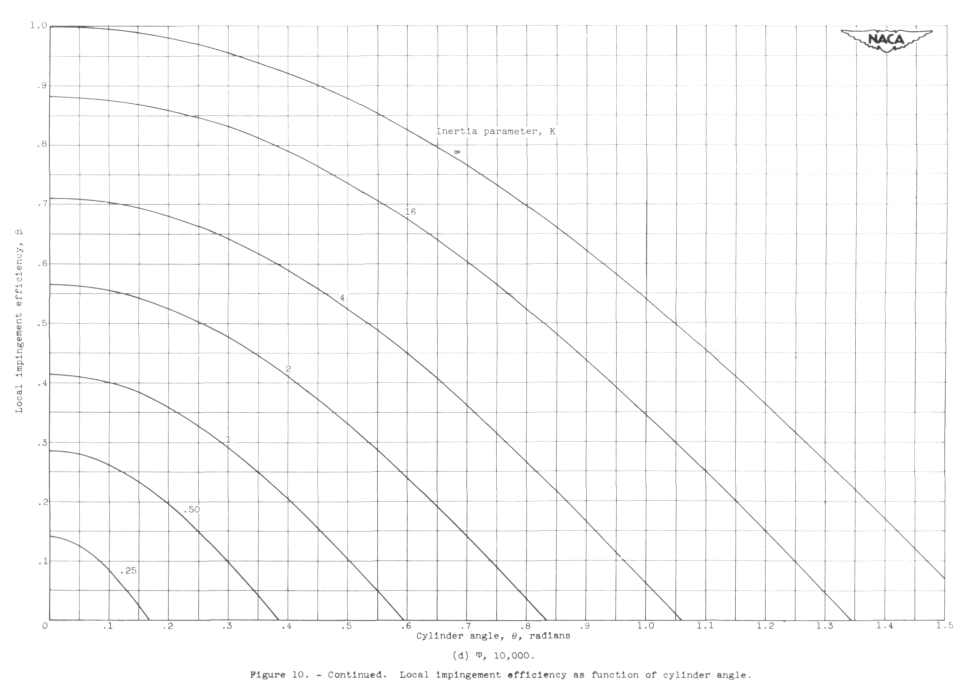
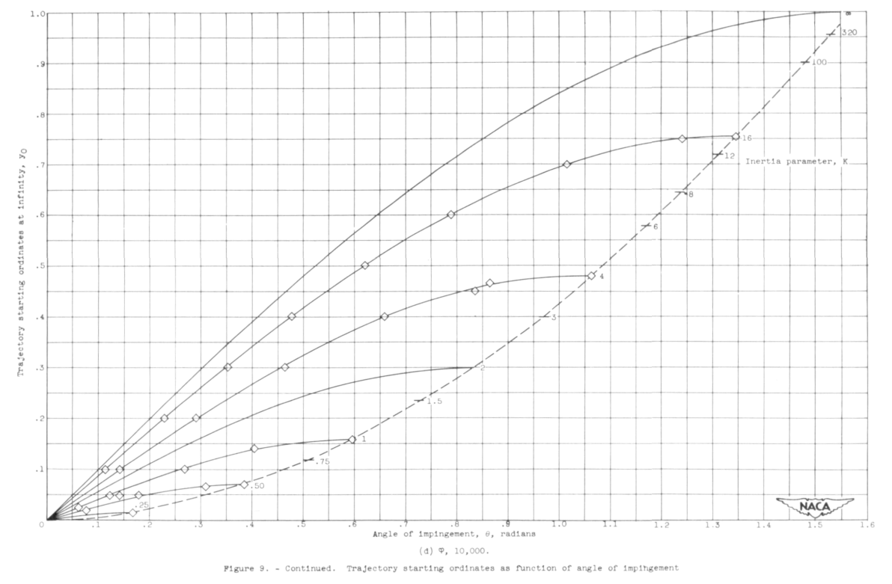

Title: NACA-TN-2904 
Date: 2022-03-20 12:00  
Category: NACA
tags: cylinders

### _"Many data points were carefully calculated in order to determine precisely the rate of droplet impingement on the surface of a right circular cylinder."_  

  

# "Impingement of Water Droplets on a Cylinder in an Incompressible Flow Field and Evaluation of Rotating Multicylinder Method for Measurement of Droplet-Size Distribution, Volume-Median Droplet Size, and Liquid-Water Content in Clouds" [^1]

## Summary

Detailed water drop impingement analysis (independent of prior analysis) is presented.

## Key points  

1.  Detailed water drop impingement analysis (independent of prior analysis) is presented
2.  Error estimates are detailed.
3.  Detailed Beta curves are provided.
4.  A difference from Langmuir and Blodgett for drop size distributions calculations is noted.

## Abstract  

> Evaluation of the rotating multicylinder method for the measurement
of droplet-size distribution, volume-median droplet size, and liquid-water 
content in clouds shoved that small uncertainties in the basic
data eliminate the distinction between different cloud droplet-size
distributions and are a source of large errors in the determination of
the droplet size. Calculations of the trajectories of cloud droplets
in an incompressible-air flow field around a cylinder were performed on
a mechanical analog constructed for the study of the trajectories of
droplets around aerodynamic bodies. Many data points were carefully
calculated in order to determine precisely the rate of droplet impingement 
on the surface of a right circular cylinder.

> Matching curves for obtaining droplet-size distribution, volume-median 
droplet size, and liquid water content from flight data were
computed from the results of the droplet trajectory calculations. An
evaluation is presented of the rotating multicylinder method for the
measurement of droplet-size distribution, volume median droplet size,
and liquid-water content in clouds. Because of the insensitivity of
the multicylinder method to changes in conditions in clouds, and the
inaccuracies in obtaining flight data, errors as large as 70 percent
in the determination of the volume-median droplet size are possible if
the flight speed is 200 miles per hour and the actual volume-median
droplet diameter in the cloud is 30 microns.

## Discussion

The online pdf available for this publication is one of the best reproductions in the NACA series, 
with clear graphics. 
The 22 by 17 inch version of cylinder water catch efficiency vs K in Figure 6 is beautiful, 
and this online format cannot do full justice to it 
(go download the pdf and view it on a large screen). 
And if you can ever view the original print it is even better.

### Detailed water drop impingement analysis

A differential analyzer was used to calculate the water drop trajectories. 
Appendix A of NACA-TN-2904 provides much detail. 

> ... the principles of operation of the
mechanical analogy are reviewed herein, and a machine setup together
with all the pertinent computations involved for a representative trajectory are presented.  

In Figure 15 below, two investigators turn the input cranks to produce output rotation on the pen plotter in the middle. 
_(Unfortunately, their names were not recorded in NACA-TN-2904.)_

  

Several mechanical analog integrators are connected to perform the calculations. 

An individual integrator component is depicted in Figure 16 below. 
The position of the balls could be varied to provide the integrated value of disc rotations to the output shaft above.  

> The method used in reference 3 for calculating the water-droplet
trajectories has been used for calculating the data presented herein. 
Many more data points were carefully calculated for the results presented 
herein than were calculated for the data in reference 3, in order
to determine more precisely the rate of impingement of droplets on the
surface of the cylinder. 

"Reference 3" is Langmuir and Blodgett [^2]. 
It is not readily evident that NACA-TN-2904 calculated many more data points than [^2]. 
While the data tables are comparable, 
Table XI of [^2] actually has more data points in it than NACA-TN-2904 Table IV.  

> Accuracy was emphasized in all the calculations, 
because the sensitivity of the rotating multicylinder method in
its application does not permit wide tolerances in the theoretical data.  

Accuracy was emphasised, and the final results are slightly different than those in [^2]. 
But it is not clear from the data presented in NACA-TN-2904 that it is more accurate than [^2]. 
 
### Error estimates

The values in Figure 14b agree with this statement from the "Summary", 
which shows a "possible error" of 70% for the case given:
> Because of the insensitivity of
the multicylinder method to changes in conditions in clouds, and the
inaccuracies in obtaining flight data, errors as large as 70 percent
in the determination of the volume-median droplet size are possible if
the flight speed is 200 miles per hour and the actual volume-median
droplet diameter in the cloud is 30 microns.  

However, Figure 14b is for an assumed cylinder mass measurement error of +/-10%, 
which seems large compared to other error estimates. 
Also, the errors have to be in a worst-case stack-up to achieve the 70% difference value. 
Thus, I would not consider this value to be "typical".

### Beta curves

This includes detailed Beta (local impingement efficiency) curves, 
which may be used to develop a Beta curve for a specific condition. 
These will be used extensively in NACA-TN-3338 [^3]. 

These are based on detailed analysis shown in figure 9:

The text says in one place:
> An analysis of the data points shown in figure 9 reveals that all
the points fell on sine curves, with amplitude and period depending on
the values of К and ф studied. The reason for this behavior is not
apparent from a study of the equations of motion (equations (l) and (2)),
which are very nonlinear and do not permit a formal solution.

For Figure 10:

> Curves of Beta as a function of Phi in addition to those curves
given in figure 10 can be found from the relation

> 

> where theta is measured in radians. This relation applies on the assumption 
that the curves in figure 9 are sine curves for which the amplitude
is characterized by y_o_m = Em and the period bу Theta_m.

The assumption that the Beta curves are cosine curves appears to be an approximation.
Langmuir and Blodgett [^2] did not provide Beta curves, but did provide maximum Beta (Beta_o) values. 
The Beta_o values do not agree well between sources:  

| Phi   | K    | Beta_o  | Beta_o                |
|-------|------|---------|-----------------------|
| -     | -    | NACA    | Langmuir and Blodgett |
| 10000 | 0.25 | _0.057_ | 0.111                 |
| 10000 | 1    | 0.415   | 0.343                 |
| 10000 | 3.24 | _0.68_  | 0.580                 |
| 10000 | 16   | 0.880   | 0.832                 |

### A difference from Langmuir and Blodgett for drop size distributions calculations

As noted in NACA-TN-2904, for drop size distributions Langmuir and Blodgett [^2] used an approximation, 
using the k\*phi value for the MVD for every drop size bin when calculating the weighted Em value. 
This means essentially that for part of the calculation (the k\*phi value) the MVD drop size was used for every bin, 
and for the other part (the k value) the drop size was unique for each bin.
A more technically correct implementation is to have a unique k\*phi value for each bin
(both the k and the k\*phi parts). 
I could not find in Langmuir and Blodgett where they were explicit about this detail of their method, 
and it was an astute observations made in NACA-TN-2904 to notice this. 

Both the original Langmuir and Blodgett multicylinder calculations, 
and a version with unique k\*phi for each bin were implemented in 
["Implementation of cylinder impingement correlations in Python"]({filename}Implementation of cylinder impingement correlations in Python.md).
A comparison to Table XI values of [^2] verifies that the "k\*phi value for the MVD" method was used.

We will see a comparison of results of the different methods for a multicylnder case in the upcoming review of NACA-RM-E53D23.

### Conclusions

It is not clear from the data presented in NACA-TN-2904 that its method is more accurate than Langmuir and Blodgett [^2].
I do not know of contemporaneous data that could resolve which method is more accurate.
And even with data from the post-NACA era it is difficult to determine that one method is 
substantially more accurate than the other. 
This will be a subject covered in the upcoming [Conclusions of the Cylinder Thread]({filename}Conclusions%20of%20the%20Cylinder%20Thread.md). 

## Citations

NACA-TN-2904 cites 15 publications:  

- Glauert, Muriel: A Method of Constructing the Paths of Raindrops of Different Diameters Moving in the Neighbourhood of (1) a Circular Cylinder, (2) an Aerofoil, Placed in a Uniform Stream of Air; and a Determination of the Rate of Deposit of the Drops on the Surface and the Percentage of Drops Caught. R. & M. No. 2025, British A.R.C., 1940.  
- Ranz, W. E.: The Impaction of Aerosol Particles on Cylindrical and Spherical Collectors. Tech. Rep. No. 3, Eng. Exp. Station, Univ. Ill., March 31, 1951. (Contract No. AT(30-3)-28, U.S. Atomic Energy Commission.)  
- Langmuir, Irving, and Blodgett, Katherine B.: A Mathematical Investigation of Water Droplet Trajectories. Tech. Rep. No. 5418, Air Materiel Command, AAF, Feb. 19, 1946. (Contract No. W-33-038-ac-9151 with General Electric Co.)  
- Brun, Rinaldo J., Serafini, John S., and Gallagher, Helen M.: Impingement of Cloud Droplets on Aerodynamic Bodies as Affected by Compressibility of Air Flow Around the Body. NACA-TN-2903, 1953.  
- Kantrowitz, Arthur: Aerodynamic Heating and the Deflection of Drops by an Obstacle in an Air Stream in Relation to Aircraft Icing. NACA-TN-779, 1940.  
- Bergrun, Norman R.: A Method for Numerically Calculating the Area and Distribution of Water Impingement on the Leading Edge of an Airfoil in a Cloud. NACA-TN-1397, 1947 [ntrs.nasa.gov](https://ntrs.nasa.gov/citations/19810068678).  
- Bergrun, Norman R.: An Empirical Method Permitting Rapid Determination of the Area, Rate, and Distribution of Water-Drop Impingement on an Airfoil of Arbitrary Section at Subsonic Speeds. NACA-TN-2476, 1951.  
- Brun, Rinaldo J., Serafini, John S., and Moshos, George J.: Impingement of Water Droplets on an NACA 651-212 Airfoil at an Angle of Attack of 4°. NACA-RM-E52B12, 1952.  
- Anon.: The Multicylinder Method. The Mount Washington Monthly Res. Bull., vol. II, no. 6, June 1946.  
- Wien, W., and Harms, F., eds.: Handbuch der Experimentalphysik. Teil 4, Bd. 4, Akademische Verdagsgesellschaft M.B.H. (Leipzig), 1932.  
- Glauert, H.: The Elements of Aerofoil and Airscrew Theory. The Macmillan Co. (New York), 1944.  
- Bush, V.: The Differential Analyzer. A New Machine for Solving Differential Equations. Jour. Franklin Inst., vol. 212, no. 4, Oct. 1931, pp. 447-488.  
- Kuehni, H. P., and Peterson, H. A.: A New Differential Analyzer. A.I.E.E. Trans., vol. 63, May 1944, pp. 221-227.  
- Crank, J.: The Differential Analyser. Longmans, Green & Co., 1947.  
- Jahnke, Eugen, and Emde, Fritz: Tables of Functions. Dover Pub., 4th ed., 1945.  

NACA-TN-2904 is cited 19 times in the NACA Icing Publications Database [^4]:

- Brun, Rinaldo J., Gallagher, Helen M., and Vogt, Dorothea E.: Impingement of Water Droplets on NACA 651-208 and 651-212 Airfoils at 4° Angle of Attack. NACA-TN-2952, 1953.
- Brun, Rinaldo J., Gallagher, Helen M., and Vogt, Dorothea E.: Impingement of Water Droplets on NACA 65A004 Airfoil and Effect of Change in Airfoil Thickness from 12 to 4 Percent at 4° Angle of Attack. NACA-TN-3047, 1953.
- Brun, Rinaldo J., Serafini, John S., and Gallagher, Helen M.: Impingement of Cloud Droplets on Aerodynamic Bodies as Affected by Compressibility of Air Flow Around the Body. NACA-TN-2903, 1953.
- Dorsch, Robert G., and Brun, Rinaldo J.: A Method for Determining Cloud-Droplet Impingement on Swept Wings. NACA-TN-2931, 1953.
- Hacker, Paul T., Brun, Rinaldo J., and Boyd, Bemrose: Impingement of Droplets in 90° Elbows with Potential Flow. NACA-TN-2999, 1953.
- Lewis, William, Perkins, Porter J., and Brun, Rinaldo J.: Procedure for Measuring Liquid-Water Content and Droplet Sizes in Super-cooled Clouds by Rotating Multicylinder Method. NACA-RM-E53D23, 1953.
- Brun, Rinaldo J., and Dorsch, Robert G.: Impingement of Water Droplets on an Ellipsoid with Fineness Ratio 10 in Axisymmetric Flow. NACA-TN-3147, 1954.
- Brun, Rinaldo J., Gallagher, Helen M., and Vogt, Dorothea E.: Impingement of Water Droplets on NACA 65A004 Airfoil at 8° Angle of Attack. NACA-TN-3155, 1954.
- Dorsch, Robert G., and Brun, Rinaldo J.: Variation of Local Liquid-Water Concentration about an Ellipsoid of Fineness Ratio 5 Moving in a Droplet Field. NACA-TN-3153, 1954.
- Dorsch, Robert G., Brun, Rinaldo J., and Gregg, John L.: Impingement of Water Droplets on an Ellipsoid with Fineness Ratio 5 in Axisymmetric Flow. NACA-TN-3099, 1954.
- Serafini, John S.: Impingement of Water Droplets on Wedges and Double- Wedge Airfoils at Supersonic Speeds. NACA-TR-1159, 1954. (Supersedes NACA-TN-2971.)
- Brun, Rinaldo J., and Dorsch, Robert G.: Variation of Local Liquid-Water Concentration about an Ellipsoid of Fineness Ratio 10 Moving in a Droplet Field. NACA-TN-3410, 1955.
- Brun, Rinaldo J., Lewis, William, Perkins, Porter J., and Serafini, John S.: Impingement of Cloud Droplets and Procedure for Measuring Liquid-Water Content and Droplet Sizes in Supercooled Clouds by Rotating Multicylinder Method. NACA-TR-1215, 1955. (Supersedes NACA TN’s 2903, 2904, and NACA-RM-E53D23)
- Brun, Rinaldo J., and Vogt, Dorothea E.: Impingement of Water Droplets on NACA 65A004 Airfoil at 0° Angle of Attack. NACA-TN-3586, 1955.
- Dorsch, Robert G., Saper, Paul G., and Kadow, Charles F.: Impingement of Water Droplets on a Sphere. NACA-TN-3587, 1955.
- von Glahn, Uwe H., Gelder, Thomas F., and Smyers, William H., Jr.: A Dye-Tracer Technique for Experimentally Obtaining Impingement Characteristics of Arbitrary Bodies and a Method for Determining Droplet Size Distribution. NACA-TN-3338, 1955.
- Gelder, Thomas F., Smyers, William H., Jr., and von Glahn, Uwe H.: Experimental Droplet Impingement on Several Two-Dimensional Airfoils with Thickness Ratios of 6 to 16 Percent. NACA-TN-3839, 1956.
- Lewis, William, and Brun, Rinaldo J.: Impingement of Water Droplets on a Rectangular Half Body in a Two-Dimensional Incompressible Flow Field. NACA-TN-3658, 1956.
- Brun, Rinaldo J., and Vogt, Dorothea E.: Impingement of Cloud Droplets on 36_5-Percent-Thick Joukowski Airfoil at Zero Angle of Attack and Discussion of Use as Cloud Measuring Instrument in Dye-Tracer Technique. NACA-TN-4035, 1957.

An online search [^5] found 54 citations of NACA-TN-2904.

### Related 

NACA-TR-1215 [^5] "supersedes" NACA-TN-2904. See the review [NACA-TR-1215]({filename}NACA-TR-1215.md).  

## Notes  

[^1]: 
Brun, Rinaldo J., and Mergler, Harry W.: Impingement of Water Droplets on a Cylinder in an Incompressible Flow Field and Evaluation of Rotating Multicylinder Method for Measurement of Droplet-Size Distribution, Volume-Median Droplet Size, and Liquid-Water Content in Clouds. NACA-TN-2904, 1953 [ntrs.nasa.gov](https://ntrs.nasa.gov/citations/19930083606).  
[^2]:
Langmuir, Irving, and Blodgett, Katherine B.: A Mathematical Investigation of Water Droplet Trajectories. General Electric Co. Rep., 1943. (Also available as Army Air Forces Tech. Rep. No. 5418 and as Dept. of Commerce Pub. PB No. 27565.)  
[^3]: 
“Ice, Frost, and Rain Protection”, SAE Aerospace Applied Thermodynamics Manual, 1969  (regularly updated, currently document [sae.org](https://www.sae.org/standards/content/air1168/4/))von Glahn, Uwe H., Gelder, Thomas F., and Smyers, William H., Jr.: A Dye-Tracer Technique for Experimentally Obtaining Impingement Characteristics of Arbitrary Bodies and a Method for Determining Droplet Size Distribution. NACA-TN-3338, 1955. [ntrs.nasa.gov](https://ntrs.nasa.gov/citations/19810068693)
[^4]: 
[NACA Icing Publications Database]({filename}naca%20icing%20publications%20database.md)  
[^5]:
[scholar.google.com](https://scholar.google.com/scholar?hl=en&as_sdt=0%2C48&q=NACA-TN-2904&btnG=)  
[^6]:
Brun, Rinaldo J., Lewis, William, Perkins, Porter J., and Serafini, John S.: Impingement of Cloud Droplets and Procedure for Measuring Liquid-Water Content and Droplet Sizes in Supercooled Clouds by Rotating Multicylinder Method. NACA-TR-1215, 1955. (Supersedes NACA TN’s 2903, 2904, and NACA-RM-E53D23)  

