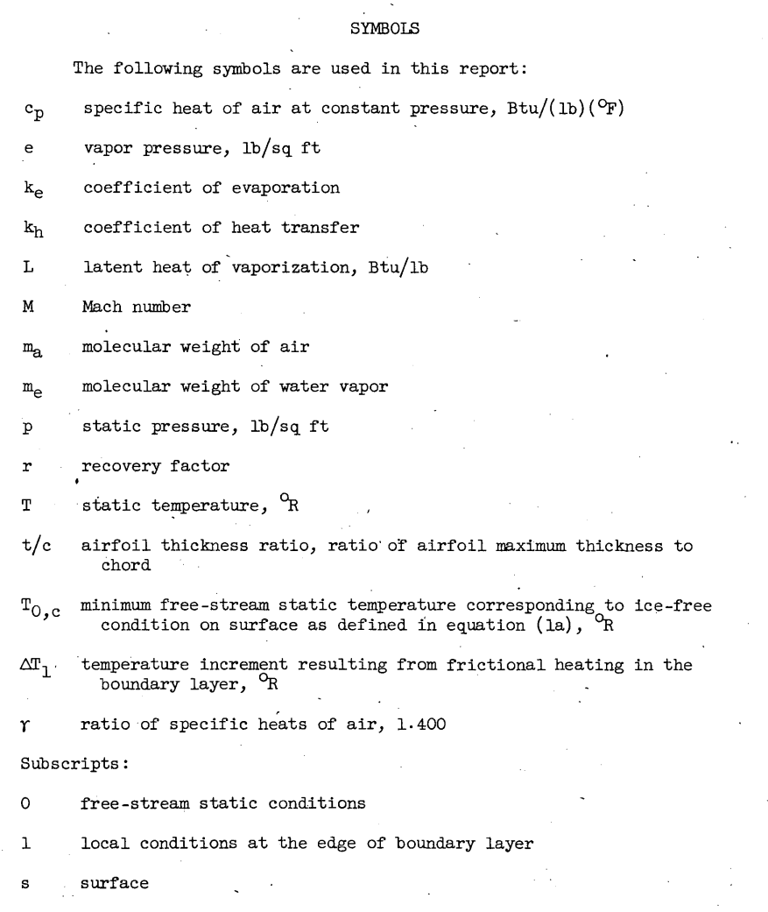
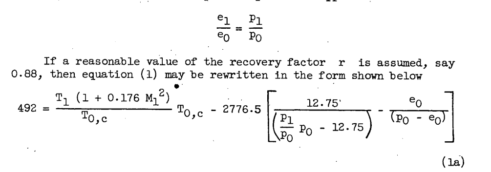
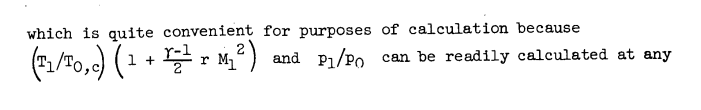
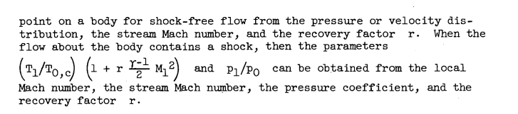
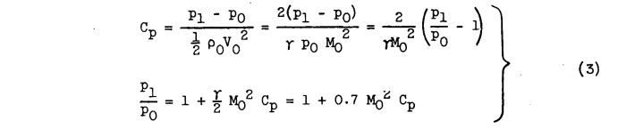
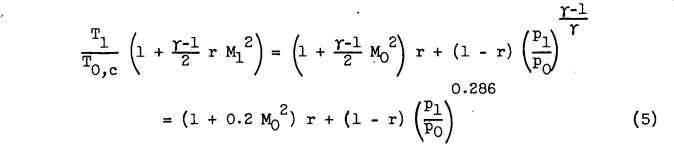
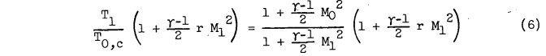
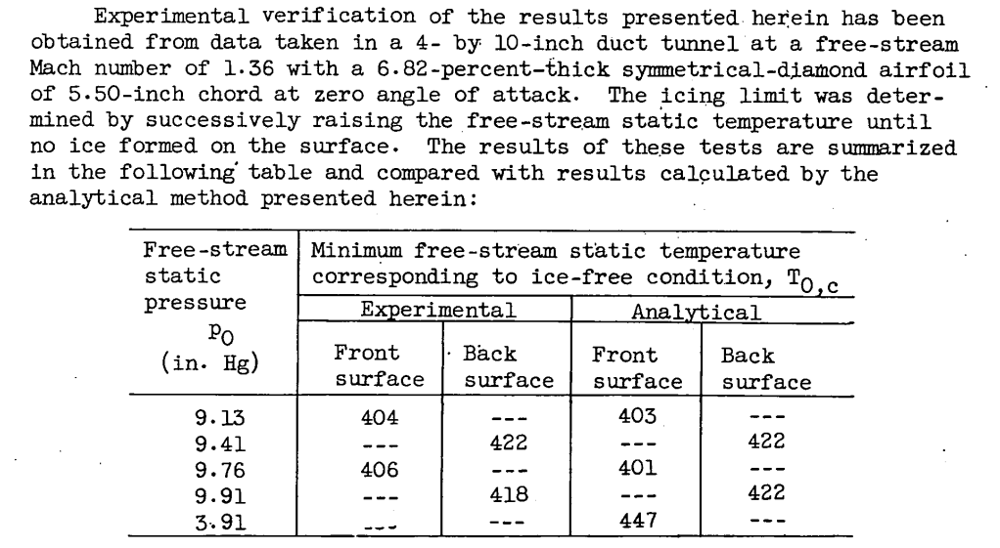
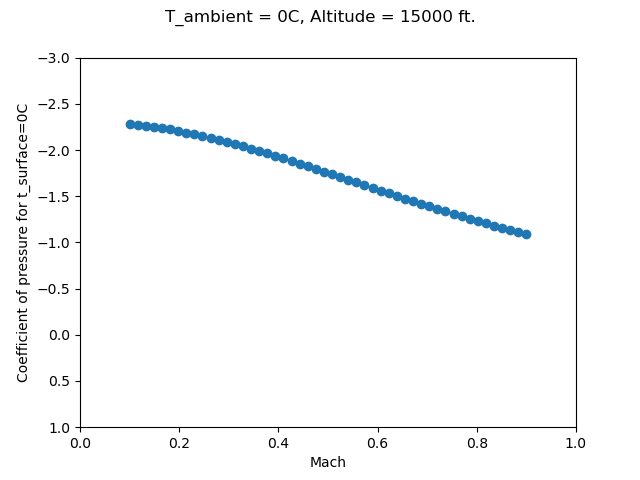

Title: NACA-TN-2914  
Date: 2022-04-26 12:00  
Category: NACA    
tags: thermodynamics, python  

### _"The effects of frictional heating were analyzed to determine the conditions under which ice formations can be prevented"_  

# NACA-TN-2861 "Analytical Investigation of Icing Limit for Diamond Shaped Airfoil in Transonic and Supersonic Flow" [^1]
and 
# NACA-TN-2914 "A Method for Rapid Determination of the Icing Limit of a Body in Terms of the Stream Conditions" [^2]

## Summary
The warmest ambient temperature at which ice can accumulate is calculated.

## Key points

1. The warmest ambient temperature at which ice can accumulate is calculated.  
2. Compressibility effects were included. 
3. Analysis showed good results compared to test data at transonic Mach numbers. 

## Abstract

NACA-TN-2861: 
> Calculations have been made for the icing limit of a diamond airfoil 
at zero angle of attack in terms of the stream Mach number, stream
temperature, and pressure altitude. The icing limit is defined as a
wetted-surface temperature of 32F and is related to the stream conditions 
by the method of Hardy.  
The results show that the point most likely to ice on the airfoil
lies immediately behind the shoulder and is subject to possible icing
at Mach numbers as high as 1.4.

NACA-TN-2914: 
> The effects of existing frictional heating were analyzed to determine 
the conditions under which ice formations on aircraft surfaces can
be prevented. A method is presented for rapidly determining by means
of charts the combination of Mach number, altitude, and stream temperature 
which will maintain an ice-free surface in an icing cloud. The
method can be applied to both subsonic and supersonic flow. The charts
presented are for Mach numbers up to 1.8 and pressure altitudes from sea
level to 45,000 feet.
    
## Discussion

This is review includes NACA-TN-2861 and NACA-TN-2914. 
They have the same authors, and contain much of the same theoretic material. 
NACA-TN-2861 includes experimental data for comparison. 
NACA-TN-2914 includes more analysis cases. 

Equations from Hardy ([NACA-ARR-5G13]({filename}NACA-ARR-5G13.md)) [^3] are 
used. 
  
  

> Because interest in this problem is fixed on a definition of flight
circumstances that provide local surface temperatures of 32°F, the
terms Ts, L, and es are constants. Hardy observed (reference 1) that
for the range of temperatures near 32°F the ratio of the evaporation
coefficient ke to the heat-transfer coefficient kh was very nearly 1. 
A solution of equation (1) can be obtained for any one of the four
variables (el, pl, Ml, and Tl) provided the other three are known.
From purely physical reasoning, however, an additional restriction exists.
This restriction results from the fact that the air in a cloud is fully
saturated at the static or free-stream conditions. For each value of
stream-static temperature, the free-stream vapor pressure is therefore
assumed a constant and equal to the saturated vapor pressure. If it is
assumed that the flow about the body, outside the boundary layer, is
accomplished with no change in phase, that is, no condensation or 
evaporation, then Dalton's law of partial pressures applies and

  

 

 

Equation (1a) in NACA-TN-2861 is the same as equation (2) in NACA-TN-2914. 

Note that the heat or mass transfer coefficients do not need to be evaluated,
just the ratio ke/kh, which was assumed to be 1. 
No assumption about laminar or turbulent flow is required, 
except in the selection of the recovery factor value. 

Note also that an impingement rate is not calculated. 
So, the water drop size and liquid water content values do not have to be known. 
It is assumed that there is enough water to wet the entire surface. 
The is no partial surface wettedness as was considered in [NACA-TN-2799](NACA-TN-2799.md) [^4]. 

The term tl/tcl... may be determined from a pressure coefficient, 
or a local Mach number:

  

  

  

NACA-TN-2861 describes a test that was run:

  

Unfortunately, the coefficient of pressure or pl/po ratios were not included,
so a comparison for this case was not run. 

In NACA-TN-2914 more complete examples were provided. 

An implementation of the calculations in the python file "naca_tn_2914.py" [^5] was used to compared results. 

> Example I. - Calculation is made of the free-stream static temperature 
required for an ice-free surface as a function of Mach number for
an NACA 65-206 airfoil at 15,000 feet pressure altitude and 1° angle of
attack.
The velocity ratio can be found for this airfoil by the
methods and results presented in reference 5. The maximum velocity ratio
(minimum pressure ratio) for this airfoil was determined to be
Vl/Vo = 1.139 and occurs at the 45-percent chord station on the upper
surface. Assuming a value of the recovery factor of 0.85 and that the
surface is wet at this point determines toc, in the following way:

| Mach | Reported pl/po | Python Calculated pl/po | Reported Toc, R | Python Calculated Toc, R |
|------|----------------|-------------------------|-----------------|--------------------------|
| 0.4  | 0.97           | 0.967                   | 486.6           | 486.2                    |
| 0.5  | 0.95           | 0.949                   | 483.8           | 483.0                    |
| 0.6  | 0.929          | 0.927                   | 480             | 478.9                    |
| 0.7  | 0.902          | 0.902                   | 475.6           | 473.7                    |

Even though the ratio pl/po calculated agrees well, the temperature values differ by up to 2.1R. 

>Example 2. - This example is presented to show typical calculations
and results in the transonic speed range. Determination is made of the
relation between stream Mach number and stream static temperature which
will provide an ice-free surface at the midchord of an 8.8 percent thick
circular arc airfoil at zero angle of attack for altitudes of 10,000,
25,000, and 40,000 feet. The recovery factor r is 0.90.  
The values of pressure coefficient Cp and local Mach number Ml
can be obtained from reference 10 for stream Mach numbers of 0.848 to
1.500 and are listed as follows:

| Mach  | Coefficient of pressure | 10000 ft. Toc, R | Python Calculated Toc, R | 25000 ft. Toc, R | Python Calculated Toc, R | 40000 ft. Toc, R | Python Calculated Toc, R |
|-------|-------------------------|------------------|--------------------------|------------------|--------------------------|------------------|--------------------------|
| 0.848 | -0.355                  | 460              | 459.0                    | 472.5            | 470.8                    | 484              | 482.8                    |
| 0.935 | -0.33                   | 452              | 450.7                    | 466.5            | 465.0                    | 481.5            | 480.3                    |
| 1.11  | -0.045                  | 423.5            | 423.1                    | 440              | 438.9                    | 464              | 462.3                    |

## Conclusions

NACA-TN-2861: 
> SUMMARY OF RESULTS
The results of the analysis of icing limit presented for the
diamond airfoil at zero angle of attack in the transonic-supersonic
speed range are as follows:

>1. The critical point for the whole airfoil in terms of the icing
limit was located immediately behind the shoulder. The critical point
on the front surface was located immediately ahead of the shoulder.
The results indicate that icing may occur at the critical point behind
the shoulder for Mach numbers as high as 1.4. 

>2. At a constant free-stream Mach number and airfoil thickness, the
minimum free-stream static temperature corresponding to an ice-free
condition increases with increasing altitude. 

>3. For the point immediately ahead of the shoulder the minimum
free-stream temperature corresponding to an ice-free condition remains
the same or decreases with increasing thickness ratio at a constant
value of Mach number and altitude. For the point immediately down-stream 
of the shoulder the free-stream temperature corresponding to
an ice-free condition increases with increasing thickness at a constant
Mach number and altitude.

NACA-TN-2914 did not have a "conclusions" section.

### Can ice form at T_ambient = 0C?

An interesting question is can ice form when the ambient static temperature is the melting point of ice, 0C? 
The calculations from NACA-TN-2914 predict yes, over a range of conditions:

  

The examples in NACA-TN-2914 did not have coefficient of pressure values in this range, 
but they are not unrealistic for other airfoils at some flight conditions. 
It is not clear that the location of the coefficient of pressure values would be in the impingement zone, 
and that the assumption of a fully wet surface would apply. 

## Citations

NACA-TN-2861 cites 11 publications: 

- Hardy, J. K.: Kinetic Temperature of Wet Surfaces A Method of Calculating the Amount of Alcohol Required to Prevent Ice, and the Derivation of the Psychrometric Equation. NACA-ARR-5G13, 1945  
- Messinger, B. L.: Equilibrium Temperature of an Unheated Icing Surface as a Function of Airspeed. Preprint No. 342, Presented at I.A.S. Meeting, June 27-28, 1951.  
- Gelder, Thomas F., Lewis, James P., and Koutz, Stanley L.: Icing Protection for a Turbojet Transport Airplane: Heating Requirements, Methods of Protection, and Performance Penalties. NACA-TN-2866, 1953.  
- Schaefer, Vincent J.: The Production of Clouds Containing Supercooled Water Droplets or Ice Crystals Under Laboratory Conditions. Bull. Am. Meteorological Soc., vol. 29, no. 4, April 1948, pp. 175-182.  
- Dorsch, Robert G., and Hacker, Paul T.: Photomicrographic Investigation of Spontaneous Freezing Temperatures of Supercooled Water Droplets. NACA-TN-2142, 1950.  
- Cole, Julian D.: Drag of a Finite Wedge at High Subsonic Speeds. Jour. Math. Phys., vol. 30, no. 2, July 1951, pp. 79-93.  
- Bryson, Arthur Earl, Jr.: An Experimental Investigation of Transonic Flow Past Two-Dimensional Wedge and Circular-Arc Sections Using a Mach-Zehnder Interferometer. NACA-TN-2560, 1951.  
- Vincenti, Walter G., and Wagoner, Cleo B.: Transonic Flow Past a Wedge Profile with Detached Bow Wave - General Analytical Method and Final Calculated Resuts. NACA-TN-2339, 1951.  
- Vincenti, Walter G., and Wagoner, Cleo B.: Transonic Flow Past a Wedge Profile with Detached Bow Wave - Details of Analysis. NACA-TN-2588, 1951.  
- Moeckel, W. E., and Connors, J. F.: Charts for the Determination of Supersonic Flow Against Inclined Planes and Axially Air Symmetric Cones. NACA-TN-1373, 1947.  
- Diehl, Walter Stuart: Standard Atmosphere - Tables and Data. NACA-TR-218, 1925.  

NACA-TN-2914 cites 10 publications:

- Callaghan, Edmund E., and Serafini, John S.: Analytical Investigation of Icing Limit for Diamond Shaped Airfoil in Transonic and Supersonic Flow. NACA-TN-2861, 1953.  
- Hardy, J. K.: Kinetic Temperature of Wet Surfaces A Method of Calculating the Amount of Alcohol Required to Prevent Ice, and the Derivation of the Psychrometric Equation. NACA-ARR-5G13, 1945  
- Schaefer, Vincent J.: The Production of Clouds Containing Supercooled Water Droplets or Ice Crystals Under Laboratory Conditions. Bull. Am. Meteorological Soc., vol. 29, no. 4, April 1948, pp. 175-182.  
- Dorsch, Robert G., and Hacker, Paul T.: Photomicrographic Investigation of Spontaneous Freezing Temperatures of Supercooled Water Droplets. NACA-TN-2142, 1950.  
- Abbott, Ira H., von Doenhoff, Albert E., and Stivers, Louis S., Jr.: Summary of Airfoil Data. NACA-TR-824, Mar. 1945.  
- Theodorsen, Theodore, and Garrick, I. E.: General Potential Theory of Arbitrary Wing Sections. NACA-TR-452, 1933.  
- Allen, H. J.: A Simplified Method for the Calculation of Airfoil Pressure Distribution. NACA-TN-708, 1939.  
- Jones, Robert T., and Cohen, Doris: A Graphical Method of Determining Pressure Distribution in Two-Dimensional Flow. NACA-TR-722, 1941.  
- Kaplan, Carl: Potential Flow about Elongated Bodies of Revolution. NACA-TR-516, 1935.  
- Bryson, Arthur Earl, Jr.: An Experimental Investigation of Transonic Flow Past Two-Dimensional Wedge and Circular-Arc Sections Using a Mach-Zehnder Interferometer. NACA-TN-2560, 1951.  

NACA-TN-2861 is cited by 5 publications in the NACA Icing Publications Database [^6]: 

- Callaghan, Edmund E.: Analogy Between Mass and Heat Transfer with Turbulent Flow. NACA-TN-3045, 1953.  
- Callaghan, Edmund E., and Serafini, John S.: A Method for Rapid Determination of the Icing Limit of a Body in Terms of the Stream Conditions. NACA-TN-2914, 1953.  
- Serafini, John S.: Impingement of Water Droplets on Wedges and Double- Wedge Airfoils at Supersonic Speeds. NACA-TR-1159, 1954. (Supersedes NACA-TN-2971.)  
- Brun, Rinaldo J., Lewis, William, Perkins, Porter J., and Serafini, John S.: Impingement of Cloud Droplets and Procedure for Measuring Liquid-Water Content and Droplet Sizes in Supercooled Clouds by Rotating Multicylinder Method. NACA-TR-1215, 1955. (Supersedes NACA TN’s 2903, 2904, and NACA-RM-E53D23)  
- Coles, Willard D.: Icing Limit and Wet-Surface Temperature Variation for Two Airfoil Shapes under Simulate High-Speed Flight Conditions. NACA-TN-3396, 1955.  

NACA-TN-2914 is cited by once publications in the NACA Icing Publications Database [^6]: 

- Coles, Willard D.: Icing Limit and Wet-Surface Temperature Variation for Two Airfoil Shapes under Simulate High-Speed Flight Conditions. NACA-TN-3396, 1955.  

NACA-TN-2861 is cited by 10 publications in the literature [^7]. 

NACA-TN-2914 is cited by 8 publications in the literature [^8]. 

## Notes: 

[^1]: 
Callaghan, Edmund E., and Serafini, John S.: Analytical Investigation of Icing Limit for Diamond Shaped Airfoil in Transonic and Supersonic Flow. NACA-TN-2861, 1953.  
[^2]: 
Callaghan, Edmund E., and Serafini, John S.: A Method for Rapid Determination of the Icing Limit of a Body in Terms of the Stream Conditions. NACA-TN-2914, 1953.  
[^3]: 
Hardy, J. K.: Kinetic Temperature of Wet Surfaces A Method of Calculating the Amount of Alcohol Required to Prevent Ice, and the Derivation of the Psychrometric Equation. NACA-ARR-5G13, 1945  
[^4]: 
Gray, Vernon H.: Simple Graphical Solution of Heat Transfer and Evaporation from Surface Heated to Prevent Icing. NACA-TN-2799, 1952.  
[^5]: 
[https://github.com/icinganalysis/icinganalysis.github.io](https://github.com/icinganalysis/icinganalysis.github.io)  
[^6]: 
[NACA Icing Publications Database]({filename}naca icing publications database.md)   
[^7]: 
https://scholar.google.com/scholar?hl=en&as_sdt=0%2C48&q=Analytical+Investigation+of+Icing+Limit+for+Diamond+Shaped+Airfoil+in+Transonic+and+Supersonic+Flow&btnG=  
[^8]: 
https://scholar.google.com/scholar?hl=en&as_sdt=0%2C48&q=A+Method+for+Rapid+Determination+of+the+Icing+Limit+of+a+Body+in+Terms+of+the+Stream+Conditions&btnG=  
