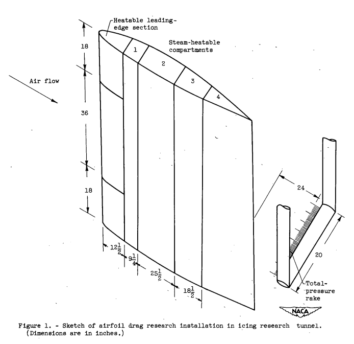
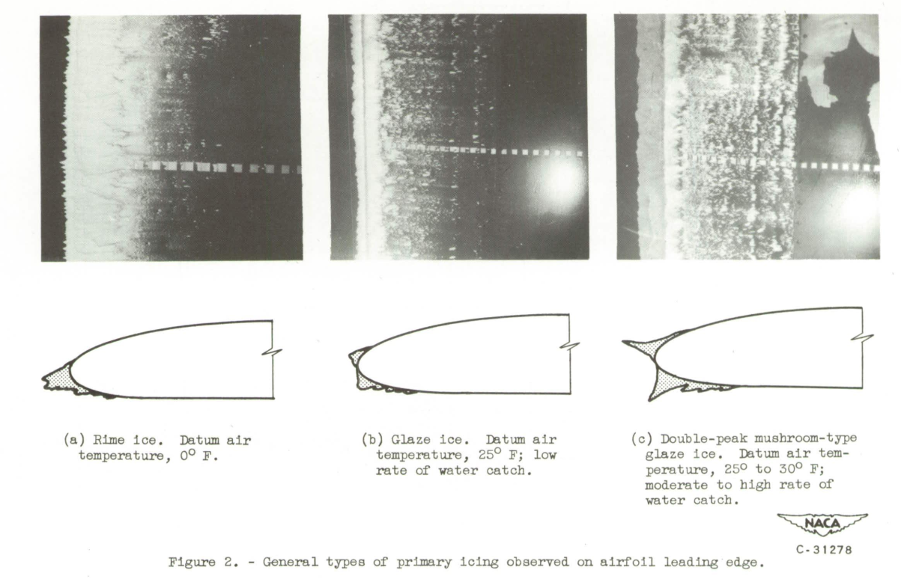
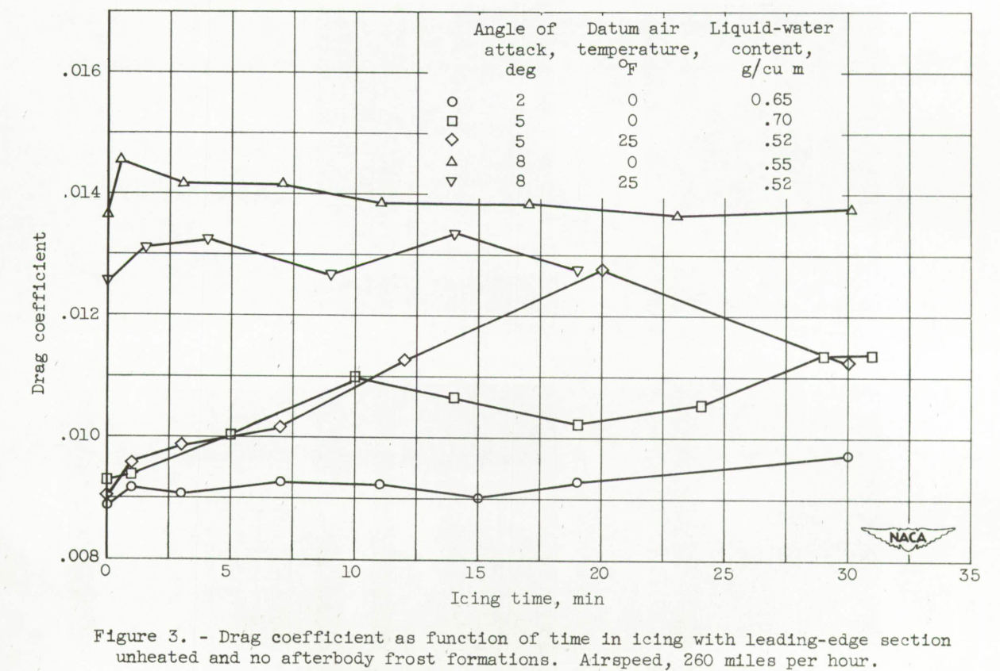

title: NACA-TN-2962     
Category: NACA  
status: draft  


###_"The results showed that glaze-ice formations, either primary or runback, ... caused large and rapid increases in drag, especially at datum air temperatures approaching 32F"_  

#NACA-TN-2962, "Effect of Ice and Frost Formations on Drag of NACA 65<sub>1</sub>-212 Airfoil for Various Modes of Thermal Ice Protection" [^1]  


##Abstract 
>The effects of primary and. runback icing and frost formations on the
drag of an 8-foot-chord NACA 651-212 airfoil section were investigated
over a range of angles of attack from 20 to 80 and airspeeds up to
260 miles per hour for icing conditions with liquid-water contents ranging 
from 0.25 to 1.4 grams per cubic meter and datum air temperatures of
-30 to 30 F.

>The results showed that glaze-ice formations, either primary or runback, 
on the upper surface near the leading edge of the airfoi1 caused
large and rapid increases in drag, especially at datum air temperatures
approaching 32° F and in the presence of high rates of water catch. Ice
formations at lower temperatures (rime ice) did not appreciably increase
the drag coefficient over the initial (standard roughness) drag coefficient. 
Cyclic de-icing of the primary Ice formations on the airfoil
leading-edge section permitted the drag coefficient to return almost to
the bare airfoil drag value. Runback icing on the lower surface did not
present a serious drag problem except when heavy spanwise ridges of runback 
ice occurred aft of the heatable area. Frost formations caused
rapid and large increases in drag with incipient stalling of the airfoil.


##Discussion  

This is a relatively long (69 page) page publication, 
so in the interest of brevity I will not detail all of its points,
particularly about deicing system design. 
Readers are encouraged to read the full publication, 
available at [ntrs.nasa.gov](https://ntrs.nasa.gov/citations/19810068586).  


>The results presented herein were obtained with an 8-foot-chord NACA
651-212 airfoil model employing a hot-gas icing-protection system
(ref. 2). The airfoil study was conducted over tIe following range of
icing and operating conditions:
```text
Angle of attack, deg ....................      2 to 8
Airspeed, mph ...........................  100 to 260
Liquid-water content, g/cu m ............ 0.25 to 1.4
Datum air temperature, °F ...............   -30 to 30
Mean effective droplet size, microns ....    10 to 16
```


>APPARATUS AND INSTRUMENTATION


>The model used in this study (and that of ref. 2) is an NACA
651-212 airfoil section of 8-foot chord spanning the 6-foot height of
the Lewis icing research tunnel. The airfoil leading-edge section, consisting 
of three spanwise segments, may be gas-heated by means of chord-wise 
passages to 12 percent of chord. The center segment is 3 feet in
span, and the top and bottom segments are 1.5 feet each in span (fig. 1).
All segments were capable of being heated independently for cyclic ice
removal or collectively for continuous heating. For the cyclic de-icing
studies a continuously heated spanwise parting strip was used near the
zero chord line (ref. 2).  

  

>Aft of 12 percent of chOrd the model was divided into four compartments 
(fig. 1), each capable of being inividually heated by means of 
steam. The inside of each compartment was lined with 1/16-inch-thick
neoprene to reduce the surface temperature, which otherwise might have 
resulted in sufficient heat transfer to the airfoil wake to affect the
drag measurements. In order to prevent steam leakage into the wake,
these compartments (hereinafter designated afterbody) were operated under
a slight vacuum.

>Datum air temperature was defined and determined as the average surface 
temperature of the unheated airfoil leading-edge section. In icing
conditions, the datum temperature was determined from thermocouples that
were shielded from or not subject to the fusion of impinged water. For
the range of conditions investigated, little difference between datum
and total air temperature was found. The icing conditions were determined 
from a previous.calibration of the tunnel and periodically checked
with a pressure-type icing-rate meter (ref. 6). The mean effective
droplet size in these studies ranged from 10 to 16 microns as determined
from a dye-tracer technique.

The data temperature here was experimentally determined. 
It may be similar to, but not exactly the same as, 
the analytically determined datum temperature in [NACA-ARR-5G13]({filename}NACA-ARR-5G13.md). 
The dye-tracer technique for drop size is not elaborated on further. 
Perhaps it is the method later documented in [NACA-TN-3338, "A Dye-Tracer Technique for Experimentally Obtaining Impingement Characteristics of Arbitrary Bodies and a Method for Determining Droplet Size Distribution"]({filename}NACA-TN-3338.md).

Here we have an early statement of icing wind tunnel test to flight similarity 
considerations:

>Because the tunnel airspeed was limited to 260 miles per hour, rates
of icing and ice formations associated with higher speeds were obtained
by increasing the liquid-water contents considerably above generally
accepted values for natural icing clouds with the air temperatures used
in the studies. In the absence of exact knowledge on droplet-impingement
characteristics of the test airfoil, the data are discussed in general
terms of water catch, defined in this investigation as a function only
of liquid-water content and airspeed, rather than the more complex function 
requiring airfoil collection efficiency based on droplet size. By
this means, the size of the ice formations obtained at airspeeds used in
this investigation and at high liquid-water, contents may be assumed to
be approximately representative of ice formations at twice the airspeed
and half the liquid-water content.


>For studies of the effect of afterbody frost formations on the drag
of the airfoil, no heat was furnished to the afterbody. Frost formed on
the afterbody because of air-stream turbulence and the supersaturated
condition of the tunnel air. The studies with frost on the afterbody
only were made over the same range of conditions as the icing studies.
For studies in which the leading-edge section as well as the afterbody
was coated with a frost formation, the tunnel air was refrigerated to
-30° F, after which refrigeration was turned off and the ventilating
doors of the tunnel were opened to permit warm moist air to pass over
the cold model. Moisture condensing on the model from this warmer air
soon covered the model with a fine coat of frost. Drag measurements with
the pressure rake were made throughout the test. The frost studies with
a fully frosted airfoil were made at an angle of attack of 8° and at a
speed of about 100 miles per hour, simulating take-off conditions.

>RESULTS AND DISCUSSION

>The investigation of the airfoil drag studies reported herein is
divided into two primary categories. The first category is concerned
with the increase in drag caused by ice formations associated with various 
modes of supplying heat to the leading-edge section; and the second,
with an evaluation of the effect on airfoil drag of frost formations
with and without accompanying ice formations. Tunnel wall interference
effects were not evaluated.

>Three general types of leading-edge ice formations were investigated
(fig. 2). The first, a rime-ice formation (fig. 2(a)), was associated
with a datum air temperature of 00 F and was essentially independent of
liquid-water content.. These ice formations conformed closely to the airfoil 
contour and faired generally forward into the air stream. The
second type, a glaze-ice formation (fig. 2(b)), was obtained with a datum
air temperature of approximately 25F and relatively low rates of water
catch. These ice formations generally built outward at an angle to the
air stream, but the primary ice formation was still somewhat faired into
the airfoil contour and did not penetrate excessively into the flow field
near the stagnation region. The final type, a rough, angular, glaze-ice
formation (fig. 2(c)), was obtained at datum air temperatures of about
300 F at moderate rates of water catch and at air temperatures down to
25 F with high rates of water catch. This glaze ice, especially near
the stagnation region, formed a double-peaked mushroom shape. The growth
of the ice formation was approximately normal to the airfoil surface,
with the peaks jutting abruptly into the flow field and causing a flow
disturbance, especially at high angles of attack. These glaze-ice formations 
may be associated, with combinations of flight speed, liquid-water 
content, and ambient-air temperature; consequently, they can occur
at low altitude under conditions of low airspeed in icing clouds of high
ambient-air temperature, or at high altitudes under conditions of high
speed and low ambient-air temperature. In the latter case, the release
of the heat of fusion and the aerodynamic heating of the airfoil surfaces
combine to promote the formation of glaze ice.

  

>A brief study of the effect of a water film at above-freezing temperatures 
on airfoil drag characteristics was also conducted. The water-film 
effect on drag at low angles of attack was negligible. At high
angles of attack (8°) an increase of as much as 15 percent in the drag
coefficient was obtained with a high rate of water catch. This value
was, however, within the range of drag change caused by normal roughening 
of the airfoil surfaces by foreign particles in the tunnel air
stream.

There were differing relationships for drag with time in icing. 
For some cases, the drag was nearly constant with time. 
For others, the drag changed with time in icing.

  


>Significance of Results  

>In the interpretation of the significance of the data presented in
the preceding sections, consideration must be taken of the probability,
frequency, and duration of encountering icing conditions that would
cause serious increases in drag and losses in lift during flight. For
example, the data for a condition of high rate of water catch and high
datum air temperature indicate large drag increases at high angles of
attack; however, such an attitude is generally of short duration for
the aircraft and occurs primarily during the initial take-off or the
final let-down stages. On the other hand, a condition of high rate of
water catch and high datum air temperature at a low angle of attack. may
occur relatively frequently for jet-powered fighter or bomber aircraft;
consequently, this icing and operating condition may be of much greater
interest with respect to drag changes and aircraft performance.  

>With the possibility of frost formations on airfoil afterbodies in
flight assumed negligible, it would appear that low rates of water catch
generally obtained by a combination of small droplets, average liquid-water 
content, low subsonic airspeeds, and large airfoil chords and
thicknesses - do not seriously affect the airfoil drag characteristics.
For these same conditions of low water catch, cyclic de-icing of the
leading-edge section does not improve the drag characteristics of the
airfoil, principally because the airfoil drag is not seriously affected
by the primary leading-edge ice formations (fig. 15). The formation of
runback ice aft of the heated areas, caused by either a cyclic de-icing
system or a continuously heated system which does not evaporate all the
impinging water, therefore constitutes the major means of incurring a
drag penalty. These drag penalties are, however, of small magnitude
over the normal range of icing conditions generally encountered by jet
aircraft in flight, and the loss in lift associated with these drag
penalties is negligible (refs. 4 and 5). It appears, therefore, that
for large airfoil chords and for thicknesses of the same magnitude as
the airfoil studied, no icing protection is required for a condition of
low rate of water catch and streamlined ice formation.  

>It should be noted that these comments apply specifically to the
12-percent-thick airfoil section investigated. Use of smaller chord or
thinner airfoils will result in higher and more rapid drag-coefficient
increases and possibly a more serious deterioration in lift for comparable 
ice formations. The initial drag coefficient of the bare airfoil
was in the range generally associated with standard roughness, for
which some surface waviness, dustiness, and protective coating may be
present. It is believed that if a completely clean and aerodynamically
smooth airfoil were exposed to icing conditions, the drag coefficient
would quickly rise, especially in the low-drag range, by as much as
100 percent to approach the initial drag coefficients reported herein
for the bare airfoil. Thereafter ice formations of the streamlined
type would contribute no appreciable drag increase.  
>A mushroom-type glaze-ice formation resulting from icing encounters
with combinations of high liquid-water content, large droplet size, high
airspeed, and high datum air temperatures will cause large and rapid
increases in drag for which most aircraft may require protection. From
the data presented in figures 20 and 25 it is apparent that an airfoil
equipped with a cyclic de-icing system is most susceptible to drag penalties 
at high angles of attack and during approach operation. It is
therefore essential that high angles of attack be avoided if a heavy
deposit of mushroom-type glaze ice has been incurred on the leading edge.
Proper operation of the aircraft, by shedding of heavy leading-edge ice
formations before assuming an approach attitude, should minimize the
danger of stalling the airfoil.  

>Runback ice formations on the lower surface increase the drag some-what 
but do not appear to affect seriously the airfoil aerodynamic
characteristics. If the upper surface of an airfoil is subject to little
or no runback icing and the lower surface is permitted to accumulate runback 
icing, a substantial reduction in heating requirements over those
calculated in reference 1 can be achieved. Thus, the use of a continuous
heating system might be extended to protect high-altitude, high-speed,
turbojet-powered aircraft without the large performance penalties indicated 
in reference 1 for a system designed to evaporate all the impinging
water.  

>For certain types of aircraft that need only penetrate a stratus
cloud layer immediately after take-off arid are capable of rapid descent
through such a cloud layer, the magnitude of the ice formation accumulated 
during the flight through the layer may not seriously affect the
aircraft performance. Upon ascent, the ice formations may decrease by
sublimation at high altitude and high speed at rates up to 1 inch of
thickness per hour. Should the expected accumulation of ice formations
on an airfoil during descent prove incompatible with the aircraft performance 
specifications, an icing-protection system may be included that.
is designed to operate only for low-speed let-down conditions. Such an
icing-protection system could operate either cyclically or continuously
with a relatively low heating requirement.  
>The icing of an aircraft in flying through a cumulus cloud at high
altitude should not prove excessively detrimental to aircraft perform-
ance, because the aircraft will in all probability be at a low angle of
attack, a flight condition not conducive to large changes in airfoil
performance characteristics.  

>Although the possibility exists of forming frost on aircraft surfaces 
during flight, the probability of such an occurrence appears to be
quite remote. Frost formations during ground operation, however, are
quite common in cold climates and, with respect to the drag losses
associated. with such formations on airfoil surfaces, merit attention.
The use of a conventional thermal icing-protection system to remove
frost from the leading-edge region of an airfoil will not provide sufficient 
protection to ensure a safe take-off. It is, therefore, necessary
in all-weather operation to provide additional protection from frost for
the aircraft while on the ground, such as sheltering the wings and
empennage surfaces with heated. covers, tents, or hangars.


##Conclusions  

>SUMMARY OF RESULTS

>The results of an investigation of the effects of ice and frost
formations on the drag of an NACA 65<sub>1</sub>-212 airfoil 
section may be summarized as follows:
>1. At high angles of attack (8°), a prohibitive increase in drag
coefficient of approximately 70 percent was obtained within 2 minutes
when ice formed on the upper surface near the leading edge of the airfoil
under conditions of heavy glaze icing (high rate of water catch and high
datum air temperatures).
>2. Relatively small formations of glaze icing (low rates of water
catch and high datum air temperature) increased the drag coefficient of
the airfoil over the range of conditions studied by less than 27 percent
following a 30-minute icing period, except for simulated landing
approaches. Rime-ice formations associated with lower air temperatures
did not increase the airfoil drag coefficient appreciably above the
initial (standard roughness) level, even with high rates of water catch.
>3. A glaze-ice formation on the leading-edge section for a simulated
approach condition, during which the airfoil attitude is increased from
2° to 8° angle of attack, caused a severe increase in drag coefficient
of over 285 percent over the bare airfoil drag at 8° angle of attack and
was accompanied by a shift in the position of the momentum wake that
indicated incipient stalling of the airfoil.
>4. Runback icing on the lower surface obtained with the use of a
continuous heating system that does not evaporate all the impinging
water caused moderate drag increases only when a spanwise ridge of ice
was formed aft of the heatable area.
>5. Removal of the primary ice formations by cyclic de-icing caused
the drag to return almost to the bare airfoil drag coefficient, except
for the drag caused by runback ice formations. In general, runback
icing with a cyclic de-icing system increased the drag less than did
runback icing incurred in similar conditions with a continuous heating
system that only evaporated approximately 28 to 44 percent of the
impinging water.
>6. Frost formations on the airfoil surfaces caused a large and
rapid increase in the drag coefficient and at high angles of attack (8°)
were accompanied by incipient stalling of the airfoil.


##Citations

NACA-TN-2962 cites 7 publications:

- Gelder, Thomas F., Lewis, James P., and Koutz, Stanley L.: Icing Protection for a Turbojet Transport Airplane: Heating Requirements, Methods of Protection, and Performance Penalties. NACA-TN-2866, 1953.  
- Lewis, James P., and Bowden, Dean T.: Preliminary Investigation of Cyclic De-Icing of an Airfoil Using an External Electric Heater. NACA-RM-E51J30, 1952.  
- Gray, Vernon H., Bowden, Dean T., and von Glahn, Uwe H.: Preliminary Results of Cyclical De-icing of a Gas-Heated Airfoil. NACA-RM-E51J29, 1952  
- Jacobs, Eastman N.: Airfoil Section Characteristics as Affected by Protuberances. NACA-TR-446, 1932.  
- Gulick, Beverly G.: Effects of a Simulated Ice Formation on the Aerodynamic Characteristics of an Airfoil. NACA-WR-L-292, May 1938.  
- Perkins, Porter J., McCullough, Stuart, and Lewis, Ralph D.: A Simplified Instrument for Recording and Indicating Frequency and Intensity of Icing Conditions Encountered in Flight. NACA-RM-E51E16, 1951.  
- Gray, Vernon H., and Bowden, Dean T.: Comparison of Several Methods of Cyclic De-Icing of a Gas-Heated Airfoil. NACA-RM-E53C27, 1953.  


NACA-TN-2962 is cited 8 time in the [NACA Icing Publications Database]({filename}naca icing publications database.md)[^2]  

- Gray, Vernon H., and Bowden, Dean T.: Comparison of Several Methods of Cyclic De-Icing of a Gas-Heated Airfoil. NACA-RM-E53C27, 1953.
- von Glahn, Uwe H., and Gray, Vernon H.: Effect of Ice Formations on Section Drag of Swept NACA 63A-009 Airfoil with Partial-Span Leading-Edge Slat for Various Modes of Thermal Ice Protection. NACA-RM-E53J30, 1954.
- Bowden, Dean T.: Investigation of Porous Gas-Heated Leading-Edge Section for Icing Protection of a Delta Wing. NACA-RM-E54I03, 1955.
- Bowden, Dean T.: Effect of Pneumatic De-Icers and Ice Formations on Aerodynamic Characteristics of an Airfoil. NACA-TN-3564, 1956.
- Gray, Vernon H., and von Glahn, Uwe H.: Heat Requirements for Ice Protection of a Cyclically Gas-Heated, 36 Swept Airfoil witb Partial-Span Leading-Edge Slat. NACA-RM-E56B23, 1956.
- Gray, Vernon H., and von Glahn, Uwe H.: Aerodynamic Effects Caused by Icing of an Unswept NACA 65A004 Airfoil. NACA-TN-4155, 1957.
- Gray, Vernon H.: Correlations Among Ice Measurements, Impingement Rates, Icing Conditions and Drag Coefficients for an Unswept NACA 65A004 Airfoil. NACA-TN-4151, 1958.
- Gray, Vernon H.: Prediction of Aerodynamic Penalties Caused by Ice Formations on Various Airfoils. NASA-TN-D-2166, 1964.

An online search [^3] found 48 citations of NACA-TN-2962. 


#Notes  

[^1]: Gray, Vernon H., and von Glahn, Uwe H.: Effect of Ice and Frost Formations on Drag of NACA 65<sub>1</sub>-212 Airfoil for Various Modes of Thermal Ice Protection. NACA-TN-2962, 1953.  
[^2]: [NACA Icing Publications Database]({filename}naca icing publications database.md)   
[^3]: https://scholar.google.com/scholar?hl=en&as_sdt=0%2C48&q=Effect+of+Ice+and+Frost+Formations+on+Drag+of+NACA+651-212+Airfoil+for+Various+Modes+of+Thermal+Ice+Protection&btnG=  

Effect of Ice and Frost Formations on Drag of NACA 651-212 Airfoil for Various Modes of Thermal Ice Protection