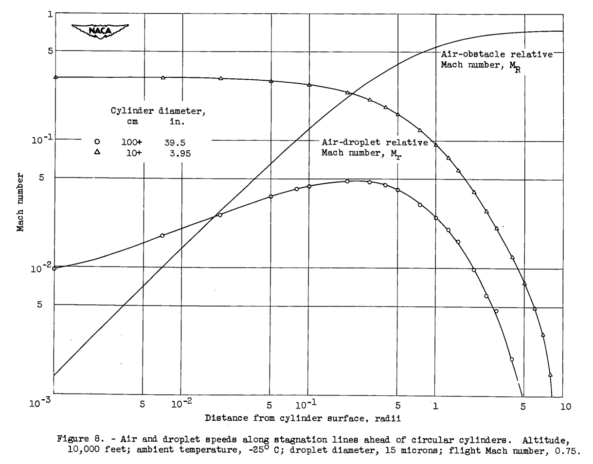
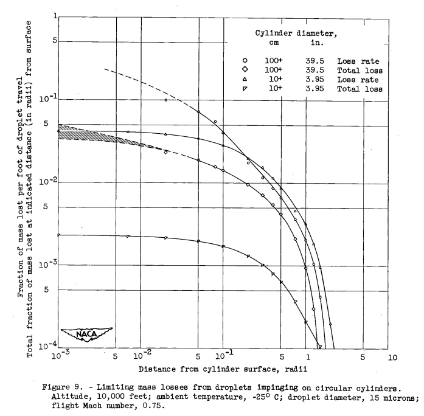

Title: NACA-TN-3024  
Category: NACA  
tags: thermodynamics  

> ###_"evaporation losses are ... very small (less than 1 percent) in the case of smaller obstacles (of icing-rate-measurement-cylinder size)."_  

#"Maximum Evaporation Rates of Water Droplets Approaching Obstacles the Atmosphere under Icing Conditions" [^1]

  

##Summary
Less that 1% of drops evaporate approaching an obstacle for most cases.

##Key points

1. Equations are detailed for the evaporation of water drops approaching an obstacle.  
2. Less that 1% of drops evaporate approaching an obstacle for most cases.  

##Abstract

> When a closed body or a duct envelope moves through the atmosphere,
air pressure and temperature rises occur ahead of the body or, under ram
conditions, within the duct. If cloud water droplets are encountered,
droplet evaporation will result because of the air-temperature rise and
the relative velocity between the droplet and stagnating air. It is
shown that the solution of the steady-state psychrometric equation provides 
evaporation rates which are the maximum possible when droplets are
entrained in air moving along stagnation lines under such conditions.
Calculations are made for a wide variety of water droplet diameters,
ambient conditions, and flight Mach numbers. Droplet diameter, body
size, and Mach number effects are found to predominate, whereas wide
variation in ambient conditions are of relatively small significance in
the determination of evaporation rates.  
The results are essentially exact for the case of movement of droplets 
having diameters smaller than about 30 microns along relatively long
ducts (length at least several feet) or toward large obstacles (wings),
since disequilibrium effects are then of little significance. Mass losses
in the case of movement within ducts will often be significant fractions
(one-fifth to one-half) of original droplet masses, while very small drop-
lets within ducts will often disappear even though the entraining air is
not fully stagnated. Wing-approach evaporation losses will usually be of
the order of several percent of original droplet masses.  
Two numerical examples are given of the determination of local evap-
oration rates and total mass losses in cases involving cloud droplets
approaching circular cylinders along stagnation lines. The cylinders
chosen were of 3.95-inch (10.0+ cm) diameter and 39.5-inch 100+ cm)
diameter. The smaller is representative of icing-rate measurement cylinders, 
while with the larger will be associated an air-flow field similar
to that ahead of an airfoil having a leading-edge radius comparable with
that of the cylinder. It is found that the losses are less than 5 percent. 
It is concluded that such losses are, in general, very small
(less than 1 percent) in the case of smaller obstacles (of icing-rate-
measurement-cylinder size); the motional dynamics are such, however, that
exceptions will occur by reason of failure of very small droplets (moving
along stagnation lines) to impinge upon obstacle surfaces. In such
cases, the droplets will evaporate completely.  

    
##Discussion

>The general literature in the field of evaporation from droplets is
extensive, but few studies of the particular problem of droplets approaching 
obstacle under icing conditions have been made. Both Hardy (ref. 4)
and Langmuir (ref. 5) have considered certain aspects of the question;
both analyses took into account the fact that the droplet will not, in
general, be in instantaneous psychrometric equilibrium with its surroundings. 
In both cases, the conclusion was reached that total evaporative
losses from droplets actually reaching obstacle surfaces are of the order
of several percent for the particular sets of conditions of their analyses. 
In both investigations, however, the ranges of droplet size, air
temperature and pressure, body size, and flight Mach number were rather
restricted.

>A complete treatment of the problem would require:
(1) use of the equations of motion of a droplet of liquid in a (compressible) gas, 
the equations to take into account in some way changes of
drag coefficient with Mach number;
(2) use of the equations governing the dynamic thermal behavior of
a volatile sphere under quite general conditions of changing heat and
mass-transfer rate including, in some instances, radiation effects; and
(3) coverage of wide ranges of obstacle size and shape, droplet
size, flight Mach number, and flight ambient air conditions.  

>The unavailability of a suitable high-speed calculator made it
necessary, however, to restrict in some manner the scope of the calculations.

>Since the subject of droplet evaporation, insofar as aircraft are
concerned, is of interest chiefly in connection with icing, radiation
effects could be ignored (since all temperature levels involved are low).
Further, it was decided to consider that a droplet remains in instantaneous 
psychrometric equilibrium with its immediate surroundings,
and its internal temperature was to be taken as uniform. Certain quantitative 
aspects of this assumption are scrutinized in the body of the report and in appendix B; 
a qualitative justification of the procedure is,
however, given here.  

>If evaporation occurs at all, it will occur principally as a result
of a droplet temperature rise, with which a droplet-surface vapor-pressure
rise will be concomitant. Therefore, maximum evaporation rates will occur,
In virtually all cases, in the vicinities of body stagnation points. If,
now, bodies and flight conditions (wing attitudes, for example) are considered 
such that air flows in the vicinities of stagnation points are
essentially symmetrical about such points, then the trajectory of a droplet 
originally on a stagnation line will essentially coincide with the
line. For the sake of simplicity, then, let attention be confined to
histories of droplets moving along such lines. Air temperature and pressure 
will rise monotonically. The droplet instantaneous position will
always be ahead of that of the air with which, at an arbitrary previous
time, it was in contact, although a quasi-static mass-transfer analysis
does not demand such motion. More importantly, with or without evaporation 
the interior droplet temperature will always lag behind the rising
surface temperature, and both the mean droplet temperature and the surface 
temperature will always be less than the local equilibrium (psychrometric) value; 
all droplet temperatures will rise monotonically. It is
possible to conclude that both the acual local time rate of evaporation
and the actual total loss of liquid will be less than those calculated
on the basis of psychrometric calculations in the case of stagnation
streamline droplet motion. It therefore follows that the present quasi-static 
calculations set upper bounds to the loss rates and total losses
for motion along stagnation lines.

This is essentially water drop the equilibrium assumption we saw in Hardy [^2].  

The calculations are rather involved, and so they will not be detailed herein. 
Readers who have read the preceding reviews in the [Icing Thermodynamics thread]({filename}thermodynamics.md) 
will be well prepared. 

The water drop airspeeds relative to the local airspeed were calculated: 

  

The resulting evaporation calculations:  

  

> CONCLUSIONS
On the basis of a theoretical analysis of rates of loss by evaporation 
of atmospheric droplets moving along stagnation lines toward
obstacles (such as wings and icing-rate measurement cylinders), it may
be concluded that:
>1. Little or no evaporative loss occurs from droplets approaching
liquid-water-content measurement cylinders (that is, cylinders having
diameters less than about 15 cm).
>2. Evaporative losses may be as high as several percent in the case
of small droplets approaching larger obstacles, such as wings, except
that there is always a possibility that the droplet will never reach the
airfoil. (In the latter case, it will, of course, evaporate completely
if it has been approaching along the stagnation line).
>3. Total losses from droplets moving along intake ducts, for example,
between the inlet entrance and engine screen of a jet engine, will
usually be of the order of 5 to 10 percent at low temperatures for the
smaller droplets and a fraction of that for the larger droplets, but may
be as great as 50 percent for the smaller droplets at ambient temperatures 
closer to 0C for high degrees of stagnation and moderately long
(10 ft) ducts.

39.5 inch diameter is rather large for a wing leading edge, 
so the losses of "several percent" may over-estimate most typical cases. 
The 3.95 inch diameter is more typical, 
so I think that the "little or no evaporative loss" would apply for most wings. 

In the post-NACA era, most sources assume zero loss due to evaporation of drops approaching an obstacle. 

Reproducing the calculations in python is a non-trivial task, 
but I am considering a "Let's Build a 1D Water Drop Motion Simulation" project, 
that would do part of what the AEDC1DMP code mentioned below does.  

##Related

A distant descendant of NACA-TN-3024 (although NACA-TN-3024 is not cited by it) is the AEDC1DMP 
(Arnold Engineering Development Center 1 Dimensional Multi-Phase) code described in [^3].

I have used the code but I do not have a copy of it, and I do not know where to find it online. 
[When I used it years ago, one had to "know someone" to get the code.] 

##Citations

NACA-TN-3024 cites 16 publications:  

- Guibert, A. G., Janssen, E., and Robbins, W. M.: Determination of Rate, Area, and Distribution of Impingement of Waterdrops on Various Airfoils from Trajectories Obtained on the Differential Analyzer. NACA-RM-9A05, 1949.  
- Bergrun, Norman R.: A Method for Numerically Calculating the Area and Distribution of Water Impingement on the Leading Edge of an Airfoil in a Cloud. NACA-TN-1397, 1947.  
- Langmuir, Irving, and Blodgett, Katherine B.: A Mathematical Investigation of Water Droplet Trajectories. Tech. Rep. No. 5418, Air Materiel Command, AAF, Feb. 19, 1946. (Contract No. W-33-038-ac-9151 with General Electric Co.)  
- Hardy, J. K.: Evaporation of Drops of Liquid. Rep. No. Mech. Eng. 1, British R.A.E., Mar. 1947.  
- Langmuir, Irving: The Cooling of Cylinders by Fog Moving at High Velocities. General Electric Co., Mar. 1945.  
- Schmidt, Ernst, and Wenner, Karl: Heat Transfer over the Circumference of a Heated Cylinder in Transverse Flow. NACA-TM-1050, 1943.  
- Frossling, Nils: Uber die Verdiinstung Fallender Tropfen. Gerl. Beitr. Geophys., Bd. 52, Heft 1/2, 1938, pp. 170-216.  
- Homann, F. (D. C. Ipsen, trans.): The Effect of High Viscosity on the Flow Around a Cylinder and Around a Sphere. Rep. No. RE-150-88, Inst. Eng. Res., Univ. Calif., Berkeley (Calif.), July 17, 1951. (Contract NAw-6004.)  
- Kaplan, Carl: The Flow of a Compressible Fluid Past a Sphere. NACA-TN-762, 1940.  
- Goff, John A., and Gratch, Serge: The Saturation Pressure of Water below 600 C. Rep. No. 4546, Thermodynamics Research Lab., Univ. of Pennsylvania, Jan. 1948. (Navy contract NObs-2477.)  
- Williams, Glenn Carber: Heat Transfer, Mass Transfer, and Friction for Spheres. SC. D. Thesis, M.I.T., 1942.  
- Ingebo, Robert D.: Vaporization Rates and Heat-Transfer Coefficients for Pure Liquid Drops. NACA-TN-2368, 1951.  
- Boelter, L. M. K., Cherry, V. H., Johnson, H. A., and Martinelli, R. C.: Heat Transfer Notes. Univ. Calif. Press (Berkeley and Los Angeles), 1948.  
- Dorsey, N. Ernest: Properties of Ordinary Water-Substance. Reinhold Pub. Corp. (New York), 1940.  
- Carslaw, H. S., and Jaeger, J. C.: Conduction of Heat in Solids. Clarendon Press (Oxford), 1947.  
- Jakob, Max: Heat Transfer. Vol. I. John Wiley & Sons, Inc., 1949.  

NACA-TN-3024 is cited 2 times by publications in the NACA Icing Publications Database [^4]:

- Brun, Rinaldo J., Lewis, William, Perkins, Porter J., and Serafini, John S.: Impingement of Cloud Droplets and Procedure for Measuring Liquid-Water Content and Droplet Sizes in Supercooled Clouds by Rotating Multicylinder Method. NACA-TR-1215, 1955. (Supersedes NACA TN’s 2903, 2904, and NACA-RM-E53D23)  
- Coles, Willard D.: Icing Limit and Wet-Surface Temperature Variation for Two Airfoil Shapes under Simulate High-Speed Flight Conditions. NACA-TN-3396, 1955.  

NACA-TN-3024 is cited 6 times in the literature [^5].

##Notes: 

[^1]: 
Lowell, Herman H.: Maximum Evaporation Rates of Water Droplets Approaching Obstacles the Atmosphere under Icing Conditions. NACA-TN-3024, 1953  
[^2]: Hardy, J. K.: Kinetic Temperature of Wet Surfaces A Method of Calculating the Amount of Alcohol Required to Prevent Ice, and the Derivation of the Psychrometric Equation. NACA-ARR-5G13, 1945  
[^3]: 
Schulz, R. J.: Second Report for Research and Modeling of Water Particles in Adverse Weather Simulation Facilities. TASK REPORT 97-03, AEDC, July, 1998, https://apps.dtic.mil/sti/pdfs/ADA364922.pdf  
[^4]: 
[NACA Icing Publications Database]({filename}naca icing publications database.md)  
[^5]: 
https://scholar.google.com/scholar?hl=en&as_sdt=0%2C48&q=Maximum+Evaporation+Rates+of+Water+Droplets+Approaching+Obstacles+the+Atmosphere+under+Icing+Conditions&btnG=  

