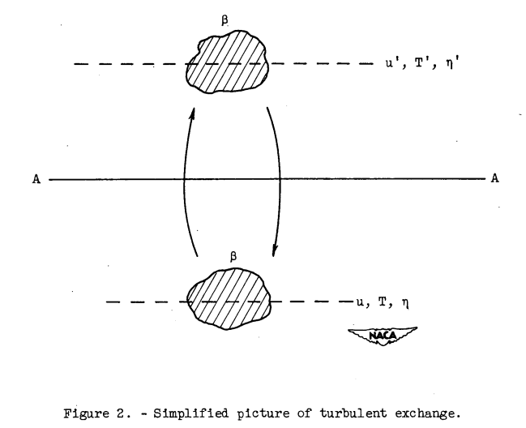
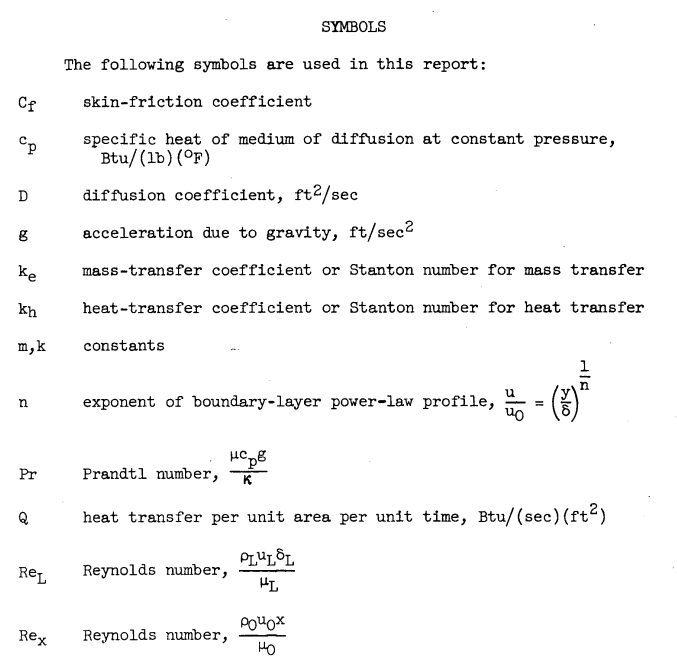
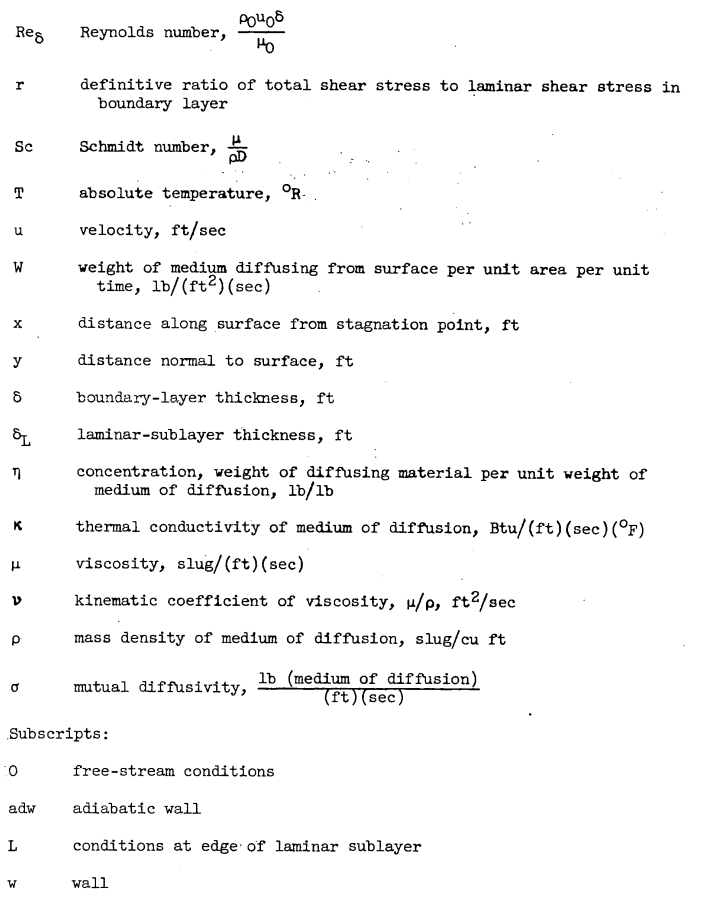
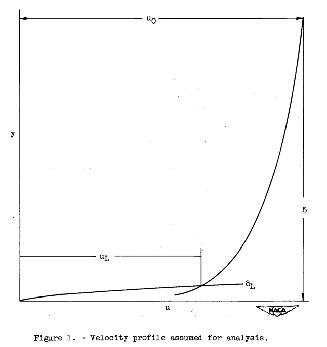
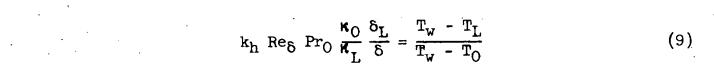
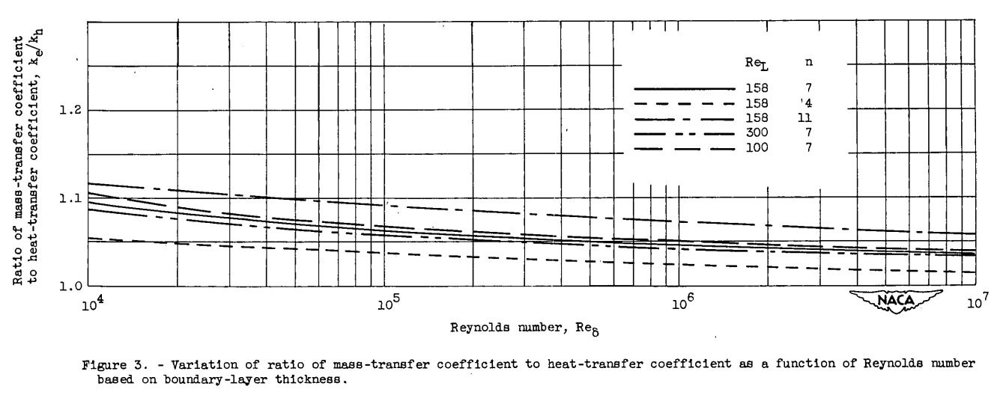

Title: NACA-TN-3045  
Category: NACA  
tags: thermodynamics  
status: draft    

###_"The evaporative cooling of surfaces by air streams at high speed is of considerable interest"_   

#"Analogy Between Mass and Heat Transfer with Turbulent Flow" [^1]

  

##Summary
For turbulent flow on a flat plate, ke/kh is about 1.1 to 1.05.

##Key points

1. For turbulent flow on a flat plate, ke/kh is about 1.1 to 1.05.  
2. The result applies at Mach numbers up to 1.5.

##Abstract  

>An analysis of combined heat and mass transfer from a flat plate has
been made in terms of Prandtlt's simplified physical concept of the turbulent 
boundary layer. The results of the analysis show that for conditions 
of reasonably small heat and mass transfer, the ratio of the mass- and 
heat-transfer coefficients is dependent on the Reynolds number of the
boundary layer, the Prandtl number of the medium of diffusion, and the
Schmidt number of the diffusing fluid in the medium of diffusion. For
the particular case of water evaporating into air, the ratio of mass-transfer 
coefficient to heat-transfer coefficient is found to be slightly
greater than unity.

##Discussion 

This will get heavily into boundary layer theory, so get acquainted with the symbols.

  
  

>ANALYSIS  
Flow Over Flat Plate at Low Speeds  
The study of reference 2 relates the local skin-friction coefficient
and the local Reynolds number based on boundary-layer thickness for the
case of turbulent flow over a flat plate. The analysis described therein
is based on the simplified physical concept of the boundary layer shown
in figure 1. The boundary layer is assumed to be sharply divided into a
turbulent region having a power-law velocity profile and a laminar region
having a constant shear stress. The thickness of the laminar sublayer is
given by the intersection of the turbulent-power-law velocity profile and
the velocity profile of the laminar sublayer. This conception of the
boundary layer is quite similar to that originally presented by Prandtl,
which assumed a turbulent region and a laminar sublayer wherein the velocity 
increased linearly with distance from the surface.

  

Terms for heat and mass transfer are developed. 

  

  

The concentration gradients are analogous. 

> The temperature ratio (Tw-Tl)/(Tw-To) and the concentration ratio (ηw-ηl)/(ηw-ηo)
may be evaluated in terms of the laminar-sublayer velocity ul and the
stream velocity uo with the aid of Reynolds analogy.

>Consider an area in the turbulent region of the boundary layer as
shown in figure 2. Let β be a small mass of fluid which is transported
per unit time, per unit area across the plane A-A. Suppose that β penetrates 
upward through A-A to a region of higher velocity u', lower temperature 
T', and lower concentration η'. In the steady-state condition
(completely developed turbulence), an equal mass β must be transported
downward across plane A-A to a region of lower velocity u, higher temperature 
T, and higher concentration η.

After a great deal of boundary layer theory and algebra, we get to equation 28:

  

>It is apparent from figure 3 that the ratio of the mass-transfer
coefficient to the heat-transfer coefficient decreases slightly with increasing 
Reynolds number. The ratio also increases with increasing n,
but both the effect of Reynolds number and n are quite small and it
would be difficult to isolate either experimentally. The curves shown
for values of ReL equal to 100, 158, and 300 at a constant value of
n = 7 indicate that the effect of changes in ReL is so small as to be
negligible.

  

> From an over-all standpoint, it would therefore be expected that the
ratio ke/kh can be taken as approximately 1.05 regardless of whether or
not the flow is transitional with values of n of the order of 4 or fully
turbulent with values of n equal to or greater than 7.

##Conclusions

>CONCLUSIONS  
An analysis of combined heat and mass transfer from a flat plate has
been made in terms of Prandtl's simplified physical concept of the boundary 
layer. The results of the analysis show that for conditions of reasonably 
small heat and mass transfer, the ratio of the mass- and heat-
transfer coefficients is dependent on the Reynolds number of the boundary
layer, the Prandtl number of the working fluid, and the Schmidt number of
the diffusing material in the medium of diffusion. For the particular case
of water evaporating into air, the ratio of mass-transfer coefficient to
heat-transfer coefficient is found to be slightly greater than unity. For
the particular case of aircraft icing, it is shown that the results of the
analysis are valid up to the maximum Mach number at which icing might
occur, that is, 1.5.

Many recent sources just use 1.12 as the value of ke/kh, as we have seen previously. 

##Citations

NACA-TN-3045 cites 5 publications:  

- Callaghan, Edmund E., and Serafini, John S.: Analytical Investigation of Icing Limit for Diamond Shaped Airfoil in Transonic and Supersonic Flow. NACA-TN-2861, 1953.  
- Donaldson, Coleman duP.: On the Form of the Turbulent Skin-Friction Law and Its Extension to Compressible Flows. NACA-TN-2692, 1952.  
- Goldstein, S.: Modern Developments in Fluid Dynamics. The Clarendon Press, Oxford, 1938.  
- Eckert, E. R. G.: Introduction to the Transfer of Heat and Mass. McGraw-Hill Book Co., Inc., 1950.  
- von Kármán, Th.: Turbulence and Skin Friction. Jour. Aero. Sci., vol. 1, no. 1, Jan. 1934, pp. 1-20.  

NACA-TN-3045 is cited 2 times by publications in the NACA Icing Publications Database [^2]:

- Coles, Willard D., and Ruggeri, Robert S.: Experimental Investigation of Sublimation of Ice at Subsonic and Supersonic Speeds and its Relation to Heat Transfer. NACA-TN-3104, 1954.
- Coles, Willard D.: Icing Limit and Wet-Surface Temperature Variation for Two Airfoil Shapes under Simulate High-Speed Flight Conditions. NACA-TN-3396, 1955.

NACA-TN-3045 is cited 4 times in the literature [^3].

##Notes  
[^1]: 
Callaghan, Edmund E.: Analogy Between Mass and Heat Transfer with Turbulent Flow. NACA-TN-3045, 1953.  
[^2]: 
[NACA Icing Publications Database]({filename}naca icing publications database.md)  
[^3]: 
https://scholar.google.com/scholar?hl=en&as_sdt=0%2C48&q=Analogy+Between+Mass+and+Heat+Transfer+with+Turbulent+Flow&btnG=  

