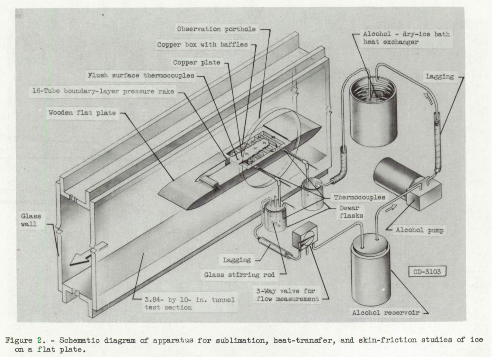
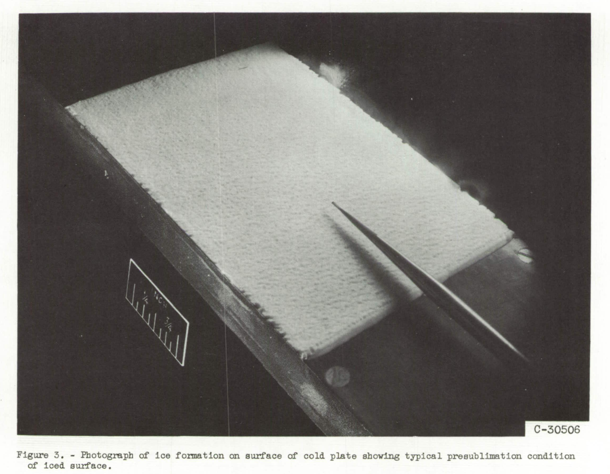
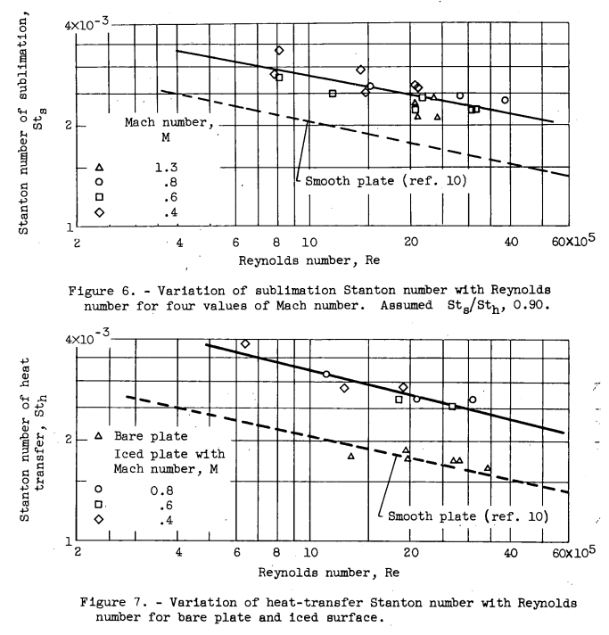
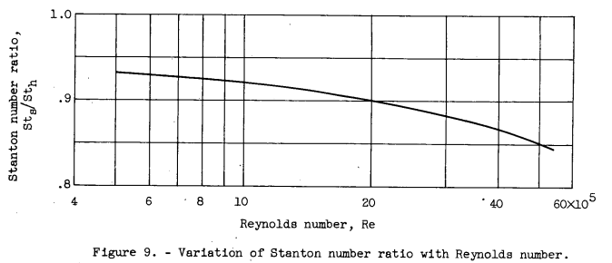

Title: NACA-TN-3104  
Category: NACA  
tags: thermodynamics  

> ###_"there has been speculation concerning removing ice during flight in clear air at high altitudes by the process of sublimation"_  

#"Experimental Investigation of Sublimation of Ice at Subsonic and Supersonic Speeds and its Relation to Heat Transfer" [^1]   

 

##Abstract  

> An experimental investigation was conducted in a 3.84- by 10-inch
tunnel to determine the mass transfer by sublimation, heat transfer,
and skin friction for an iced surface on a flat plate for Mach numbers
of 0.4, 0.6, and 0.8 and pressure altitudes to 30,000 feet. Measurements 
of rates of sublimation were also made for a Mach number of 1.3
at a pressure altitude of 30,000 feet.  
The results show that the parameters of sublimation and heat transfer 
were 40 to 50 percent greater for an iced surface than was the bare-
plate heat-transfer parameter. For iced surfaces of equivalent roughness, 
the ratio of sublimation to heat-transfer parameters was found to
be 0.90. The sublimation data obtained at a Mach number of 1.3 showed
no appreciable deviation from that obtained at subsonic speeds. The
data obtained indicate that sublimation as a means of removing ice
formations of appreciable thickness is usually too slow to be of mach
value in the de-icing of aircraft at high altitudes.

##Summary
Sublimation rates at up to Mach 1.3 are measured. 

##Key points 

1. "natural ice formations resulting from the impingement
and freezing of small water droplets on a surface are rarely smooth"  
2. Test were conducted to determine sublimation rates on rough ice surfaces.  
3. "Sublimation as a means of removing an ice formation of appreciable 
thickness is usually too slow to be of much value in aircraft
de-icing at high altitudes."  

##Discussion  

Be acquainted with the symbols.

  
  
  

>Similarity between the processes
of sublimation of ice and evaporation of water makes the principles
evolved by previous investigators in the field of evaporation applicable
to sublimation studies. From Reynolds analogy and from the work of many
investigators, notably Colburn (refs. 2 and 3), in correlating experimental 
data, the relations between mass transfer, heat transfer, and
skin friction for a flat plate are well known. Thus a reasonably accurate
prediction of the rate of sublimation of a smooth ice surface subjected
to a tangential low-velocity air stream could be made from available
data. However, natural ice formations resulting from the impingement
and freezing of small water droplets on a surface are rarely smooth, and
very little is known of the sublimation rate of rough ice in a high-
velocity air stream.  

Note "natural ice formations resulting from the impingement
and freezing of small water droplets on a surface are **rarely smooth**". 
The roughness requires that the boundary layer analogies be modified 
(a challenging task not undertaken in NACA-TN-3104), 
or experimental means be used (the means described herein). 

>The present investigation was undertaken to determine the rate of
sublimation from the iced surface of a flat plate in a subsonic and a
low supersonic air stream, and to relate the sublimation and heat transfer 
from a rough ice surface. The investigation was conducted in a
3.84- by 10-inch tunnel at the NACA Lewis laboratory.  

>Preliminary
experimentation with several methods of forming ice together with limitations 
of space and access to the inside of the tunnel indicated that
ice formed by the condensation of moisture from a humidity-controlled
air stream on the cold surface of a metal plate most nearly suited the
requirements.

>The study of the heat-transfer process from the iced surface im-
poses two additional requirements: (1) the transfer of heat must take
place without the transfer of mass to avoid interaction of the two
processes, and (2) the measurement of the temperature of the ice surface 
should be possible. The condensation method of forming the ice
offers an indirect method for obtaining the surface temperature by
measurement of the humidity of the air stream under conditions for which
the ice thickness is constant (no net condensation or sublimation
effect). The ice surface temperature under these conditions is equal
to the temperature of saturation of the air stream. Thus both the
additional requirements of the heat-transfer study can be satisfied
through use of the condensation method of forming the ice. Therefore
for this investigation ice was caused to form on the cold plate by in-
creasing the humidity of the air stream by means of steam injection.
When the dew point of the air stream exceeded the surface temperature
of the cold plate, condensation in the form of a dense frost-like ice
formation occurred, as shown in figure 3.

  

>The movable probe shown in figure 3 was used for purposes of
focusing the telescope and aiding in the determination of ice thick-
ness.

>The heat transferred through the ice or to the bare surface was
determined from the heat gained by the alcohol flowing through the copper 
box in the model, as obtained from measurement of alcohol flow rate
and change in alcohol temperature.

>Stanton Numbers of Sublimation and Heat Transfer  
The sublimation data obtained in this investigation were first calculated 
by using a value of unity for the ratio Sts/Sth. Values of
Sts were obtained from equations (2) and (3). The heat-transfer data
were calculated by using equation (4) to determine Sth. The ratio of
the Stanton numbers thus determined from the experimental data had a
value of 0.94. Recalculation of the data was then made by using an
assumed value of 0.90 for the ratio Sts/Sth with a consequent reduction 
in the values of Sts. The experimental Stanton number ratio was
then found to be approximately 0.90, which agrees with the assumed value.
This determination of Stanton number ratio was made over the Mach number 
range of 0.4 to 0.8 and a pressure-altitude range of 5000 to 30,000
feet because both these factors influence the ice roughness.  
The sublimation data obtained with the value of 0.90 for Sts/Sth
are presented in figure 6 in the form of the Stanton number of sublimation 
as a function of Reynolds number. The solid faired line was obtained 
by use of the method of least squares. The heat-transfer Stanton
number, as a function of Reynolds number, calculated for the case of a
smooth flat plate from an empirical equation given in reference 10 is included 
for comparison. The data show that the Stanton number of sublimation 
Sts decreases with increasing Reynolds number and has a slope
very nearly equal to that of the empirical relation for the heat transfer
from a smooth plate. No consistent tendency to deviate from the sub-
sonic results is exhibited by the limited data obtained at a Mach number
of 1.3.

  

>Comparison of
figures 6 and 7 both with and without ice on the surface of the plate
shows that, for ice roughness of the order of that present during this
investigation, the sublimation and heat-transfer Stanton numbers are 40
to 50 percent higher than those for a smooth plate. The increase in
heat-transfer Stanton numbers due to. ice on the surface was comparable
with the increase in average skin-friction coefficients caused by ice
on the surface.  

  

>Application to Aircraft Icing  
Sublimation of an ice formation from an aircraft surface occurs
during flight in clear air even though the air may be saturated. The
relatively high surface temperatures of the ice (brought about by the
frictional heating associated with high-speed flight) raise the vapor
pressure at the surface of the ice such that it is always greater than
the vapor pressure of the ambient air. Curves showing the sublimation
rate as a function of altitude and of air velocity over the iced sur-
faces for two ambient-air temperatures at each of three altitudes are
shown in figure 10. The value of 0.90 for the Stanton number ratio was
used in the computations for these curves. The curves for flight in
saturated air are shown in figure 10(a) and for flight in dry air in
figure 10(b).

> A comparison of the curves presented in figure 10 shows that the
rate of sublimation is somewhat greater for flight in dry-air than for
flight in saturated air, especially for the lower-altitude conditions.

  
  

##Conclusions

> SUMMARY OF RESULTS  
The experimental investigation to determine the mass transfer by
sublimation, heat transfer, and skin friction for an iced flat surface
yielded the following results:  
>1. The Stanton numbers of sublimation and heat transfer were 40 to
50 percent higher for an iced surface than the Stanton number of heat
transfer for a bare plate.  
>2. For iced surfaces of equivalent roughness, the ratio of the
Stanton numbers of sublimation and heat transfer was 0.90.  
>3. Average skin-friction coefficients obtained with iced surfaces
and with a bare plate showed increases due to ice roughness comparable
with the increase in heat-transfer Stanton number due to ice on the
surface.  
>4. The data obtained at a Mach number of 1.3 showed no appreciable
deviation in sublimation Stanton number from that obtained at subsonic
speeds.  
>5. Sublimation as a means of removing an ice formation of appreciable 
thickness is usually too slow to be of much value in aircraft
de-icing at high altitudes.  

For comparison, [Messinger's]({filename}messinger.md) [^2] estimate for sublimation was:
>Once an unheated surface has been allowed to collect
ice, the period required to remove it by sublimation
alone is long. It is of the order of 5 hours for 1/4 in.
of ice at an air speed of 500 knots at 30,000 ft. and
N.A.C.A. standard ambient temperature.  

which equates to about 0.25 lbm/ft^2-hr at 500 knots (575 mph) (depending on the ice density).  

Figure 10a (saturated air) yields about 0.5 lbm/ft^2-hr at -40C, 
and Figure 10b (dry air) yields about 0.6 lbm/ft^2-hr.

##Citations  

NACA-TN-3104 cites 11 publications:  

- Hacker, Paul T., and Dorsch, Robert G.: A Summary of Meteorological Conditions Associated with Aircraft Icing and a Proposed Method of Selecting Design Criterions for Ice-Protection Equipment. NACA-TN-2569, 1951.  
- Colburn, Allan P.: A Method of Correlating Forced Convection Heat Transfer Data and a Comparison with Fluid Friction. Trans. Am. Inst. Chem. Eng., vol. XXIX, 1933, pp. 174-210.  
- Chilton, T. H., and Colburn, Allan P.: Mass Transfer (Absorption) Coefficients. Ind. and Eng. Chem., vol. 26, no. 11, Nov. 1934, pp. 1183-1187.  
- Baines, W. D.: A Literature Survey of Boundary-Layer Development on Smooth and Rough Surfaces at Zero Pressure Gradient. Iowa Inst. Hydraulic Res., Univ. Iowa, 1951. (Office Naval Res. Contract N8-onr-500.)  
- Hardy, J. K.: Kinetic Temperature of Wet Surfaces A Method of Calculating the Amount of Alcohol Required to Prevent Ice, and the Derivation of the Psychrometric Equation. NACA-ARR-5G13, 1945  
- Boelter, L. M. K., Cherry, V. H., Johnson, H. A., and Martinelli, R. C.: Heat Transfer Notes. Univ. Calif. Press (Berkeley), 1946, p. XVI-36.
- Callaghan, Edmund E.: Analogy Between Mass and Heat Transfer with Turbulent Flow. NACA-TN-3045, 1953.  
- Tucker, Maurice: Approximate Turbulent Boundary-Layer Development in Plane Compressible Flow Along Thermally Insulated Surfaces with Application to Supersonic-Tunnel Contour Correction. NACA-TN-2045, 1950.  
- McAdams, William H.: Heat Transmission. McGraw-Hill Book Co., Inc., 1942.  
- Eckert, E. R. G.: Introduction to the Transfer of Heat and Mass. First ed., McGraw-Hill Book Co., Inc., 1950, P. 117.    
- Marvin, C. F.: Psychrometric Tables for Obtaining the Vapor Pressure, Relative Humidity, and Temperature of the Dew Point. W.B. No. 235, Weather Bur., U.S. Dept. Commerce, 1941.    

NACA-TN-3104 is cited 2 times by publications in the NACA Icing Publications Database [^4]:

- Coles, Willard D.: Experimental Determination of Thermal Conductivity of Low-Density Ice. NACA-TN-3143, 1954.  
- Coles, Willard D.: Icing Limit and Wet-Surface Temperature Variation for Two Airfoil Shapes under Simulate High-Speed Flight Conditions. NACA-TN-3396, 1955.  

NACA-TN-3104 is cited 33 times in the literature [^4].

##Notes:

[^1]:
Coles, Willard D., and Ruggeri, Robert S.: Experimental Investigation of Sublimation of Ice at Subsonic and Supersonic Speeds and its Relation to Heat Transfer. NACA-TN-3104, 1954.  
[^2]: 
Messinger, B. L.: Equilibrium Temperature of an Unheated Icing Surface as a Function of Airspeed. Preprint No. 342, Presented at I.A.S. Meeting, June 27-28, 1951.  
[^3]: 
[NACA Icing Publications Database]({filename}naca icing publications database.md)  
[^4]: 
https://scholar.google.com/scholar?hl=en&as_sdt=0%2C48&q=Experimental+Investigation+of+Sublimation+of+Ice+at+Subsonic+and+Supersonic+Speeds+and+its+Relation+to+Heat+Transfer&btnG=  
