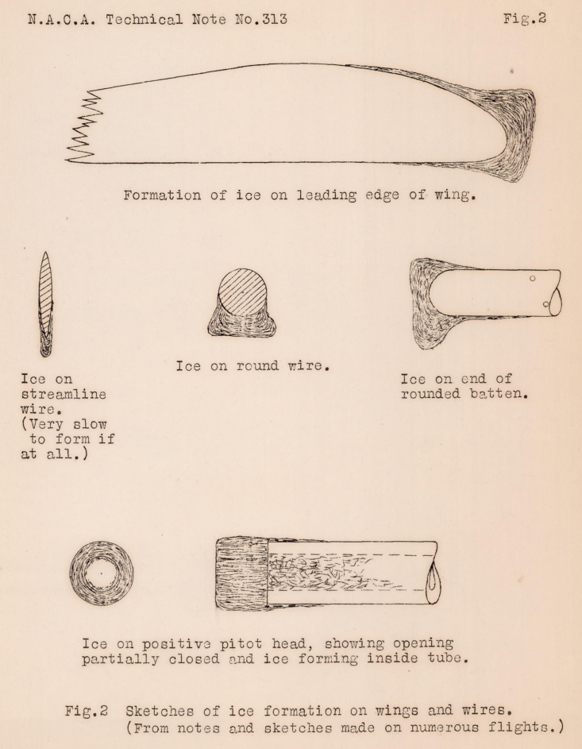
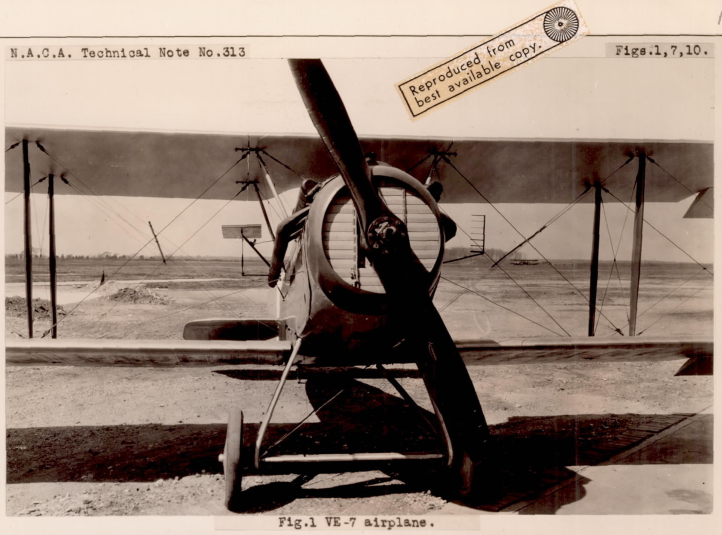
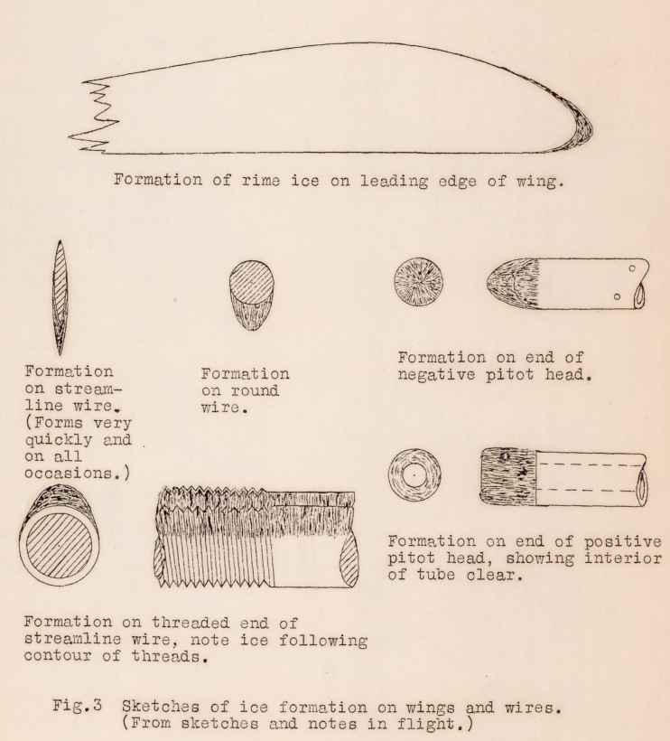
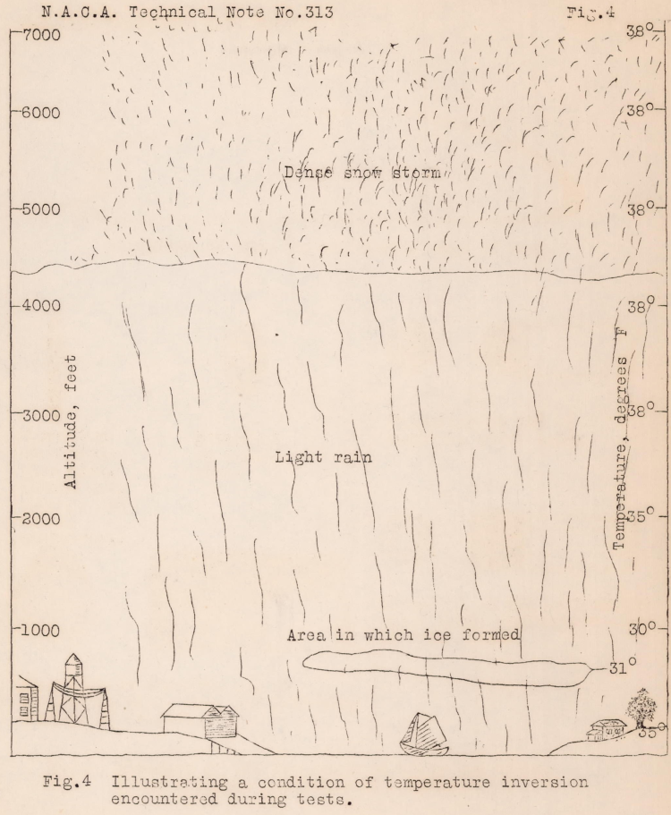
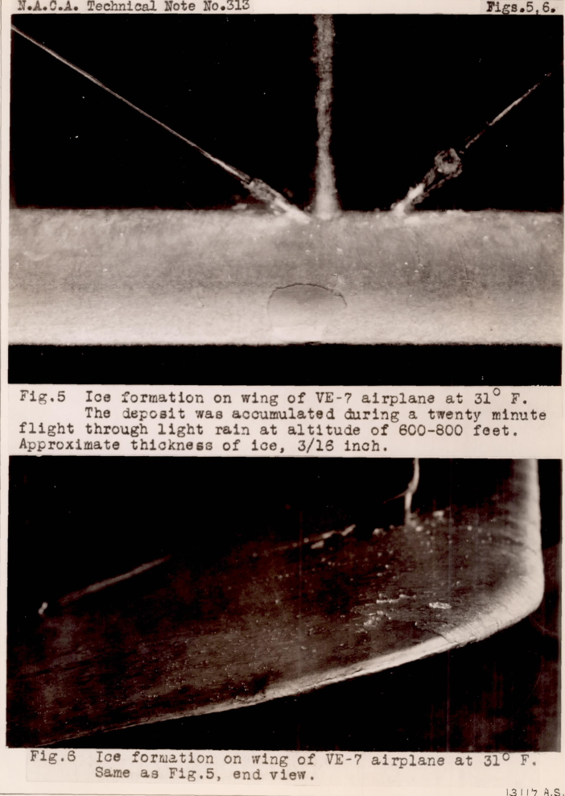

title: NACA-TN-313  
Date: 2022-06-06 12:00  
Category: NACA  
tags: ice shapes  

### _"an irregular shape is developed due to the ice formation, which is ruinous to the aerodynamic efficiency of the airfoils"_

# NACA-TN-313, "The Formation of Ice upon Airplanes in Flight" [^1] 

  
## Summary  
Ice shapes are recorded in flight tests in natural icing conditions.  

## Key Points  
1. Types of ice formations are noted, clear ice (possibly SLD) and rime ice.  
2. The atmospheric conditions for the types of ice are noted.  
3. "Oily surface" icephobic substances are tested.  
4. Procedures for avoiding the most hazardous icing conditions are provided.

## Abstract  

>This report describes the atmospheric conditions under
which ice is deposited upon the exposed parts of airplanes in flight.
It identifies the formation which is found under different conditions, 
and describes some studies of preventative
means together with recommendations for avoiding the consequences of the formation.

## Discussion  

This is an almost "lost gem" of the NACA-era (cited only 10 times).  
It features:  
- Description of supercooled large drop (SLD) icing conditions  
- "Detect and exit" icing mitigation strategy  
- Natural icing flight tests of icephobic materials  
- Identification of different types of icing  

and all of this in 1929.  

I was surprised at how much of my own icing flight test experience was reflected in NACA-TN-313,
published 90+ years ago.  

As this publication is short, and the online copy is of varying legibility, 
large portions are transcribed herein. 

>This study of the phenomena of the formation of ice upon
the wings and exposed parts of an airplane while flying was
prompted by the numerous reports of experiences in which airplanes 
were forced to be landed on account of the deposit of
quantities of ice upon the structure. From these reports it
was concluded that the failure of many long-distance flights
through cold regions, regarding the fate of whose personnel
nothing has been learned, may possibly have been due to the
formation of ice on these airplanes, which prevented them from
continuing to their destinations .

>Reports were obtained from every available source where
these phenomena were reported to have been observed.
Much of the information was contradictory, the formation being reported
as having occurred under a wide variety of conditions usually
where moisture exists, either in the form of fog, clouds, or
rain, but at temperatures varying from 32F. to as low as -14F.  

>Methods and Apparatus  

>The lack of agreement as to the conditions under which a
deposit of ice might be expected indicated the necessity for a
connected study at first hand.
Some difficulty was anticipated in locating the necessary conditions for this study
and the suggestion was made that it might be necessary to equip an expedition 
to travel in those northern parts of the continent where
the proper conditions might occur most frequently.
However, the idea was formed at this laboratory that the conditions
might be found at Langley Field by flying to an altitude where
freezing temperatures would be met, accompanied by the presence
of rain, clouds, or a rising fog bank.

>An airplane was equipped with external air temperature
thermometers, of the N.A.C.A. electric type and, in addition,
some convenient forms and surfaces were fitted, up on which the
formation of ice might be studied, as well as up on the structure 
of the airplane itself (Fig. 1).
This airplane was kept
in constant readiness and at such times as suitable conditions
appeared probable, flights were made, during which observations
and notes were taken.

  

[Frankly, I would not be brave enough to fly that in icing conditions, 
with all of the wires, struts, etc. that are potential ice collection surfaces.]

>It was somewhat discouraging to find that repeated efforts
to photograph the formation of the ice while in flight were
fruitless, and that, excepting on a few occasions, the descent
to warmer atmosphere resulted in the melting of much of the formation 
which, if not entirely melted off, was shaken loose in the jar of landing.
However, on certain occasions when the
ground-temperature was near freezing, landings were made with
the formation intact and photographs and further observations
could be made on the ground, in addition to the observations in
flight, which were made in every case.

>Results  

>The results of a great number of observations have clearly
identified the conditions which must prevail in order that ice
may be deposited upon the airplane.
First, moisture must be
present in the atmosphere, whether in the form of fog, clouds
or rain; makes little difference, excepting, as would be expected, 
in the rapidity with which the deposit forms, that is, the
more free water, the more ice in a given time.
Measured observations of the relative humidity were not made in flight and
were not considered of importance.
>Secondly , low temperature must exist, that is, 32F or less.
The range of a few degrees below 32F is a zone of temperature
in which a coating of transparent, solid ice will form,
very similar to the formation which is observed on trees in what
is generally called a sleet storm .
The exact range of temperature in which this will occur is not definitely established
and the width of the zone is dependent on the presence or absence of certain conditions, 
i.e., temperature inversion, and sub-cooled droplets, 
which permit water to exist in its liquid
state at a temperature lower than 32F. These will be discussed later.

>The formation of ice under these conditions is illustrated
by Figure 2, which shows the tendency of the formation as observed in a number 
of actual cases during the experiments at
Langley Field.
It will be noted that ice in this form has a
definite tendency to mushroom or to enlarge its frontal area at
the very front of the formation.

  

>An important observation which has been frequently confirmed is illustrated in Figure 3.
At temperatures below. the zone directly below 32°F, that is, at temperatures as low as
15F, which is definitely beyond the first zone, though not
necessarily near its lower boundary, an entirely different type
of formation is noted, there being practically no tendency to
mushroom as in the case in the zone immediately below 32°F.
Further, the texture and appearance of the ice so formed is radically different, 
and is known to meteorologists as "rime" ice.
In the conditions at or near 32F., as was said above, the ice is clear and hard.
In this latter case the formation is pure white, opaque, and granular in texture.
It is, in fact, snow of very fine flake size or more truly, since it lacks flake design, 
a collection of tiny ice pellets, which have but little cohesion or adhesion.

  

>The formation of either the clear ice or rime ice upon an
airplane produces danger from two
sources:
the first, which is the lesser, being the additional weight to be carried by the
airplane due to the deposit, and the second and more serious,
the loss in lift and increase in drag resulting from the irregularity 
of the shape of the formation.
In Figure 2, it will be noted that an irregular shape is developed 
due to the ice formation, 
which is ruinous to the aerodynamic efficiency of the
airfoils or struts upon which it is deposited.
The irregularity,
where it exists, is found near the leading edge of the airfoil
or strut.
Here the normal air flow is most critical and the
malformation, therefore, has the maximum of detrimental effect.
In Figure 3 it is noted that the deposit, rime ice, is of such
form that little or no aerodynamic effect would be expected on
the form upon which it was deposited.

>It is, of course, apparent that the clear ice is heavier per
unit volume than the snow-like deposit, but of itself the matter
of increased weight requires little comment if it were not for
the fact that in conjunction with the reduced aerodynamic efficiency 
the increased weight renders the conditions more dangerous.
As for the weight itself, it is believed that the weight
of deposit would not be much more than the weight of the fuel
which was consumed in the flight, before and during the deposit.
These, of course, cancel.

>The ice formation has been charged in numerous instances
with clogging air-speed-heads and other exposed instruments,
and there are some reports of jammed controls.
It is quite obvious that the formation upon the Pitot or Venturi head of an
air-speed meter or other instrument would interfere with its operation.
However, the jamming of controls has not been experienced in the experiments at this 
laboratory.
It is thought that the reported in stances of jamming have occurred on older
and obsolete types of airplanes whose control systems were more
exposed, and that it is much less likely to occur upon the more
modern airplanes.

>During the conduct of these experiments several unusual
cases of temperature inversion were noted, the most unusual
being illustrated by Figure 4.
On this day, the ground temperature was 35F. 
At 600 to 800 feet, it was 31F; at 3000 feet,
it was 38F, and this temperature was constant to an altitude of 7500 feet.
There was a fine rain at the ground level which
extended to an altitude of about 4000 feet, with very heavy
snow between that altitude and the maximum altitude reached,
about 7500 feet.

Figure 4 appears to describe a supercooled large drop (SLD) icing scenario,
where a temperature inversion allows rain formation aloft, 
which then falls through a colder layer that cools the drops below 0C (32F). 
  

>Figures 5 and 6 illustrate a formation which was obtained upon this flight.
No deposit of any form whatsoever  was observed at any other altitude or condition other than
at from 600 to 800 feet altitude in a fine rain which froze immediately upon striking 
the airplane.
It is also interesting to note that the area of low temperature, 31F, 
extended laterally through an area of not more than half a mile square at that
altitude, and that this area was almost entirely over the water
of the river in the vicinity of Langley Field.
Temperature inversion which permits rain to fall from a higher and warmer air
into a lower, colder stratum need not necessarily be considered an exception to the rule.
When in the conditions of rain,
clouds, or fog, this inversion may be expected as a matter of more frequent occurrence.

  

### Icephobics tests

Several potentially protective substances were tested. 

>The oily surfacing seemed to present the most promise and several attempts were made 
to prevent the formation by coating
one-half of the small metal airfoil which had been placed in a
convenient position on the airplane with a substance of this
nature.
Oil, grease, wax, and paraffin were among the substances employed.
__The unexpected fact, developed in the flight
experiments, was that in each case ice was observed to form upon
the treated surface more quickly than upon the bare metal.__
At first thought, this appeared very unusual behavior, but it
should be remembered that the drops of water are bombarding the
frontal area of the greased surface at flight velocities approximating
100 m.p.h., quite unlike the behavior of water which is
simply poured upon such surfaces.
These drops strike the oily
or greasy material and are, to a certain extent, embedded therein and held, 
so that they freeze before they have had an opportunity to roll off.

## Conclusions  

>Ice, in the true sense, will only form in a zone of temperatures 
of unknown, but narrow, width below 32°F when clouds, fog,
or rain are encountered.
The ice formation so deposited will
assume an irregular contour upon the wing or part of the airplane.
This irregular shaped mass of ice, when applied to an
aerodynamic form  produces a malformation extremely detrimental
to its efficiency.
This malformation, in conjunction with the
additional weight of the ice, may be expected to necessitate discontinuance of flight .

>In temperatures below the zone in which clear ice is formed
an entirely different formation is deposited.
This is a formation more similar to snow.
Its contours do not produce the
detrimental aerodynamical features of clear ice and its weight
is less.  
Temperature inversion may interfere in any case.

>Recommendations  

>There appears little likelihood of successful prevention
of the formation of ice on the airplane in flight by the application 
of any preventative means.
However, it appears possible
to avoid the conditions in which it is formed and thus escape
the dangers it would produce.
The formation of clear ice is found only in a restricted
range of temperature just below 32F, and the successful avoidance 
of the conditions for ice formation by avoiding the area
in which the conditions of temperature and moisture are conducive 
to the formation need not place too great a limitation on
the operation of the airplane.
If pilots can be well and thoroughly acquainted with the conditions 
controlling the formation
of ice and particularly if they can learn that every deposit
upon the wings or parts of an airplane is not necessarily hazardous, 
the problem will be in a large measure solved.

>They must know that clear ice, which forms in a narrow
range of temperature just below 32F, is almost certain to be
deposited, if the conditions favorable to its deposit are maintained 
sufficiently long, and that this formation is detrimental
to the aerodynamic efficiency of the wing or other part.
They must, therefore, learn as a matter of practice, to avoid this
accumulation of ice.
This avoidance is not difficult since it
will not occur except in the presence of moisture in reasonable
quantity; which should be clearly evident, visually, whether the
moisture be in the form of rain, fog, or clouds.
The temperature range is definitely limited to a few degrees below 32F.
A distance type thermometer should be so installed as to apprise
the pilot, by means of a thermometer dial upon his instrument
board, of the temperature taken at a remote point on the airplane 
and showing the temperature of the air through which he is flying.

>On the other hand, all deposits of an icy nature are not
dangerous, and those which form at lower temperatures
than in the zone immediately below 32F, and which are readily identifiable 
by their pure white color, will not necessarily produce
a malformation of the aerodynamic forms.
In either case, the weight, while appreciable, does not introduce a great hazard,
excepting in connection with the reduced aerodynamic efficiency
caused by the malformation of profiles when such malformation occurs.
Safety, therefore, obviously lies in avoidance,
and while temperature inversion may always be expected to complicate the situation, 
a selection of temperature by a change
of altitude should tend to eliminate the hazard.

## Citations  

NACA-TN-313 cites no references. 

NACA-TN-313 is cited by 2 references in the [NACA Icing Publications Database]({filename}naca icing publications database.md) [^2]:    
- Knight, Montgomery, and Clay, William C.: Refrigerated Wind Tunnel Tests: on Surface Coatings for Preventing Ice Formation. NACA-TN-339, 1930.  
- Geer, William C., and Scott, Merit: The Prevention of the Ice Hazard on Airplanes. NACA-TN-345, July, 1930. Available at [https://www.abbottaerospace.com/downloads/naca-tn-345-the-prevention-of-the-ice-hazard-on-airplanes](https://www.abbottaerospace.com/downloads/naca-tn-345-the-prevention-of-the-ice-hazard-on-airplanes)   

An online search [^3] found NACA-TN-313 cited by 10 references. 

## Related  

NACA-TN-293 [^4] describes earlier work by the same authors. 

One of the 10 references citing NACA-TN-313 was AIAA 2003-21 [^5], 
which I credit with the post NACA-era revival of interest in NACA-TN-313, 
as there were no citations between 1938 and 2003. 

In AIAA 2003-21, I particularly like the premise that [paraphrased]: 
>"The process of education is generally built around... the questions 'What do we know?' and 'How do we know it?'".

which is something I endeavor to address here.

The low number of citations may be due to NACA-TN-313 not being in the ["Selected Bibilography of NACA-NASA Aircraft Icing Publications"]({filename}/The Historical Selected Bibliography of NACA-NASA Icing Publications.md). 
The few references that cite it were also not on the list. 
As we saw above, this was not due to a lack of merit; 
it has a surprising amount of technically innovative material early in the historical development of 
ice protection technology. 

##Notes  

[^1]: Carroll, Thomas, and McAvoy, William H.: The Formation of Ice upon Airplanes in Flight. NACA-TN-313, 1929.  
[^2]:
[NACA Icing Publications Database]({filename}/naca icing publications database.md)  
[^3]: https://scholar.google.com/scholar?cites=1115240518241246610&as_sdt=5,48&sciodt=0,48&hl=en  
[^4]: Carroll, Thomas, and McAvoy, William H.: The Formation of Ice upon Exposed Parts of an Airplane in Flight. NACA-TN-293, 1929.  
[^5]: Green, Steven D.: Inflight Icing Education Objectives for Air Carrier Pilots, AIAA 2003-21, 2003. [http://www.flightopsresearch.org/data/files/aiaa2003-21.pdf](http://www.flightopsresearch.org/data/files/aiaa2003-21.pdf) .  
This is a candidate for "The Greatest Thing That You Have (Probably) Never Read" series in [Diversions]({filename}diversions.md).  
