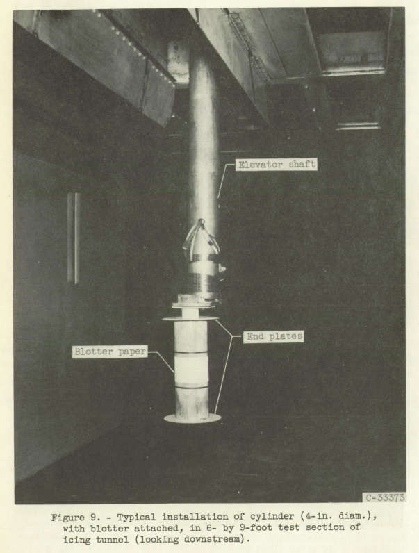
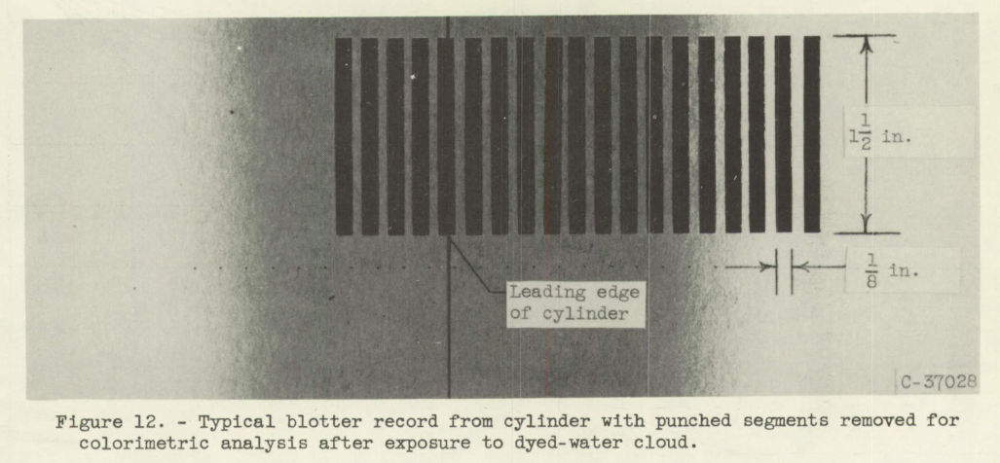
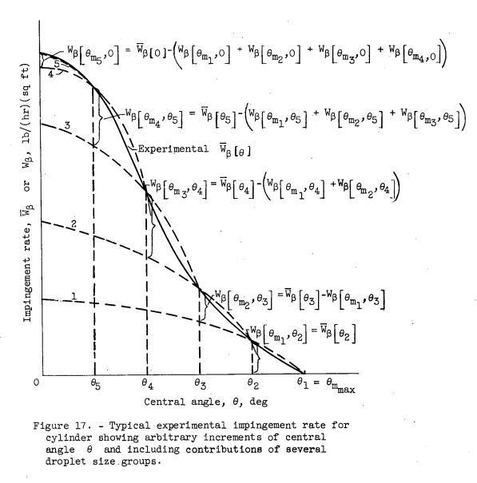
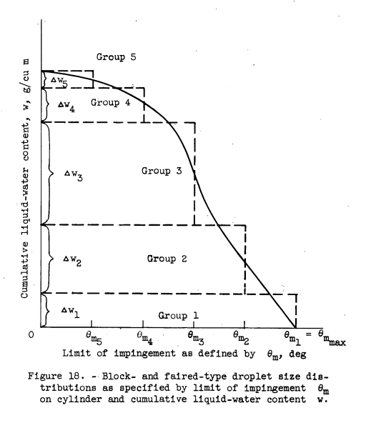
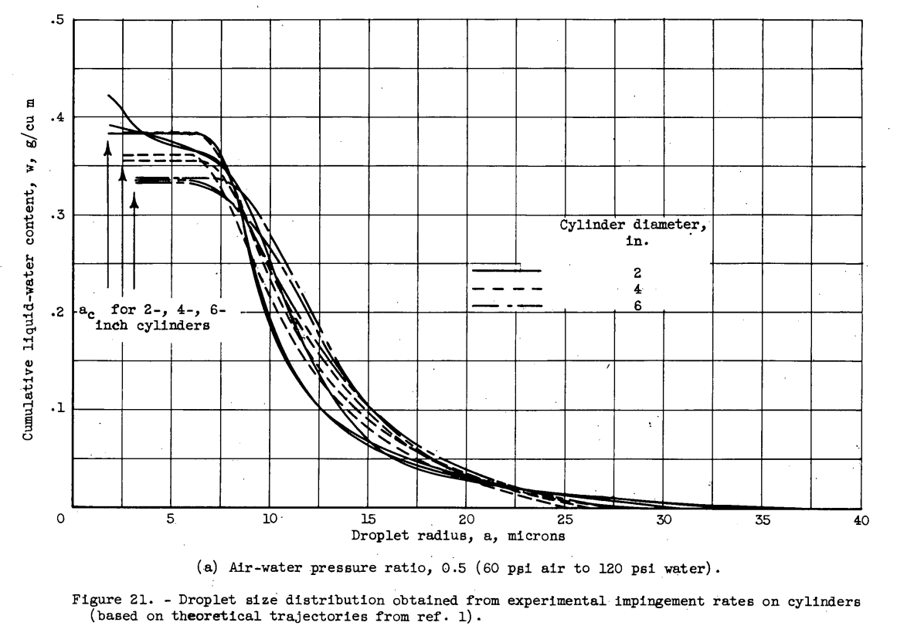
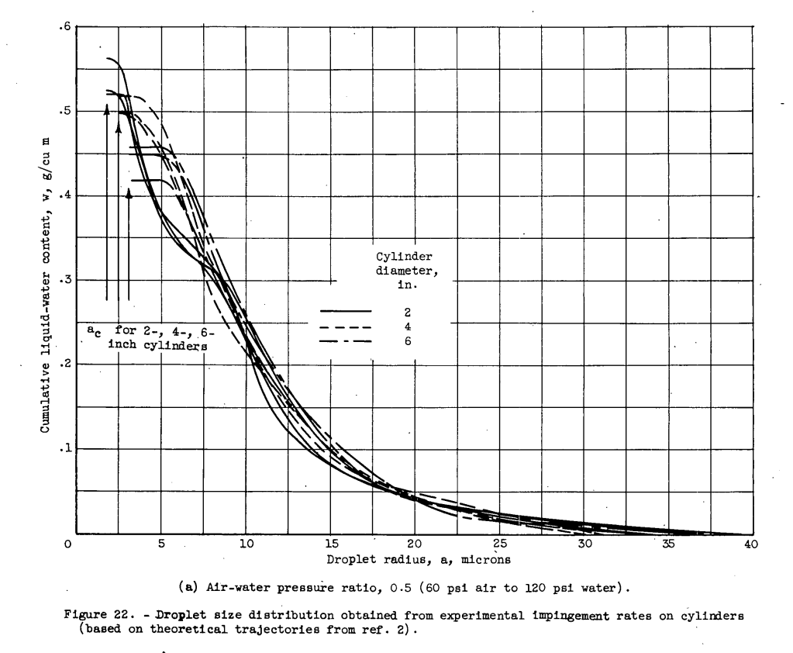
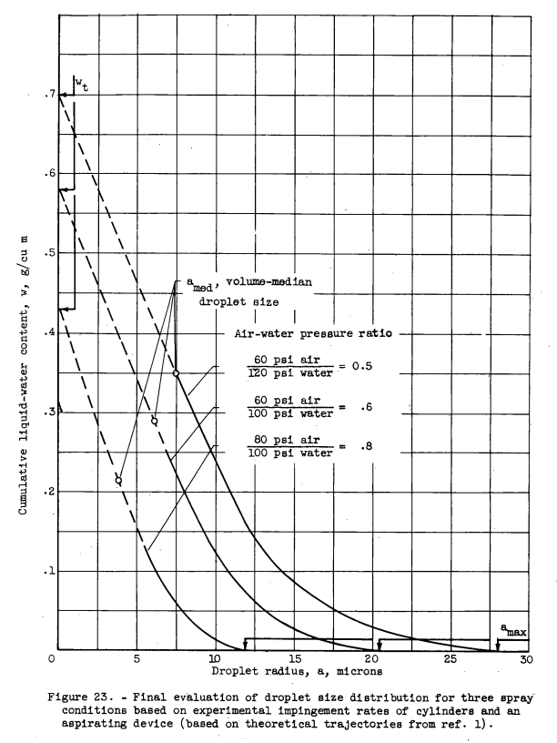
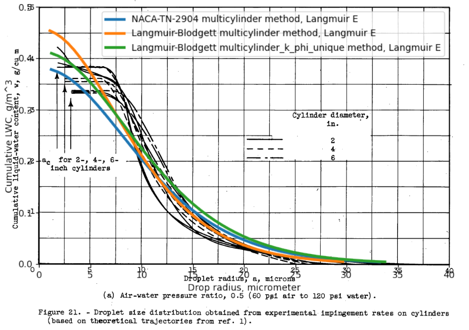

Title: NACA-TN-3338 
Category: NACA
tags: cylinder
status: draft

###>_"The present state of development of the camera (ref. 16) or the oiled-slide technique (ref. 17) for measuring droplet size is not considered so adequate a means for determining droplet size as the indirect method herein described."_

#"A Dye-Tracer Technique for Experimentally Obtaining Impingement Characteristics of Arbitrary Bodies and a Method for Determining Droplet Size Distribution" [^1]

##Summary 
A pioneering test method is described, and a drop size measurement analysis that did not quite work out.

##Key points  
1. A dye-tracer blotter-paper water drop impingement measurement technique is described. 
2. An analysis of test results attempted to determine the water spray drop size spectrum. 
3. The dye-tracer analysis is compared to the multicylinder method. 

##Abstract

> A dye-tracer technique has been developed whereby the quantity of
dyed water collected on a blotter-wrapped body exposed to an air stream
containing a dyed-water spray cloud can be colorimetrically determined
in order to obtain local collection efficiencies, total collection 
efficiency, and rearward extent of impingement on the body. In addition, a
method has been developed whereby the impingement characteristics obtained 
experimentally for a body can be related to theoretical impingement data 
for the same body in order to determine the droplet size 
distribution of the impinging cloud. Several cylinders, a ribbon, and an
aspirating device to measure cloud liquid-water content were used in the
studies presented herein for the purpose of evaluating the dye-tracer
technique. Although the experimental techniques used in the dye-tracer
technique require careful control, the methods presented herein should be
applicable for any wind tunnel provided the humidity of the air stream
can be maintained near saturation.

##Discussion

I characterize this as a pioneering test method, 
and a brilliant results analysis that did not quite work out. 

###The spray system

There is a detailed discussion of a dye and blotter paper method of experimentally 
determining water drop impingement rates.  

The (then) NACA Lewis Icing Research Tunnel (IRT) (now NASA Glenn) was used in the test. 
Cylinder test articles were constructed. 

After the blotter paper was exposed to dye spray, the paper was analyzed for de concentration. 

Special nozzles with fast acing solenoids were used. 
It is not clear to me if the nozzles were otherwise similar to the Icing Research Tunnel 
"STD" or "MOD1" nozzles, so they may produce a different spray characteristic. 

###The impingement data

After a chemical analysis of the dye concentration in the blotter paper 
the local water catch rates were calculated. 

###The distribution analysis

The impingement is divided into arbitrary segments, 
and beta curves corresponding to drop sizes for the impingement limit are 
constricted and summed to yield an approximate total beta curve. 
Fractions of total water content for each segment are determined during the process. 

The values from each group or segment are plotted, 
and a "faired" curve through them manually produced. 

The cylinder angle theta values can be translated into drop impingement limits and plotted. 
(Note that drop radius "a" is used here, not diameter) 

It is not surprising that the curves tend to flat-line at low drop sizes. 
The drop radii for K=0.125, where impingement would be zero, are noted on the figure as "ac".

The analysis was also conducted using data from Langmuir and Blodgett,
shown in Figure 22 below. 
It is not clear how this was done, as L&B did not provide beta curves. 
I speculate that the L&B Em and Theta_max values were used with an
assumed cosine relationship as in NACA-TN-2904.

> 

The results were set aside in favor of the NACA-TN-2904 results from Figure 21.

> The differences noted (between
figs. 21 and 22) are again caused by the differences inherent in the
theoretical results of references 1 and 2. Because more data points
are presented and the accuracy of the data is stated, reference 1 will
be used hereinafter rather than reference 2 as a basis for the 
subsequent results.

The flat results for small drop sizes in Figure 21 led to a re-evaluation:

> In obtaining a single curve which is the best representation of
the actual droplet size distribution existing in the tunnel for a given
set of spray conditions, it is reasonable to use an average of the nine
curves (three repeats times three cylinder sizes) in the larger droplet
size range where the results from all three cylinder sizes are in
reasonable agreement. In the range of the smaller droplet sizes (a < 6
microns, see fig. 21), it appears that the theoretical data are not
strictly applicable because a different droplet size distribution curve
is obtained for each cylinder size. However, the end point of the droplet 
size distribution curve (a = 0, w = wt) is single-valued and is
specified by the wt values obtained with the aspirating device. The
averages (for several repeats) of the total liquid-water content wt
obtained with the aspirator are summarized as follows:

> Because of the cylinder-size trend for droplet radii less than 
approximately 6 microns (fig. 21), a straight line was faired between a 6
microns and the tabulated value of wt for each pressure ratio. The
results of this interpretation of the data are shown in figure 23; the
reasoning underlying this interpretation is presented in the DISCUSSION
section.

> The accuracy of determining droplet size distribution by the use of
the dye-tracer technique together with theoretical trajectory data could
be definitely established if an accurate instrument were available to
measure directly a representative sample of all droplet sizes present in
the experimental spray cloud. The present state of development of the
camera (ref. 16) or the oiled-slide technique (ref. 17) for measuring
droplet size is not considered so adequate a means for determining droplet 
size as the indirect method herein described.

Unfortunately, we may never know the accuracy of the method, 
as there was not an independent measurement of the drop size distribution. 
Figure 23 frankly does not look like a natural or artificially produced drop size sprectrum that I have seen 
(they usually have an "S" shape, not a steep slope at one end), 
but perhaps the nozzles used in the test produced that size characteristic. 
I think that it is more likely that the aspirating device used to measure LWC was not very accurate, 
resulting in an artificially high left end point.
 
I think that here NACA-TN-3338 missed an opportunity. 
The oiled-slide measurement technique was studied in detail by Langmuir [^], 
and the potential shortcoming of the method noted. 
However, the technique can yield accurate results, 
if care is taken in both the sample collection and the processing of the samples. 
[I have used the oiled-slide and other drop sizing instruments method in natural icing flight tests].  

Langmuir chose to use oiled-slide data to develop the Langmuir distributions,
see ["A Langmuir B drop size distribution is (almost) a normal distribution"]({filename}A Langmuir B distribution is almost a normal distribution.md). 
And NACA-TN-3338 also chose to make comparision to a Langmuir distribution. 

###Multicylinder comparison

I wonder why they did not use the "go-to" method of the multicylinder analysis. 
This was perhaps another lost opportunity that would not require technology beyond what was available. 
Assuming that the measured impingement rates are accurate, 
there are data for three cylinder diameters to apply. 
This could yield values for MVD, LWC, and Langmuir distribution type, 
which is at least characterization of the breadth of the distribution. 
Author von Glahn was familiar with the multicylinder instrument. 
He was an author of NACA-RM-E51B12, which noted the use of multicylinders 
in the calibration of the icing tunnel: 
> Cloud droplet sizes and liquid-water contents in the tunnel
were measured by the rotating-multicylinder method and were in the
range of natural icing conditions. 

I performed the multicylinder comparison shown below in the file "naca_tn_3338_multicylinder.py". 
There are some similarities, but the NACA-TN-3338 method is generally steeper in the middle, 
and flatter on the ends than the multicylinder best fits. 

If I had to pick a best guess as to the true distribution, 
or at least a "close enough" representation,
I would pick the "Langmuir-Blodgett multicylinder_k_phi_unique" line. 
By that reckoning, the NACA-TN-3338 figure 21 values are "not bad" for MVD and LWC 
(it is hard to establish accuracy with only one comparision),
but, as mentioned above, have a different distribution shape.

I note how casually the (then) NACA Lewis Icing Wind Tunnel (IRT) is mentioned. 
There is no citation for the tunnel and its capabilities, 
and I had to look hard to find that one line from NACA-RM-E51B12 about using the rotating-multicylinder.
(In contrast, there are at least 18 publications in the NASA era about the IRT and its uses). 
The ASME recognized the IRT as an "International Historic Mechanical Engineering Landmark" in 1987. 

##Conclusions

> A technique for experimentally determining the impingement 
characteristics of an arbitrary body and a method whereby the droplet size
spectrum of the spray cloud can be determined from the experimental 
impingement on a body for which the theoretical trajectories are known
have been developed. These developments present an opportunity to study
experimentally the impingement characteristics of other shapes such as
airfoils, radomes, inlet cowlings, and asymmetrical bodies. Although
analytical trajectory studies can be made for these various bodies, the
problems associated with the determination of the flow fields and 
consequent droplet trajectories often prove difficult and tedious. Use of
the dye-tracer technique for arbitrary shapes in any suitable testing
facility would proceed as described herein for cylinders: The droplet
size distribution in the spray cloud would be established using bodies
for which the theoretical impingement characteristics are known, while
an aspirating device similar to the one described (appendix B) may be
used for the determination of total liquid-water content. The unknown
body with blotter then would be exposed and analyzed for local rates of
water impingement, including the determination of the maximum extent or
limit of impingement, and integrated for total collection efficiency.
Impingement limits and collection efficiency are often presented.

> ...

> The method of calculation is a step-wise approximation
and may be derived by methods similar to those used for obtaining the
droplet distribution in the section METHOD OF DETERMINING DROPLET-SIZE
DISTRIBUTION. The results of such an analysis would be useful in (1)
calculating the impingement rates for a body in a cloud of arbitrary
droplet size distribution, and (2) determining whether the assumptions
used in theoretical trajectory calculations are valid. This determination 
requires an independent means (reliable instrument) for measuring
the droplet size distribution.

##Citations

Cites 13

- Brun, Rinaldo J., and Mergler, Harry W.: Impingement of Water Droplets on a Cylinder in an Incompressible Flow Field and Evaluation of Rotating Multicylinder Method for Measurement of Droplet-Size Distribution, Volume-Median Droplet Size, and Liquid-Water Content in Clouds. NACA-TN-2904, 1953.
- Langmuir, Irving, and Blodgett, Katherine B.: A Mathematical Investigation of Water Droplet Trajectories. Tech. Rep. No. 5418, Air Materiel Command, AAF, Feb. 19, 1946. (Contract No. W-33-038-ac-9151 with General Electric Co.)
- Tribus, Myron: Modern Icing Technology - Lecture Notes. Eng. Res. Inst., Univ. of Michigan, Jan. 1952. (Air Res. and Dev. Command, USAF Contract AF 18(600)-51, E.O. No. 462 Br-1, Proj. M992-E.)
- Bergrun, Norman R.: A Method for Numerically Calculating the Area and Distribution of Water Impingement on the Leading Edge of an Airfoil in a Cloud. NACA-TN-1397, 1947.
- Brun, Rinaldo J., Gallagher, Helen M., and Vogt, Dorothea E.: Impingement of Water Droplets on NACA 65A004 Airfoil and Effect of Change in Airfoil Thickness from 12 to 4 Percent at 4° Angle of Attack. NACA-TN-3047, 1953.
- Brun, Rinaldo J., Gallagher, Helen M., and Vogt, Dorothea E.: Impingement of Water Droplets on NACA 651-208 and 651-212 Airfoils at 4° Angle of Attack. NACA-TN-2952, 1953.
- Guibert, A. G., Janssen, E., and Robbins, W. M.: Determination of Rate, Area, and Distribution of Impingement of Waterdrops on Various Airfoils from Trajectories Obtained on the Differential Analyzer. NACA-RM-9A05, 1949.
- Brun, Rinaldo J., Serafini, John S., and Gallagher, Helen M.: Impingement of Cloud Droplets on Aerodynamic Bodies as Affected by Compressibility of Air Flow Around the Body. NACA-TN-2903, 1953.
- Serafini, John S.: Impingement of Water Droplets on Wedges and Double- Wedge Airfoils at Supersonic Speeds. NACA-TR-1159, 1954. (Supersedes NACA-TN-2971.)
- Brun, Rinaldo J., and Dorsch, Robert G.: Impingement of Water Droplets on an Ellipsoid with Fineness Ratio 10 in Axisymmetric Flow. NACA-TN-3147, 1954.
- Dorsch, Robert G., Brun, Rinaldo J., and Gregg, John L.: Impingement of Water Droplets on an Ellipsoid with Fineness Ratio 5 in Axisymmetric Flow. NACA-TN-3099, 1954.
- Bergrun, Norman R.: An Empirical Method Permitting Rapid Determination of the Area, Rate, and Distribution of Water-Drop Impingement on an Airfoil of Arbitrary Section at Subsonic Speeds. NACA-TN-2476, 1951.
- Langmuir, Irving: Super-Cooled Water Droplets in Rising Currents of Cold Saturated Air, Pt. I. Res. Lab., General Electric Co., Oct. 1943-Aug. 1944. (Army Contract W-33-106-sc-65.)

cited by 10

- Dorsch, Robert G., Saper, Paul G., and Kadow, Charles F.: Impingement of Water Droplets on a Sphere. NACA-TN-3587, 1955.
- Bowden, Dean T.: Effect of Pneumatic De-Icers and Ice Formations on Aerodynamic Characteristics of an Airfoil. NACA-TN-3564, 1956.
- Gelder, Thomas F., Smyers, William H., Jr., and von Glahn, Uwe H.: Experimental Droplet Impingement on Several Two-Dimensional Airfoils with Thickness Ratios of 6 to 16 Percent. NACA-TN-3839, 1956.
- Hacker, Paul T., Saper, Paul G., and Kadow, Charles F.: Impingement of Droplets in 60° Elbows with Potential Flow. NACA-TN-3770, 1956.
- Lewis, William, and Brun, Rinaldo J.: Impingement of Water Droplets on a Rectangular Half Body in a Two-Dimensional Incompressible Flow Field. NACA-TN-3658, 1956.
- von Glahn, Uwe H.: Use of Truncated Flapped Airfoils for Impingement and Icing Tests of Full-Scale Leading-Edge Sections. NACA-RM-E56E11, 1956.
- Brun, Rinaldo J., and Vogt, Dorothea E.: Impingement of Cloud Droplets on 36_5-Percent-Thick Joukowski Airfoil at Zero Angle of Attack and Discussion of Use as Cloud Measuring Instrument in Dye-Tracer Technique. NACA-TN-4035, 1957.
- Lewis, James P., and Ruggeri, Robert S.: Experimental Droplet Impingement on Four Bodies of Revolution. NACA-TN-4092, 1957.
- Gelder, Thomas F.: Droplet Impingement and Ingestion by Supersonic Nose Inlet in Subsonic Tunnel Conditions. NACA-TN-4268, 1958.
- Gray, Vernon H.: Correlations Among Ice Measurements, Impingement Rates, Icing Conditions and Drag Coefficients for an Unswept NACA 65A004 Airfoil. NACA-TN-4151, 1958.

26 citations

##Related  
> The present state of development of the
camera (ref. 16) or the oiled-slide technique (ref. 17) for measuring
droplet size is not considered so adequate a means for determining droplet 
size as the indirect method herein described.
 
I think that here NACA-TN-3338 missed an opportunity. 
The oiled-slide measurement technique was studied in detail by Langmuir [^], 
and the potential shortcoming of the method noted. 
However, the technique can yield accurate results, 
if care is taken in both the sample collection and the processing of the samples. 
[I have personally used the oiled-slide method in natural icing flight tests].  

Langmuir chose to use oiled-slide data to develop the Langmuir distributions,
see ["A Langmuir B drop size distribution is (almost) a normal distribution"]({filename}A Langmuir B distribution is almost a normal distribution.md),
and was an advocate for the multicylinder method. 
NACA-TN-3338 chose to make comparision to a Langmuir distribution. 

The dye-tracer technique will be used in the post-NACA era, see NACA-CR-4257 [].

##Notes  
[1]: von Glahn, Uwe H., Gelder, Thomas F., and Smyers, William H., Jr.: A Dye-Tracer Technique for Experimentally Obtaining Impingement Characteristics of Arbitrary Bodies and a Method for Determining Droplet Size Distribution. NACA-TN-3338, 1955.  

Langmuir, Irving: Super-Cooled Water Droplets in Rising Currents of Cold Saturated Air, Pt. I. Res. Lab., General Electric Co., Oct. 1943-Aug. 1944. (Army Contract W-33-106-sc-65.)

Langmuir, Irving, and Blodgett, Katherine B.: A Mathematical Investigation of Water Droplet Trajectories. Tech. Rep. No. 5418, Air Materiel Command, AAF, Feb. 19, 1946. (Contract No. W-33-038-ac-9151 with General Electric Co.)

An Experimental Method for Measuring Water Droplet Impingement Efficiency on Two- and Three-Dimensional Bodies

Papadakis, M., Elangonan, R., Freund, Jr., G.A., Breer, M., Zumwalt, G.W. and Whitmer, L.: "An Experimental Method for Measuring Water Droplet Impingement Efficiency on Two- and Three- Dimensional Bodies," NASA-CR-4257, Nov. 1989.
https://www.wichita.edu/academics/engineering/icing/documents/NASA-CR-4257.pdf

https://scholar.google.com/scholar?hl=en&as_sdt=0%2C48&q=A+dye-tracer+technique+for+experimentally+obtaining+impingement+characteristics+of+arbitrary+bodies+and+a+method+for+determining+droplet+size+distribution&btnG=  

https://www.asme.org/wwwasmeorg/media/resourcefiles/aboutasme/who%20we%20are/engineering%20history/landmarks/117-icing-research-tunnel-nasa-lewis-research-ce.pdf  

[^3]: [https://github.com/icinganalysis/icinganalysis.github.io](https://github.com/icinganalysis/icinganalysis.github.io)  

von Glahn, Uwe H., Callaghan, Edmund E., and Gray, Vernon H.: NACA Investigations of Icing-Protection Systems for Turbojet-Engine Installations. NACA-RM-E51B12, 1951.

[NACA Icing Publications Database]({filename}naca icing publications database.md)  
