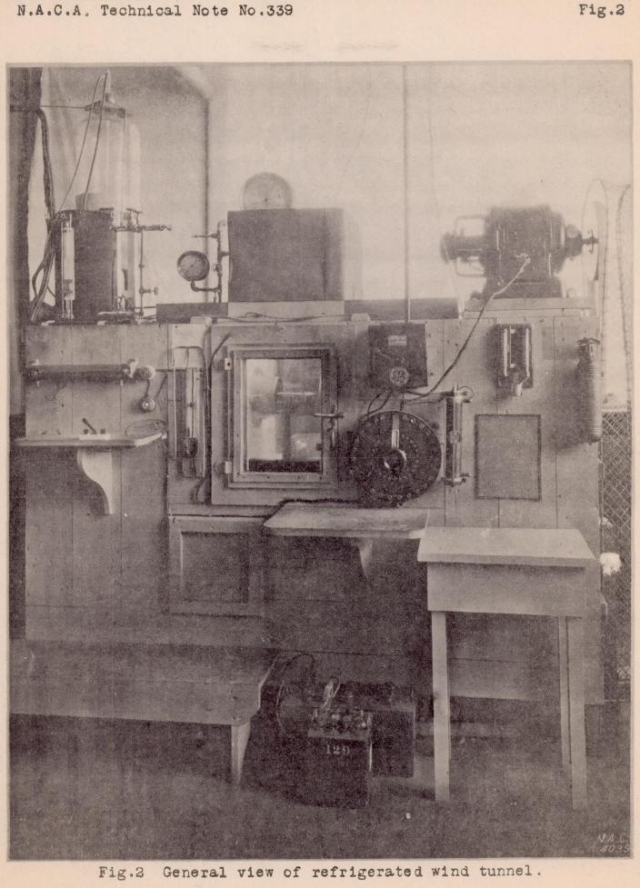
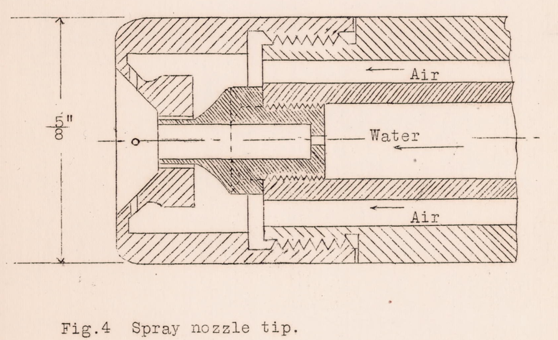
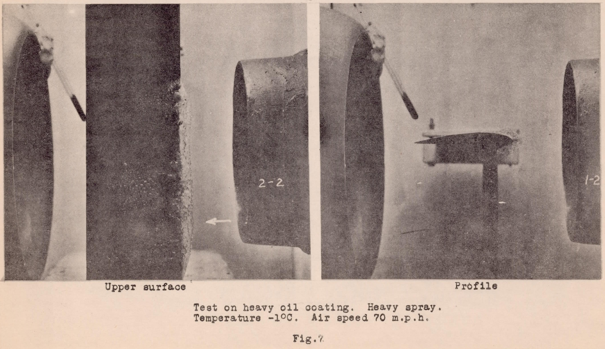
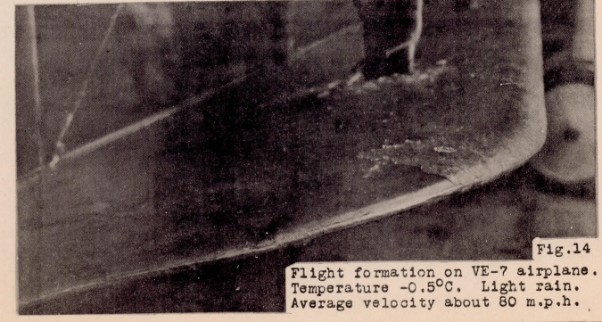

title: NACA-TN-339  
Date: 2022-07-18 12:00  
category: icing tunnels  
tags: icing tunnel  

### _"A spray, which consisted of very small drops, was found to be quite satisfactory"_  

# "Refrigerated Wind Tunnel Tests on Surface Coatings for Preventing Ice Formation"  

## Summary  
An early icing wind tunnel and test are described

## Key Points
1. An early icing wind tunnel with most of the components of current tunnels is described.  
2. A test of several coatings to prevent ice is detailed.  
3. Many of the points noted about icing tunnel test reflect current test experience.  

## Abstract  

>This investigation was conducted in the Refrigerated Wind
Tunnel at Langley Memorial Aeronautical Laboratory, Langley
Field, Virginia, to determine the effectiveness of various surface 
coatings as a means
for preventing ice formations on aircraft in flight.
The substances used as coatings for these tests are divided
into two groups:
compounds soluble in water, and those which are insoluble in water.
It was found that certain soluble compounds were apparently
effective in preventing the formation of ice on an airfoil model, 
while all insoluble compounds which were tested were found
to be ineffective.

## Discussion  

This is a good introduction to icing wind tunnels, 
as it illustrates the basic components common to most current icing wind tunnels, 
and it also illustrates some test challenges. 

The scale was limited (6-inch diameter throat), 
which limited the size of the test article 
(a 3-inch chord Clark Y airfoil construct of mahogany wood). 

This review will only superficially cover the test purpose, 
determining the performance of potential surface coatings to prevent ice formation. 

>Apparatus  
>A diagram of the refrigerated wind tunnel, which is of the
open-throat type with an air stream 6 inches in diameter, is
shown in Figure 1.
The tunnel proper, which is of metal, is insulated from the 
outside air by layers of cork and wood.
The test chamber 
is insulated by double glass doors and windows
which enable the ice-forming process to be observed and photographed 
from the outside (Fig. 2).
The air temperature in the
tunnel is lowered and regulated by the flow of cold brine through
the hollow, metal guide vanes, the brine being cooled by a refrigerating 
apparatus of commercial type (Fig. 3).
The circulation of the air in the tunnel is maintained by a propeller driven
by an electric motor.

  

  

Most current recirculating-loop icing wind tunnels have the same components:
fan, turning vanes, converging and diverging sections, refrigeration and a heat exchanger, spray nozzles, and
a nominal test section.  

There was an array of four water spray nozzles. 
The basic spray nozzle design is similar to, but not identical to, 
those used in the later NACA Lewis Icing Research Tunnel (IRT). 
A central stream of water is affected by circumferential air jets. 
Adjusting the water pressure and air pressure result in different 
combinations of drop size and liquid water content. 

  

>Certain preliminary tests were made in the wind tunnel to
determine the best form of water spray necessary to produce ice
of smooth appearance and which would be similar in structure
and form to that observed in flight (Reference 12), in order to
make a study of possible preventives.
It was found that the
character of the formations obtained depended to a great degree
on the quantity of water admitted to the tunnel per unit of time.
A spray which consisted of large drops was found to use excessive
quantities of water which could not be properly regulated without 
giving very poor dispersion in the jet, and which gave formations 
of ice on the model of a very different shape from any
obtained in flight.
A spray, which consisted of very small
drops, was found to be quite satisfactory and was used in all
the following tests, as it could be easily controlled to give
even dispersion across the air stream at any desired rate of
water output.

It is not detailed how the drop size was measured. 

Several candidate ice prevention coatings were tested: 

>Insoluble compounds:  
>- Light lubricating mineral oil.  
>- Heavy lubricating mineral oil.  
>- Cup grease.  
>- Vaseline.  
>- Paraffin.  
>- Simonize wax.  

>Soluble compounds:  
>- Glycerine.  
>- Glycerine and calcium chloride.  
>- Molasses and calcium chloride.  
>- Hardened sugar solution.  
>- Hardened glucose solution.  

>In all the tests only half of the airfoil was covered with
the substance under consideration, the other half being left
bare for comparison.
In all accompanying photographs of ice
formations, the coated half of the wing is indicated by an arrow.

> In these first tests, oils, greases, and waxes showed no
tendency towards prevention or even hindrance of the formation
of ice, and actually, in some cases they augmented it as shown
in Figure 7.
It was originally believed that the drops would
not remain on these substances, since they are supposed to shed
water, but this action did not take place.
The drops adhered
to the surface, especially at the stagnation point of the leading edge, 
and froze quite as readily as on the bare wing.

  

>Tests on the soluble substances likewise did not show a
marked preventive tendency.
It was believed that these substances would dissolve with the water 
as fast as it struck the
surface , and thus lower the freezing point so that ice would
not form.
Owing to the low viscosity of the glycerine and calcium chloride solutions, 
they immediately blew back from and
exposed the leading edge on which ice then formed.
Tests made on the sugar solution did not show this tendency to blow back.
The solution, however,was not easily dissolved, consequently
ice formed readily on the leading edge on top of the coating.
It was difficult to distribute this sticky substance evenly on
the wing and some of it crystallized upon cooling, showing that
it was a rather impractical coating at the best.
In tests on a
hardened glucose solution (Fig. 8), made at the suggestion of
the U.S. Bureau of Standards, the same general process took place
as in the case of the sugar,
except that for the first two minutes of the test the formation 
of ice on the coated side was hindered.
However, after the formation had once started, it
built up rapidly showing apparently that there was too much water
falling on the surface for the glucose to have much effect.

  

>Assuming that the conditions under which the first series
of tests was made were too severe and probably not representative 
of flight conditions, a second series of tests was made
which gave less exaggerated formations.
These second test conditions were obtained by reducing the quantity of 
spray water admitted to the tunnel per unit of time to one-fifth of the previous
anount, and by reducing the duration of the tests to nine
minutes.
A few preliminary tests under these altered conditions
appear ed to indicate that the formations obtained were more moderate 
and approximated more nearly those of full scale.

>Information on various flight tests has been carefully
studied and compared with the wind tunnel results on the uncoated
airfoil.
For comparison with wind tunnel formations, a photograph of an actual ice 
formation obtained in a test flight at this laboratory is given in Figure 14.
This particular example was obtained during a sleet and rain storm 
at a recorded air temperature of about -0.5 C.
The formation was collected in about 15 minutes, and though very light, 
had a characteristic shape and structure.

  

>The amount of water present in the wind tunnel jet was measured 
roughly to determine the actual density of the spray used
in the tests.
These measurements were compared with meteorological tables, 
and indicate that the spray density used in the
first series of tests,
which was about 2000 milligrams of liquid
water per cubic meter of air, corresponds to
excessive rain.
Similarly, the density used in the second series, which was
about 500 milligrams per cubic meter, corresponds with figures
for a moderate to heavy rain.
It is believed that the latter 
density represents more closely average ice-forming weather conditions.

It is not explained further how the 
"amount of water present in the wind tunnel jet was measured".  

## Conclusions  

>Within the scope of these tests which consisted only in investigating 
the ability of certain substances when applied to
an airfoil surface to prevent the formation of ice, none of the
compounds showed any appreciable preventive action with the
heavy spray.  
The following conclusions may be drawn from the
results of tests in which the lighter spray was used:  
>1. Insoluble compounds, such as oils, waxes, greases,
and paints, are ineffective in preventing the formation of ice.  
>2. Soft soluble compounds, such as mixtures of molasses and glycerine 
with calcium chloride, which do not have
a strong tendency to keep their shape and to adhere to the
surface, blow away from the leading edge and do not prevent
the growth of ice.  
>3. Hard soluble compounds, such as glucose and Karo
syrup, which hold their shape and adhere strongly to the
surface, prevent ice formations within certain temperature
limits, depending on their solubility.
>4. Coatings need only be applied to the leading edge
of an airfoil as far back as the maximum ordinate.  
>5. Other methods of applying substances to the wing
surfaces may prove to be effective, such as the continuous 
application of a liquid soluble compound to the leading edge.  

It is not clear that this particular icing wind tunnel was used for other icing tests. 
See ["We Freeze to Please": A History of NASA's Icing Research Tunnel and the Quest for Flight Safety](https://ntrs.nasa.gov/citations/20020066162)
for more information. 

### Icing wind tunnel tests lessons learned

NACA-TN-339 illustrates some general "lessons learned"
I have from icing wind tunnel tests. 

#### Calibration

NACA-TN-339 had the goal   

    "to produce ice of smooth appearance and which would be 
    similar in structure and form to that observed in flight"

Water spray parameters were adjusted to achieve this. 
Current calibrations typically have MVD and LWC values measured, 
but in 1930 there were limited means to achieve that.  

Sometimes all one needs is a relative result, 
such as compound A performed better than compound B, 
where perhaps almost any icing condition would do, 
but I have found that the time invested in ensuring 
calibration to your target environment is time well spent. 

#### Spray uniformity  

    "A spray which consisted of large drops was found to use excessive
    quantities of water which could not be properly regulated without 
    giving very poor dispersion in the jet, and which gave formations 
    of ice on the model of a very different shape from any
    obtained in flight."
    
Current icing wind tunnel calibration reports usually include a spray uniformity map,
usually determined by placing a metal grid in the test section and 
measuring ice thickness at several locations. 
Being within +/-20% of center-line or nominal concentration is often
considered to be "uniform enough". 
For large water drop icing conditions, the uniform area may be a rather small portion
of the test section. 

Different test purposes may have different uniformity requirements.  

#### Iteration

    "Assuming that the conditions under which the first series
    of tests was made were too severe and probably not representative 
    of flight conditions, a second series of tests was made
    which gave less exaggerated formations."

It is likely that you will learn something during the test, 
that will lead you to adjust later test conditions. 

An exception to this may be qualification or certification tests, 
where the conditions are prescribed, 
and (hopefully) one is just confirming the expected result. 

#### Comparison to other test environments  

    "none of the compounds showed any appreciable preventive action 
    with the heavy spray."  
    
While the surface coatings selected for test may have been "common sense" 
based on experience with static conditions, 
things are different in the dynamic formation of ice in an icing wind tunnel,
or natural icing flight conditions. 

Many times I have heard variations on the phrase "But it worked in our lab!"  

#### Consider small scale tests

Limited scale icing wind tunnels have similar roles today, 
testing small components, investigating "icephobics", and research studies. 

There are several advantages to the small scale test facilities, including:  

- low cost test article construction, low operating and ownership costs   
- good access and visibility (the entire test section wall is glass or clear plastic, and removable)  
- good test productivity (get to target conditions quickly, easy to change or adjust the test article, no large hoist required)  

So, if you have a test that can be scaled down, consider using a smaller test facility.  

You might perform a preliminary test at a smaller scale facility, 
learn some things, 
and then test at a larger scale facility. 

However, there are challenges, 
particularly if one wishes to scale results up to a larger scale 
(without larger scale tests). 
We will cover some of those in a later post in the [Icing Wind Tunnel Test thread]({filename}Icing Wind Tunnel Test Thread.md). 

## Citations  

NACA-TN-339 cites 12 publications:

- Simpson, G. C.: The Water in the Atmosphere. Nature, April 14, 1923, London.  
- McAdie, A.: The Principles of Aerography. Rand, McNally & Co., 1917.  
- Milham, W. I.: Meteorology. MacMillan Company, 1918.  
- Geddes, A. E. M.: Meteorology. B1ackie and Son, 1921.  
- Gregg, W. R.: Aeronautical Meteorology. Ronald Press Company, 1928  
- Barnes, H. T.: Ice Engineering. Renouf Publishing Company, 1928.  
- Kopp, W.: Danger of Ice Formations on Airplane. N. A. C. A. Technical Memorandum No. 499, 1929.  
- Carroll, Thomas, and McAvoy, William H.: The Formation of Ice upon Airplanes in Flight. NACA-TN-313, 1929. [ntrs.nasa.gov](https://ntrs.nasa.gov/citations/19930081134)
- McAdie, A.: Cloud Formations as Hazards in Aviation. McAdie, 1929.  
- Hubner, E.: Ice Formation on Airplanes. German Meteorological Service Report No. 25.  
- Barnes, H. T.: Adhesion of Ice Research. National Research Council, 1929.  
- Carroll, Thomas, and McAvoy, William H.: The Formation of Ice upon Airplanes in Flight. NACA-TN-313, 1929. [ntrs.nasa.gov](https://ntrs.nasa.gov/citations/19930081134)

NACA-TN-339 is cited once in the [NACA icing publications database]({filename}naca%20icing%20publications%20database.md) [^2]  

- Theodorsen, Theodore, and Clay, William C.: Ice Prevention on Aircraft by means of Engine Exhaust Heat and Technical Study of Heat Transmission from a Clark Y Airfoil. NACA-TR-403, 1931. [ntrs.nasa.gov](https://ntrs.nasa.gov/citations/19930091477)  

An online search [^3] found 9 citations of NACA-TN-339.

## Notes  

[^1]: Knight, Montgomery, and Clay, William C.: Refrigerated Wind Tunnel Tests on Surface Coatings for Preventing Ice Formation. NACA-TN-339, 1930 [ntrs.nasa.gov](https://ntrs.nasa.gov/citations/19930081168).  
[^2]: [NACA icing publications database]({filename}naca%20icing%20publications%20database.md)   
[^3]: 
[scholar.google.com](https://scholar.google.com/scholar?hl=en&as_sdt=0%2C48&q=Refrigerated+Wind+Tunnel+Tests+on+Surface+Coatings+for+Preventing+Ice+Formation&btnG=)  

