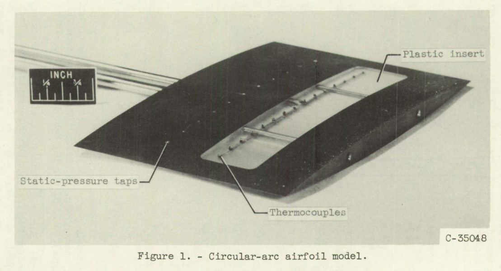
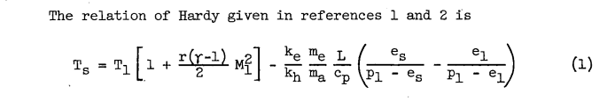
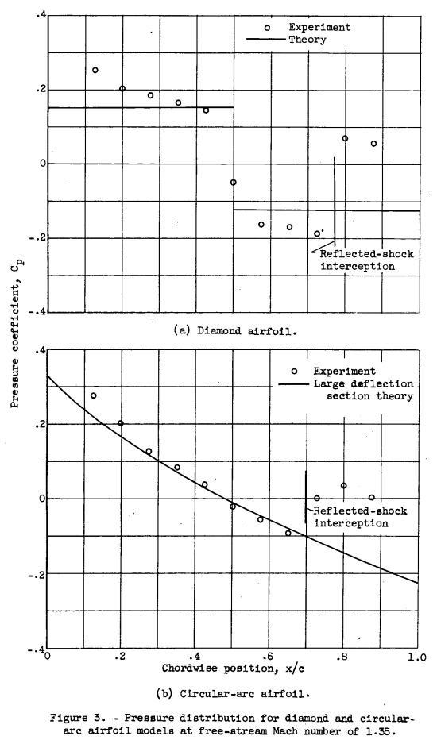
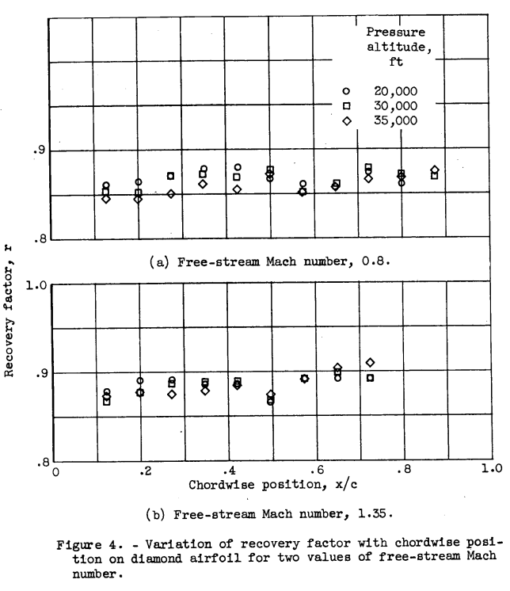
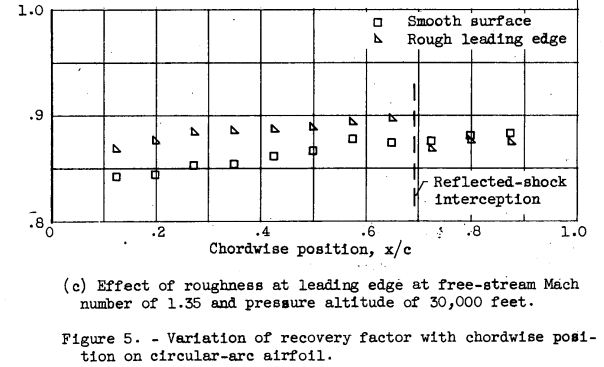
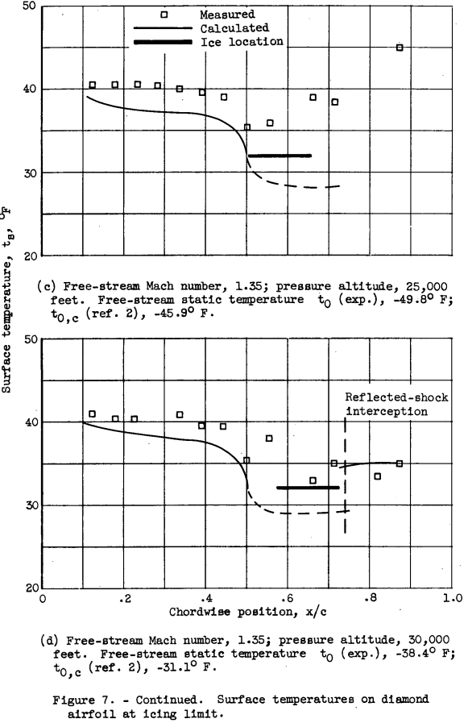
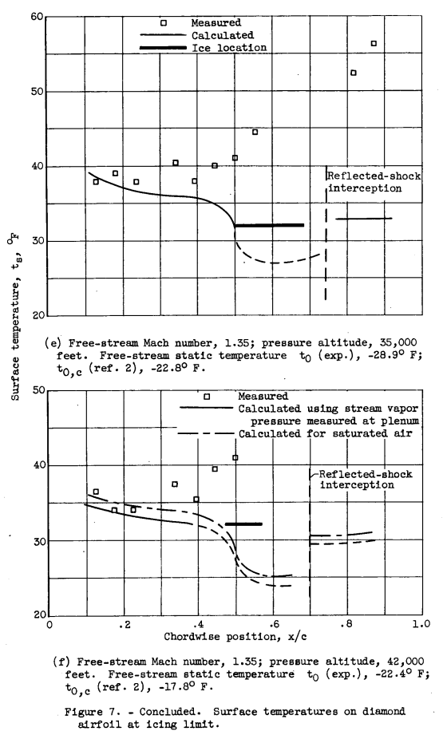
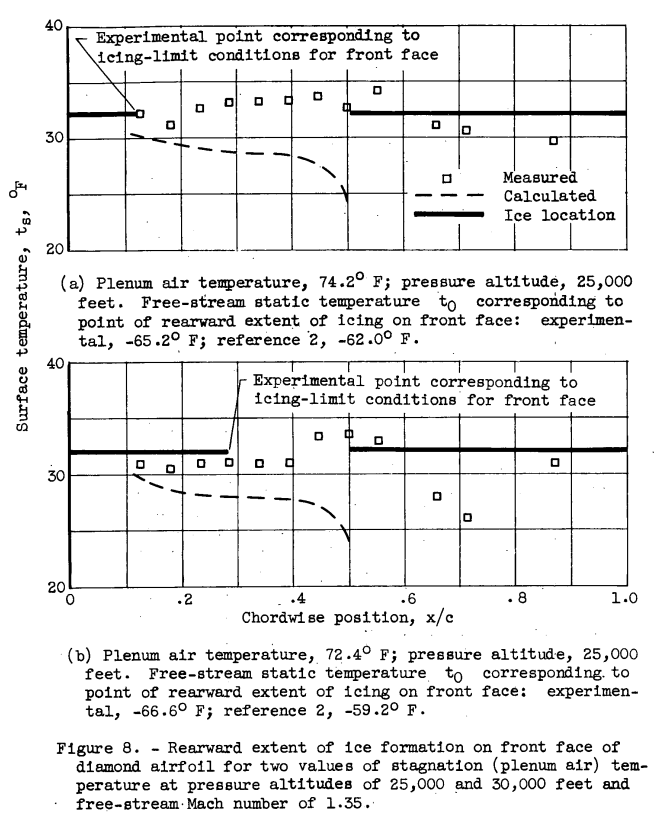
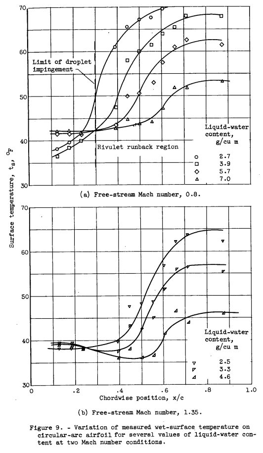
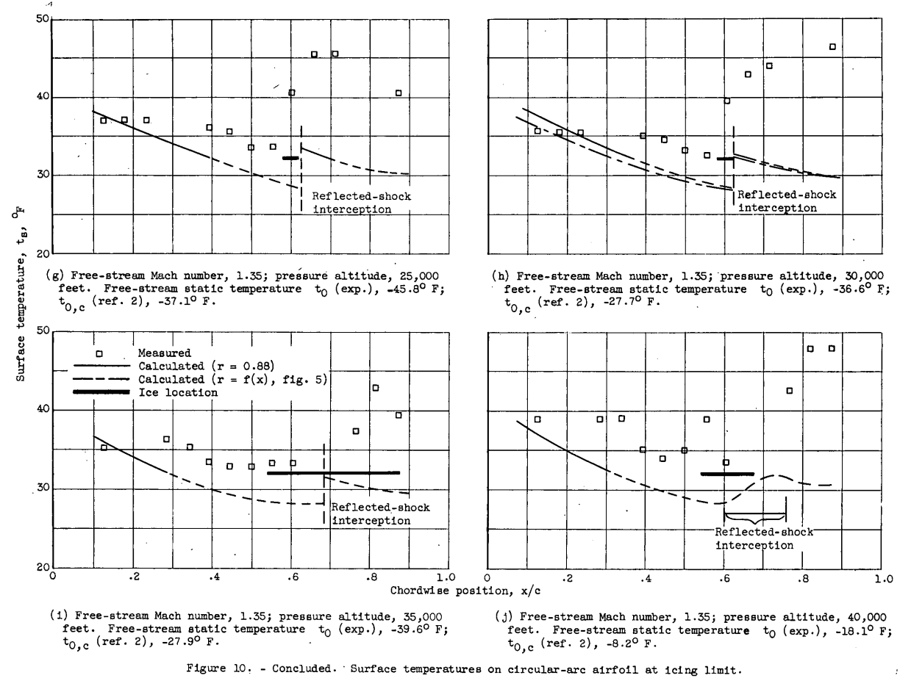

title: NACA-TN-3396  
Date: 2022-05-12 12:00  
Category: NACA  
tags: thermodynamics  

###_"into the transonic and supersonic regimes, the frictional heating becomes of considerable importance to icing."_  

#"Icing Limit and Wet-Surface Temperature Variation for Two Airfoil Shapes under Simulated High-Speed Flight Conditions"

  

##Summary  
Predictions of the icing limit temperature were "sufficiently accurate" in tests at Mach 1.35. 

##Key points  

1. Surface temperatures in icing conditions are challenging to measure.  
2. Apparently small differences in pressure coefficient and recovery factor values are important at high Mach values. 
3. Partial surface wettedness makes comparisons between analysis and test challenging.  
4. Thermal conduction in the substrate affects runback ice.  
5. Predictions of the icing limit temperature were "sufficiently accurate" in tests at Mach 1.35.    

##Abstract 

>Frictional heating resulting from flight at high speeds effectively
reduces the value of ambient-air temperatures at which ice forms on aircraft 
surfaces. An experimental study was made of the wet-surface temperature 
and the stream conditions that result in ice-free surfaces for
bodies in flight through icing clouds, and the results obtained are compared 
with values calculated using an analytical method. Two symmetrical
airfoil models, one of diamond shape and the other of double-circular-arc
contour, were used in the investigation. Results are presented for Mach
numbers from 0.6 to 1.35 and for pressure altitudes from 25,000 to 40,000
feet.  
The experimental investigation gave values of the wet-surface temperature 
that were consistently 20 to 40 F higher than the values calculated 
by the analytical method for all but the foremost part of the
airfoils. The analytical method gave conservative results, compared with
the experimental results, predicting the initial formation of ice to
occur at values of ambient-air temperature up to 120 F higher than were
found experimentally. The experiments generally substantiated the analytically 
determined location of critical regions on the bodies for the
initial formation of ice and provided sufficient agreement with analytical 
results to prove their validity.

##Discussion  

For brevity, I will focus on the results at Mach 1.35, 
although results at other Mach values were also presented. 

>The experimental investigation of the icing limit consisted essentially 
in determining the value of the stream static temperatures at
which ice would first start to form on, or just be removed from, a surface 
in a high-velocity air stream. For this purpose, a symmetrical diamond 
airfoil and a symmetrical circular-arc airfoil, each having a chord
length of 6 inches and a thickness-to-chord ratio of 6 percent, were
used in the study. Both airfoil models were made of brass and were provided 
with 11 static-pressure taps in the chordwise direction. A transparent 
plastic insert, which formed a relatively large (1 by 5 in.)
portion of the central part of each airfoil, provided an insulated region
free from conduction effects where local surface temperatures could be
determined. The ratio of the thermal conductivity of the plastic insert
to that of the rest of the model was approximately 2.5x10^-3. Fifteen
thermocouples were located in the surface of the plastic in a chordwise
direction parallel to the static taps. A photograph of the circular-arc
airfoil model showing the static taps, the plastic insert, and the 
thermocouples is presented in figure 1. The diamond airfoil was of similar
construction.

  

###Analysis

Equations from [NACA-ARR-5G13]({filename}NACA-ARR-5G13.md) [^2] were used to calculate the wet surface temperature. 

  

Test section temperature and humidity were measured and controlled:  

>The air for the tunnel was provided from a central supply system
at the following initial conditions: pressure, 10 pounds per square
inch gage; temperature, -20 F; and humidity ratio, approximately 3.0x10-4
pounds of water vapor per pound of dry air. By means of electric and
steam heaters and a control valve at the inlet to the plenum chamber, the
air was conditioned to the desired values of temperature and pressure at
the tunnel test section.  
A sensitive dewpoint meter was used to determine the frostpoint temperature 
of a continuous sample of air from the tunnel plenum chamber.
An air-atomizing spray nozzle, located approximately 18 inches up-
stream of the model as shown in figure 2, was used to provide local
values of the liquid-water content of the air from 0.5 to 7.0 grams per
cubic meter at the model.

>METHOD AND PROCEDURE  
The icing limit has been defined as "the set of flight conditions
which provides a wet and ice free surface temperature of 32 F for a
particular point on a body traveling in an icing cloud" (ref. 2). The 
general equation (1) does not include the 32 F surface temperature
restriction, and can be checked at other temperatures. The specific application 
of the general equation to the icing limit adds no complication,
except that, for the experimental investigation, a slight amount of ice
must form to enable the determination of the icing limit. Thus, experimentally 
the release of the heat of fusion of a small amount of ice occurs
but is negligible and is not considered in the analysis.

> The experimental value of the icing limit was determined for each
Mach number and pressure altitude condition by first selecting a value
of plenum air temperature for which ice would form on the model, and
gradually increasing the temperature until the ice would no longer form.
No appreciable accumulation of ice was allowed to form on the model, as
the local pressure changes caused by the rough ice are conducive to the
formation of more ice, and the formation of more than minute quantities
of ice would require that the heat of fusion be considered in the investigation. 
The value of the plenum temperature that corresponds to the
icing-limit conditions was then used to determine the value of free-stream 
static temperature on the basis of a dry-air adiabatic process to
be compared with the analytical results of references 1 and 2.

###Results  

>Chordwise Variation of Pressure Distribution  
Pressure distributions on the models for M0 = 1.35 are shown in
figure 3. 

  

>Figure 4 shows recovery factor as a function of the chord.wise posi-
tion for the diamond. airfoil model at values of the free-stream Mach num-
ber of 0.8 and 1.35. At the lower Mach number condition (fig. 4(a)), the
value of the recovery factor was approximately 0.86 over the front half of
the model and 0.87 over the rear half. For the supersonic case (fig.
4(b)), the value of the recovery factor was higher, averaging slightly
greater than 0.88 over the front surface and approximately 0.89 for the
rear surface.  
  

Leading edge roughness affects the recovery factor:

>The recovery factor obtained when the occurrence of fully turbulent
flow is accelerated by roughness near the leading edge is shown in 
figure 5(c). A band of number 80 grit, 3/16 inch wide, was cemented to the
model just behind the leading edge to promote the increased turbulence.
The recovery factor behind the roughened surface is 0.87 at the first
point of measurement, as compared with 0.845 obtained with the smooth
surface. The increase in recovery factor due to roughness diminishes as
a function of the distance from the leading edge, showing that almost
fully turbulent flow exists at the midchord position without roughness.

  

A recovery factor value to be used for wet conditions was estimated. 

>The recovery factor can be determined only for a dry surface; therefore, 
the effect of a surface water film cannot be evaluated, but should.
be of no greater magnitude than that experienced with the leading-edge
roughness. For both the diamond and circular-arc airfoils, a value of
0.88 for the recovery factor would seem to be applicable for conditions
involving some roughness due to water film or ice for all but the very
foremost regions of the airfoils. 

>Diamond Airfoil  
Surface temperature and icing limit - rear surface. - The existence
of a critical region for the formation of ice just behind the shoulder
of the diamond airfoil was predicted and experimentally substantiated in
reference 1. A similar result was experienced. during the present investigation, 
and a photograph of ice formed. on the rear surface of the airfoil model 
is shown in figure 6. Conduction of heat from the tunnel
walls and from the unwetted regions of the brass portion of the model
prevented the formation of ice on any part of the model except the plastic
insert and areas immediately adjacent.

The effect of partial surface wettedness or runback rivulets was noted.

> Experimental values of the wet-surface temperature behind the shoulder
 were often not obtained, because as the water film flowed over the
shoulder it divided into rivulets that frequently missed the thermocouples
entirely. 

This illustrates some of the difficulties of measuring surface temperatures in icing conditions. 
Several times I have observed ice on a test article when the thermocouples read something above 0C. 

  

  

Differences in measured and theoretical temperatures were discussed:

>The forward extremity of the observed ice formation was considered
as the point corresponding to the point defined. in the icing-limit 
definition, and the free-stream static temperature (icing limit) was 
determined for the conditions existing at that point from reference 2. 
The values so obtained are presented in the figure legends together with the
experimentally determined free-stream static temperature. The experimental 
value is from 40 to 80 below the value determined from reference 2.
The thermocouples located in the regions corresponding to the observed
chordwise position of the ice locations for the most part did not indicate 
freezing-level temperatures. This discrepancy in the results was
apparently caused. by the partly wetted nature of the surface and consequent 
incomplete spanwise development of the ice formation, which were
thus not always directly over the thermocouple junctions.

> As the air temperature was reduced, ice on the forward surfaces
formed first in the region directly behind the leading edge, and further
redaction in the stream temperature caused the ice to extend farther back
toward the shoulder. Thus, the point on the surface for which the icing-
limit definition applies is the rearward extremity of the ice formation.
Figure 8 shows the change in the rearward extent of the icing for two air
temperatures at two pressure altitudes.  
  
> For each of the stream conditions
shown, the calculated surface temperature indicates that the region just
ahead of the shoulder should be more susceptible to icing than any other
part of the forward surface. However, the occurrence of ice formations
first near the leading edge, and the rearward movement of the icing with
reduction in air temperature may probably be caused by the lower recovery
factor near the leading edge and by the high rates of heat transfer and
evaporation combined with a value for the ratio of ke/kh greater than
unity if laminar flow exists in this region. The results of reference 2
apply strictly only to turbulent flow, and. the changes in recovery factor
and heat and mass transfer that occur in the leading-edge region are not
included in the analysis of reference 2. 

>Circular-Arc Airfoil  
Impingement. - On the circular-arc airfoil, direct impingement of
the water droplets occurred only over approximately the first 30 percent
of chord. Behind the impingement region, surface tension and viscous
forces caused the runback water to separate into rivulets. As this investigation 
was concerned primarily with the temperatures of wet surfaces,
it was necessary to provide sufficient runback water to result in nearly
fully wetted surfaces behind the limit of impingement, even though high
values of liquid-water concentration were required. Although the effect
on the surface temperature of increasing the liquid-water concentration
is similar for the circular-arc and the diamond airfoils, the smaller
droplet impingement area makes the effect of partial wetness of the surface 
aft of the limit of impingement more apparent for the circular-arc
airfoil.  

>In figure 9 and the figures following, 
any increase in temperature as a function of chordwise position aft
of the midchord position mist be considered to be caused by an 
incompletely wet surface at the thermocouples.

  

>Surface temperature and icing limit. - Figure 10 presents measured
surface temperatures obtained with the circular-arc airfoil, together
with calculated surface temperatures (r = 0.88) and observed ice-
formation locations for Mach numbers of 0.6, 0.8, and 1.35 at pressure
altitudes from 25,000 to 40,000 feet. Included in each figure for the
30,000-foot pressure altitude condition is the surface temperature calculated 
with values of the recovery factor corresponding approximately to
the variation with chordwise position shown in figure 5 (figs. 10(b),
(e), and (h)).

>The results obtained for several pressure altitudes at a Mach number 
of 1.35 are shown in figures 10(g) to (j). Ice was observed to form
first in the region just behind the midchord position. Measured and calculated 
surface temperatures both show agreement as to the location of
the critical region for the initial formation of ice. Surface temperatures 
very near the freezing point were measured in the vicinity of the
ice location at each of the altitude conditions. Calculated surface temperatures 
approximately 40 F below the measured temperature were obtained
in the critical region. The trend of the measured surface temperatures
to values lower than the calculated. temperature in the leading-edge region 
is apparent in figures 10(g) to (j) as it was.in previous figures
for both the diamond and circular-arc airfoil models. The icing-limit
temperatures "t0,c" based on the location of the ice, included in the
figure legends, show that reference 2 predicts the formation of ice at
temperatures from 70 to 12° F higher than the experimentally determined
limiting temperature. The occurrence of the ice formation near the
reflected-shock intersection and the slope of the calculated surface temperature 
curve indicate that the ice might have formed nearer the trailing
edge and at a higher stream temperature if the shock had not been present. 

  

##Conclusions  

>SUMMARY OF RESULTS  
The twofold experimental investigations to determine the wet-surface
temperatures on bodies in subsonic and supersonic air streams, together
with determination of the stream conditions for which ice will just start
to form on the surfaces, yielded the following results:  
>1. Measured values of the wet-surface temperature were consistently
20 to 40 F higher than were calculated with equations given in references
1 and 2 together with experimental free-stream static temperatures for
all but the foremost part of the fully wetted regions of the models.  
>2. Agreement between the experimental and analytical results shows
that the results of references 1 and 2 are sufficiently accurate to be
applied generally. Calculated values of the icing-limit conditions were
consistently conservative compared with the experimental results, predicting 
the formation of ice at values of ambient-air temperature up to
120 F higher and at an average value 70 F higher than the values determined 
by experiment.  
>3. The locations of analytically determined regions on the airfoil
susceptible to the initial formation of ice were generally substantiated
by experiment. An exception was observed in the case of the circular-arc 
airfoil model at subsonic airspeeds, for which the region of initial
ice formation occurred near the leading edge instead of at the midchord
region as predicted analytically.  

While NACA-TN-3396 is not cited often in the literature, 
I recommend that anyone working with runback ice study it closely, 
in more depth than in this review. 

##Citations  

NACA-TN-3396 cites 8 publications: 

- Callaghan, Edmund E., and Serafini, John S.: Analytical Investigation of Icing Limit for Diamond Shaped Airfoil in Transonic and Supersonic Flow. NACA-TN-2861, 1953.  
- Callaghan, Edmund E., and Serafini, John S.: A Method for Rapid Determination of the Icing Limit of a Body in Terms of the Stream Conditions. NACA-TN-2914, 1953.  
- Hardy, J. K.: Kinetic Temperature of Wet Surfaces A Method of Calculating the Amount of Alcohol Required to Prevent Ice, and the Derivation of the Psychrometric Equation. NACA-ARR-5G13, 1945  
- Callaghan, Edmund E.: Analogy Between Mass and Heat Transfer with Turbulent Flow. NACA-TN-3045, 1953.  
- Coles, Willard D., and Ruggeri, Robert S.: Experimental Investigation of Sublimation of Ice at Subsonic and Supersonic Speeds and its Relation to Heat Transfer. NACA-TN-3104, 1954.  
- Nukiyama, Shiro, and Tanasawa, Yasushi (E.Hope,trans.): Experiments on the Atomizations of Liquids in an Airstream. Rep. No. 4, The Influence of the Characteristics of the Liquids on the Diameter of the Atomized Droplets. Defence Res. Board, Dept. Nat. Defence, Ottawa (Canada), Maar. 18, 1950. (Translated from Trans. Soc. Mech. Eng. (Japan), vol. 5, no. 18, Feb. 1939, pp. 68-75.)  
- Kaye, Joseph: Survaey of Friction Coefficients, Recovery Factors, and Heat-Transfer Coefficients in Supersonic Flow. Tech. Rep. No. 6418-5, Dept. Mech. Eng. and Div. Ind. Cooperation, M.I.T., Oct. 1, 1953. (Office Naval Res. Contrac N5ori-07805, NR-061-028, D.I.C. Proj. No. 6418.)  
- Lowell, Herman H.: Maximum Evaporation Rates of Water Droplets Approaching Obstacles the Atmosphere under Icing Conditions. NACA-TN-3024, 1953  

NACA-TN-3396 is cited once in the NACA Icing Publications Database [^3]:

- von Glahn, Uwe H.: The Icing Problem, presented at Ottawa AGARD Conference. AG 19/P9, June 10-17 1955  

An online search found that NACA-TN-3396 is cited 2 times in the literature [^4].  

##Notes 

[^1]: 
Coles, Willard D.: Icing Limit and Wet-Surface Temperature Variation for Two Airfoil Shapes under Simulated High-Speed Flight Conditions. NACA-TN-3396, 1955.  
[^2]: 
Hardy, J. K.: Kinetic Temperature of Wet Surfaces A Method of Calculating the Amount of Alcohol Required to Prevent Ice, and the Derivation of the Psychrometric Equation. NACA-ARR-5G13, 1945  
[^3]: 
[NACA Icing Publications Database]({filename}naca icing publications database.md)  
[^4]: 
https://scholar.google.com/scholar?hl=en&as_sdt=0%2C48&q=Icing+Limit+and+Wet-Surface+Temperature+Variation+for+Two+Airfoil+Shapes+under+Simulate+High-Speed+Flight+Conditions&btnG=  
