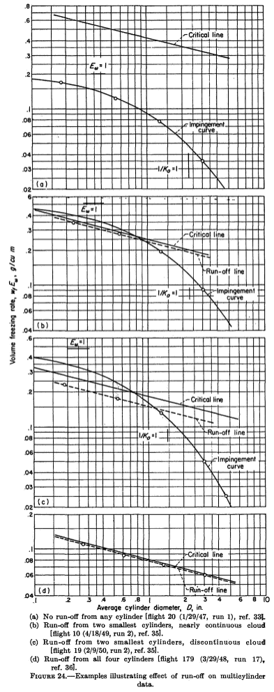
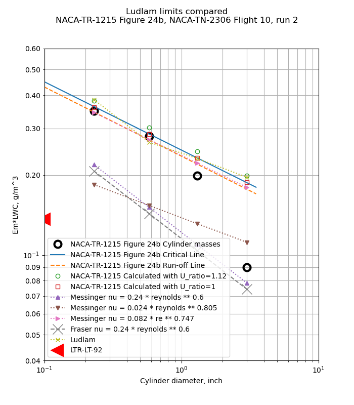
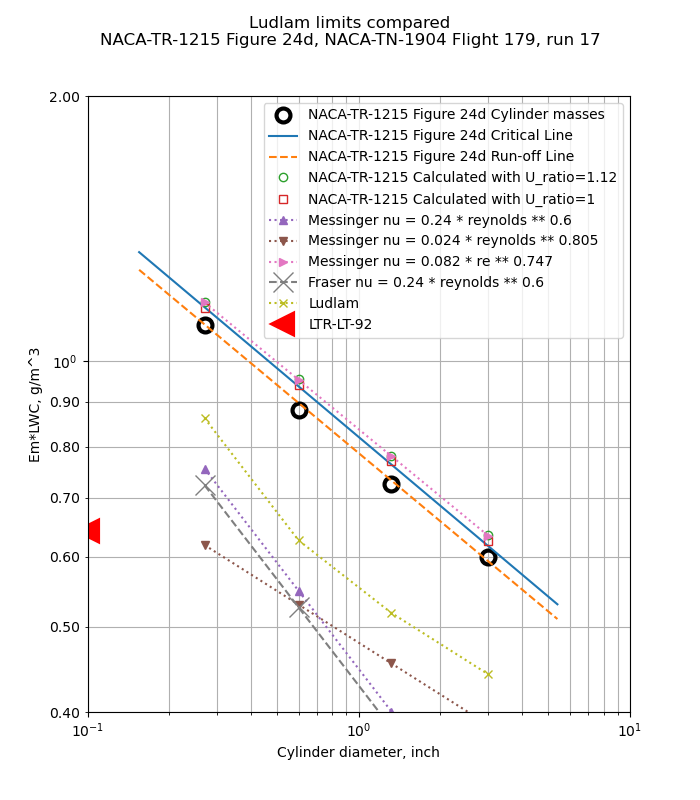

Title: NACA-TR-1215 Thermodynamics
Date: 2022-05-11 12:00  
Category: NACA  
tags: cylinders, instruments, python  

### _"... the effect on final results of droplets that do not freeze completely on the cylinders"_  

# "Impingement of Cloud Droplets and Procedure for Measuring Liquid-Water Content and Droplet Sizes in Supercooled Clouds by Rotating Multicylinder Method" [Thermodynamics topics] [^1]

## Summary 
Conditions where not all water drops freeze are considered.

## Key points  
1. Conditions where not all water drops freeze on the multicylinder instrument are considered. 
2. Rotating cylinder Ludlam limits are compared to flight test data. 

## Abstract

>  Evaluation of the rotating multicylinder method for the
measurement of droplet-size distribution, volume-median droplet
size, and liquid-water content in clouds showed that small 
uncertainties in the basic data eliminate the distinction between
different cloud droplet-size distributions and are a source of
large errors in the determination of the droplet size. Calculations 
of the trajectories of cloud droplets in incompressible and
compressible flow fields around a cylinder were performed on a
mechanical analog constructed for the study of the trajectories of
droplets around aerodynamic bodies. Many data points were
carefully calculated in order to determine precisely the rate of
droplet impingement on the surface of a right circular cylinder.
From the computed droplet trajectories, the following impingement 
characteristics of the cylinder surface were obtained and
are presented in terms of dimensionless parameters: (1) total
rate of water impingement, (2) extent of droplet impingement
zone, and (3) local distribution of impinging water on cylinder
surface.

> The rotating multicylinder method for in-flight determination
of liquid-water content, droplet size, and droplet-size distribution
in icing clouds is described. The theory of operation, the
apparatus required, the technique of obtaining data in fight,
and detailed methods of calculating the results, including
necessary charts and tables, are presented. An evaluation of
the multicylinder method includes the effect on final results of
droplets that do not freeze completely on the cylinders after
striking them, as well as probable errors in final results caused
by the inherent insensitivity of the multicylinder method.

## Discussion

This review focuses on the thermodynamic aspects, 
see a more general review at [NACA-TR-1215]({filename}NACA-TR-1215.md).  

### Droplets that do not freeze completely

The significant part that NACA-TR-1215 adds 
is the effect of water drops that do not completely freeze. 
Building on the work of Ludlam [^2] and others, an analysis method was detailed in Appendix F. 

  
  

To put the analysis results in terms useful for multicylinder analysis, 
the ambient liquid water content is split into the portions that freeze, evaporate, 
and liquid water that does not freeze and presumably runs off of the cylinder. 
The term LWC_freeze\*Em (or wf\*Em) is proportional to the rotating cylinder ice mass, 
and it is plotted with cylinder diameter, similar to the plots used for the manual 
determination of best fit MVD, LWC and distribution that we have seen previously. 

Detailed heat equations start with convection: 

  

And freezing: 

  

And evaporation, 
and then all equations are combined in F10 to predict the
"critical line" (the maximum water rate that can all freeze):

  

Figure 24 shows cases where the cylinder masses are well below the critical line (a),
some masses are affected (b and c), and all cylinders are affected (d).  

Also shown in Figure 24 is a "run-off" line:  
> For observations in discontinuous clouds, points representing 
critical or super-critical conditions lie approximately along a line called the
"run-off line," which is located parallel to and generally
below the critical line, because the effect on the average
value of wf*Ew of the term containing λ is nearly always
smaller than the effect of discontinuities (gaps) in the cloud.

Data affected by run-off may still be useful in some circumstances:

> If multicylinder data taken under conditions of partial
run-off are analyzed by the ordinary method without reference 
to the possible occurrence of run-off, the results usually
indicate values of liquid-water content that are too small
and values of mean effective droplet diameter that are too
large. This occurs because, under ordinary flight and cloud
conditions, run-off occurs first from the smallest cylinders.
For very large droplets, on the other hand, run-off occurs
first from the largest cylinder and thus would tend to cause
underestimation of the droplet size.

> The methods described in the preceding paragraphs make
possible the attainment of satisfactory results in many cases
in which one or two cylinders are affected by run-off. Observations 
from which reliable results are unobtainable can
also be recognized and rejected.

The equations were programmed in the file "naca_tr_1215_find_critical_line.py" [^3]. 

I did not attempt to implement Equation F10 directly. 
Instead, the heat terms are collected and an LWC value found 
iteratively to satisfy the mass and energy balance. 

    q_conv = pi * h * (ts - tk - u ** 2 / 2 / CP_AIR * (1 - u1 ** 2 / u ** 2 * (1 - r)))
    q_evap = (pi * h * RATIO_MOLECULAR_WEIGHTS / CP_AIR * L_EVAPORATION * (calc_vapor_p(ts) - calc_vapor_p(tk)) / p)
    q_sensible = em * lwc / CP_AIR * u * WATER_SPECIFIC_HEAT * (ts - tk)
    q_kinetic = -em * lwc / CP_AIR * u * u ** 2 / 2
    q_freezing = q_conv + q_evap + q_sensible + q_kinetic

    mf = qf / L_FREEZING
    me = q_evap / L_EVAPORATION
    mc = lwc / G_PER_KG * em * u
    
    find lwc so that
    mc - mf - me = 0

Note the term pi in the convection and evaporation terms. 
The entire surface of the cylinder is considered to be fully wet and contribute to
convection and evaporation, with a surface extent of pi*diameter 
[diameter is common to all of the heat terms, and so may be algebraically eliminated]. 
The entire surface is also considered to be at one temperature, 0C. 

The critical line (only) was calculated. 

The run-off line was apparently surmised manually, 
with the logic that if more than one cylinder mass is at or below the critical line, 
and the apparently limited masses follow a -0.253 slope on the log-log plot. 
The -0.253 slope comes from the heat transfer relationship used, 
nu = 0.082*re^0.747, so -0.253 = 0.747 - 1 . 

Figure 24a has no run-off line, and none of the cylinder freezing rates appear to be limited. 

  

For Figure 24b, the smaller two cylinders appear to be limited, 
and the run-off line is close to the critical line. 

  

For Figure 24c, the smaller two cylinders appear to be limited, 
and the run-off line is further below the critical line than in Figure 24b. 

  

In Figure 24d, all of the cylinder freezing rates are limited, 
and the run-off line is close to the critical line. 

  

In Appendix F the value for Ul/U is given as: 

>The value 1.12 used for the ratio Ul/U was obtained from
measurements made in calibrating the multicylinder exposure
used on the C-46 airplane by the Ames laboratory (ref. 33).

However, it is not clear that that the 1.12 value was used for all cases in Figure 24. 
For cases b and d, the results calculated with the python implementation agree better 
with a ratio of Ul/U=1. 
The difference in results with Ul/U=1 versus Ul/U=1.12 is small, about 0.02 g/m^3, 
and the python results agree with the Figure 24 results within that tolerance. 

## Conclusions

> Multicylinder
results obtained with limitations on ice-accretion rates may
be in error by a magnitude as large as the measurements, if
the effect of run-off is not evaluated. Run-off is a factor in
determining the volume-median droplet size and the liquid-water 
content. If run-off is not recognized in the analysis of
the data, the measured data points are incorrectly matched
to the theoretically calculated matching curves.  

## Ludlam limits

When we compare the various ["Ludlam limits"]({filename}ludlam.md) for rotating cylinders that we have seen before, 
some compare well to the test results, and some do not. 

The NACA-TR-1215 method compares to the measured data very well. 
I find this level of agreement compelling. 

The [Messinger]({filename}messinger.md) method [^4] with the same heat transfer relationship as NACA-TR-1215 
(nu = 0.082*re^0.747) compares well to the test data. 

The Messinger methods with other heat transfer relationships do not compare well. 

The Fraser [^5] method does not compare well with the test data, and is comparable the the Messinger results with the same heat transfer relationship
(nu = 0.24*re^0.6). 

The Ludlam method compares well in some cases (24c and 24c), but not in others. 
The lack of viscous heating in the Ludlam method contributes to the differences. 

  

  

  

  

The LTR-LT-92 method [^6] has been added to the rotating cylinder "Ludlam limits". 
Figure 7 of LTR-LT-92 gives critical LWC values for a 0.002489 m diameter cylinder (only),
and is plotted here as 0.1 inch diameter. 
The LTR-LT-92 method does not compare well to the flight test data. 
The LTR-LT-92 method assumes that only the impingement region 
(approximately the front half of the cylinder) contributes to convection and evaporation. 
While the values do not compare well to this flight test data, 
they may be viewed as "conservative" in that if the values are used as LWC limits, 
any measurements will be well below the critical line and the run-off lines, 
but many legitimate measurements might be questioned. 

  

It appears that there were two essential elements of an analysis to well match the flight test rotating cylinder freezing rate values:
1. Evaporation and convection occur on the entire surface of the cylinder.  
2. A roughness-enhanced heat transfer relationship (nu = 0.024 * re^0.747)

## Citations

NACA-TR-1215 cites 37 publications:

- Glauert, Muriel: A Method of Constructing the Paths of Raindrops of Different Diameters Moving in the Neighbourhood of (1) a Circular Cylinder, (2) an Aerofoil, Placed in a Uniform Stream of Air; and a Determination of the Rate of Deposit of the Drops on the Surface and the Percentage of Drops Caught. R. & M. No. 2025, British A.R.C., 1940.  
- Ranz, W. E.: The Impaction of Aerosol Particles on Cylindrical and Spherical Collectors. Tech. Rep. No. 3, Eng. Exp. Station, Univ. Ill., March 31, 1951. (Contract No. AT(30-3)-28, U.S. Atomic Energy Commission.)  
- Langmuir, Irving, and Blodgett, Katherine B.: A Mathematical Investigation of Water Droplet Trajectories. Tech. Rep. No. 5418, Air Materiel Command, AAF, Feb. 19, 1946. (Contract No. W-33-038-ac-9151 with General Electric Co.)  
- Brun, Edmond, Caron, Robert, et Vasseur, Marcel: Introduction a l'etude de la Mecanique des Suspensions. G. R. A. Rapport Tech. No. 15, Recherches Aeronautiques (Paris), 1945.  
- Kantrowitz, Arthur: Aerodynamic Heating and the Deflection of Drops by an Obstacle in an Air Stream in Relation to Aircraft Icing. NACA-TN-779, 1940. [ntrs.nasa.gov](https://ntrs.nasa.gov/citations/19930081535)  
- Dorsch, Robert G., Brun, Rinaldo J., and Gregg, John L.: Impingement of Water Droplets on an Ellipsoid with Fineness Ratio 5 in Axisymmetric Flow. NACA-TN-3099, 1954. [ntrs.nasa.gov](https://ntrs.nasa.gov/citations/19810068689)    
- Brun, Rinaldo J., and Dorsch, Robert G.: Impingement of Water Droplets on an Ellipsoid with Fineness Ratio 10 in Axisymmetric Flow. NACA-TN-3147, 1954. [ntrs.nasa.gov](https://ntrs.nasa.gov/citations/19930083846)    
- Dorsch, Robert G., and Brun, Rinaldo J.: Variation of Local Liquid-Water Concentration about an Ellipsoid of Fineness Ratio 5 Moving in a Droplet Field. NACA-TN-3153, 1954. [ntrs.nasa.gov](https://ntrs.nasa.gov/citations/19810068690)  
- Hacker, Paul T., Brun, Rinaldo J., and Boyd, Bemrose: Impingement of Droplets in 90° Elbows with Potential Flow. NACA-TN-2999, 1953. [ntrs.nasa.gov](https://ntrs.nasa.gov/citations/19810068680)  
- Bergrun, Norman R.: A Method for Numerically Calculating the Area and Distribution of Water Impingement on the Leading Edge of an Airfoil in a Cloud. NACA-TN-1397, 1947. [ntrs.nasa.gov](https://ntrs.nasa.gov/citations/19810068678)   
- Bergrun, Norman R.: An Empirically Derived Basis for Calculating the Area, Rate, and Distribution of Water-Drop Impingement on Airfoils. NACA-TR-1107, 1952. [ntrs.nasa.gov](https://ntrs.nasa.gov/citations/19930092143)  
- Brun, Rinaldo J., Gallagher, Helen M., and Vogt, Dorothea E.: Impingement of Water Droplets on NACA 651-208 and 651-212 Airfoils at 4° Angle of Attack. NACA-TN-2952, 1953. [ntrs.nasa.gov](https://ntrs.nasa.gov/citations/19810068683)   
- Brun, Rinaldo J., Gallagher, Helen M., and Vogt, Dorothea E.: Impingement of Water Droplets on NACA 65A004 Airfoil and Effect of Change in Airfoil Thickness from 12 to 4 Percent at 4° Angle of Attack. NACA-TN-3047, 1953. [ntrs.nasa.gov](https://ntrs.nasa.gov/citations/19810068682)  
- Brun, Rinaldo J., Gallagher, Helen M., and Vogt, Dorothea E.: Impingement of Water Droplets on NACA 65A004 Airfoil at 8° Angle of Attack. NACA-TN-3155, 1954. [ntrs.nasa.gov](https://ntrs.nasa.gov/citations/19810068691) 
- Dorsch, Robert G., and Brun, Rinaldo J.: A Method for Determining Cloud-Droplet Impingement on Swept Wings. NACA-TN-2931, 1953. [ntrs.nasa.gov](https://ntrs.nasa.gov/citations/19810068687)  
- Clark, Victor F.: The Multicylinder Method. The Mount Washington Monthly Res. Bull., vol. II, no. 6, June 1946.  
- Ludlam, F. H.: The Heat Economy of a Rimed Cylinder. Quart. Jour. Roy. Meteorological Soc., vol. 77, no.334., Oct. 1951.  
- Fraser, D., Rush, C. K., and Baxter, D. C.: Thermodynamic Limitations of Ice Accretion Instruments. Nat. Aero. Establishment, Ottawa (Canada), LR-32, Aug. 22, 1952. [journals.ametsoc.org](https://journals.ametsoc.org/view/journals/bams/34/4/1520-0477-34_4_146.pdf)  
- Wien, W., and Harms, F., eds.: Handbuch der Experimentalphysik. Teil 4, Bd. 4, Akademische Verdagsgesellschaft M.B.H. (Leipzig), 1932.  
- Glauert, H.: The Elements of Aerofoil and Airscrew Theory. The Macmillan Co. (New York), 1944.  
- Lowell, Herman H.: Maximum Evaporation Rates of Water Droplets Approaching Obstacles the Atmosphere under Icing Conditions. NACA-TN-3024, 1953 [ntrs.nasa.gov](https://ntrs.nasa.gov/citations/19810068865)
- Brun, Rinaldo J., and Mergler, Harry W.: Impingement of Water Droplets on a Cylinder in an Incompressible Flow Field and Evaluation of Rotating Multicylinder Method for Measurement of Droplet-Size Distribution, Volume-Median Droplet Size, and Liquid-Water Content in Clouds. NACA-TN-2904, 1953. [ntrs.nasa.gov](https://ntrs.nasa.gov/citations/19930083606)   
- Eser, F. (N. Flint, Trans.): On the Flow of Compressible Fluids Past Solid Bodies at Subsonic Velocity. Luftfabrtforschung, vol. 20, no. 7, July 20, 1943, pp. 220-230. R.T.P. Translation No. 2056, Ministry Aircraft Prod. (British).  
- Neel, Carr B., Jr., Bergrun, Norman R., Jukoff, David, and Schlaff, Bernard A.: The Calculation of the Heat Required for Wing Thermal Ice Prevention in Specified Icing Conditions. NACA-TN-1472, 1947. [ntrs.nasa.gov](https://ntrs.nasa.gov/citations/19810068709)   
- Howell, Wallace E.: Comparison of Three Multicylinder Icing Meters and Critique of Multicylinder Method. NACA-TN-2708, 1952. [ntrs.nasa.gov](https://ntrs.nasa.gov/citations/19810068732) [ntrs.nasa.gov](https://ntrs.nasa.gov/citations/19810068732)  
- Clark, Victor F.: Conditions for Run-Off and Blow-Off of Catch on Multicylinder Icing Meter. Tech. Rep. No. 5676, Air Materiel Command, U. S. Air Force, June 22, 1948, pp. 190-218.  
- Jahnke, Eugen, and Emde, Fritz: Tables of Functions. Dover Pub., 4th ed., 1945.  
- Dropkin, David: The Deviation of the Actual Wet-Bulb Temperatures from the Temperature of Adiabatic Saturation. Bull. No. 23, Eng. Exp. Station, Cornell University, July 1936.  
- Hardy, J. K.: Measurement of Free Water in Cloud Under Conditions of Icing. NACA-ARR-4I11, 1944. [ntrs.nasa.gov](https://ntrs.nasa.gov/citations/19930093553)  
- Callaghan, Edmund E., and Serafini, John S.: Analytical Investigation of Icing Limit for Diamond Shaped Airfoil in Transonic and Supersonic Flow. NACA-TN-2861, 1953. [ntrs.nasa.gov](https://ntrs.nasa.gov/citations/19810068583)  
- McAdams, William H.: Heat Transmission. McGraw-Hill Book Co., Inc., 1942.  
- Jakob, Max: Heat Transfer. Vol. I. John Wiley & Sons, Inc., 1949.  
- Lewis, William, Kline, Dwight B., and Steinmetz, Charles P.: A Further Investigation of the Meteorological Conditions Conducive to Aircraft Icing. NACA-TN-1424, 1947. [ntrs.nasa.gov](https://ntrs.nasa.gov/citations/19810068854)
- Johnson, H. A., and Rubesin, M. W.: Aerodynamic Heating and Convective Heat Transfer - Summary of Literature Survey. Trans. ASME, vol. 71, no. 5, July 1949, pp. 447-456.  
- Kline, Dwight B., and Walker, Joseph A.: Meteorological Analysis of Icing Conditions Encountered in Low-Altitude Stratiform Clouds. NACA-TN-2306, 1951. [ntrs.nasa.gov](https://ntrs.nasa.gov/citations/19810068851)
- Lewis, William, and Hoecker, Walter H., Jr.: Observations of Icing Conditions Encountered in Flight During 1948. NACA-TN-1904, 1949. [ntrs.nasa.gov](https://ntrs.nasa.gov/citations/19810068853)

NACA-TR-1215 is cited 4 times in the NACA Icing Publications Database [^7]:

- Gelder, Thomas F., Smyers, William H., Jr., and von Glahn, Uwe H.: Experimental Droplet Impingement on Several Two-Dimensional Airfoils with Thickness Ratios of 6 to 16 Percent. NACA-TN-3839, 1956. [ntrs.nasa.gov](https://ntrs.nasa.gov/citations/19810068700)  
- Hacker, Paul T., Saper, Paul G., and Kadow, Charles F.: Impingement of Droplets in 60° Elbows with Potential Flow. NACA-TN-3770, 1956. [ntrs.nasa.gov](https://ntrs.nasa.gov/citations/19810068701)  
- Brun, Rinaldo J., and Vogt, Dorothea E.: Impingement of Cloud Droplets on 36_5-Percent-Thick Joukowski Airfoil at Zero Angle of Attack and Discussion of Use as Cloud Measuring Instrument in Dye-Tracer Technique. NACA-TN-4035, 1957. [ntrs.nasa.gov](https://ntrs.nasa.gov/citations/19810068703)  
- Gelder, Thomas F.: Droplet Impingement and Ingestion by Supersonic Nose Inlet in Subsonic Tunnel Conditions. NACA-TN-4268, 1958. [ntrs.nasa.gov](https://ntrs.nasa.gov/citations/19810068699)  

An online search found that NACA-TR-1215 is cited 12 times in the literature [^8]. 

## Notes:

[^1]:
Brun, Rinaldo J., Lewis, William, Perkins, Porter J., and Serafini, John S.: Impingement of Cloud Droplets and Procedure for Measuring Liquid-Water Content and Droplet Sizes in Supercooled Clouds by Rotating Multicylinder Method. NACA-TR-1215, 1955. (Supersedes NACA TN’s 2903, 2904, and NACA-RM-E53D23) [ntrs.nasa.gov](https://ntrs.nasa.gov/citations/19810068697)  
[^2]:
Ludlam, F. H.: The Heat Economy of a Rimed Cylinder. Quart. Jour. Roy. Meteorological Soc., vol. 77, no.334., Oct. 1951.
[^3]: [github.com](https://github.com/icinganalysis/icinganalysis.github.io)  
[^4]:
Messinger, B. L.: "Equilibrium Temperature of an Unheated Icing Surface as a Function of Air Speed", J. Aeronaut. Sci., 20, 29-41, 1953.  
[^5]:
Fraser, D., Rush, C. K., and Baxter, D. C.: Thermodynamic Limitations of Ice Accretion Instruments. Nat. Aero. Establishment, Ottawa (Canada), LR-32, Aug. 22, 1952. [journals.ametsoc.org](https://journals.ametsoc.org/view/journals/bams/34/4/1520-0477-34_4_146.pdf)  
[^6]: 
Stallabrass, J. R.: An Appraisal of the Single Cylinder Method of Liquid Water Content Measurement, National Research Council Canada, LTR-LT-92, November, 1978.  
[^7]:
[NACA icing publications database]({filename}naca%20icing%20publications%20database.md)  
[^8]:
[scholar.google.com](https://scholar.google.com/scholar?hl=en&as_sdt=0%2C48&q=Impingement+of+Cloud+Droplets+and+Procedure+for+Measuring+Liquid-Water+Content+and+Droplet+Sizes+in+Supercooled+Clouds+by+Rotating+Multicylinder+Method.+NACA-TR-1215%2C+1955.+%28Supersedes+NACA+TN%E2%80%99s+2903%2C+2904%2C+and+NACA-RM-E53D23%29++&btnG=)  

