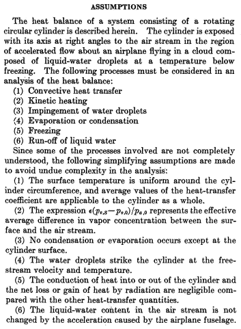
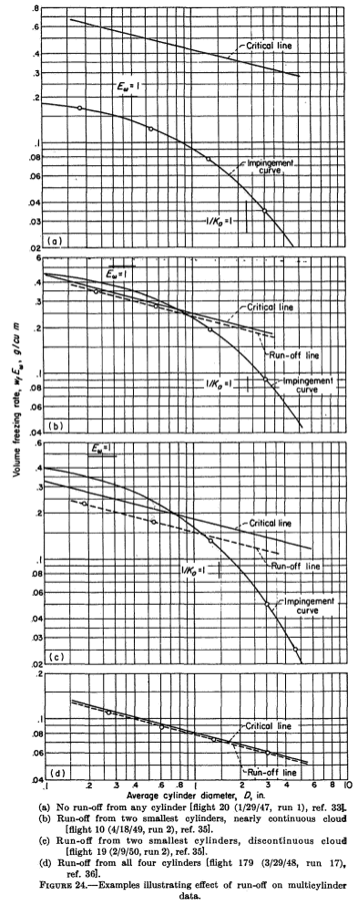
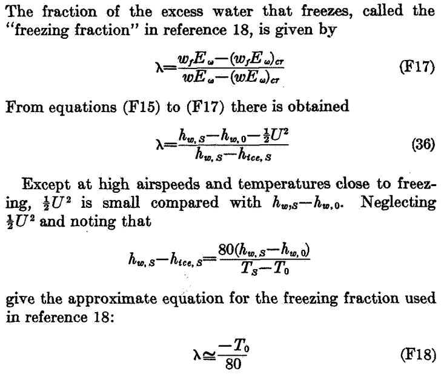

Title: NACA-TR-1215  
Category: NACA  
tags: cylinder  

> ###_"... the effect on final results of droplets that do not freeze completely on the cylinders"_  

#"Impingement of Cloud Droplets and Procedure for Measuring Liquid-Water Content and Droplet Sizes in Supercooled Clouds by Rotating Multicylinder Method. "[^1]

##Summary 
Conditions where not all water drops freeze are considered.

##Key points  
1. NACA-TN-2903, NACA-TN-2904, and NACA-RM-E53D23 are "superseded" (collected together).
2. Conditions where not all water drops freeze on the multicylinder instrument are considered. 
3. The terms "freezing fraction" is introduced into the NACA publications.

##Abstract

>  Evaluation of the rotating multicylinder method for the
measurement of droplet-size distribution, volume-median droplet
size, and liquid-water content in clouds showed that small 
uncertainties in the basic data eliminate the distinction between
different cloud droplet-size distributions and are a source of
large errors in the determination of the droplet size. Calculations 
of the trajectories of cloud droplets in incompressible and
compressible flow fields around a cylinder were performed on a
mechanical analog constructed for the study of the trajectories of
droplets around aerodynamic bodies. Many data points were
carefully calculated in order to determine precisely the rate of
droplet impingement on the surfme of a right circular cylinder.
From the computed droplet trajectories, the following impingement 
characteristics of the cylinder surface were obtained and
are presented in terms of dimensionless parameters: (1) total
rate of water impingement, (2) extent of droplet impingement
zone, and (3) local distribution of impinging water on cylinder
surface.

> The rotating multicylinder method for in-flight determination
of liquid-water content, droplet size, and droplet-size distribution
in icing clouds is described. The theory of operation, the
apparatus required, the technique of obtaining data in fight,
and detailed methods of calculating the results, including
necessary charts and tables, are presented. An evaluation of
the multicylinder method includes the effect on final results of
droplets that do not freeze completely on the cylinders after
striking them, as well as probable errors in final results caused
by the inherent insensitivity of the multicylinder method.

##Discussion

###"supersedes" NACA-TN-2903, NACA-TN-2903, and NACA-RM-E53D23

NACA-TR-1215 "supersedes" NACA-TN-2903 [^2], NACA-TN-2903 [^3], and NACA-RM-E53D23 [^4]. 
Large portions of each of those is reproduced in NACA-TR-1215, 
and will not be reiterated here. 
Detail-oriented readers will want to view those reviews: 
[NACA-TN-2903]({filename}NACA-TN-2903.md), 
[NACA-TN-2904]({filename}NACA-TN-2904.md), 
[NACA-RM-E53D23]({filename}NACA-RM-E53D23.md). 
And due to the compact, two-column print format of NACA-TR-1215, 
many of the figures are more legible in the three forerunners. 

I did not find where anything significant was deleted from the three. 
So supersede does not appear to mean over-riding or deprecating.
Rather, NACA-TR-1215 collects them and adds to them.

However, note that the three are conspicuously missing from the references of NACA-TR-1215, 
(although they appear in a foot note),
perhaps implying that there would be no need to look at them again?
Brun was an author on all four publications. 

###droplets that do not freeze completely

The significant part that NACA-TR-1215 adds 
is the effect of of water drops that do not completely freeze. 
Building on the work of Ludlam [^5] and others, an analysis method was detailed in Appendix F.

A detailed explanation of the equations in Appendix F is quite involved, 
and will be deferred to a possible, future thread on thermodynamics. 

To put the analysis results in terms useful for multicylinder analysis, 
the ambient liquid water content is split into the portions that freeze, evaporate, 
and liquid water that does not freeze and presumably runs off of the cylinder. 
The term LWC_freeze\*Em (or wf\*Em) is proportional to the rotating cylinder ice mass, 
and it is plotted with cylinder diameter, similar to the plots used for the manual 
determination of best fit MVD, LWC and distribution that we have seen previously.

What is added is a "critical" line, which is a calculated limit for freezing all of the 
available water, using the equations from Appendix F. 

Note that critical line is a function of airspeed, temperature, and altitude,
and that there are unique values for each cylinder diameter, 
even though each cylinder is flying through the same conditions. 

Also added is a "run-off" line:  
> For observations in discontinuous clouds, points representing 
critical or super-critical conditions lie approximately along a line called the
"run-off line," which is located parallel to and generally
below the critical line, because the effect on the average
value of wf*Ew of the term containing λ is nearly always
smaller than the effect of discontinuities (gaps) in the cloud.

(The term λ is explained further below).

Figure 24 shows cases where the cylinder masses are well below the critical line (a),
some masses are affected (b and c), and all cylinders (d).  

Data affected by run-off may still be useful in some circumstances:

> If multicylinder data taken under conditions of partial
run-off are analyzed by the ordinary method without reference 
to the possible occurrence of run-off, the results usually
indicate values of liquid-water content that are too small
and values of mean effective droplet diameter that are too
large. This occurs because, under ordinary flight and cloud
conditions, run-off occurs first from the smallest cylinders.
For very large droplets, on the other hand, run-off occurs
first from the largest cylinder and thus would tend to cause
underestimation of the droplet size.

> The methods described in the preceding paragraphs make
possible the attainment of satisfactory results in many cases
in which one or two cylinders are affected by run-off. Observations 
from which reliable results are unobtainable can
also be recognized and rejected.

###Freezing fraction

NACA-TR-1215 includes a "freezing fraction" term, I believe for the first time in the NACA series.

 

Note that the term is defined on a mass basis (F17) and then transformed to an energy basis (36).

Here, the term is credited to Fraser [^6] ("reference 18"), which was published in August, 1952.

The term is generally credited to [Messinger]({filename}messinger.md) [^7], which was published in a journal in January, 1953. 
However, Messinger had presented the paper at a meeting in 1951. 
Also, Messinger's freezing fraction is different. 
In this nomenclature, Messinger's freezing fraction is λ = wf / w. 

Surprisingly, Messinger is referenced only once (NACA-TN-2861) in the NACA publications, 
even though it was contemporaneous, at least for the later NACA works. 
Messinger is the second most cited of any aircraft icing publication that I know of, 
second only to Langmuir and Blodgett [^9] (732 citations versus 741 [^9]).

#Conclusions

The often noted laments about the limitations of the multicylinder method 
are repeated yet again, 
but it is also noted that it was still the most "reliable" technique.

> Although the rotating multicylinder method for measurements 
in icing clouds has several inherent undesirable 
characteristics, it is considered to be the most reliable technique
known at this time that is adaptable to flight use. The meteorological 
data obtained with the multicylinder method are
the only data available for the design of ice-protection equipment 
for aircraft. An important deficiency of the method lies
in its insensitivity in discriminating and resolving droplet-size 
distributions. The differences among the droplet-size 
distributions are masked by the scattering of the measured data
due to errors in measurements, by differences between
assumed theoretical conditions and those actually prevailing
in the natural cloud, and by errors in the calculations.  

> Even though the effect of compressibility of the air on the
droplet trajectories is negligible, the airplane speed should be
maintained as low as possible in obtaining flight data, because
the final results are most accurate at low speeds. Also, the
limitations of ice-accretion rate caused by kinetic heating and
heat of fusion are less severe at low airspeeds. Multicylinder
results obtained with limitations on ice-accretion rates may
be in error by a magnitude as large as the measurements, if
the effect of run-off is not evaluated. Run-off is a factor in
determining the volume-median droplet size and the liquid-water 
content. If run-off is not recognized in the analysis of
the data, the measured data points are incorrectly matched
to the theoretically calculated matching curves.  

> Different forms of the multicylinder instruments are discussed 
in reference 25, along with the effects of yaw, ice
density, and other factors on the reliability of data and the
reproducibility of measurements for conditions on a
mountain.

"Reference 25" is NACA-TN-2708 (previous review: [NACA-TN-2708]({filename}NACA-TN-2708.md)).

NACA-TR-1215 superseded NACA-TN-2904, 
but NACA-TN-2904 is cited more often (54 citations) than NACA-TR-1215 (12 citations [^10]).
Some of the difference (11 citations) is due to NACA-TN-2904 predating NACA-TR-1215 by about two years, 
but many of the citations occur after NACA-TR-1215 was published. 
If "supersede" was intended to mean "make obsolete", it did not have that effect. 

The thermodynamics of NACA-TR-1215 are reviewed in more detail in [NACA-TR-1215-Thermodynamics]({filename}NACA-TR-1215-Thermodynamics.md).  

##Citations

NACA-TR-1215 cites 37 publications:

- Glauert, Muriel: A Method of Constructing the Paths of Raindrops of Different Diameters Moving in the Neighbourhood of (1) a Circular Cylinder, (2) an Aerofoil, Placed in a Uniform Stream of Air; and a Determination of the Rate of Deposit of the Drops on the Surface and the Percentage of Drops Caught. R. & M. No. 2025, British A.R.C., 1940.
- Ranz, W. E.: The Impaction of Aerosol Particles on Cylindrical and Spherical Collectors. Tech. Rep. No. 3, Eng. Exp. Station, Univ. Ill., March 31, 1951. (Contract No. AT(30-3)-28, U.S. Atomic Energy Commission.)
- Langmuir, Irving, and Blodgett, Katherine B.: A Mathematical Investigation of Water Droplet Trajectories. Tech. Rep. No. 5418, Air Materiel Command, AAF, Feb. 19, 1946. (Contract No. W-33-038-ac-9151 with General Electric Co.)
- Brun, Edmond, Caron, Robert, et Vasseur, Marcel: Introduction a l'etude de la Mecanique des Suspensions. G. R. A. Rapport Tech. No. 15, Recherches Aeronautiques (Paris), 1945.
- Kantrowitz, Arthur: Aerodynamic Heating and the Deflection of Drops by an Obstacle in an Air Stream in Relation to Aircraft Icing. NACA-TN-779, 1940.
- Dorsch, Robert G., Brun, Rinaldo J., and Gregg, John L.: Impingement of Water Droplets on an Ellipsoid with Fineness Ratio 5 in Axisymmetric Flow. NACA-TN-3099, 1954.
- Brun, Rinaldo J., and Dorsch, Robert G.: Impingement of Water Droplets on an Ellipsoid with Fineness Ratio 10 in Axisymmetric Flow. NACA-TN-3147, 1954.
- Dorsch, Robert G., and Brun, Rinaldo J.: Variation of Local Liquid-Water Concentration about an Ellipsoid of Fineness Ratio 5 Moving in a Droplet Field. NACA-TN-3153, 1954.
- Hacker, Paul T., Brun, Rinaldo J., and Boyd, Bemrose: Impingement of Droplets in 90° Elbows with Potential Flow. NACA-TN-2999, 1953.
- Bergrun, Norman R.: A Method for Numerically Calculating the Area and Distribution of Water Impingement on the Leading Edge of an Airfoil in a Cloud. NACA-TN-1397, 1947.
- Bergrun, Norman R.: An Empirically Derived Basis for Calculating the Area, Rate, and Distribution of Water-Drop Impingement on Airfoils. NACA-TR-1107, 1952.
- Brun, Rinaldo J., Gallagher, Helen M., and Vogt, Dorothea E.: Impingement of Water Droplets on NACA 651-208 and 651-212 Airfoils at 4° Angle of Attack. NACA-TN-2952, 1953.
- Brun, Rinaldo J., Gallagher, Helen M., and Vogt, Dorothea E.: Impingement of Water Droplets on NACA 65A004 Airfoil and Effect of Change in Airfoil Thickness from 12 to 4 Percent at 4° Angle of Attack. NACA-TN-3047, 1953.
- Brun, Rinaldo J., Gallagher, Helen M., and Vogt, Dorothea E.: Impingement of Water Droplets on NACA 65A004 Airfoil at 8° Angle of Attack. NACA-TN-3155, 1954.
- Dorsch, Robert G., and Brun, Rinaldo J.: A Method for Determining Cloud-Droplet Impingement on Swept Wings. NACA-TN-2931, 1953.
- Clark, Victor F.: The Multicylinder Method. The Mount Washington Monthly Res. Bull., vol. II, no. 6, June 1946.
- Ludlam, F. H.: The Heat Economy of a Rimed Cylinder. Quart. Jour. Roy. Meteorological Soc., vol. 77, no.334., Oct. 1951.
- Fraser, D., Rush, C. K., and Baxter, D. C.: Thermodynamic Limitations of Ice Accretion Instruments. Nat. Aero. Establishment, Ottawa (Canada), LR-32, Aug. 22, 1952.
- Wien, W., and Harms, F., eds.: Handbuch der Experimentalphysik. Teil 4, Bd. 4, Akademische Verdagsgesellschaft M.B.H. (Leipzig), 1932.
- Glauert, H.: The Elements of Aerofoil and Airscrew Theory. The Macmillan Co. (New York), 1944.
- Lowell, Herman H.: Maximum Evaporation Rates of Water Droplets Approaching Obstacles the Atmosphere under Icing Conditions. NACA-TN-3024, 1953
- Brun, Rinaldo J., and Mergler, Harry W.: Impingement of Water Droplets on a Cylinder in an Incompressible Flow Field and Evaluation of Rotating Multicylinder Method for Measurement of Droplet-Size Distribution, Volume-Median Droplet Size, and Liquid-Water Content in Clouds. NACA-TN-2904, 1953.
- Eser, F. (N. Flint, Trans.): On the Flow of Compressible Fluids Past Solid Bodies at Subsonic Velocity. Luftfabrtforschung, vol. 20, no. 7, July 20, 1943, pp. 220-230. R.T.P. Translation No. 2056, Ministry Aircraft Prod. (British).
- Neel, Carr B., Jr., Bergrun, Norman R., Jukoff, David, and Schlaff, Bernard A.: The Calculation of the Heat Required for Wing Thermal Ice Prevention in Specified Icing Conditions. NACA-TN-1472, 1947.
- Howell, Wallace E.: Comparison of Three Multicylinder Icing Meters and Critique of Multicylinder Method. NACA-TN-2708, 1952.
- Clark, Victor F.: Conditions for Run-Off and Blow-Off of Catch on Multicylinder Icing Meter. Tech. Rep. No. 5676, Air Materiel Command, U. S. Air Force, June 22, 1948, pp. 190-218.
- Jahnke, Eugen, and Emde, Fritz: Tables of Functions. Dover Pub., 4th ed., 1945.
- Dropkin, David: The Deviation of the Actual Wet-Bulb Temperatures from the Temperature of Adiabatic Saturation. Bull. No. 23, Eng. Exp. Station, Cornell University, July 1936.
- Hardy, J. K.: Measurement of Free Water in Cloud Under Conditions of Icing. NACA-ARR-4I11, 1944.
- Callaghan, Edmund E., and Serafini, John S.: Analytical Investigation of Icing Limit for Diamond Shaped Airfoil in Transonic and Supersonic Flow. NACA-TN-2861, 1953.
- McAdams, William H.: Heat Transmission. McGraw-Hill Book Co., Inc., 1942.
- Jakob, Max: Heat Transfer. Vol. I. John Wiley & Sons, Inc., 1949.
- Lewis, William, Kline, Dwight B., and Steinmetz, Charles P.: A Further Investigation of the Meteorological Conditions Conducive to Aircraft Icing. NACA-TN-1424, 1947.
- Johnson, H. A., and Rubesin, M. W.: Aerodynamic Heating and Convective Heat Transfer - Summary of Literature Survey. Trans. ASME, vol. 71, no. 5, July 1949, pp. 447-456.
- Kline, Dwight B., and Walker, Joseph A.: Meteorological Analysis of Icing Conditions Encountered in Low-Altitude Stratiform Clouds. NACA-TN-2306, 1951.
- Lewis, William, and Hoecker, Walter H., Jr.: Observations of Icing Conditions Encountered in Flight During 1948. NACA-TN-1904, 1949.

NACA-TR-1215 is cited 4 times in the NACA Icing Publications Database [^11]:

- Gelder, Thomas F., Smyers, William H., Jr., and von Glahn, Uwe H.: Experimental Droplet Impingement on Several Two-Dimensional Airfoils with Thickness Ratios of 6 to 16 Percent. NACA-TN-3839, 1956.
- Hacker, Paul T., Saper, Paul G., and Kadow, Charles F.: Impingement of Droplets in 60° Elbows with Potential Flow. NACA-TN-3770, 1956.
- Brun, Rinaldo J., and Vogt, Dorothea E.: Impingement of Cloud Droplets on 36_5-Percent-Thick Joukowski Airfoil at Zero Angle of Attack and Discussion of Use as Cloud Measuring Instrument in Dye-Tracer Technique. NACA-TN-4035, 1957.
- Gelder, Thomas F.: Droplet Impingement and Ingestion by Supersonic Nose Inlet in Subsonic Tunnel Conditions. NACA-TN-4268, 1958.

An online search found that NACA-TR-1215 is cited 12 times in the literature [^10]. 

##Notes:

[^1]:
Brun, Rinaldo J., Lewis, William, Perkins, Porter J., and Serafini, John S.: Impingement of Cloud Droplets and Procedure for Measuring Liquid-Water Content and Droplet Sizes in Supercooled Clouds by Rotating Multicylinder Method. NACA-TR-1215, 1955. (Supersedes NACA TN’s 2903, 2904, and NACA-RM-E53D23)  
[^2]:
Brun, Rinaldo J., Serafini, John S., and Gallagher, Helen M.: Impingement of Cloud Droplets on Aerodynamic Bodies as Affected by Compressibility of Air Flow Around the Body. NACA-TN-2903, 1953.  
[^3]:
Brun, Rinaldo J., and Mergler, Harry W.: Impingement of Water Droplets on a Cylinder in an Incompressible Flow Field and Evaluation of Rotating Multicylinder Method for Measurement of Droplet-Size Distribution, Volume-Median Droplet Size, and Liquid-Water Content in Clouds. NACA-TN-2904, 1953.  
[^4]:
Lewis, William, Perkins, Porter J., and Brun, Rinaldo J.: Procedure for Measuring Liquid-Water Content and Droplet Sizes in Super-cooled Clouds by Rotating Multicylinder Method. NACA-RM-E53D23, 1953.  
[^5]:
Ludlam, F. H.: The Heat Economy of a Rimed Cylinder. Quart. Jour. Roy. Meteorological Soc., vol. 77, no.334., Oct. 1951.
[^6]:
Fraser, D., Rush, C. K., and Baxter, D. C.: Thermodynamic Limitations of Ice Accretion Instruments. Nat. Aero. Establishment, Ottawa (Canada), LR-32, Aug. 22, 1952.  
[^7]:
Messinger, B.L.: “Equilibrium Temperature of an Un-heated Icing Surface as a Function of Airspeed”, J. Aeron. Sci. vol. 20 no. 1, January 1953, pp 29-42.  
[^8]:
Langmuir, Irving, and Blodgett, Katherine B.: A Mathematical Investigation of Water Droplet Trajectories. Tech. Rep. No. 5418, Air Materiel Command, AAF, Feb. 19, 1946. (Contract No. W-33-038-ac-9151 with General Electric Co.)  
[^9]:
https://scholar.google.com/scholar?hl=en&as_sdt=0%2C48&q=Mathematical+Investigation+of+Water+Droplet+Trajectories&btnG=  
https://scholar.google.com/scholar?hl=en&as_sdt=0%2C48&q=Equilibrium+Temperature+of+an+Un-heated+Icing+Surface+as+a+Function+of+Airspeed&btnG=  
[^10]:
https://scholar.google.com/scholar?hl=en&as_sdt=0%2C48&q=Impingement+of+Cloud+Droplets+and+Procedure+for+Measuring+Liquid-Water+Content+and+Droplet+Sizes+in+Supercooled+Clouds+by+Rotating+Multicylinder+Method.+NACA-TR-1215%2C+1955.+%28Supersedes+NACA+TN%E2%80%99s+2903%2C+2904%2C+and+NACA-RM-E53D23%29++&btnG=  
https://scholar.google.com/scholar?hl=en&as_sdt=0%2C48&q=NACA-TR-1215&btnG=  
https://scholar.google.com/scholar?hl=en&as_sdt=0%2C48&q=NACA-TN-2904&btnG=  
[^11]:
[NACA Icing Publications Database]({filename}naca icing publications database.md)  
