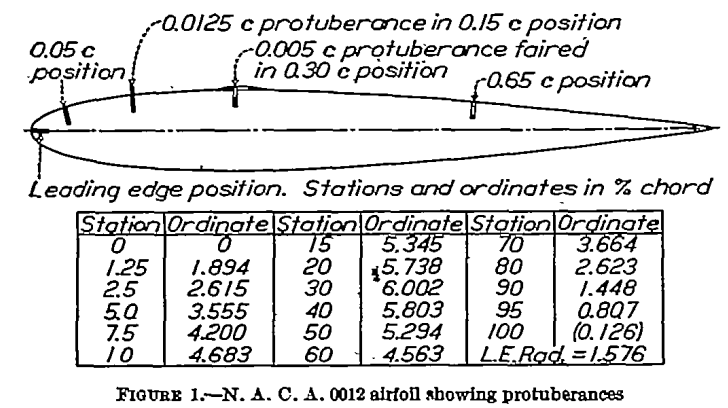
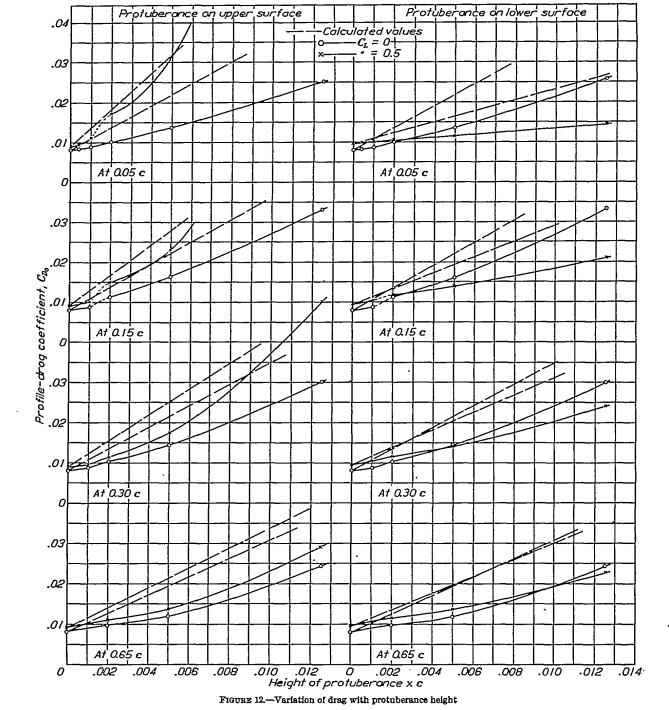

title: NACA-TR-446  
Date: 2022-06-08 12:00  
Category: NACA  
tags: ice shapes, effects of ice  

### _"As regards the lift at higher angles of attack ..., the [effect] becomes increasingly serious as the protuberance approaches a point near the leading edge."_  

  

#NACA-TR-446, "Airfoil Section Characteristics as Affected by Protuberances" [^1]

## Summary
"Protuberances" on an airfoil can have significant effects on section lift and drag. 

## Key Points
1. Position and height of the protuberance are important.  
2. While icing is not mentioned, later works will apply this data in an icing context. 

## Abstract

>The drag and interference caused by protuberance
from the surface of an airfoil have been determined in the
N.A.C.A. Variable-Density Wind Tunnel at a Reynolds
Number of approximately 3,100,000. The effects of variations
of the fore-and-aft position, height, and shape of
the protuberance were measured by determining how the
airfoil section characteristics were affected by the addition
of th various protuberances extending along the entire 
span of the airfoil. The results provide fundamental
data on which to base the prediction of the effects of actual
short-span protuberances. The data may also be applied
to the design of air brakes and spoilers.

## Discussion  

This publication does not mention ice or icing, 
but it has shaped many perceptions about the effects of ice on an airfoil. 

The Variable-Density Wind Tunnel was used [^2] 
(which is now on the U.S. National Register of Historic Places [^3]). 
This pressurized wind tunnel allowed achieving a fairly high Reynolds Number, 
even if the test article was not large. 
  

Sheet-metal "protuberances" were positioned at various locations on the model.  
  

For NACA-TR-446, tunnel data corrections are explained:
>Attention should be here called to the fact,
however, that the characteristics thus presented should
not be used with precise strip method calculations as
though they were true infinite-aspect-ratio characteristics, 
but should be considered as average section
characteristics deduced from the test data by the
methods described in reference 2. Differences between 
these section characteristics and the true ones
may probably be neglected as long as all the sections of
the rectangular wing that was tested were operating
at effective angles of attack are within the range of approximately 
normal lift curve slope.
Their use is also partly justified by the fact that approximately correct
results for a full-span protuberance
on a wing of normal aspect ratio are obtained from them when the
simple aspect-ratio corrections
(reference 2) are applied.

The protuberance heights had different effects at one location.  
  

Different locations had different effects at one protuberance height.  
  

Drag was roughly proportional to protuberance height, but varied by location.  
  

The effects on maximum lift of protuberance height and location were summarized.  
  

Fairing the protuberance had some effect.  
  

## Conclusions  

>The following conclusions of immediate practical
value may be drawn from the results in regard to the
effects of full-span protuberances.  
>1. For most of the unfaired protuberances investigated 
except those very near the lending edge, the
drag resulting from the addition of the protuberance
could be roughly estimated as equal to or greater than,
the product of the free-stream dynamic pressure and
the protuberance frontal area.  
>2. The greater drag increases may result from protuberances 
the height of which exceeds 0.001c, particularly when 
the protuberances are from points
along either surface forward of the maximum-thickness
position.  
>3. Very large increases of drag may result from the
interference of a protuberance having a height exceeding 
0.005c if it is on the forward portion of the
upper surface of the profile.  
>4. A simple fairing over the protuberance greatly
reduces but does not entirely eliminate the adverse
effect.  
>5. The effect of a protuberance on the maximum
lift is unimportant when the protuberance is on the
lower surface, but becomes very important, even for a
protuberance so small that it would ordinarily be
classed as a surface roughness, as the position approaches 
the leading edge along the upper surface.  

This data was for a single, 2D airfoil section at one Reynolds number, 
but it has been used as a general "map" of the expected effects of aircraft icing 
[we will see examples in the [Conclusions of the Ice Shapes and Their Effect thread]({filename}Conclusions of the Ice Shapes and Their Effects Thread.md)].

NACA-TR-446 is cited several times in the recent literature in the context of ice shapes on an airfoil. 

The data are also an excellent test for your favorite CFD method, 
to see how high of an angle of attack that you can reproduce test results,
both with and without a protuberance. 

## Citations

NACA-TR-446 cites 5 references.  

- Ower, E.: Interference. Roy. Aero. Soc. Jour., July, 1932.  
- Jacobs, Eastman N., and Abbott, Ira H.: The N.A.C.A. Variable-Density Wind Tunnel. NACA-TR-416, 1932. [ntrs.nasa.go](https://ntrs.nasa.gov/citations/19930091490)  
- Jacobs, Eastman N.: Tests of Six Symmetrical Airfoils in the Variable-Density Wind Tunnel. NACA-TN-385, 1931. [ntrs.nasa.gov](https://ntrs.nasa.gov/citations/19930081229)  
- Wieselberger, C., and Betz, A.: Ergebnisse der Aerodynamischen Versuchsanstalt zu Gottingen. Oldenburg (Munchen), 1923. II Liferung, pp. 33-34.  
- Theodorsen, Theodore: Theory of Wing Sections of Arbitrary Shape. NACA-TR-411, 1931. [ntrs.nasa.gov](https://ntrs.nasa.gov/citations/19930091485)  

NACA-TR-446 is cited 5 times in the [NACA icing publications database]({filename}naca%20icing%20publications%20database.md)[^4]  

- Neel, Carr B., Jr., and Bright, Loren G.: The Effect of Ice Formations on Propeller Performance. NACA-TN-2212, 1950. [ntrs.nasa.gov](https://ntrs.nasa.gov/citations/19810068625)  
- Gray, Vernon H., and von Glahn, Uwe H.: Effect of Ice and Frost Formations on Drag of NACA 651_212 Airfoil for Various Modes of Thermal Ice Protection. NACA-TN-2962, 1953. [ntrs.nasa.gov](https://ntrs.nasa.gov/citations/19810068586)  
- von Glahn, Uwe H., and Gray, Vernon H.: Effect of Ice Formations on Section Drag of Swept NACA 63A-009 Airfoil with Partial-Span Leading-Edge Slat for Various Modes of Thermal Ice Protection. NACA-RM-E53J30, 1954. [ntrs.nasa.gov](https://ntrs.nasa.gov/citations/19930086972)  
- Bowden, Dean T.: Effect of Pneumatic De-Icers and Ice Formations on Aerodynamic Characteristics of an Airfoil. NACA-TN-3564, 1956. [ntrs.nasa.gov](https://ntrs.nasa.gov/citations/19930084294)  
- Gray, Vernon H.: Correlations Among Ice Measurements, Impingement Rates, Icing Conditions and Drag Coefficients for an Unswept NACA 65A004 Airfoil. NACA-TN-4151, 1958. [ntrs.nasa.gov](https://ntrs.nasa.gov/citations/19810068588)  

An online search [^5] found 103 citations of NACA-TR-446, many of them in an icing context. 

## Notes  

[^1]: Jacobs, Eastman N.: Airfoil Section Characteristics as Affected by Protuberances. NACA-TR-446, 1932 [ntrs.nasa.gov](https://ntrs.nasa.gov/citations/19930091520).  
[^2]: Jacobs, Eastman N., and Abbott, Ira H.: The N.A.C.A. Variable-Density Wind Tunnel. NACA-TR-416, 1932. [ntrs.nasa.go](https://ntrs.nasa.gov/citations/19930091490)  
[^3]: [Variable_Density_Tunnel at en.wikipedia.org](https://en.wikipedia.org/wiki/Variable_Density_Tunnel)  
[^4]: [NACA icing publications database]({filename}naca%20icing%20publications%20database.md)  
[^5]: [scholar.google.com](https://scholar.google.com/scholar?hl=en&as_sdt=0%2C48&q=Airfoil+Section+Characteristics+as+Affected+by+Protuberances&btnG=)  
