Title: NACA-TR-831 
Date: 2022-04-14 12:00  
Category: NACA 
tags: thermodynamics, ice protection, python  

### _"It has been shown that the temperature of the surface of the wing in conditions of icing can be predicted with considerable exactitude from the temperatures measured in clear air."_  

# "An Analysis of the Dissipation of Heat in Conditions of Icing from a Section of the Wing of the C-46 Airplane" [^1] 

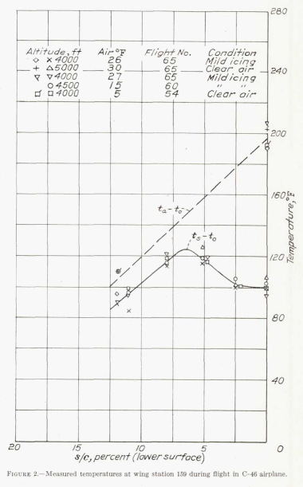 

## Summary

Two-dimensional heat balance equations for ice protection are detailed. 

## Key points
1.  Heat balance equations for ice protection are detailed. 
2.  An assumption about water drop temperature approaching an object is made. 
3.  A cylinder approximation for an airfoil leading edge is used for water drop impingement. 

## Abstract 

> A method is given for calculating the temperature that a
surface, heated internally by air, will assume in specified 
conditions of icing. The method can be applied generally to 
predict the performance, under conditions of icing, of the thermal
system for protecting aircraft. Calculations have been made
for a section of the wing of the C-46 airplane, and the results
agree closely with the temperatures measured. The limit of
protection, when the temperature of the surface reaches 32°F,
has been predicted for the leading edge. The temperature of
the surface in conditions of icing with air at 0°F also has been
calculated. The effect of kinetic heating and the effect of the
concentration of free water and size of droplet in the cloud are
demonstrated.

## Discussion 

Here we see cooperation between NACA and the RAE (Royal Aircraft Establishment), 
as author J. K. Hardy was from the RAE, as were several of the references. 

The nomenclature may be challenging, so peruse the symbols used: 

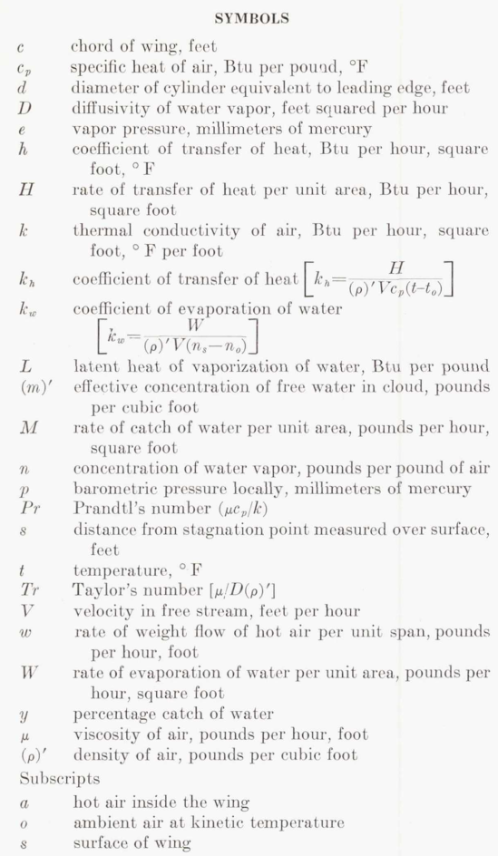 

The ice protection heat exchanger is described in detail in NACA-ARR-5A03b. 
Hot air from an internal "D" chamber enters a corrugated heat exchanger near the leading edge. 
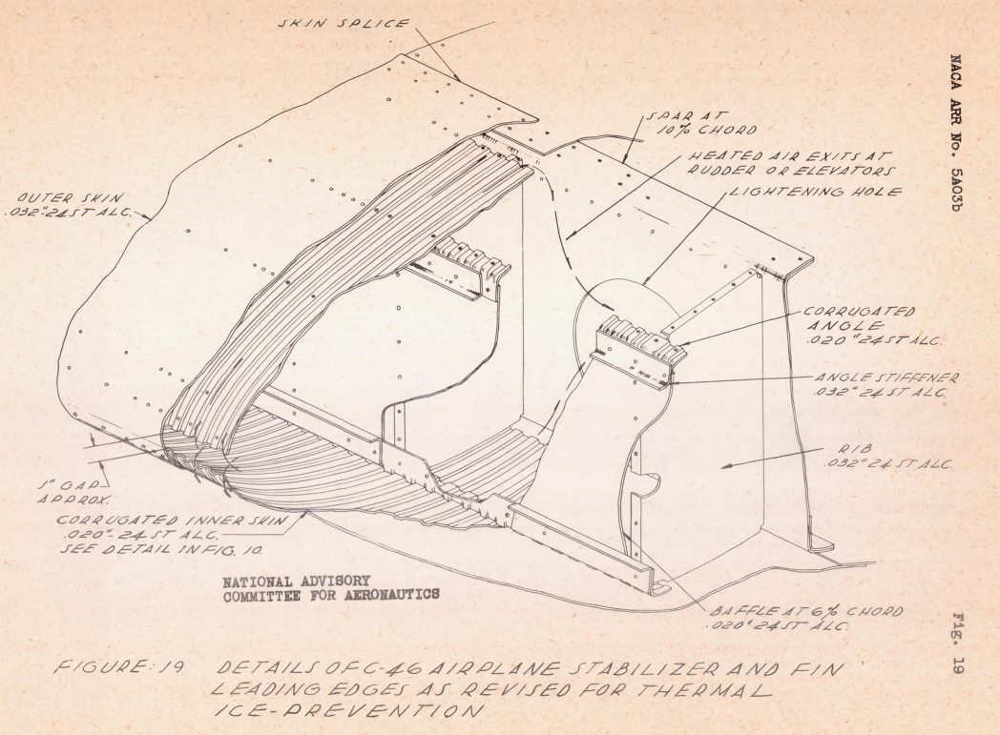

The thermal performance calculations are detailed. 
Large portions are reproduced herein:

> THEORETICAL ANALYSIS  
> CLEAR AIR  
In clear air, the equation which gives the balance of the
flow of heat to and from the surface is  
> 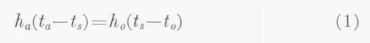  
> The equation which gives the change in temperature of the
hot air t_a, as it flows over the inner surface is  
> 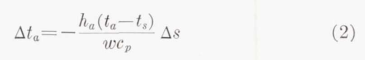  
> Values of t_s and t_a, which satisfy both equations, are found
by trial. These are the mean values for a strip of width Δs in
a chordwise direction and unit length spanwise. Equation
(2) is inexact, since the air flowing through the space between
inner and outer skins receives heat through the back of the
corrugations from the air as it flows from the main duct to
the entry to the corrugations. A more exact equation is  
>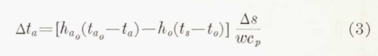  

> h_a_o is the over-all coefficient of transfer of heat from the hot
air behind to the hot air within the corrugations and t_a_o is
the temperature of the air before entering the corrugations.
In the present analysis, equation (2) has been used throughout. 
A trial calculation has been made using equation (3);
the results of this calculation will be discussed later.

> Equations of heat flow.
> In conditions of icing, droplets of
water strike the surface in an area about the stagnation
point. The rate of dissipation of heat from the area on
which the droplets strike is given by the equation 
>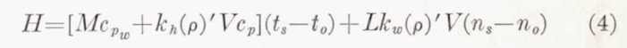  
> where cp_w is the specific heat of water. This assumes that
the temperature of the water caught is raised from that of
the air to that of the surface. The temperature of the air
t_o is the kinetic temperature in wet air as derived in reference 4.

"Reference 4" is NACA-ARR-4I11 [^2], with Hardy as the author. 
NACA-ARR-4I11 analyzed an instrument that sampled the ambient air, 
and the sample was heated to ensure that all water drops evaporated. 
The vapor pressure of the heated air (measured via dew point) 
could then be used to calculate the liquid water content of the air. 

To calculate t_o, 
NACA-ARR-4I11 used a table from [^3]
which I have not been able to find. 
For the python implementation, I used the t_o calculation method from [NACA-ARR-5G13]({filename}NACA-ARR-5G13.md) [^4].

There is a subtlety here for the ice protection application, 
which assumes that the water drops and vapor are always in equilibrium with the (dry) air temperature. 
A dry air calculation yields a static temperature rise as the flow approaches the stagnation point on a surface. 
The equilibrium assumption requires that a significant portion of water drops evaporate 
as the flow approaches the stagnation point, before reaching the (possibly) heated surface,
lowering the amount of liquid water available to impinge on the surface. 
The significant latent heat of evaporation involved lowers the "kinetic" temperature 
(total or recovery temperature, in more recent terminology) relative to a dry air calculation. 

Later works in the Thermodynamics thread will use a different assumption, 
that the water drops are not in equilibrium, 
with the water drop temperature and vapor concentration essentially unaffected as the flow approaches the object. 

Other than lowering the liquid water content available to impinge, 
the equilibrium assumption probably has a minor effect on the ice protection heating calculation. 

> The nondimensional coefficient of transfer of
heat k_h is used, since it is related to the coefficient of evaporation 
k_w. It is related to the more familiar coefficient of
transfer h_o by the equation

>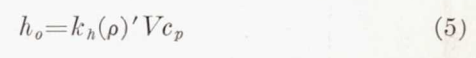  

The evaporation equation form will see some variation in later works.

> Equation (4) may be put into a form which is more convenient 
for computation by substitution from equation (5)
and rearrangement.

>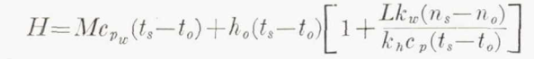  

The heat transfer to the external flow may then be linked to the 
heat transfer from the heated, internal flow:

>  

"X" is a linearization about an operating point of the non-linear evaporation rate.  

>Equation (6) in conjunction with equation (2) is used to
calculate the temperature of the surface on which the
droplets strike. 

Note that this requires an iterative solution, 
as the surface temperature is not yet known. 
The "X" value is a non-linear function of surface temperature, 
"wet kinetic temperature", and pressure. 
Table I is for the 4000 ft. example altitude. 

>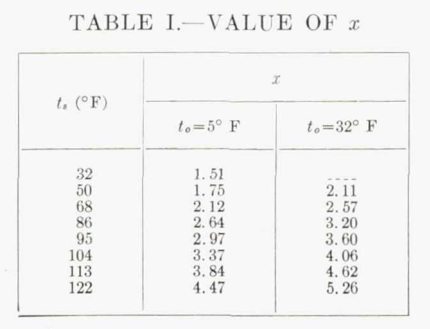  

There follows a discussion about the ratio of k_h to k_w. 
The values will differ in later works, but: 
>In the present calculation the ratio of k_w to k_h has been taken as unity.

### Rate of water catch 

A cylinder is used as an approximation of the wing leading edge to 
calculate impingement (more on [cylinders]({filename}Icing on Cylinders.md)):

> The value of M, the rate at which
water from the cloud strikes the leading edge of the wing, is
calculated by the method given in reference 9. The wing
is considered as equivalent to a cylinder having the same
radius as the radius of curvature of the leading edge.

Reference 9 also has Hardy as an author. 
Hardy, J. K., Hales, K. C., and Mann, G.: Rate of Catch of Supercooled Water on Aerofoils and Cylinders in Flight Under Conditions of Icing. TN No. S. M. E. 207, R. A. E., Jan. 1944. 

> It is necessary to assume a size of droplet in the cloud, 
since this
was not measured in the tests of the C-46 airplane. With
an assumed size of drop, the percentage catch y is found from
figure 1 of reference 9. The total rate of catch per foot
span is  
>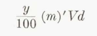  
> The value of (m)', the effective concentration of water in
pounds per cubic foot, is found by deducting the amount of
water evaporated by kinetic heating from the concentration
specified for the particular conditions of icing. The method
of calculating this is shown by the example given in reference 4.

Again, we see the equilibrium assumption that results in a reduced water catch. 

An assumed impingement rate curve is constructed: 

> The convention adopted with regard to the distribution of
the catch of water on the surface of the wing is to assume
that the water is caught in the area between s/c= +/-1.25
percent, and that it is equally distributed over this area
except at the stagnation point. At the stagnation point, the
rate of catch, it is assumed, is given by the equation  
>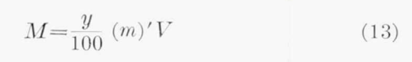  
> Between s/c =0 and s/c =1.25 percent on either the upper or
the lower surface of the wing, the rate of catch for unit span
is given by  
>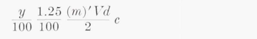  

This method differences from later investigations. 

It is noted that the equilibrium assumption may not be applicable in all cases: 

>There is an important qualification which must be made
to the method of calculating the rate of catch of water. In
calculating the effective concentration of free water, it is
assumed that the droplets respond fully to the change in
temperature produced by kinetic heating as they approach
the surface. This is consistent with the limited observations
which have been made on the C-46 airplane. If, however,
the droplets are large and the speed of flight is high, the
droplets may not respond fully to the effect of kinetic heating.
In consequence, the effective concentration of free water will
be greater than that calculated. The response will depend
on the size of wing as well as on the size of droplet. The
extent to which the severity of icing may be reduced by the
effect of kinetic heating at high speeds is not known. 

### Blown-off water 

> Blow-off of water. It is evident from equation (8) that no
account has been taken of the heat carried by water from
the area of catch to the surface behind this area. The reason
for the omission is that the water runs back in large drops
which cover only a very small area of the surface, and which
are blown off the surface early in their travel.  
As far as can be judged by eye, the water which strikes the
surface collects near the stagnation point until a condition
of instability is reached, when a portion of it is blown back
as a large drop. This tends to lift from the surface, since its
path is curved. It is restrained from lifting by the surface
tension of the water, and is subject to deformation by the
force of the air. It is probable, under the influence of these
forces, that a second state of instability is reached; this
results in the disruption of the drop and its dispersal into
the air, except for a small residue of water. This residue
which continues to flow back over the surface as a small drop,
must be dispersed by evaporation before its temperature
falls to 32' F, if the formation of ice is to be avoided.

Later works will have different opinions about how much water, 
if any, is blown off of the surface

### Wet surface

> Rate of evaporation.—The calculation of the rate of
evaporation of water from the surface, when the surface is
completely wetted, presents no difficulty. The rate of
evaporation is given either by the equation  
>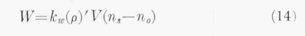  
>or by the equation  
>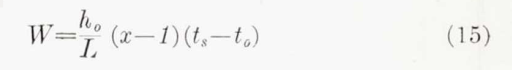  
> When the surface is just wet, the condition reached at
the termination of stage 2, the value of M in equation (6)
is equal to that of W. In this state, the value of t_s, which
must be such as to satisfy this identity, can be found by
trial.
Behind the point at which water is blown off the surface,
there is a formidable difficulty. If it is assumed, as stated
in the preceding section, that the residue of water is dis-
persed by evaporation, then the surface must be partially
wetted only. This requires that equation (8) must be
modified to suit this condition. This is not possible without
knowing the degree of wetness of the surface. Alternatively,
if it is assumed that sufficient water is carried to the surface
through the boundary layer to satisfy the requirement of
full evaporation, thereby malting equation (8) valid, then
the residue of water will not evaporate. The absence of ice
from runback, in many of the tests of the C-46 airplane in
conditions of icing, suggests that evaporation must occur.
It is evident that a detailed investigation is necessary before
all
can be made of the important process by which
analysis of
water leaves the surface of the wing. In the analysis of 
this report it is assumed that the surface is fully wetted.

The assumption about what fraction of the surface is wet where there is runback water 
will be revisited in later works. 

### External Heat Transfer Coefficients  

There is a discussion about how the external heat transfer coefficients were determined. 
There had been previous analysis ([^5], [^6], [^7], [^8]) (and [^8] includes the cylinder leading edge approximation).
There is much to see here, but this is the thermodynamics thread, so I will stay focused. 
The method from [^5] was used, as it provided laminar and turbulent values. 

>The values of h_o, used in the analysis, are plotted in figure 1. 
The form of the transition from the laminar to the turbulent 
regime which is shown in this figure is entirely arbitrary.
It is known that transition, when it occurs in a forward
position on a wing, will not be abrupt. The precise shape
of the curve of transition is indeterminate.  
>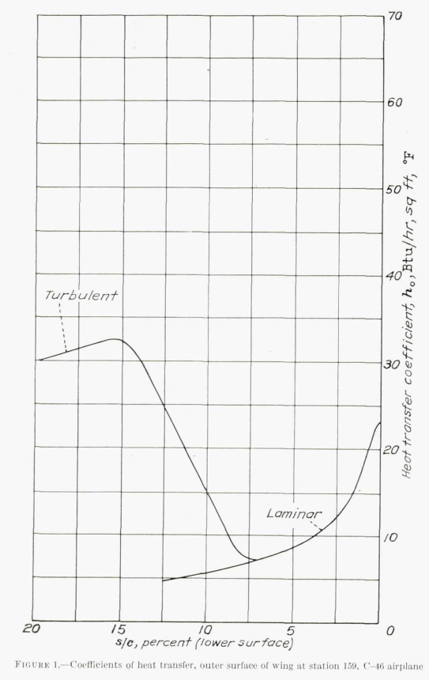  

Later works will use a variety of methods, some similar to the methods described above, 
to determine external heat transfer coefficients. 

###Internal Heat Transfer Coefficients  

The internal heat transfer coefficient was determined from 
the external heat transfer coefficient values,
the calculated t_o value, 
and surface and heated air thermocouple readings. 
So, the accuracy of the internal heat transfer coefficient is dependent on those other values. 

> The value, used in the analysis, for the coefficient of
transfer of heat h d to the inner surface of the wing has been
deduced from the actual temperature of the surface, in clear
air, measured in flight. Trial calculations were made, using
equations (1) and (2) with the values of h_o from figure 1,
to find the value of h_o which gave values of t, in agreement
with those measured. It was found that a value of 21 Btu
per hour, square foot, °F for h_a , constant for the whole
extent of the double skin, appeared to be the most satisfactory. 
This value has been used for all other calculations.

> It is difficult to believe that the value of h_a, in the case
of the C-46 wing, really is constant. The agreement,
therefore, between the terminal value, 19.5 Btu per hour,
square foot, °F, calculated from the data of reference
5, and the value used in the calculations must be regarded
as fortuitous.

Efforts will continue in later works to determine internal heat transfer coefficients. 

### Water catch

### Results  

While the flight conditions where surface temperatures were measured were described as "mild icing", 
an LWC value of 1.2 g/m^3 was selected [which seems high to me for "mild icing"].

> The concentration of free water, for both temperatures, has been taken as 1.2 grams per cubic meter, and the
size of droplet in the cloud as 10 microns diameter.

Nonetheless, the calculated surface temperatures in Figure 4 are within about 10F of the measured values. 
Also, the heated air temperatures match well, 
indicating that the internal and external heat transfer coefficients used yield a match on 
overall energy balance 
(it is possible for more than one set of internal and external heat transfer coefficients to yield similar results). 

>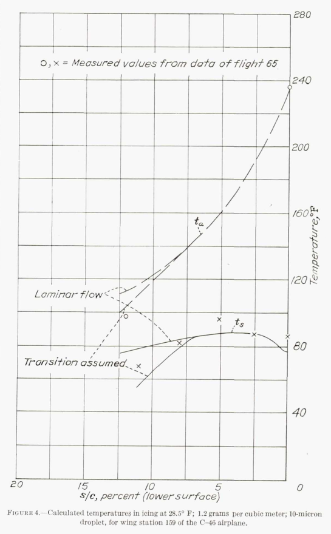  

The calculated effect of different liquid water content values is shown in Figure 6.

>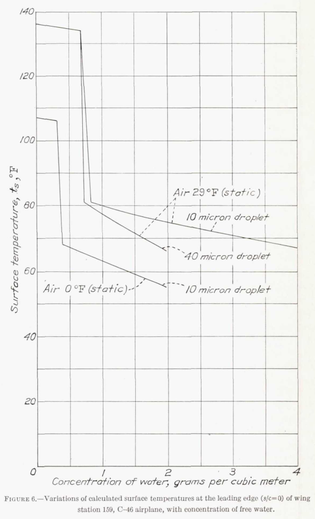  

Figure 6 shows some of the effect of the equilibrium assumption. 
For the 29F, 10 micron case, the predicted surface temperatures are high
(similar to the dry air conditions), 
up to an (ambient) concentration of water of about 0.65 g/m^3. 
Above that value, the surface temperatures take an abrupt drop to a lower value, 
as there are water drops, that were not completely evaporated, available to impinge. 

## Conclusions 

> It has been shown that the temperature of the surface of
the wing in conditions of icing can be predicted with considerable 
exactitude from the temperatures measured in clear
air. It is possible, therefore, to calculate the thermal requirements 
of a wing which is subject to conditions of icing, if the
coefficients of transfer of heat, both to the inner surface and
from the outer surface in clear air, are known. For the
outer surface, there is little doubt as to the correctness of
the method by which the values of the coefficients of transfer 
are calculated. The uncertainties are the location of the
point of transition and the form of the curve of transition
from laminar to turbulent flow. There is, as well, the uncertainty 
as to the effect, on transition, of water on the surface. 
The rate of transfer of heat from the hot air to the
inner surface cannot at present be calculated with any confidence. 
There is need for systematic experiment to establish 
the fundamental data required.  
The analysis of this report is incomplete, since the point at
which water is blown off the wing cannot be predicted, and,
behind this point, the heat required to prevent ice is not
known. In these circumstances it is not possible to find
how far back from the leading edge the double skin should be
carried. The optimum distribution of heat also is uncertain.
Again, there is need for systematic experiment.  
The lack of knowledge as to the physical characteristics of
severe conditions of icing, as they occur in nature, is a severe
handicap. With this knowledge, the specification for the
design of thermal systems of protection can be given in terms
of definite conditions of icing.

The confidence that 
> "**the temperature of the surface of the wing in conditions of icing can be predicted with considerable exactitude**"  

is quickly tempered with a list of uncertainties:  
- "The uncertainties of the location of the point of transition"  
- "the uncertainty as to the effect, on transition, of water on the surface"  
- "The rate of transfer of heat from the hot air to the inner surface cannot at present be calculated with any confidence"  
- "point at which water is blown off the wing cannot be predicted"  
- "optimum distribution of heat also is uncertain"  
- "The lack of knowledge as to the physical characteristics of severe conditions of icing, as they occur in nature, is a severe handicap"  

These will be continuing challenges for later works, as well as other items noted above:  
- accuracy of the water drop temperature equilibrium assumption  
- water rate catch calculations  
- details of the evaporation calculation, including the ratio of k_h to k_w  
- fraction of water drops blown off of the surface, if any  
- fraction wettedness of the surface in the water runback region  

NACA-TR-831 included most of the components of more recent, 
2D thermal ice protection thermodynamic analysis. 
And it raised issues to be investigated further. 
So, I view it as a success. 

##Citations 

NACA-TR-831 cites 14 references: 

- Jones, Alun R., and Spies, Ray J., Jr.: An Investigation of a Thermal Ice-Prevention System for a C-46 Cargo Airplane, III - Description of Thermal Ice-Prevention Equipment for Wings, Empennage, and Windshield. NACA-ARR-5A03b, 1945.
- Hardy, J. K., and Mann, G.: Prediction of the Rate of Formation of Ice, and the Rate of Heating Necessary to Prevent Ice. TN No. Acre. 1010, R. A. E., Aug. 1942.
- Hales, K. C., and Mann, G.: Investigation of Wing De-icing By Means of Hot Air. TN No. S. M. E. 255, R. A. E., July 1944.
- Hardy, J. K.: Measurement of Free Water in Cloud Under Conditions of Icing. NACA-ARR-4I11, 1944.
- Ditton Laboratory Staff: Hot Air De-icing — Heat Transfer in the Double Skin. TN No. S. M. E. 208, R. A. E., Jan. 1944.
- Anon.: Note on Kinetic Heating with Particular Reference to Conditions of Icing. Tech. Note No. 674, R.A.E., June 1942. (NACA Reprint October 1942)
- Goldstein, S.: Modern Developments in Fluid Dynamics. The Clarendon Press, Oxford, 1938.
- Dorsey, N. Ernest: Properties of Ordinary Water-Substance. Reinhold Pub. Corp. (New York), 1940.
- Hardy, J. K., Hales, K. C., and Mann, G.: Rate of Catch of Supercooled Water on Aerofoils and Cylinders in Flight Under Conditions of Icing. TN No. S. M. E. 207, R. A. E., Jan. 1944.
- Squire, H. B.: Heat Transfer Calculation for Aerofoils. NACA-MRR-3E29 (R. A. E., Aero 1783), 1943.
- Neel, Carr B., Jr.: An Investigation of a Thermal Ice-Prevention System for a C-46 Cargo Airplane, I— Analysis of the Thermal Design for Wings, Empennage, and Windshield. NACA-ARR-A503, 1945.
- Allen, H. J., and Look, Bonne C.: A Method for Calculating Heat Transfer in the Laminar Flow Region of Bodies. NACA-TR-764, 1943.
- Martinelli, R. C., Guibert, A. G., Morrin, E. H., and Boelter, L. M. K.: An Investigation of Aircraft Heaters, VIII - A Simplified Method for the Calculation of the Unit Thermal Conductance over Wings. NACA-WR-W-14, Mar. 1943.
- Selna, James, Neel, Carr B., Jr., and Zeiller, E. Lewis: An Investigation of a Thermal Ice-Prevention System for a C-46 Cargo Airplane, IV - Results of Flight Tests in Dry-Air and Natural-Icing Conditions. NACA-ARR-5A03c, 1945.

NACA-TR-831 is cited 8 times in the NACA Icing Publications Database [^9]: 

- Hardy, J. K.: Measurement of Free Water in Cloud Under Conditions of Icing. NACA-ARR-4I11, 1944.
- Hardy, J. K.: Kinetic Temperature of Wet Surfaces A Method of Calculating the Amount of Alcohol Required to Prevent Ice, and the Derivation of the Psychrometric Equation. NACA-ARR-5G13, 1945
- Darsow, John F., and Selna, James: A Flight Investigation of the Thermal Performance of an Air-Heated Propeller. NACA-TN-1178, 1947.
- Gray, Vernon H., and Campbell, B. G.: A Method for Estimating Heat Requirements for Ice Prevention on Gas-Heated Hollow Propeller Blades. NACA-TN-1494, 1947.
- Neel, Carr B., Jr., Bergrun, Norman R., Jukoff, David, and Schlaff, Bernard A.: The Calculation of the Heat Required for Wing Thermal Ice Prevention in Specified Icing Conditions. NACA-TN-1472, 1947.
- Gelder, Thomas F., and Lewis, James P.: Comparison of Heat Transfer from Airfoil in Natural and Simulated Icing Conditions. NACA-TN-2480, 1951.
- Neel, Carr B., Jr., and Steinmetz, Charles P.: The Calculated and Measured Performance Characteristics of a Heated-Wire Liquid-Water-Content Meter for Measuring Icing Severity. NACA-TN-2615, 1952.
- Lewis, William, and Perkins, Porter J.: A Flight Evaluation and Analysis of the Effect of Icing Conditions on the PG-2 Airship. NACA-TN-4220, 1958.

An online search found that NACA-TR-831 is cited 13 times in the literature [^10].  

## Notes: 

[^1]:  
Hardy, J. K.: An Analysis of the Dissipation of Heat in Conditions of Icing from a Section of the Wing of the C-46 Airplane. NACA-TR-831, 1945. (Formerly NACA-ARR-4I11a.)  
[^2]: Jones, Alun R., and Spies, Ray J., Jr.: An Investigation of a Thermal Ice-Prevention System for a C-46 Cargo Airplane, III - Description of Thermal Ice-Prevention Equipment for Wings, Empennage, and Windshield. NACA-ARR-5A03b, 1945.  
[^3]: Anon.: Note on Kinetic Heating with Particular Reference to Conditions of Icing. Tech. Note No. 674, R.A.E., June 1942. (NACA Reprint October 1942)  
[^4]: Hardy, J. K.: Kinetic Temperature of Wet Surfaces A Method of Calculating the Amount of Alcohol Required to Prevent Ice, and the Derivation of the Psychrometric Equation. NACA-ARR-5G13, 1945. 
[^5]: Squire, H. B.: Heat Transfer Calculation for Aerofoils. NACA-MRR-3E29 (R. A. E., Aero 1783), 1943.  
[^6]: Neel, Carr B., Jr.: An Investigation of a Thermal Ice-Prevention System for a C-46 Cargo Airplane, I— Analysis of the Thermal Design for Wings, Empennage, and Windshield. NACA-ARR-A503, 1945.  
[^7]: Allen, H. J., and Look, Bonne C.: A Method for Calculating Heat Transfer in the Laminar Flow Region of Bodies. NACA-TR-764, 1943.  
[^8]: Martinelli, R. C., Guibert, A. G., Morrin, E. H., and Boelter, L. M. K.: An Investigation of Aircraft Heaters, VIII - A Simplified Method for the Calculation of the Unit Thermal Conductance over Wings. NACA-WR-W-14, Mar. 1943.  
[^9]:
[NACA icing publications database]({filename}naca%20icing%20publications%20database.md)  
[^10]: 
[scholar.google.com](https://scholar.google.com/scholar?hl=en&as_sdt=0%2C48&q=Hardy%2C+J.+K.%3A+An+Analysis+of+the+Dissipation+of+Heat+in+Conditions+of+Icing+from+a+Section+of+the+Wing+of+the+C-46+Airplane&btnG=)  
