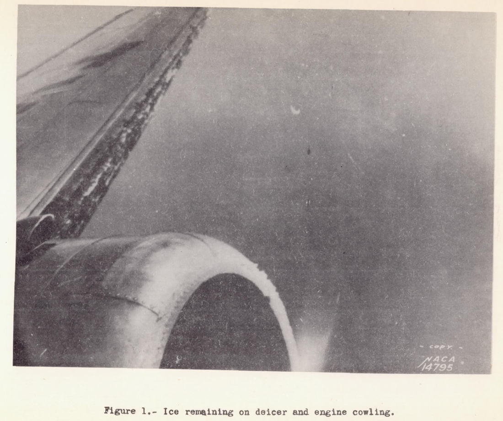

title: NACA-WR-L-292  
Date: 2022-06-13 12:00  
Category: NACA  
tags: ice shapes  

### _"The danger lies, not so much in the higher stalling speed, but more in the possibility that the stall may occur without advance warning to the pilot."_  

# NACA-WR-L-292, "Effects of a Simulated Ice Formation on the Aerodynamic Characteristics of an Airfoil" [^1]

## Summary
Airfoil characteristics with simulated residual ice are measured.

## Key Points  
1. An airline operator survey of ice shapes was conducted.  
2. A residual ice shape was tested at near full scale.  
3. A significant reduction in Cl_max values was found.  
4. Values are compared to NACA-TR-446.

## Abstract
> In connection with the general study of icing problems 
an item of major interest is the effect of ice on
the aerodynamic characteristics of a wing.
Of particular interest is the effect of the ice which remains on a wing,
under some flight conditions in spite of the operation of
rubber de-icers.
At the request of the N.A.C.A. a questionnaire seeking 
information as to the size and distribution of such
ice particles on the wings was circulated to transport
airplane operators by the Air Transport Association of
America.
The information received in response to this
questionnaire shows that under certain conditions ice adheres 
to the wing in irregular ridges on both sides of the
inflatable rubber tubes.
One of the photographs received
of icing conditions in flight is shown in figure 1.
Since it was not feasible to simulate all possible
distributions of ice which might occur over the leading
edge of a wing, a single distribution was arbitrarily
chosen to represent a severe case of this type of icing.
As a consequence of the limited test program the results
are not general and only indicate the order and magnitude
of the effects which may occur.

  

## Discussion  

As this publication is short, the majority of the text will be transcribed here.

>EQUIPMENT AND TESTS

>As the 6- by 36-foot N.A.C.A. 0012 metal airfoil used
for the investigation was primarily constructed to obtain
section characteristics, particular care was taken to
achieve a smooth surface.
The entire surface was sprayed
with several coats of paint primer which was smoothed with
sandpaper between each application and finally polished
with rubbing compound.

>To simulate the ice formation, a mixture of tar and
crushed slag was applied to a strip of cloth which was attached 
over the leading edge of the airfoil (fig. 2).
The size of the crushed slag was limited to that which would
pass through a 1/4-inch mesh sieve.

  

Figure 3 shows the
arrangement and size of the formations on the airfoil.

  

>The tests were made in the full-scale wind tunnel
(reference 1) at an air speed of approximately 60 miles
per hour.

>RESULTS AND DISCUSSION

>The results showing the effects of the simulated ice
formation on the aerodynamic characteristics of the airfoil 
are presented in figures 4 and 5.
The data are fully corrected for all wind-tunnel effects.

  

  

>The simulated ice formation reduces the slope of the
lift curve over the entire useful angle-of-attack range
although the greatest effect occurs near the angle for
maximum lift.
The maximum lift coefficient is reduced
from 1.32 to 0.80 with no appreciable change in the angle
of attack of maximum lift.
The profile-drag coefficient
at the high-speed lift coefficient is increased by 90 percent. 
Since the tests were made on an extremely smooth
airfoil, this increase may be somewhat greater than should
be expected for a service-type wing.
The ratio of lift to
drag is reduced throughout the angle-of-attack range, the
maximum value being reduced from 23.7 to 14.5.
The pitching-moment coefficients about the aerodynamic center are
not greatly affected by the simulated ice formation.

>Of the foregoing effects the reduction in the maximum
lift coefficient is probably of greatest concern to airplane operators.
This reduction in the maximum lift coefficient entails a 
corresponding increase in the airplane
stalling speed which varies with the wing loading as shown
in figure 5.
Any increase in the stalling speed constitutes a potential source of danger.
The danger lies, not so much in the higher stalling speed, but more in the 
possibility that the stall may occur without advance warning
to the pilot.
This is particularly true for a case in
which reliance is placed chiefly on the air-speed meter to
predict the stalling speed.

>The increase in drag may be somewhat greater than
should be expected on a service-type wing but, since the
simulated formation does not necessarily represent the
worst condition that may occur, the use of the foregoing
results in making calculations of the probable effect of
the ice on the range and rate of climb may not be too conservative.

### Comparison to NACA-TR-446  

NACA-WR-L-292 and NACA-TR-446 both used NACA 0012 airfoils. 
Both had span-to-chord ratios of 6, with apparently bare ends.

While the test articles in NACA-WR-L-292 and NACA-TR-446 are of much different chord lengths, 
the high pressure wind tunnel used for NACA-TR-446 resulted in a roughly comparable 
chord Reynolds number values.

While they are similar in those respects, and seemingly good candidates for comparison, 
there are differences as detailed below. 
These differences will illustrate some of the challenges of applying NACA-TR-446 data 
to other tests.

It is not clear what (if any) tunnel data corrections were applied in NACA-WR-L-292.

For NACA-TR-442, corrections are explained:
>Attention should be here called to the fact,
however, that the characteristics thus presented should
not be used with precise strip method calculations as
though they were true infinite-aspect-ratio characteristics, 
but should be considered as average section
characteristics deduced from the test data by the
methods described in reference 2. Differences between 
these section characteristics and the true ones
may probably be neglected as long as all the sections of
the rectangular wing that was tested were operating
at effective angles of attack are within the range of approximately 
normal lift curve slope.
Their use is also partly justified by the fact that approximately correct
results for a full-span protuberance
on a wing of normal aspect ratio are obtained from them when the
simple aspect-ratio corrections
(reference 2) [^2] are applied.

However, the Cl_max values with the clean airfoil differ (see the table further below).

The roughness elements for NACA-WR-L-292 had a h/chord ratio of 0.005, 
and an x/chord location of 0.025 (the furthest aft "lumps"). 
While the elements were rough, and applied in a 3D pattern, 
we will treat them as full span, square-edged protuberances like in NACA-TR-446. 
We can then interpolate a Cl_max with protuberance value from NACA-TR-446, Figure 13. 

| Value                       | NACA-WR-L-292        | NACA-TR-446                  |
|-----------------------------|----------------------|------------------------------|
| Airfoil section             | NACA 0012            | NACA 0012                    |
| Aspect ratio                | 6:1                  | 6:1                          |
| Re                          | 3.3e6                | 3.1e6                        |
| Cl_max clean                | 1.32                 | 1.52                         |
| Protuberance                | 3D roughness pattern | full span square edged plate |
| h/chord                     | 0.005                | 0.005                        |
| x/chord                     | 0.025                | 0.025                        |
| Cl_max with protuberance    | 0.8                  | 0.86 (interpolated)          |
| Cl_max reduction            | -0.52                | -0.66                        |
| Cl_max reduction (fraction) | -0.4                 | -0.43                        |

As the clean Cl_max values are offset, 
it is not clear how to compare Cl_max values with protuberances. 
Numerically, they are close. 
The Cl_max fraction reduction values are also close, 
but the Cl_max reduction values are not particularly close. 
It is not clear which is the most meaningful comparison. 

Given the difference in the clean Cl_max values, 
and the "protuberance" shape differences, 
perhaps one should be be pleasantly surprised that there is 
some correspondence in the Cl_max reduction values. 
An alternative explanation is that the details 
of the protuberance shape are a secondary effect. 

Regardless of the details, the Cl_max reductions are large for these airfoil sections.

## Citations

NACA-WR-L-292 cites one reference.

- DeFrance, Smith J.: The NACA Full-Scale Wind Tunnel. NACA-TR-459, 1933.  

NACA-WR-L-292 is cited by two references in the [NACA Icing Publications Database]({filename}naca icing publications database.md)[^3]

- Neel, Carr B., Jr., and Bright, Loren G.: The Effect of Ice Formations on Propeller Performance. NACA-TN-2212, 1950.  
- Gray, Vernon H., and von Glahn, Uwe H.: Effect of Ice and Frost Formations on Drag of NACA 651_212 Airfoil for Various Modes of Thermal Ice Protection. NACA-TN-2962, 1953.  

An online search [^4] found 25 citations of NACA-WR-L-292.

## Notes

[^1]: May 1938. Gulick, Beverly G.: Effects of a Simulated Ice Formation on the Aerodynamic Characteristics of an Airfoil. NACA-WR-L-292, May 1938.  
[^2]: Jacobs, Eastman N., and Abbott, Ira H.: The N.A.C.A. Variable-Density Wind Tunnel. NACA-TR-416, 1932.  
[^3]: [NACA Icing Publications Database]({filename}naca icing publications database.md)  
[^4]: https://scholar.google.com/scholar?hl=en&as_sdt=0%2C48&q=Effects+of+a+Simulated+Ice+Formation+on+the+Aerodynamic+Characteristics+of+an+Airfoil&btnG=  
