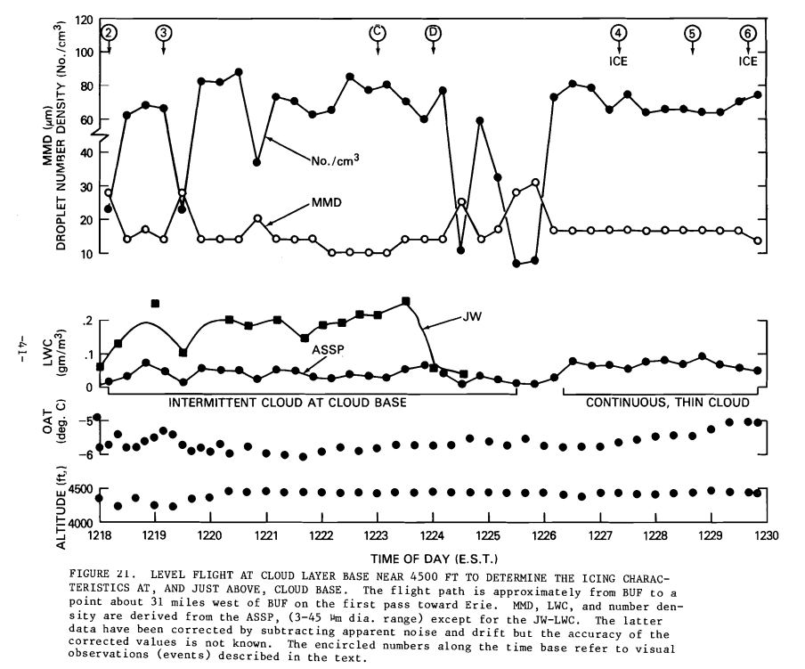

title: Manual of Scaling Methods  
Date: 2022-08-10 12:00  
category: icing tunnels  
tags: icing tunnel  

### _"... it was not surprising that scale ice shapes were again a good match for the reference"_  

# NASA/CR-2004-212875 [^1]   

  

## Summary  
Similarity calculations for ice shapes are detailed.  

## Key Points  
1. Several scaling methods with differing parameters are compared in tests.  
2. "The Ruff method, supplemented with the constant-WeL approach to calculate scale velocity, is recommended"  
3. Examples are included of how to deal with limitations (temperature, lwc, etc.)  

## Abstract  

>This manual reviews the derivation of the similitude relationships 
believed to be important to ice accretion and
examines ice-accretion data to evaluate their importance.
Both size scaling and test-condition scaling methods
employing the resulting similarity parameters are described, 
and experimental icing tests performed to evaluate 
scaling methods are reviewed with results. 
The material included applies primarily to unprotected, unswept
geometries, but some discussion of how to approach
other situations is included as well. The studies given
here and scaling methods considered are applicable only
to Appendix-C icing conditions. Nearly all of the experimental 
results presented have been obtained in sea-level tunnels. 
Recommendations are given regarding
which scaling methods to use for both size scaling and
test-condition scaling, and icing test results are described
to support those recommendations. Facility limitations
and size-scaling restrictions are discussed. Finally, appendices 
summarize the air, water and ice properties
used in NASA scaling studies, give expressions for each
of the similarity parameters used and provide sample
calculations for the size-scaling and test-condition scaling 
methods advocated.

## Discussion  

I consider this to be "The" reference for scaling test conditions for 
ice shapes in areas without ice protection. 

This is a lengthy publication (78 pages, 32 figures), 
with much high quality technical content, 
so this review will be highly condensed. 

There is a detailed discussion of potential scaling parameters, 
and reviews of test data that show which ones may have importance. 
Several we have seen before in the [Icing Wind Tunnel Test Thread]({filename}Icing Wind Tunnel Test Thread.md). 

>3.8. Summary of Potential Scaling Parameters  
For convenience, all the similarity parameters discussed
above that appear to have the most influence on ice accretion 
and are therefore most likely to form the basis
of a scaling method will be listed here again. All are
dimensionless except for the water-energy and air-energy
transfer terms (φ and θ) which have dimensions of temperature.  
>- Reynolds number, Rea (eq. (3.1))  
>- Modified inertia parameter, Ko (eq. (3.8))  
>- Stagnation collection efficiency, βo (eq. (3.13))  
>- Accumulation parameter, Ac (eq. (3.26)
>- Relative heat factor, b (eq. (3.55))  
>- Water-energy transfer parameter, φ (eq. (3.56))  
>- Air-energy transfer parameter, θ (eq. (3.57))  
>- Freezing fraction, no (eq. (3.59))  
>- Weber number, for example: Wec, WeL, Weδ, Weh, Wew or Wet (eqs. (3.66) (3.69), (3.70), (3.72), (3.79) or (3.80))  
>- Water film thickness, hfilm/d, (eq. (3.74))  

>Note that in place of the modified inertia parameter, Ko,
the collection efficiency at the leading edge, βo, can be
used. βo is a more sensitive parameter than Ko. These
two parameters are directly related by equation (3.13).

Tests with a surfactant added to the water spray showed a
notable effect of changing the surface tension, 
indicating an importance to the Weber number.

  

Several potential scaling methods were considered:  

  

>Figure 5.3.4 graphs some of the information in Table V
along with additional data. Here, the scale-to-reference
velocity ratio is given as a function of the reference-to-scale 
size ratio for a range of size ratios from 1.7 to 4.
The shaded band represents scale velocity ratios in the
range of ±15%. The velocity ratio for most of the methods 
was calculated for a reference velocity of 150 mph.
At this reference velocity, however, the routines used to
calculate scale velocity failed for the average-velocity
and constant-Wek methods at scale ratios greater than 2;
therefore, to obtain values over the complete range of
scale ratios, the reference velocity used for these methods
was 115 mph. It is evident that even with a scale ratio as
high as 4 there are a number of methods whose scale
velocities differ by no more than ±15%. This is not a
sufficient difference to produce significant variations in
ice shape.

  

>As Table V and figure 5.3.4 show, for half-size scaling,
the scale velocity resulting from matching WeL falls in
the range between constant Weδ and average V that has
shown reasonable scaling results in past studies. At this
time, WeL seems to have greater experimental justification 
than other similarity parameters. The practical advantage 
of using constant WeL is that the scale velocity-to-reference 
velocity ratio is simply the square root of the
size ratio (eq. (3.71)). Furthermore, it leads to a more
moderate scale velocity than some of the similarity parameters 
that might be used.

## Conclusions  

### Geometric scaling

>5.3.7. Recommended Method to Scale Size  
 
>The Ruff method reviewed in section 5.3.3, supplemented 
with the constant-WeL approach (section 5.3.4) to
calculate scale velocity, is recommended for simulating
the main ice shape with a model scaled in size. This
method requires matching scale and reference model
non-dimensional geometry and AOA, as well as scale
and reference values of the similarity parameters Ko, Ac,
no, φ, θ and WeL for tunnels with altitude capability or Ko,
Ac, no, WeL and the choice of either φ or θ for sea-level
tunnels. At this time, matching of WeL appears to have
the strongest analytical basis for finding scale velocity.
The velocity resulting from use of this method is of the
same magnitude as several other proposed approaches
listed in Table V, and experimental evaluation of this
method seems to validate it. As greater understanding of
water-film effects is gained, this recommendation may
change.

>Scale drop size can be found either from equation (3.18)
or by matching Ko from equation (3.8). For simulating
the main ice shape, a great deal of flexibility is possible
in choosing scale drop size, because, as shown in figures
3.3.6 and 3.3.7, for the conditions investigated to date, Ko
has no measurable effect on main ice shape. Nevertheless, 
it is recommended that Ko be matched whenever
possible, because it does affect the impingement limit. If
scale and reference Kocan not be matched, instead of
simply matching Ac, the product βoAc should be matched
as closely as possible. Furthermore, if Ko is not matched
and impingement limits are important additional tests
should be performed at the reference βo, Ac and no to
determine these limits. For scaled impingement-limit
tests, the parameters φ (or θ) and WeL, necessary for
faithful scaling of main ice shapes, can be ignored.

>For scaling tests to determine main ice shape, there is a
high probability that the parameters φ and θ do not have
to be matched to the reference values, but additional testing 
is required to confirm that this simplification is valid.
Until such testing is completed, it is recommended that
these parameters continue to be used.

>The matching of all the parameters required to find scale
test conditions necessitates solving several equations
simultaneously. The programming of solutions to this
system of equations is not difficult, and is simplified by
the use of mathematical software such as Mathcad® or
Mathematica®.

The "Ruff method, supplemented with the constant-WeL approach" 
is detailed in Appendix B with example calculations. 

### Dealing with limitations

Often, the theoretical ideal test condition is not achievable, 
due to facility or test article limitations. 
Some guidance is provided.

>Velocities are limited by physical constraints, as well.

Large test articles may be velocity limiting. 
In some cases, the drag is large so that the fan power can 
only achieve something below the nominal test section maximum velocity. 
In other cases, the test article may be load limited to some airspeed 
below the nominal test section maximum velocity. 

>In some cases, the scale total temperature found by
matching either φ or θ is above freezing. References 35
and 46 showed that when total temperatures exceeded
27°F (-3°C) ice shapes are distorted enough that a good
match of the reference is not possible. Thus, when scale
total temperature is greater than 27°F, φ and θ must be
abandoned and a scale temperature selected such that the
total temperature is below 27°F (-3°C). LWC must then
also be adjusted to maintain constant no.

It is not clear if this is a characteristic specific to the NASA Glenn IRT, 
or if it is a general result. 

Appendix B has an example of dealing with a temperature limitation. 

>For very short accretion times for which ice features do
not have time to form, simplifications to the above recommendations 
are possible. For example, a constant-velocity 
approach can be substituted for constant-WeL, as
discussed in section 5.3.5. For short times (small values
of Ac) the primary concern should be to match scale and
reference βoAc.

Appendix B also has an example of adjusting at test condition 
where the ideal condition is outside the capabilities of 
the spray nozzles. 

While NASA/CR-2004-212875 did not specifically recommend it, 
I recommend using the "Ruff method, supplemented with the constant-WeL approach"
for Appendix C icing cases, regardless of whether the test article is geometrically scaled. 

### Acceptable Parameter Variations and The effects of tolerances  

>5.3.6. Acceptable Parameter Variations  
Even for glaze ice, the similarity parameters may not
always need to be matched precisely between scale and
reference to insure good scale ice shapes. In fact, in
practice, uncertainties in test conditions make it impossible 
to specify precisely the scale parameter values. Thus,
it is helpful to know what tolerances are acceptable. 
This topic was reviewed in reference 19. There it was recommended 
that uncertainties in test parameters should be
minimized such that the scale-reference match of no and
of Ac should be within ±10%. If scale and reference βo
do not match, the product βoAc should match 
within ±10%. Ice shape is not as sensitive to changes in velocity as 
to those in no and Ac, as shown in section 5.3.4. 
It is recommended, however, that WeL,S, the similarity 
parameter from which scale velocity is found, be maintained 
within ±15% of WeL,R. Additional testing of the
effects of variations in this parameter on ice shape is
needed to better establish acceptable variations in WeL.

>A variation of the modified Ruff method [ref. 46] for sea-level
tunnels is to determine scale temperature by matching θ
while ignoring φ. This approach results typically in
lower temperatures than by using constant φ. Reference
46 concluded from limited testing that it made no difference 
to the ice shape whether temperature was found by
matching φ or θ. Reference 49 also showed scale ice
shapes that matched the reference when temperature was
found by applying constant θ with φ unmatched. These
results are not surprising since neither φ nor θ has been
shown to have an effect on ice shape independent of the
freezing fraction. Thus, it is highly probable that the
scale temperature (or, alternatively, LWC) can be chosen
arbitrarily with the LWC (or temperature) determined by
matching scale and reference no. Anderson and Tsao [ref. 74]
__demonstrated good matches of scale and reference
shapes for conditions for which neither φ nor θ matched
reference values__ [emphasis added]. Additional testing is needed to confirm
this result, but if validated, it would provide useful 
flexibility in the definition of scale test conditions.

Here is the apparent priorities for scaling parameter matching, 
and the recommended tolerances, summarized from above (highest priority first). 

1. product of βo Ac +/-10%  
2. no +/-10%  
3. WeL +/-15%  
4. βo (no specific tolerance)
5. φ (no specific tolerance)
6. Other parameters (Mach, θ, other Weber numbers, etc.) may not be important.  

The tolerances above are for reference to scale comparison. 
However, in an icing wind tunnel control values are only known 
to a certain tolerance, and can vary during a test. 

Note from above (emphasis added):  
>__In fact, in
practice, uncertainties in test conditions make it impossible 
to specify precisely the scale parameter values.__

Here is a simplified version of "Table 1 Test Section Performance Targets" from SAE ARP5905 [^2] for comparision:

| Tunnel Control Parameter | Measurement Uncertainty | Tunnel Centerline Temporal Stability |
|--------------------------|-------------------------|--------------------------------------|
| Airspeed                 | +/-1%                   | +/-2%                                |
| Static Temperature, C    | +/-0.5                  | +/-0.5                               |
| LWC                      | +/-10%                  | +/-20%                               |
| MVD                      | +/-10%                  | +/-10%                               |

While the "temporal stability" value for LWC may appear to be large, 
natural icing clouds typically have similar if not larger variations 
over small scales (seconds in flight). 
Here is an example from FAA-RD-80-24 [^3] (note the LWC plot):

  
_Figure 21 of FAA-RD-20-24_

The measurement uncertainty value for LWC, however, 
is comparable to the recommended tolerance on no, 
and the product of βoAc. 
However, if all values are known when determining a test point, 
the product of βoAc can be set by adjusting icing time. 

The effect of MVD differences on βo is non-linear, 
and depends on the specific condition. 

So, what ends up being tested may be different from the 
planned, ideal similarity condition. 

### Recommended Future Studies in Scaling

>This manual concentrated on scaling for simple geometries 
and two-dimensional wing sections. Future studies
need to address such applications as swept wings, rotor-craft 
and scaling for ice-protection systems. For small
sweep angles, swept-wing accretions may be close
enough to unswept that the scaling methods in this manual 
might be applicable. Testing is required to verify this
approach, however, and to date none has been done.

I find the recommendations for thermal systems to be rather incomplete:  
>Scaling for thermal ice-protection systems will require
the addition of terms to the energy balance equation of
section 3.5 to represent the ice-protection system. For
such applications of scaling, there is no ice shape to be
concerned about, so, in addition to thermal similarity
parameters, it is only necessary to match the product βoAc
to insure the correct water catch is simulated. This is not
difficult to do, but scaling methods for thermal 
ice protection need to be evaluated.  

We will look at this more in a future post, "Anti-Ice Test Similarity".  

## Citations  

NASA/CR-2004-212875 cites 78 references (too numerous to list here). 

I will point out four from the NACA-era:
 
1.&nbsp;von Glahn, Uwe H., “Use of Truncated Flapped Airfoils for Impingement and Icing Tests of Full-Scale Leading-Edge Sections,” [NACA-RM-E56E11]({filename}scaling_in_naca_tests.md), July 1956.  
8.&nbsp;Langmuir, Irving and Blodgett, Katharine B., [“A Mathematical Investigation of Water Droplet Trajectories,”]({filename}Mathematical Investigation of Water Droplet Trajectories.md) Army Air Forces Technical Report No. 5418, February 1946.  
21.&nbsp;Messinger, B.L., [“Equilibrium Temperature of an Unheated Icing Surface as a Function of Airspeed,”]({filename}messinger.md) J. Aeron. Sci. vol. 20 no. 1, January 1953, pp 29-42.  
25.&nbsp;Gelder, Thomas F. and Lewis, James P., “Comparison of Heat Transfer from Airfoil in Natural and Simulated Icing Conditions,” NACA-TN-2480, September 1951.  

And three we saw before in the [Icing Wind Tunnel Test Thread]({filename}Icing Wind Tunnel Test Thread.md):  

7.&nbsp;Ruff, G.A., “Analysis and Verification of the Icing Scaling Equations,” [AEDC-TR-85-30]({filename}aedc_tr_85_30.md), Vol 1 (Rev), March 1986.  
39.&nbsp;[Bilanin, A. J.]({filename}bilanin_pi_terms.md), “Proposed Modifications to the Ice Accretion/Icing Scaling Theory,” AIAA-88-0203, January 1988.  
69.&nbsp;Bartlett, C. Scott, “An Empirical Look at Tolerances in Setting Icing Test Conditions with Particular Application to Icing Similitude,” [DOT/FAA.CT-87/31 and AEDC-TR-87-23]({filename}aedc_tr_87_23.md), August 1988.  

An online search [^4] found 10 citations of "Manual of Scaling Methods".

## Notes  

[^1]: Anderson, David N.: Manual of scaling methods. No. E-14272, NASA/CR-2004-212875. 2004.  [ntrs.nasa.gov](https://ntrs.nasa.gov/api/citations/20040042486)   
[^2]: Aerospace, S. A. E. "SAE ARP 5905 Calibration and acceptance of icing wind tunnels." [ARP5905](https://www.sae.org/standards/content/arp5905/)  
[^3]: Jeck, Richard K: "Icing Characteristics of Low Altitude, Supercooled Layer Clouds", FAA-RD-80-24, May, 1980.  
[^4]: 
[scholar.google.com](https://scholar.google.com/scholar?hl=en&as_sdt=0%2C48&q=Manual+of+Scaling+Methods&btnG=)  

