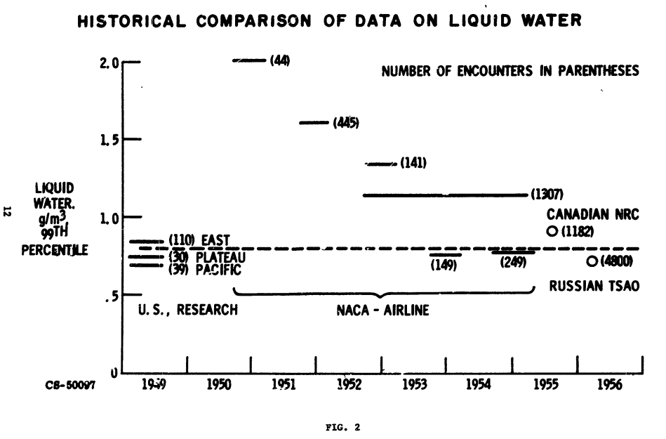

Title: Porter Perkins Conclusions   
Date: 2023-12-14 12:00  
status: draft  
tags: Porter Perkins, flight safety   

### _"our knowledge of aircraft icing and the penalties associated with it has not changed substantially in the last forty to fifty years"_ [^1]  

## Summary  

The many and varied contributions of Porter Perkins are reviewed.  

## Discussion  

I will focus on three areas: 

- Foresight about supercooled large drop (SLD) icing  
- A shift in instrument calibration
- Contributions to the Appendix C icing regulation   

## Foresight about supercooled large drop (SLD) icing  

I am not quite sure that I agree with the quote (from 1993) now. A lot of things have happened in three decades. 

Perkins and Rieke foreshadowed in 1993 the potential effects of large-size water-drop icing conditions, 
now commonly termed supercooled large drop (SLD) icing:  

[^1] _[Emphasis added]_    
>Protection from "Severe" icing encounters is
not possible by definition. Likewise, __there is
little if any protection from very large droplet
sizes__ when ambient temperatures are near
freezing because buildups aft of the protected
surfaces are possible due to "Runback" on the
non protected surfaces. Total coverage at the
present state-of-the-art is impractical.

In 1994 an accident occurred near Roselawn, Indiana, USA, 
that was later attributed to SLD icing. 
This set off a multinational effort to better understand such 
icing conditions and their effects on aircraft. 
New regulations were published in 2014 [^3]. 

Readers may note a 20-year interval between the accident and new regulations. 
There were intermediate actions, such as Airworthiness Directive being published, 
and a lot of basic research into icing and the effects of ice shapes. 
The complete story is beyond the scope of this post. 

Others of Perkins' publications included mentions of large drop icing: 

[^6]: Perkins, Porter J.: Summary of Statistical Icing Cloud Data Measured Over United States and North Atlantic, Pacific, and Arctic Ocean During Routine Aircraft Operations. NASA Memo 1-19-59E, 1959. [ntrs.nasa.gov](https://archive.org/details/nasa_techdoc_19810068860/page/n9/mode/2up)  
[^1]: Lewis, William, and Perkins, Porter J.: A Flight Evaluation and Analysis of the Effect of Icing Conditions on the PG-2 Airship. NACA-TN-4220, 1958. [ntrs.nasa.gov](https://ntrs.nasa.gov/citations/19810068595)  

As we saw in [Conclusions of the Meteorological Instruments Thread]({filename}Conclusions%20of%20the%20Meteorological%20Instruments%20Thread.md), 

### A shift in instrument calibration  

In "Review of Icing Criteria; William Lewis" from the [1969 Aircraft Ice Protection Report of Symposium]({filename}1969%20Aircraft%20Ice%20Protection%20Report%20of%20Symposium.md), 
William Lewis summarized icing criteria, such as drop size and LWC values. 
He had comments on the NACA era instrumentation that was used to measure them.  
 
>Problems were encountered with the calibration, but since the
device was so well adapted to automatic operation, arrangements were made
with the airlines to begin an extensive program of data collection. As
the program progressed, __difficulties with the calibration proved to be more
serious than had been anticipated__, but data collection continued to expand.
The net result was a large amount of data providing useful information on
such factors as horizontal and vertical extent of icing conditions, but
considerable uncertainty remains as to the meaning of indications of icing
rate and liquid water content. The data from this program was published
in three reports (ref. 2, 3, 4) each containing tabulations of liquid water
content and a description of calibrations in use at that time. Apparently,
as the data were worked up __the calibration was changed from time to time
as a result of further studies__. I see no other possible explanation for the
striking differences among the three reports.  

"ref. 2, 3, 4" are NACA-RM-E52J06, NACA-RM-E55F28a, and NASA Memo 1-19-59E, 
which we saw in [Meteorology publications by Porter Perkins]({filename}perkins%20meteorology.md).  

>One convenient statistic that may be used for an overall comparison of data
from various sources is the 99th percentile of liquid water content from
the entire distribution without classification by either drop size or
temperature. This comparison is shown in figure 2. Values from various
sources are plotted on a time scale to provide historical perspective and
show the apparent trend in the airline data. The airline data and the
Russian data from scheduled soundings probably contain a negligible fraction
of measurements in cumulus clouds, and are therefore comparable to the
early research data from stratiform clouds.

  

Figure 2 shows the diminishment in "NACA - Airline" LWC values, 1950 to 1955.  

Perkins' description is much briefer (NASA-MEMO-1-19-59):  

>These results are lower than preliminary values published in an interim
report (ref. 3). The data presently reported are considered more reliable 
because they are based on a larger sampling of data, and on improved
installation and operation of the icing meter. A comparison of the data
from this program with values from multicylinder measurements taken earlier 
(ref. 3) shows that higher water contents (0.5 g/cu m) averaged
over short distances exist somewhat more frequently than was previously
indicated.

"ref. 3" is NACA-RM-E55F28a.  

An innovation between NACA-RM-E55F28a and NASA Memo 1-19-59E that was 
perhaps under-emphasized was:

> the operating characteristics of the sensing probe as discussed in appendix B

  

Note that for many temperatures an unadjusted reading would be too high. 
I have not found this calibration curve in other publications, 
and the effect may be large enough to explain the differences from results 
prior to NASA Memo 1-19-59E. 

[^3]: Perkins, Porter J.: Statistical Survey of Icing Data Measured on Scheduled Airline Flights over the United States and Canada from November 1951 to June 1952. NACA-RM-E55F28a, 1955. [ntrs.nasa.gov](https://ntrs.nasa.gov/citations/19930088875)  
[^6]: Perkins, Porter J.: Summary of Statistical Icing Cloud Data Measured Over United States and North Atlantic, Pacific, and Arctic Ocean During Routine Aircraft Operations. NASA Memo 1-19-59E, 1959. [ntrs.nasa.gov](https://archive.org/details/nasa_techdoc_19810068860/page/n9/mode/2up)  
- Perkins, Porter J.: Preliminary Survey of Icing Conditions Measured During Routine Transcontinental Airline Operation. NACA-RM-E52J06, 1952. [ntrs.nasa.gov](https://ntrs.nasa.gov/citations/19810068855)  

[^1]: Perkins, Porter, and William Rieke. "Aircraft icing problems-After 50 years." 31st Aerospace Sciences Meeting, AIAA-93-0392. 1993. [arc.aiaa.org](https://arc.aiaa.org/doi/abs/10.2514/6.1993-392)   
[^2]: American Eagle Flight 4184, October 31, 1994. [wikipedia.org](https://en.wikipedia.org/wiki/American_Eagle_Flight_4184)  
[^3]: [25.1420 Appendix O Supercooled large drop icing conditions.](https://www.ecfr.gov/current/title-14/chapter-I/subchapter-C/part-25/subpart-F/subject-group-ECFR3f07132c2c2d01e/section-25.1420)  

The derivation of Appendix C Figure 1 is straight-forward. 
Data from NACA-TN-1855 maps directly onto Figure 1. 
However, note that the values at -40F were not included. 

The "Maximum vertical extent, 6500 ft" appears to have come from 
[NACA-TN-2306]({filelname}NACA-TN-2306.md):  
_[emphasis added]_

>Vertical extent of stratiform icing clouds. -   
> 
>The depth of continuous icing clouds is a factor to be considered in 
flight navigation to reduce the rate of ice accretion, particularly with 
unprotected aircraft. In order to provide information on the average
and the maximum vertical extent of continuous or nearly continuous
icing conditions, data were obtained when feasible either by
surveying the clouds or by noting the height of the cloud tops
in relation to the height of the cloud bases reported by weather
observing stations over the flight area. Reliable data were
obtained for a total of 48 flights during four winters of icing
flights. The observations were generally obtained over terrain
where orographic effects were considered negligible. The maximum
depth of the icing clouds was not determined as the thickness of
one particular icing cloud layer in every case. Two or more cloud
layers sufficiently close together, or with varying bases and tops
such that icing conditions were unavoidable without frequent changes
in flight altitude, were considered as one cloud layer. __The maximum
vertical extent of multiple cloud layers was approximately 6500 feet
as indicated in figure 3.__ Eighty percent of the icing conditions
was less than 4000 feet in vertical extent. The average observed
vertical extent of stratiform icing clouds was approximately
3000 feet. Flight surveys indicated a maximum depth of 3500 feet.
for any single cloud layer, which is in approximate agreement with
the discussion of cloud-thickness values presented in reference 2.  

  

The derivation of Appendix C Figure 2 is shown below. 
The frequency of observations of icing at temperature and altitude values was plotted 
in NACA-TN-2569 Figure 4, and an envelope was drawn around it. 
Note that a point near -24F, 16000 ft. was not included, without explanation. 

  

How Appendix C Figure was derived is a long and involved story, perhaps meriting its onwn thread in the future. 
For now, note that Figure 3 cites NACA-TN-2738 as the source. 
However, NACA-TN-2738 cites NACA-TN-1904 as the source for its data. 
If one does some arithmetic with the NACA-TN-1904 values, 
one can get values along the Appendix C Figure 3 curve. 
Jeck notes that the NACA-TN-2738 curve was "extrapolated anonymously"
(reference , which provides a good, but not quite complete, story of Appendix C Figure 3).

  

So far, we have no values that appear to be derived from a publication by Porter Perkins. 

What is left that could have been contributed?  

NACA-RM-E52J06 noted that:  

>The majority of the research flights into icing conditions were
made by attempting to select weather conditions, flight paths, and altitudes, 
which would yield heavy or continuous icing. Multiple traverses
were often made when such conditions were found. It is impossible,
therefore, to determine from this information the extent or frequency
of specified icing conditions that would be encountered during normal
flight operations such as those experienced by airlines on routine
schedules.  

The data from the [Meteorology publications by Porter Perkins]({filename}perkins%20meteorology.md) 
were in this theme, assessing what airlines could actually encounter. 

While some of Perkins' publications were too late to contribute to Appendix C, 
much of the flight data was gathered by 1955. 
Preliminary data could have provided assurances that data from typical airline routes 
were not greatly different from the prior research data. 

Whether Perkin's data was used to develop Appendix C, it had a lasting legacy. 
It makes up a substantial portion of the Supercooled Cloud Database used in DOT/FAA/AR-07/4. 

<!--
look up numbers
-->

Perkins' publications are cited 15 times in the Aircraft Icing Handbook

<!--

The "Maximum vertical extent, 6500 ft" from Appendix C, Figure 1 might come from 
NASA Memo Figure 9. I have found other assessments of cloud vertical extent, 
but this is the only one that clearly indicates 6500 ft (well, actually about 6600 ft. as P=0.001).  

  
_Figure 9 of NASA-MEMO-1-19-59, reused as Figure 6._  

However, the timing of publication is a little awkward. CAM 4b, the first appearance of Appendix C data, 
was effective August 25, 1955. NASA-MEMO-1-19-59 was published in January 1959. 
It is 
-->

Jeck, Richard K.: Advances in the Characterization of Supercooled Clouds for Aircraft Icing Applications. DOT/FAA/AR-07/4, Appendix C, November, 2008.  
