title: ADS-4  
Date: 2022-05-14 12:00  
Category: NACA  
tags: thermodynamics  

### _"these calculations, performed at several span stations, can become unnecessarily tedious"_  

# ADS-4, “Engineering Summary of Airframe Icing Technical Data” [^1]  

  

## Summary
A single thermodynamic control volume is used for anti-ice calculations. 

## Key points  
1. Ice shapes are classified (glaze, rime).  
2. A single thermodynamic control volume is used for anti-ice calculations.  
3. NACA icing publications are extensively used.  

## Abstract  

>This report provides, in a single reference document, an engineering summary
of selected technical data on airframe icing conditions, methods of detecting,
preventing, and removing ice from airframes in flight, and methods of testing
ice protection systems to ensure their adequacy.
An aircraft engineer can use
this report to design adequate ice protection systems for any type aircraft for
any flight mission profile.  
The work done in preparing this report covered a survey, study, analysis,
and summary of the vast amount of technical literature on airframe icing
available in the world today.
Key technical data on airframe icing was selected
and summarized for the report.
Results of the work provide a design engineer
with the following:  
a. Complete statistical data on the earth's icing weather conditions that can be used as design criteria for airframe ice protection systems.  
b. An explanation of the physics of airframe ice collection.  
c. A discussion of known methods of airframe ice protection, and formulas and data to be used in their design.  
d. Selected specific applications of ice protection systems to conventional aircraft airframes.  
e. Data on known methods and systems for detection of airframe icing.  
f. Various methods of testing ice protection systems and aircraft for adequacy.

> This technical report is an adequate single reference document for airframe
design engineers to use in designing airframe ice protection systems.
New and
different airframe protection systems, methods, and test procedures that are
as good or better than those given here may exist and certainly will exist in the
future.
The adequacy of the ice protection system on each type of aircraft must be
proved in the mission icing environment the design engineer established for the
aircraft.

## Discussion  

ADS-4 was published after the NACA era, but it was included in Uwe von Glahn's ["Selected Bibliography of NACA-NASA Icing Publications"]({filename}The Historical Selected Bibliography of NACA-NASA Icing Publications.md).
ADS-4 relied heavily on NACA icing publications, 
and more than half of the citations in the sections reviewed below were NACA icing publications. 

There is much to see here, as ADS-4 is long (483 pages). 
This review will focus on the thermodynamic aspects (only) of Section 2, "Physics of Ice Collection", 
and Section 3, "Methods of Ice Protection".

Note: the quality of the images from the online document is variable. 
Scanned text often required manual cleanup. 
I have done some straightening of the images herein. 

### Physics of Ice Collection 

>2.1 SUMMARY  
Ice can form on aircraft forward surfaces during flight through clouds at temperatures below freezing.
For a given icing condition (as defined in Section 1), 
the rate and extent of ice accumulation is a function of flight speed 
and airfoil or body geometry.
This section of the report presents the formulas ard tabulations
of impingement data that will allow calculation of ice accretion rate and extent
for a large number of airfoils and geometric bodies.
The ice collection rate for nearly any object can be approximated from the data presented.
These values are needed for the design of the various types of ice protection systems, or to
consider the effects of ice accretion if the surface is not protected.  

> 2.2 INTRODUCTION
Ice may form on the unheated forward facing surfaces of an aircraft flying
through clouds of supercooled water droplets.
At low temperature, the water droplets freeze immediately on impact with airfoil leading edges, forming rime ice (Figure 2-1 from Ref. 2-1).
At higher temperatures, the water droplets
may flow over the surface for a short distance before freezing, resulting in
glaze ice (Figure 2-1b). The size, shape and extent
of ice formation depends
on the cloud liquid water content, the drop size and temperature,
the flight
speed and angle of attack, airfoil or body geometry, and duration of the icing
encounter.

The image quality of ADS-4 Figure 2-1 is poor, so I will not reproduce it here.
Instead, here is the more legible, original Figure 11 from "The Icing Problem" ("Ref. 2-1") [^2].
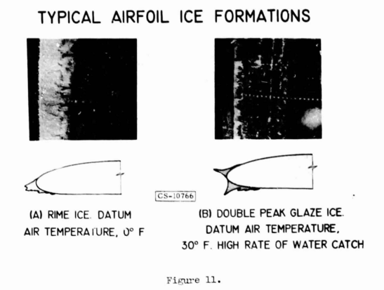  

Perhaps surprisingly, this is one of the few images of ice 
from all the NACA icing publications that we have seen so far. 

>Equations and methods of determining ice shapes on unprotected airframe
components are shown.
The flight speeds above which icing will not occur are
shown versus ambient temperature.
Typical ice shapes are also shown, as
well as plots to define the three basic types of ice accretion in terms of flight
speed, ambient temperature, liquid water content and droplet size.
The terms used in this report to describe the three types of ice are glaze,
intermediate and rime. The terms are in common use in icing literature and
by icing research and design engineers.
The terminology commonly used by
aircraft pilots in reporting ice may differ; the following tabulation may help
clarify the discrepancies:

    Ice Designation                  Ice Description
    
    Icing Literature  Pilots         
    ----------------  ------
    --                Glaze      Smooth film of ice covering leading edge 
                                 at temperatures just below freezing.  
    
    Glaze             Mushroom   Double-horn ice formations, hard clear
                                 ice with rapid growth rate.    
    
    Intermediate      --         Combination of glaze and rime ice; glaze
                                 in forward areas, rime in aft areas.
    
    Rime              Spearhead  Milky white appearance, lower density
                                 ice with a relatively streamlined shape.

> 2.5.1 ICING LIMIT AND TYPES OF ICE AS A FUNCTION OF FLIGHT CONDITIONS -  
The following discussion presents information on characteristic ice shapes and means of determining the type of ice shape associated with
various combinations of airspeed and icing conditions.
The temperature of an airfoil exposed to icing conditions is a complex function of airspeed, liquid water content, ambient temperature and altitude.
shape and type of ice (if any) that forms is dependent on the surface temperature. 
In this section of the report, equations for calculating surface temperature are presented, as well as typical results.
Types of ice and shape are also shown and are related to flight and meteorological conditions.

> The "datum temperature" has been widely used to represent the temperature of an unheated surface in icing. 
(This usage is not entirely accurate, as will be discussed later.) It has also been described as "wet adiabatic" and "wet
air boundary layer" temperature.
It may be calculated from the equation:  
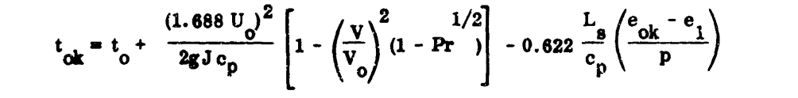  

While it is not cited by ADS-4, the datum temperature concept comes from [NACA-ARR-5G13]({filename}NACA-ARR-5G13.md) [^3]. 

>Solution of this equation is shown In Figure 2-31 for flight speeds up to 800 kt., 
ambient temperatures of -20 to 30 F, and an altitude of 10,000 ft. 
Curves for sea level and 20,000 ft. are shown in Section 3 (Figure 3-8).
It may be seen that a flight speed of 300 kt. will produce a 32 F datum temperature at 20 F
ambient, but that at 0 F a speed of 485 knots is needed.
This graph may be used as a guide in determining whether a particular combination of flight speed and 
ambient temperature is likely to represent a potential icing problem.  
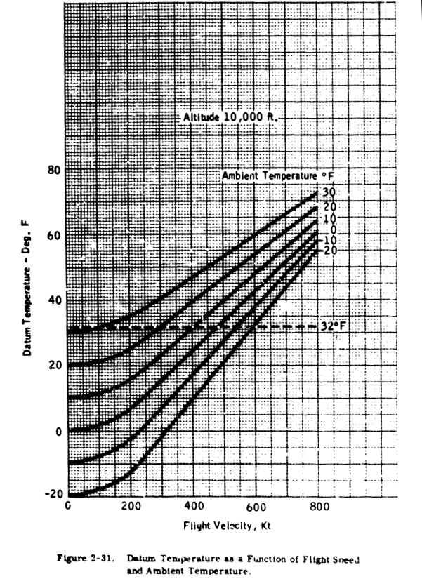  

>An exact account of the heat balance on an unheated, insulated icing surface
way be found in Ref. 2-27.
Typical curves of surface temperature versus free
stream velocity are shown in Figure 2-32, and are compared with the temperatures 
in clear air and those calculated by the "datum temperature" equation.
At the lower speeds, release of heat of fusion (as the water freezes) can result
in temperatures in excess of dry air total temperature.
At 32 F, a region exists
where the water catch is completely frozen (n = 1), partly frozen, or all in
liquid form (n = 0).
(The freezing fraction, n, is defined in Ref. 2-27 as that
part of the water catch that freezes in the region where it impinges.) At the
higher speeds, the equilibrium surface temperature is not greatly different from
the "datum" temperature.
  

Ref. 2-27 is [Messinger]({filename}messinger.md) [^4]. 

>It should be noted that the method of Ref. 2-27 is based upon an insulated
surface (no chordwise heat flow).
This is true for a plastic radome or fiberglass leading edge as well as 
for a titanium or steel leading edge. However,
an aluminum-skinned airfoil will transfer heat chordwise and the surface
temperature at the lower speeds may be fairly close to the "datum" temperature.
It may be seen from the preceding data that relatively high speeds are
needed to preclude the formation of ice, and that aircraft with low operating
speeds will experience icing much more frequently than higher speed aircraft.
The type of ice that forms and its shape are a function of speed, liquid
water content and temperature.
intermediate and rime.
Ice shapes are generally classified as glaze,
A correlation of ice shape is shown in Figures 2-33
through 2-35 in terms of liquid water content, ambient temperature and flight
speed.

  
  
  

The file "ads4_freezing_fraction.py" [^5] reproduces the values well:

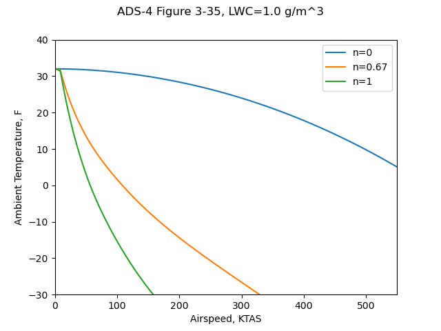  

>This correlation was obtained from an analysis by Dickey (Ref. 2-28),
using the "freezing fraction" concept developed by Messinger (Ref. 2-27).
The
specific values shown are based on the stagnation line of a two-inch cylinder
(insulated) with a drop size of 15 microns.
An aluminum-skinned airfoil would
tend to accumulate rime and intermediate glaze-rime ice at slightly higher
temperatures than shown, because of the conduction of heat away from the area
of high water catch (and release of heat of fusion).
The plots of Figures 2-33
through 2-35 can be used as a guide in determining the probable type of ice
formed for various flight and icing conditions.
These curves have not been
validated by experiment over the complete range of parameters shown; therefore, 
caution and judgment must be exercised in their use.
In general terms, it can be stated that rime ice is likely to occur at total
air temperatures of about 10 F and below, while glaze ice usually occurs at
total temperatures of 25 to 32 F.
Between 10 and 25 F, a glaze-rime formation will usually occur, with clear glaze ice at the stagnation region, and 
milky-white rime ice in the aft regions.

>2.5.2  
GLAZE ANID RIME ICE SHAPES FOR VARIOUS AIRFOILS AND BODIES OF REVOLUTION - 
The shape of ice formation is of particular interest
in the case of unprotected airframe components.
Flight tests are often made
with simulated ice shapes on developmental aircraft to determine the need for
protecting these components.
In this case, the ice shape must be determined
by a combination of analysis and reference to existing data an ice shapes from
both wind tunnel and flight tests.  

>Although a large number of photographs are available of ice shapes on unheated bodies, 
very few actually show cross-sections of the ice, or give critical
dimensions (maximum thickness, extent, etc).
Several photographs and sketches
from Ref. 2-29 and 2-30 are shown in Figures 2-36 through 2-40 to illustrate
glaze, intermediate and rime ice deposits.
Cross-sections of ice on a four per
cent airfoil are shown in Figure 2-36.
Rime ice forms in a manner that is easily
predictable; that is, the drops freeze on impact and the resulting ice shape has
the same form as would be predicted by the droplet impingement data shown previously.
The rate of growth is generally linear for rime ice, because the ice
shape does not alter the flow field significantly.
The glaze ice exhibits the typical "double horn" shape, 
that results from water flow in the stagnation region.
As the ice increases in size, the aft regions are sheltered from impingement so
that virtually all the water is deposited at the stagnation region.
The exact shape
of glaze ice is difficult to predict; however, most glaze ice shapes will be similar
to those of Figures 2-36 and 2-37.
Rate of growth for glaze ice may be nonlinear
(increasing with time in icing) because the ice affects the flow field.
This is
particularly true for thin airfoils at low angle of attack (See Ref. 2-29).
This factor should be considered in predicting ice shapes on unheated airfoils.

  

The image quality of Figures 2-37 to 2-40 are so poor that they are not worth reproducing here. 

>On highly swept airfoils, glaze ice tends to form as a series of discontinuous cup shapes.
A comparison of ice shapes for various sweep angles is
shown in Figure 2-40.

>The ice shapes shown are based upon maintaining angle of attack (as well
as other parameters) constant throughout the icing encounter.
This is a reasonable assumption for current turbine aircraft 
which have a large power reserve at the lower speeds where icing is most likely to occur.
Aircraft powered
by piston engines may not have adequate power to maintain airspeed as drag
increases in icing.
In this case, speed is reduced and the angle of attack is increased.
Analysis of ice shapes on unprotected surfaces should consider
this change in angle of attack when it is applicable.  
A correlation of ice shape and drag effects with impingement parameters
has been published as an SAE paper (Ref. 2-31).
The report contains significant and useful data; 
however, the correlations shown are entirely empirical.
It is believed that the correlations should be further qualified before they are
used for design purposes. 

### Methods of Ice Protection

We previously reviewed [NACA-TN-2799]({filename}NACA-TN-2799.md) [^6], 
and it was noted that it did not include how to determine heat transfer coefficients. 
Methods for that are provided in ADS-4. 

>3.1 SUMMARY  
If a need for ice protection has been established for an airframe, then the depth
or degree of protection that is desired or can be provided must be established.
Areas that may require ice protection are presented in Figure 3-1. 
Several degrees of ice protection are possible.
First is de-icing, in which ice accretion 
is permitted on the protected surface and then removed periodically.
Second is running wet anti-icing, in which moisture is prevented by some means
from freezing on the surface.
This moisture may run back beyond the protected
surface and freeze (commonly called runback ice).  
Third is evaporative or dry
anti-icing, in which all moisture impinging upon the surface is evaporated with
no runback.  
These various degrees of ice protection may be provided by pneumatic
de-icers, fluid freezing point depressants, and thermal-hot gas and thermal-electric systems.  
This section of the report will describe the various ice protection systems
and will present methods of determining the requirements placed on the systems 
to provide a particular degree of ice protection.
  

>3.5 THERMAL ANTI-ICING   
3.5.1 DESCRIPTION -  
Thermal anti-icing systems use heat to maintain the
temperature of the surface to be protected above freezing throughout an icing
encounter. Thermal anti-icing systems are classified as evaporative and running wet. 
Evaporative systems, as the name implies, supply sufficient heat to
evaporate all water droplets impinging upon the heated surface.
The running
wet systems, however, provide only enough heat to prevent freezing upon the
heated surface.
Beyond the heated surface of a running wet system, the water
could freeze (generally called runback ice).
For this reason, running wet systems must be used carefully 
so as not to permit runback ice buildup in critical
locations.
For example, the heated surface of a running wet system on a
turboprop or turbojet inlet should extend into the inlet to the compressor face
so that the water runoff will combine with the intake air and not strike cold
surfaces where it could refreeze, break off, and possibly damage the engine.

>Basically, two sources of heat for thermal anti-icing are used in aircraft:
electrical heaters and hot air. For anti-icing, the heat source must remain on
throughout the icing encounter. Areas ot an aircraft that may be afforded thermal 
ice protection are included in Figure 3-1.
Of these areas, the windshield
is always given anti-ice protection while the remainder of the areas may be
given anti-icing or de-icing protection, depending on the power available for
ice protection and the effects of ice accretion on the aircraft.

>3.5.2
REQUIREMENTS - Equations expressing heat transfer and evaporation
from wetted surfaces during icing encounters have been used to develop a graphical solution for the determination of heat required for anti-icing (Ref. 3-4).
Figures 3-18a and 3-18b are presented for this purpose.
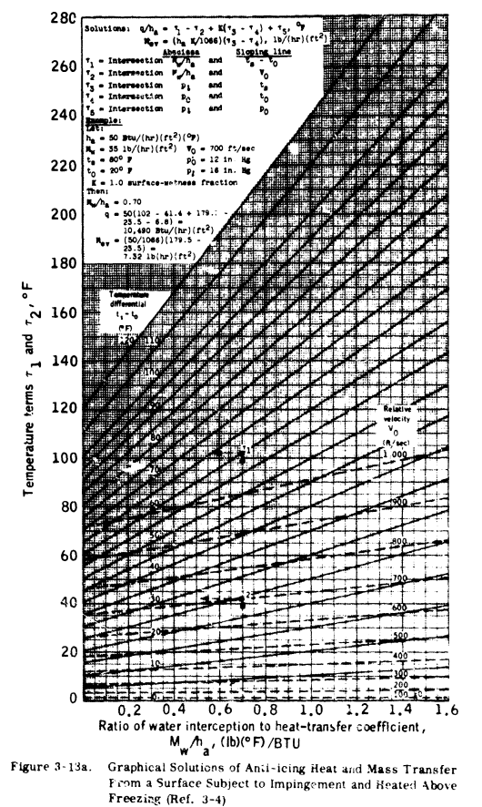  
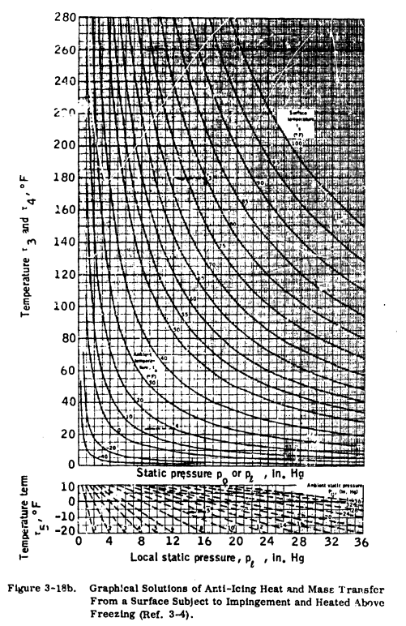  

"Ref. 3-4" was reviewed previously at [NACA-TN-2799]({filename}NACA-TN-2799.md) [^6].  

>Preparatory to using
these figures, the local heat transfer coefficient and rate of water catch (MW)
must be determined.  
To determine the local heat transfer on an airfoil, the following three
equations may be used:  
a. Heat transfer coefficient for a cylinder (hcy) of the same radius as the
leading edge of the airfoil.  
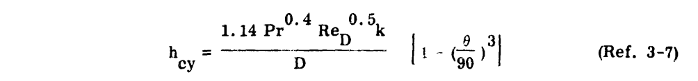  
b. Heat transfer coefficient for laminar flow over a flat plate (hlp) to the
chordwise extent of the heated surface .
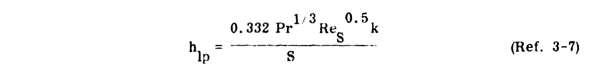  
c. Heat transfer coefficient for turbulent flow over a flat plate to the
chordwise extent of the heated surface
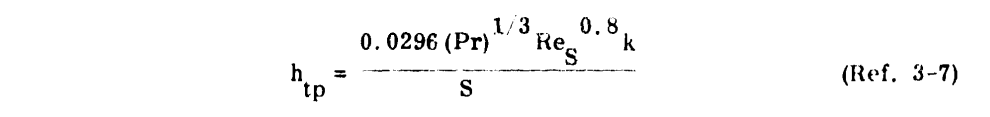  

"Ref. 3-7" is NACA-TN-2866 [^7].  

>A typical plot of these heat transfer coefficients is presented in Figure 3-19
for a specific altitude and airspeed.
The transitions from flat plate laminar to
flat plat turbulent are only estimates, as the location of the transition region
will vary with surface roughness, airfoil shape and angle of attack.
Transition
will usually start at a Reynolds Number of .5 to 2 x 10^6 and the flow will be fully
turbulent at a Reynolds Number of 2 to 4 x 10^6.  
These equations may be used to determine the heat required per unit area
along the chord.
On tapered and swept-back airfoil, these calculations, performed at several span stations, 
can become unnecessarily tedious.
In practice,
the heat transfer coefficients for a span station are plotted as in Figure 3-19
and an average value assumed for that station.
This average value (ha) is then
used to enter Figures 3-18a and 3-18b to determine the anti-icing heat requirements.
This assumption of an average value of heat transfer coefficient has a
percentage of error in the same order of magnitude as the assumptions made
in the meteorological variables.  
>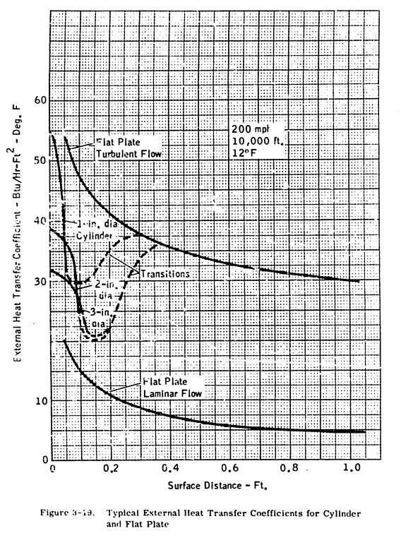  

In many situations, "engineering judgement" would have to be applied 
to find the "average value assumed" of disparate values like those shown above. 

>The water catch rate (Mw) is obtained by dividing the water catch (Wm) by
the heated area per foot of span for each spanwise position (see Section 2 and
the example in Section 4). For a completely evaporative system, the rate of
evaporation of water (Mev) must equal the rate of water catch (Mw). With this
knowledge, the following equation may be solved for
>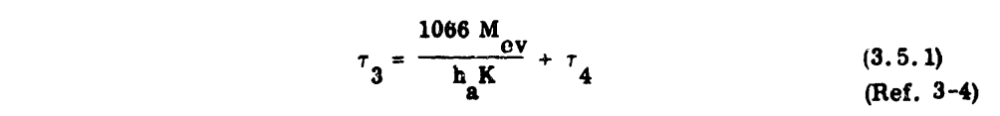  
>where K is the surface wettness fraction which is assumed to be 1.0 in the
impingement region and 0.20 to 0.25 beyond the impingement region.

While it is not cited by ADS-4, I believe that the 0.2 to 0.25 surface wettedness value came from 
NACA-TN-2480 [^8], Figure 7:  

  

>With τ3,
Figure 3-18b is entered with po to find ts.
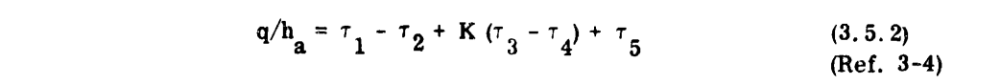  
If designing for a running wet system, the surface temperature (ts) is
assumed to be some value above freezing (such as 35F, and
τ3 is found graphically. The next steps are the graphical solution for τ1 through τ5 using Figures
3-18a and 3-18b and the solution of Equation 3.5.2 for the heat transfer rate at
each spanwise position.
The heat transfer rate (q) may then be plotted versus spanwise position to
obtain heating distribution requirements.
Typical values for a wing are from
2,5000 to 5,5000 [sic] BTU/hr.-ft. span.

I believe that what was intended above is "2500 to 5500 BTU/hr.-ft.span". 

## Conclusions

From a current perspective, there were surprisingly few ice shapes recorded in the NACA era. 
There will be considerable development of ice shape test and analysis methods in the post-NACA era. 

This use of an averaged heat transfer coefficient and a single, averaged control volume gets perpetuated in later sources such as 
the SAE Aerospace Applied Thermodynamics Manual [^9]. 

The Aircraft Icing Handbook [^10] incorporates large portions of ADS-4. 

## Citations

Section 2 cites 31 publications, 19 of which are NACA publications. 

- von Glahn, Uwe H.: The Icing Problem, presented at Ottawa AGARD Conference. AG 19/P9, June 10-17 1955. [ntrs.nasa.gov](https://ntrs.nasa.gov/citations/19700070487)     
- von Glahn, Uwe H., Gelder, Thomas F., and Smyers, William H., Jr.: A Dye-Tracer Technique for Experimentally Obtaining Impingement Characteristics of Arbitrary Bodies and a Method for Determining Droplet Size Distribution. NACA-TN-3338, 1955.  
- Langmuir, Irving, and Blodgett, Katherine B.: A Mathematical Investigation of Water Droplet Trajectories. Tech. Rep. No. 5418, Air Materiel Command, AAF, Feb. 19, 1946. (Contract No. W-33-038-ac-9151 with General Electric Co.)  
- Brun, Rinaldo J., Gallagher, Helen M., and Vogt, Dorothea E.: Impingement of Water Droplets on NACA 651-208 and 651-212 Airfoils at 4° Angle of Attack. NACA-TN-2952, 1953.  
- Brun, Rinaldo J., and Mergler, Harry W.: Impingement of Water Droplets on a Cylinder in an Incompressible Flow Field and Evaluation of Rotating Multicylinder Method for Measurement of Droplet-Size Distribution, Volume-Median Droplet Size, and Liquid-Water Content in Clouds. NACA-TN-2904, 1953 [ntrs.nasa.gov](https://ntrs.nasa.gov/citations/19930083606).     
- Sogin, H. H.: A Design Manual for Thermal Anti-Icing Systems. WADC TR 54-313, December 1954.  
- Guibert, A. G., Janssen, E., and Robbins, W. M.: Determination of Rate, Area, and Distribution of Impingement of Waterdrops on Various Airfoils from Trajectories Obtained on the Differential Analyzer. NACA-RM-9A05, 1949.  
- Bergrun, Norman R.: A Method for Numerically Calculating the Area and Distribution of Water Impingement on the Leading Edge of an Airfoil in a Cloud. NACA-TN-1397, 1947 [ntrs.nasa.gov](https://ntrs.nasa.gov/citations/19810068678).  
- Brun, Rinaldo J., Gallagher, Helen M., and Vogt, Dorothea E.: Impingement of Water Droplets on NACA 65A004 Airfoil at 8° Angle of Attack. NACA-TN-3155, 1954. [ntrs.nasa.gov](https://ntrs.nasa.gov/citations/19810068691) 
- Brun, Rinaldo J., Lewis, William, Perkins, Porter J., and Serafini, John S.: Impingement of Cloud Droplets and Procedure for Measuring Liquid-Water Content and Droplet Sizes in Supercooled Clouds by Rotating Multicylinder Method. NACA-TR-1215, 1955. (Supersedes NACA TN’s 2903, 2904, and NACA-RM-E53D23) [ntrs.nasa.gov](https://ntrs.nasa.gov/citations/19810068697)
- Torgeson, W. L., and Abramson, A. E.: A Study of Heat Requirements for Anti-Icing Radome Shapes with Dry and Wet Surfaces. WADC Tech. Rep. 53-284, Wright Air Dev. Center, Wright-Patterson Air Force Base, Sept. 1953. (Contract AF 33(616)-85, RDO No. 664-802.)  
- Brun, Rinaldo J., Gallagher, Helen M., and Vogt, Dorothea E.: Impingement of Water Droplets on NACA 65A004 Airfoil and Effect of Change in Airfoil Thickness from 12 to 4 Percent at 4° Angle of Attack. NACA-TN-3047, 1953.  
- Gelder, Thomas F., Smyers, William H., Jr., and von Glahn, Uwe H.: Experimental Droplet Impingement on Several Two-Dimensional Airfoils with Thickness Ratios of 6 to 16 Percent. NACA-TN-3839, 1956.  
- Lewis, James P., and Ruggeri, Robert S.: Experimental Droplet Impingement on Four Bodies of Revolution. NACA-TN-4092, 1957.  
- Brun, Rinaldo J., and Vogt, Dorothea E.: Impingement of Cloud Droplets on 36_5-Percent-Thick Joukowski Airfoil at Zero Angle of Attack and Discussion of Use as Cloud Measuring Instrument in Dye-Tracer Technique. NACA-TN-4035, 1957. [ntrs.nasa.gov](https://ntrs.nasa.gov/citations/19810068703)  
- Lewis, William, and Brun, Rinaldo J.: Impingement of Water Droplets on a Rectangular Half Body in a Two-Dimensional Incompressible Flow Field. NACA-TN-3658, 1956. [ntrs.nasa.gov](https://ntrs.nasa.gov/citations/19930084877)    
- Hacker, Paul T., Saper, Paul G., and Kadow, Charles F.: Impingement of Droplets in 60° Elbows with Potential Flow. NACA-TN-3770, 1956.  
- Brun, Rinaldo J., and Vogt, Dorothea E.: Impingement of Water Droplets on NACA 65A004 Airfoil at 0° Angle of Attack. NACA-TN-3586, 1955. [ntrs.nasa.gov](https://ntrs.nasa.gov/citations/19810068696)  
- Hacker, Paul T., Brun, Rinaldo J., and Boyd, Bemrose: Impingement of Droplets in 90° Elbows with Potential Flow. NACA-TN-2999, 1953.  
- Dorsch, Robert G., Brun, Rinaldo J., and Gregg, John L.: Impingement of Water Droplets on an Ellipsoid with Fineness Ratio 5 in Axisymmetric Flow. NACA-TN-3099, 1954. [ntrs.nasa.gov](https://ntrs.nasa.gov/citations/19810068689)    
- Dorsch, Robert G., Saper, Paul G., and Kadow, Charles F.: Impingement of Water Droplets on a Sphere. NACA-TN-3587, 1955. [ntrs.nasa.gov](https://ntrs.nasa.gov/citations/19810068694)    
- Brun, Rinaldo J., and Dorsch, Robert G.: Impingement of Water Droplets on an Ellipsoid with Fineness Ratio 10 in Axisymmetric Flow. NACA-TN-3147, 1954. [ntrs.nasa.gov](https://ntrs.nasa.gov/citations/19930083846)    
- Weiner, Frederick R.: Use of the Ko Correlation in Preliminary Design and Scale Model Icing. NA-63-303, North American Aviation, Inc. (Presented at Spring Meeting of Aircraft Air-Conditioning Forum, Los Angeles, California, March 21, 1963).  
- Dewinnell, J. H.: Principles of Aerodynamics. McGraw-Hill, 1949.  
- Dorsch, Robert G., and Brun, Rinaldo J.: A Method for Determining Cloud-Droplet Impingement on Swept Wings. NACA-TN-2931, 1953.  
- von Mises, Richard: Theory of Flight. McGraw-Hill, 1945.  
- Messinger, B. L.: Equilibrium Temperature of an Unheated Icing Surface as a Function of Airspeed. Preprint No. 342, Presented at I.A.S. Meeting, June 27-28, 1951.  
- Dickey, Thomas A.: An Analysis of the Effects of Certain Variables in Determining the Form of an Ice Accretion. AEL 1206, April 1952 (presented at Mt. Washington Spring Planning Conference, Engineering Laboratory, Naval Air Experimental Station, 29 May 1952).  
- Gray, Vernon H.: Correlations Among Ice Measurements, Impingement Rates, Icing Conditions and Drag Coefficients for an Unswept NACA 65A004 Airfoil. NACA-TN-4151, 1958. [ntrs.nasa.gov](https://ntrs.nasa.gov/citations/19810068588)  
- Bowden, Dean T.: Effect of Pneumatic De-Icers and Ice Formations on Aerodynamic Characteristics of an Airfoil. NACA-TN-3564, 1956. [ntrs.nasa.gov](https://ntrs.nasa.gov/citations/19930084294)  
- Gray, Vernon H.: Correlation of Airfoil Ice Formations and Their Aerodynamic Effects With Impingement and Flight Conditions. SAE preprint No. 225 (paper presented at SAE National Aeronautics Meeting), October 1957.  
  
Section 3 cites 17 publications, 9 of which are NACA publications.  
                                                                                                                                                                                                                                                                                                                   
- Bowden, Dean T.: Effect of Pneumatic De-Icers and Ice Formations on Aerodynamic Characteristics of an Airfoil. NACA-TN-3564, 1956. [ntrs.nasa.gov](https://ntrs.nasa.gov/citations/19930084294)  
- Anon.: De-Icing System, Pneumatic Boot, Aircraft, General Specification for. Mil Spec. MIL-D-8804A, 14 June 1956.  
- Anon.: Spray Equipment, Aircraft Windshield, Anti-Icing. Mil Spec. MIL-8-6625A, Oct. 1951  
- Gray, Vernon H.: Simple Graphical Solution of Heat Transfer and Evaporation from Surface Heated to Prevent Icing. NACA-TN-2799, 1952.  
- Lewis, James P., and Blade, Robert J.: Experimental Investigation of Radome Icing and Icing Protection. NACA-RM-E52J31, 1953.  
- Tanner,  D. C.: Fluid De-Icing. (paper presented at 1961 Aircraft Ice Protection Conference, D. Napier & Son, Ltd.).  
- Gelder, Thomas F., Lewis, James P., and Koutz, Stanley L.: Icing Protection for a Turbojet Transport Airplane: Heating Requirements, Methods of Protection, and Performance Penalties. NACA-TN-2866, 1953. [ntrs.nasa.gov](https://ntrs.nasa.gov/citations/19930083662)  
- Anon.: Anti-Icing Equipment for Aircraft, Heated Surface Type, General Specification for. Mil Spec. MIL-A-9482, 15 Dec. 1947, amended 10 June 1955, 1955.  
- Anon.: Transparent Areas, Anti-Icing Defrosting and Defogging Systems, General Specifications for. Mil Spec. MIL-T-5842A, 1 Sept. 1950.  
- Sogin, H. H.: A Design Manual for Thermal Anti-Icing Systems. WADC TR 54-313, December 1954.  
- Lewis, James P., and Bowden, Dean T.: Preliminary Investigation of Cyclic De-Icing of an Airfoil Using an External Electric Heater. NACA-RM-E51J30, 1952. [ntrs.nasa.gov](https://ntrs.nasa.gov/citations/19810068711)  
- Lewis, James P.: De-Icing Effectiveness of External Electric Heaters for Propeller Blades. NACA-TN-1520, 1948.  
- Lewis, James P., and Stevens, Howard C., Jr.: Icing and De-Icing of a Propeller with Internal Blade Heaters. NACA-TN-1691, 1948.  
- Gray, Vernon H., and Bowden, Dean T.: Comparison of Several Methods of Cyclic De-Icing of a Gas-Heated Airfoil. NACA-RM-E53C27, 1953. [ntrs.nasa.gov](https://ntrs.nasa.gov/citations/19810068601)  
- Johnson, H. C., and  Johnson, E. G.: Study of Limited Type Ice Removal and Prevention Systems (Mechanical Phase). WADC Technical Report 55-262, Research Inc., April 1955.  
- Meyer, W. R., and Foley, E. F., Jr.,: Ice Adhesion Tests on Films of Organic Polar Materials. WADC Technical Report 56-591, March 1957.  
- Trunov, O. K., and Egorov, M. S.: Some Results of Experimental Flights in Natural Icing Conditions and Operation of Aircraft Thermal Ice Protection. (paper presented at 1960 Aircraft Ice Protection Conference, D. Napier and Son, Ld.).  

An online search [^11] found 65 citations of ADS-4 in the literature.  

## Related  

[Design Manuals]({filename}Design%20Manuals.md) discusses ADS-4 and its predecessors. 

## Notes 

[^1]: Bowden, D.T, et.al., “Engineering Summary of Airframe Icing Technical Data”, FAA Technical Report ADS-4, General Dynamics/Convair, San Diego, California, 1964 [apps.dtic.mil](https://apps.dtic.mil/sti/citations/AD0608865)  
[^2]: 
von Glahn, Uwe H.: The Icing Problem, presented at Ottawa AGARD Conference. AG 19/P9, June 10-17 1955. [ntrs.nasa.gov](https://ntrs.nasa.gov/citations/19700070487)   
[^3]: Hardy, J. K.: Kinetic Temperature of Wet Surfaces A Method of Calculating the Amount of Alcohol Required to Prevent Ice, and the Derivation of the Psychrometric Equation. NACA-ARR-5G13, 1945. [ntrs.nasa.gov](https://ntrs.nasa.gov/citations/19930093546) 
[^4]: 
Messinger, B. L.: Equilibrium Temperature of an Unheated Icing Surface as a Function of Airspeed. Preprint No. 342, Presented at I.A.S. Meeting, June 27-28, 1951.  
[^5]: [github.com](https://github.com/icinganalysis/icinganalysis.github.io)  
[^6]: 
Gray, Vernon H.: Simple Graphical Solution of Heat Transfer and Evaporation from Surface Heated to Prevent Icing. NACA-TN-2799, 1952.[ntrs.nasa.gov](https://ntrs.nasa.gov/citations/19930083505)  
[^7]: 
Gelder, Thomas F., Lewis, James P., and Koutz, Stanley L.: Icing Protection for a Turbojet Transport Airplane: Heating Requirements, Methods of Protection, and Performance Penalties. NACA-TN-2866, 1953. [ntrs.nasa.gov](https://ntrs.nasa.gov/citations/19930083662)  
[^9]: 
Gelder, Thomas F., and Lewis, James P.: Comparison of Heat Transfer from Airfoil in Natural and Simulated Icing Conditions. NACA-TN-2480, 1951.  
[^9]: “Ice, Frost, and Rain Protection”, SAE Aerospace Applied Thermodynamics Manual, 1969  (regularly updated, currently document [sae.org](https://www.sae.org/standards/content/air1168/4/))    
[^10]: “Aircraft Icing Handbook Volume 1.” DOT/FAA/CT-88/8-1 (1991) [apps.dtic.mil](https://apps.dtic.mil/sti/pdfs/ADA238039.pdf). Also note that there was a perhaps little known update in 1993 (that did not affect the pages of interest herein): [apps.dtic.mil](https://apps.dtic.mil/sti/pdfs/ADA276499.pdf).  
[^11]: [scholar.google.com](https://scholar.google.com/scholar?hl=en&as_sdt=0%2C48&q=Engineering+Summary+of+Airframe+Icing+Technical+Data&btnG=)  
