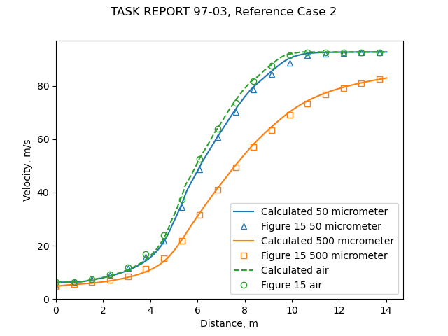
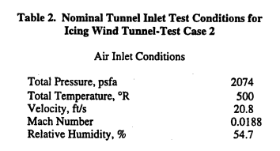
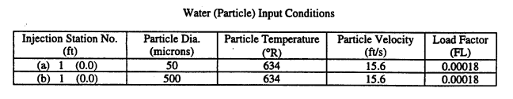
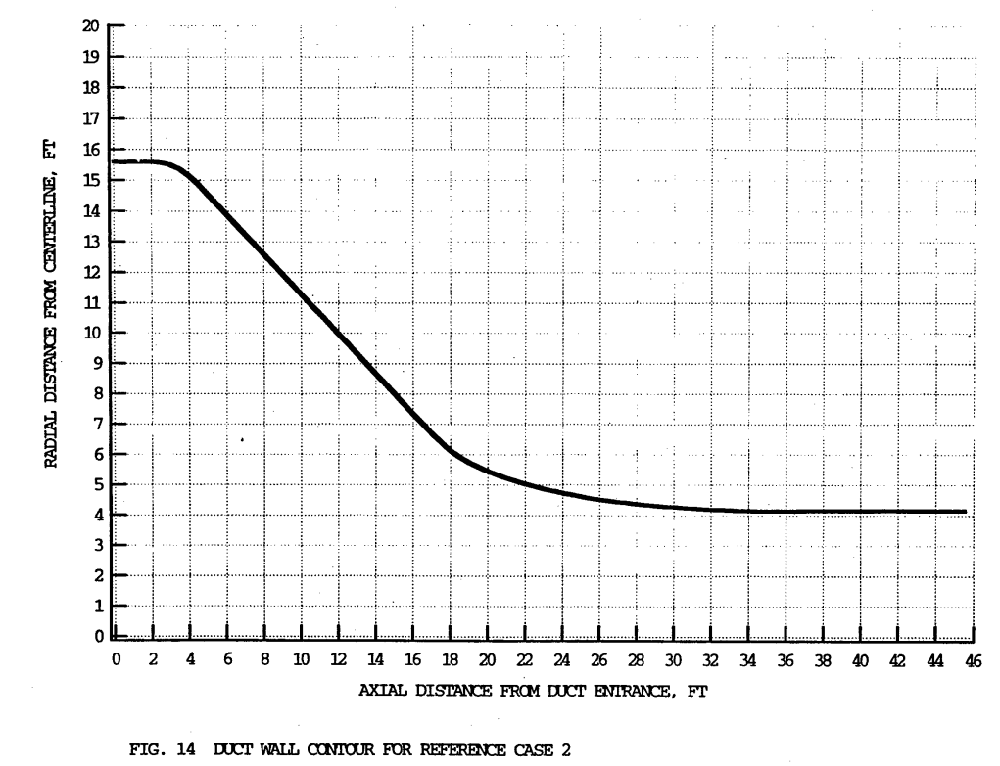
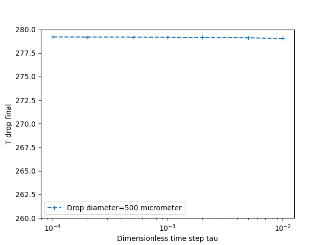
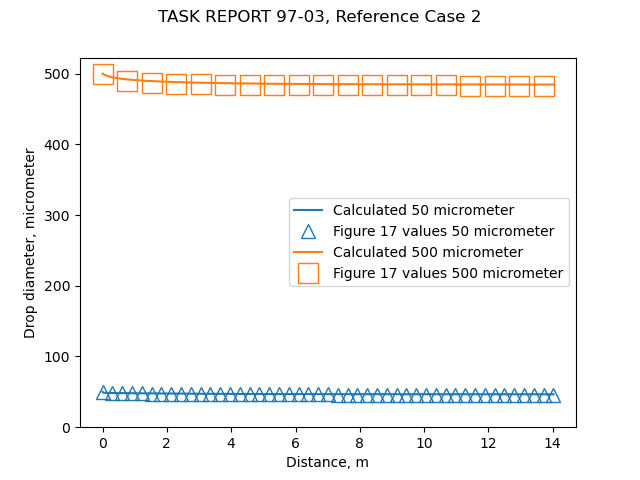

Title: AEDC1DMP  
Date: 2022-05-31 12:00  
category: Diversions  
tags: impingement, evaporation, python 

### _"The third part of the study comprised some numerical computations of two-phase, dilute, air and entrained water particle flows, using a new version of the AEDC one-dimensional, multiphase flow code, AEDC1DMP."_  

   

# The AEDC 1-Dimensional Multi-Phase code (AEDC1DMP) and the iads1dmp

## Abstract 

The AEDC1DMP calculates the water drop speed and evaporation in an icing wind tunnel. 
The AEDC1DMP is described in "Second Report for Research and Modeling of Water Particles in Adverse Weather Simulation Facilities" [^1]. 
AEDC is the Arnold Engineering Development Complex, formerly the Arnold Engineering Development Center. 

>1.0 INTRODUCTION TO THE RESEARCH  
This report describes a continuation of research into the modeling of water particle
freezing for application to adverse weather simulation facilities. The research was initiated in
FY1996 to investigate the physics of freezing of submillimeter supercooled water particles or
droplets in both natural and artificial or simulated adverse weather environments. The first phase
of the research was reported and discussed in a report [1] and a paper [2]. The work has
continued into FY1997 and has been expanded to include work done to model three-dimensional
ice accretions on surfaces, as well as modeling the near field of water spray clouds produced by
air-atomized water spray nozzles. Because of the increased scope of the work, a single report
cannot cover all of the work phases. Therefore, the present report covers only the continued
research and development of water particulate freezing models and their application in a 
one-dimensional multiphase flow code to predict water spray freezing in ducted air flows.

There is considerable information on water drop freezing calculations, 
that will not be described herein. 

Our immediate goal is to find data to use for comparison with the code developed in this post. 

## Discussion  

>5.0 EVALUATION OF AEDC1DMP CODE ON REPRESENTATIVE DUCT FLOW CASES  
5.1 Baseline Case of Ducted. Two-Phase Flow  
The base case computed for a comparison purpose was a ducted flow with a "single"
water spray station at its inlet.
In the code AEDC1DMP, the water is assumed to enter the airflow at up to ten different
injection stations that are separated, axially in the duct. Each injection station is capable of
putting in a given amount of water, in a given sized water particle with its specified velocity and
temperature. When all of the injection stations are bunched close together, axially, in the duct,
they can be used to model a single spray station with a spray droplet size distribution
characterized by ten discrete drop sizes. This was the approach taken in the previous study [1] to
examine the freezing of two-phase, ducted flows representative of both full-scale and 
research-scale icing test facilities.

>5.3.2 Nominal Test Conditions in a Full-Scale Icing Facility

>The duct or wind tunnel geometry assumed for test case 2 is shown in Figure 14. This
wind tunnel like configuration has a large inlet and a steep contraction section, to minimize flow
disturbances. Icing spray nozzles are assumed to be put in the plane of the large inlet. The test
section is located at x = 46 ft, so that the state of the water particles injected at the inlet of the
wind tunnel should be in kinetic and thermal equilibrium with the air flow by the time they reach
the test section. The tunnel has a large contraction ratio (inlet flow area divided by test section
flow area), hence, the range of permissible inlet air flow velocities is small, ranging from near 0
to about 45 ft per second. At the higher inlet air velocities, the test section has reached 
near-choking, or sonic flow conditions. Generally, icing tests are conducted at air flow or 
flight-simulating speeds in the range of a few hundred miles per hour. 
Therefore, a nominal set of inlet
test conditions was defined for the representative calculation made with AEDC1DMP. 
The nominal test conditions are listed below.

  
  
  

["Load Factor" is the ratio of mass of water drops injected to mass of air, and is proportional to the liquid water content.] 

### The iads1dmp code

Our goal is to develop enough capability to predict water drop airspeed, 
temperature, and evaporation rates. 

Equations from [^2] and [^3] were implemented in the file "iads1dmp.py" [^4] for the iads1dmp 
("Icing Analysis Developmental Software 1 Dimensional Multi-Phase" code, 
an homage to AEDC1DMP and the python lower case file naming convention). 

As this was flow in a duct, not flow around a cylinder, 
a different airspeed function was used 
than for the "cylinder_drop_1d_trajectory_shift.py" from ["Let's Build a 1D Water Drop Trajectory Simulation"]({filename}build_a_1d_drop_motion_simulation.md). 
The changing duct area was put into a table, 
and the local airspeed calculated with compressible flow relationships. 

The heat and mass transfer relationships from [NACA-TN-3024]({filename}NACA-TN-3024.md) [^3] were used.  

  
  

As a time stepping integration method was used, 
convergence with the dimensionless time step tau was checked using the calculated final drop temperature.  

  

The calculated drop velocity values agree well with the AEDC1DMP results. 
   

The water leaving the spray nozzles is heated, 
so a water drop has a rapid initial temperature drop. 
The calculated temperature values agree well for the 50 micrometer case, 
but not as well as for the 500 micrometer case, although the end points match well. 
The iads1dmp used the heat transfer correlation from NACA-TN-3024 for a sphere. 
I suspect that the AEDC1DMP may have used a different heat transfer coefficient
(the coefficient used is not given in reference [^1]). 

  

The drop sizes change slightly during the travel as water evaporates. 
Most of the change occurs near the point of the spray, where the drops are hot. 
   

The liquid water content changes as drops evaporate. 
Although the initial values (0.22 g/m^3) are the same for both drop size cases, 
the final values differ. 
The smaller drop size has a larger surface area to volume ratio, 
which is a large factor in the more rapid evaporation of the smaller drops. 

   

## Conclusions

Unfortunately, "Second Report for Research and Modeling of Water Particles in Adverse Weather Simulation Facilities" 
did not include actual test data, 
but it did have analysis results for comparison. 
Measuring water drops temperatures in an icing wind tunnel is quite challenging,
and is an area still undergoing development. 

The AEDC1DMP code does many things 
(such as handling a drop size distribution, and predicting drop freeze out rates) 
that the iads1dmp does not. 
However, the iads1dmp does give similar results for water drop relative airspeed and 
heat and mass transfer rates for the single drop size cases compared herein. 

We will call this "good enough" to proceed to our next step,
comparing calculated water drop evaporation rates to those in NACA-TN-3024. 

## Notes:

This is part of the [Water drop evaporation thread]({filename}water_drop_evaporation_thread.md), 
which you may want to review if you came here via a direct link. 

[^1]: 
Schulz, R. J.: Second Report for Research and Modeling of Water Particles in Adverse Weather Simulation Facilities. TASK REPORT 97-03, AEDC, July, 1998, https://apps.dtic.mil/sti/pdfs/ADA364922.pdf  
[^2]:
Langmuir, Irving: Super-Cooled Water Droplets in Rising Currents of Cold Saturated Air, Pt. I. Res. Lab., General Electric Co., Oct. 1943-Aug. 1944. (Army Contract W-33-106-sc-65.)  
[^3]: 
Lowell, Herman H.: Maximum Evaporation Rates of Water Droplets Approaching Obstacles the Atmosphere under Icing Conditions. NACA-TN-3024, 1953  
[^4]: [https://github.com/icinganalysis/icinganalysis.github.io](https://github.com/icinganalysis/icinganalysis.github.io)  

