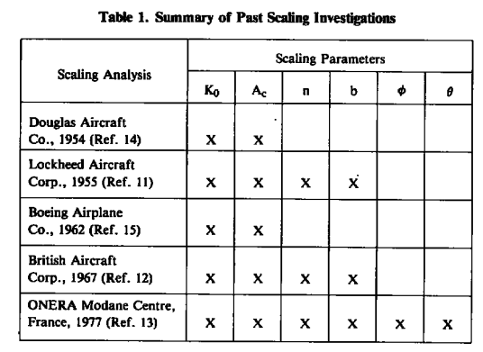
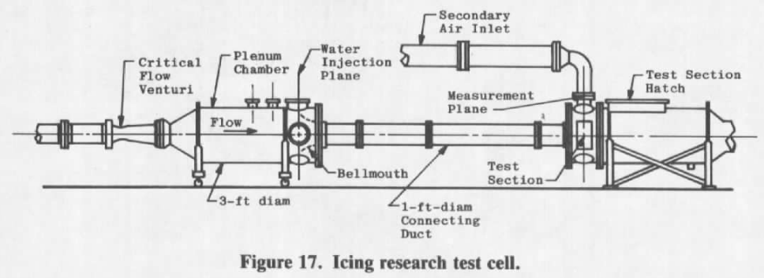
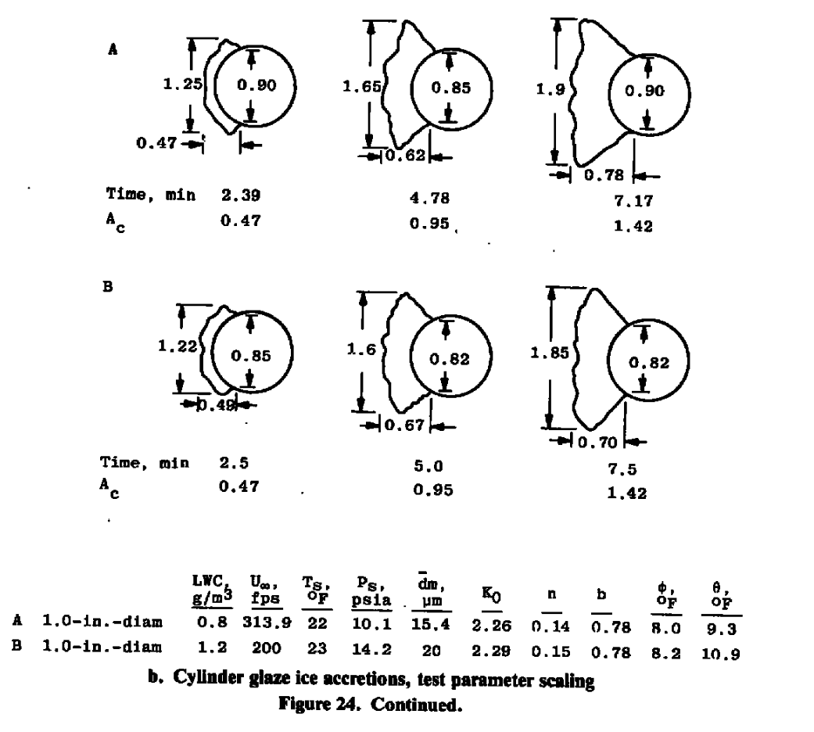
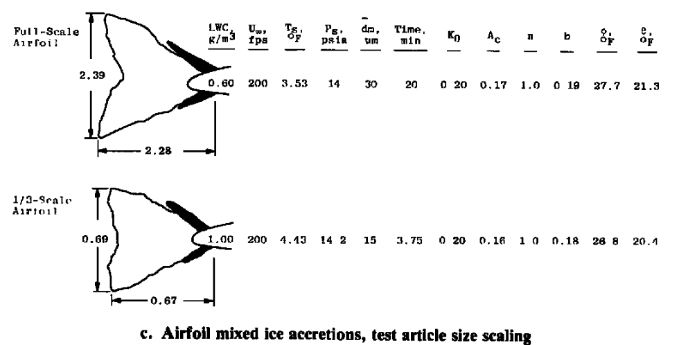
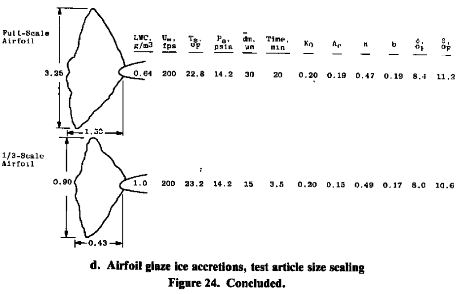

title: AEDC-TR-85-30  
Date: 2022-08-01 12:00  
category: icing tunnels  
tags: icing tunnels  

### _"It would be beneficial to the icing community if the feasibility of using scale models in these tests could be proven."_  
  

# "Analysis and Verification of the Icing Scaling Equations" [^1]    

## Summary  
An expanded set of icing similarity terms are derived and tested.  

## Key Points  
1. Water drop impingement similarity is simplified using Ko.  
2. Icing heat transfer similarity terms derived from Messinger are added.  
3. Tests in an icing wind tunnel validate the selected set of similarity terms.  

## Abstract  

>1.1 BACKGROUND  

>The formation of ice on aircraft surfaces occurs during flight through supercooled
droplets. Ice accretions on these surfaces usually degrade both aircraft performance and
operational safety. For this reason, it has become important in the design and certification
phases of system development to evaluate system performance degradation because of icing.

>The most acceptable method of evaluating the performance characteristics of aircraft
and aircraft components for system certification would be to conduct flight tests in natural
icing conditions. Adequate system evaluation through icing flight tests requires specific
weather conditions, posing severe operational limitations because of the low frequency of
their occurrence. This makes certification through flight testing time consuming and
expensive because large amounts of flying time are required to adequately evaluate a system
over a wide range of conditions. Flight testing in a simulated cloud produced by an icing
tanker would appear to be the next most desirable method of conducting icing tests. In
practice, this method of flight testing is severely limited by tanker operational limitations,
lack of control of atmospheric parameters such as temperature, pressure and humidity, and
the logistics of maintaining steady flight in a cloud produced by a leading aircraft.
Therefore, ground testing in altitude facilities has become an accepted approach for
evaluating aircraft system performance in icing conditions.

>The size of many of the aircraft components to be tested greatly limits the number of test
facilities capable of conducting icing tests. It would be beneficial to the icing community if
the feasibility of using scale models in these tests could be proven. The problem is
complicated because the icing process is governed by the impingement of water droplets and
the thermodynamics of the freezing process on the surface. This document gives the results
of a study conducted at Arnold Engineering Development Center (AEDC) Engine Test
Facility (ETF) to experimentally verify a set of icing scaling equations.  

>1.2 SCOPE OF INVESTIGATION  
 
>A research program was conducted at the AEDC/ETF to evaluate the icing scaling
requirements. The objectives of the study were (1) to evaluate the equations governing the
icing process to identify proposed scaling parameters, (2) to develop a computer code to
solve the various forms of the icing scaling equations, (3) to conduct tests to determine
which, if any, of the proposed methods produced scale ice accretions, and (4) if an accurate
set of icing scaling equations were found, to write a final computer code that could be used
in icing tests.  

>The scaling verification tests were conducted using full- and half-scale circular cylinders
and full-, 1/3-, and 1/6-scale airfoil sections. By applying a postulated scaling method, test
conditions that should produce scale ice accretions were calculated using the computer code
developed for this study. The size and shape of the ice accretions resulting from these test
conditions were compared with full-scale results to determine the accuracy of the scaling
method. The objectives of the study were met by identifying a scaling method that produces
scaled ice accretions over a wide range of test conditions and that can be applied to a variety
of icing testing situations.

## Discussion 

This is a long publication (80 pages, 38 figures), so this will be a highly condensed review. 

>TYPES OF ICING SCALING  

>The first and most obvious type of icing scaling is that in which the ice accretions are
formed on a subscale model similar to those that would be obtained at full-scale. The ability
to test subscale geometries would allow smaller test facilities to conduct a wider range of
icing tests. Since smaller test facilities are usually less expensive to operate than larger
facilities, the cost would be substantially reduced.  

>A second type of icing scaling, test parameter scaling, is aimed at increasing the
simulation capabilities of test facilities by extending the Mach number, altitude, and/or
temperature ranges. Icing scaling equations relate the test cell atmospheric and
meteorological conditions so that similar ice accretions can be formed. These equations
indicate how ground test conditions could be modified to avoid the operational limits of a
test facility, yet achieve the appropriate icing condition. For example, a facility may be
limited to ambient pressure but have the need to produce an ice accretion that would be
formed at an altitude of 10,000 ft. The scaling equations would be applied to determine the
test conditions at atmospheric pressure required to simulate the icing that occurs at the
altitude flight condition. This type of scaling will allow test facilities to offer a wider range of
possible conditions to an aircraft manufacturer to evaluate their flight system.  

>The applications of both types of scaling would make them very attractive to both the
test facility operator and the aircraft manufacturer.

Several candidate similarity terms are developed. 

### Impingement similarity  

Water drop impingement similarity is used, similar to [NACA-RM-E8A27]({filename}scaling_in_naca_tests.md), 
but rather than separate K and Phi terms, a merged Ko term is used.

>K = 2/9 ρw rd^2 U∞/(μa c) &nbsp;&nbsp;&nbsp;&nbsp; (3)

>Ko = (λ/λs) K  &nbsp;&nbsp;&nbsp;&nbsp; (8)

>Where:  
ρw is water density  
rd is drop diameter radius  
U∞ is free stream air speed  
μa is air viscosity  
c is chord length  

These and λ/λs we saw in [Langmuir and Blodgett]({filename}Mathematical Investigation of Water Droplet Trajectories.md) [^2].

### Water exposure similarity

>Ac = LWC(U∞)τ / (ρwc)  &nbsp;&nbsp;&nbsp;&nbsp; (16)

>Where:
Ac is the accumulation parameter  
LWC is the liquid water content  
U∞ is free stream air speed  
τ is time in icing  
ρw is water density  
c is chord length  
Ts is air static temperature  

### Freezing similarity  

A heat transfer analysis derived from Messinger [^3] was developed.

>b = Wwcpws / hc  &nbsp;&nbsp;&nbsp;&nbsp; (20)  
>Φ = 32 - Ts - U∞^2/(2 gc J cpw,s)  &nbsp;&nbsp;&nbsp;&nbsp; (21)  
>Θ = (Tsur - Ts - U∞^2/(2 gc J cpa)) + We Lv / hc   &nbsp;&nbsp;&nbsp;&nbsp; (22)  

>Where:  
Ww is water catch rate  
c is chord length  
cpws is the specific heat of water on the surface  
hc is heat transfer coefficient  
Ts is air static temperature  
U∞ is free stream air speed  
gc is a unit system constant  
J is the unit system work to thermal energy factor
32 is the ice melting point temperature in Fahrenheit
Tsur is surface temperature  
cpa is the specific heat of water on the surface  
We is the rate of surface water evaporation  
Lv is the latent heat of evaporation of water

The gc and J terms are explained further in [A Brief Digression on Unit Systems]({filename}brief-digression-on-units.md). 

We is explained further in Appendix B of AEDC-TR-85-30. 

While it was not explicitly noted in AEDC-TR-85-30, note that:  
>n = (cpw,s/Lv) (Φ + Θ / b)  

So if Φ, Θ, and b are matched then n will be matched. 

>In summary, the following scaling equations will be evaluated in the experimental
portion of this study:

>(Ko)model = (Ko)full-scale  
>(Ac)model = (Ac)full-scale  
>(n)model = (n)full-scale  
>(b)model = (b)full-scale  
>(Φ)model = (Φ)full-scale  
>(Θ)model = (Θ)full-scale  

Table 1 shows prior scaling analysis works. 
It shows that industry and others were actively developing scaling methods 
at a time when NACA/NASA was not. 

  

I have read two of these in the past (but I do not have a copy of them), 
and I have not found any of these online. 
It is not surprising that the one from Lockheed Aircraft includes freezing fraction, 
as Messinger worked there at that time. 

### Icing wind tunnel tests

Various methods were tried. 

  

The Icing Research Test Cell was used.

  

The method where Ko, Ac, n, Φ, and Θ were held constant 
performed the best, both for scaling test article size or other parameters.  

  
  
  
  

>These results have identified a scaling procedure that accurately duplicates the 
ice-accretion profiles. In this scaling method, Ko, Ac, n, Φ, and Θ are held constant. 
The set of verified scaling equations can, therefore, be expressed as follows:  

>1. (Ko)model = (Ko)full-scale  
>2. (Ac)model = (Ac)full-scale  
>3. (n)model = (n)full-scale  
>4. (Φ)model = (Φ)full-scale  
>5. (Θ)model = (Θ)full-scale  

>A final version of the icing scaling similitude code, SIMICE, was written to solve the
above set of verified scaling equations (See AEDC-TR-85-30, Vol. II). The icing test
parameters that must be determined from these equations are as follows:

>1. velocity  
>2. static pressure  
>3. static temperature  
>4. liquid water content
>5. drop diameter
>6. icing time  

I have not been able to find "AEDC-TR-85-30, Vol. II", or the SIMICE program online.

>Note that there are six icing test parameters and only five equations, indicating that the
problem is underspecified and that one of the test parameters can, therefore, be arbitrarily
selected. In practice, this additional parameter is selected to overcome a test facility
limitation. The solution of the above equations will be illustrated by two practical scaling
examples to be discussed in the following section.

Note also that some icing wind tunnels do not control pressure. 
In those cases, the five equations determine the five test parameters. 

## Conclusions  

>8.0 SUMMARY OF RESULTS  
The objectives of this study were to evaluate the equations governing the ice-accretion
process to identify proposed scaling parameters and to conduct tests to determine which, if
any, of the proposed methods produced scale ice accretions. A set of scaling equations were
verified, and limitations of the scaling techniques were identified. A computer code was
developed to solve the scaling equations for use in various icing applications. The results of
this study can be summarized as follows:  
>1. A set of equations that can be used to calculate test conditions so that scaled ice
shapes are produced on geometrically similar bodies was developed and
experimentally verified. The test conditions are such that Ko, Ac, n, Φ, and 0, are
held constant.  
>2. The post-test evaluation of the scaling parameters based on the actual test conditions
was necessary for the accurate evaluation of test results.  
>3. An icing similitude computer code, SIMICE, was developed to calculate similitude
conditions using the verified scaling equations.  
>4. The equations are applicable over the range of meteorological conditions found in
natural icing, with the possible exception of velocity.  
>5. Velocity is the primary limitation of the scaling equations. To maintain scaled flow
fields and droplet impingement characteristics, both the model and full-scale
velocities must yield a Reynolds number greater than or equal to 2.0 x 10^5 and less
than the velocity giving the critical Mach number of the body geometry.  
>6. At values of dynamic pressure of approximately 1.6 psia, the shedding
characteristics of the ice accretion were observed to effect the final ice shape.
Therefore, ice accretions did not scale well when qf > 1.6 psia and qm < 1.6 or vice
versa.  
>7. A method for scaling shedding characteristics by maintaining the dynamic pressure
was developed, but facility limitations did not permit adequate verification.
Additional testing is required to verify this ice-shedding scaling technique.  

The selected method yielded excellent results.

In later literature, it is sometimes called the "AEDC" or "Ruff" method. 

The method can be rather restrictive, 
particularly if adjusting test section air pressure is not available. 
Depending on the flight reference condition, 
the calculated test condition may be outside of the envelope of 
MVD-LWC-Airspeed that the facility can produce (a subject not covered in AEDC-TR-85-30).

## Citations

AEDC-TR-85-30 cites 25 publications (20 in the main text, 5 more in the appendices).  

- Pope, A.: Wind Tunnel Testing. John Wiley and Sons, Inc., New York, 1947.  
- Bragg, M. B., Gregorek, G. M., and Shaw, R. J.: "An Analytical Approach to Airfoil Icing." AIAA Paper No. 81-0403, Presented at the 19th Aerospace Sciences Meeting, January 12-15, 1981.  
- Langmuir, E. and Blodgett, K. B.: "A Mathematical Investigation of Water Droplet Trajectories." General Electric Co., ATI 25-223, February 1946.  
- Bowden, D. T., Gensemer, A. E., and Skeen, C. A.: "Engineering Summary of Airframe Icing Technical Data." Federal Aviation Agency FAA-ADS-4, March 1964.  
- Frost, W., Chang, H. P., and Kimble, K. R.: "Particle Trajectory Computer Program for Icing Analysis." Final report for NASA/Lewis Research Center Under Contract NASA-22442 by FWG Associates, Inc., April 1982.  
- Chang, H. P., Frost, W., and Shaw, R. J." "Influence of Multidroplet Size Distribution on Icing Collection Efficiency." Presented at the AIAA 21 st Aerospace Sciences Meeting, AIAA Paper No. 83-0110, January 10-13, 1983.  
- Olsen, W.: "Close-up Movies of the Icing Process on the Leading Edge of an Airfoil." NASA/Lewis Research Center Movie C-313, 1985.  
- Tribus, M. V. et. al.: "Analysis of Heat Transfer Over a Small Cylinder in Icing Conditions on Mount Washington." American Society of Mechanical Engineers Transactions, Vol. 70, 1949, pp. 871-876.  
- Messinger, B. L.: "Equilibrium Temperature of an Unheated Icing Surface as a Function of Airspeed." Journal of the Aeronaulical Sciences, Vol. 20, No. 1, January 1953, pp. 29-42.  
- Fergus, J. L., Jr.: "A Steady-State Thermal Model for Analysis of Incipient Icing on an Airfoil Leading Edge." AEDC-TR-83-2 (AD-AI31207), July 1983.  
- Sibley, P. J. and Smith, R. E., Jr.: "Model Testing in an Icing Wind Tunnel." Lockheed Aircraft Corporation, Report No. LR10981, 1955.  
- Jackson, E. T.: "Development Study: The Use of Scale Models in an Icing Tunnel to Determine the Ice Catch on a Prototype Aircraft with Particular Reference to Concorde." British Aircraft Corporation (Operating) Ltd., Filton Division, SST/B75T/RMMcK/242, July 1967.  
- Armand, C. et. al.: "Techniques and Facilities Used at the Onera Modane Centre for Icing Tests." North Atlantic Treaty Organization Advisory Group for Aerospace Research and Development, AGARD-AF-127, November 1978.  
- Hauger, H. H. and Englar, K. G.: "Analysis of Model Testing in an Icing Wind Tunnel." Douglas Aircraft Company, Inc. Report No. SM14933, 1954.  
- Dodson, E. O.: "Scale Model Analogy for Icing Tunnel Testing." Boeing Airplane Company, Transport Division, Document No. D66-7976, March 1962.  
- Bentley, H. T.: "Fiber Optics Particle-Sizing System." AEDC-TR-73-111 (AD-766647), September 1973.  
- Hunt, J. D.: "A Comparison of Particle Diagnostic Systems." AEDC-TR-80-33 (AD-AI04027), August 1981.  
- Willbanks, C. E. and Schulz, R. J.: "Analytical Study of Icing Simulation for Turbine Engines in Altitude Test Cells." AEDC-TR-73-1444 (AD-770069), November 1973.  
- Stallabrass, J. R.: "Procedure for Allowing for the Evaporation from Water Droplets in an Engine Icing Test Cell." National Research Council of Canada (NRC) Report LTR-LT-129, January 1982.  
- Brun, R. J., Serafini, J. S., and Gallagher, H. M.: "Impingement of Cloud Droplets on Aerodynamic Bodies as Affected by Compressibility of Air Flow Around the Body." NACA TN 2903, March 1953.  
- Hobbs, P. V.: Ice Physics. Oxford University Press, Ely House, London, 1974.  
- Sogin, H. H.: " A Design Manual for Thermal Anti-Icing Systems." Illinois Institute of Technology, WADC-TR-54-313, December 1954.  
- Lozowski, E. P., Stallabrass, J. R., and Hearty, P. F.: "The Icing of an Unheated Nonrotating Cylinder in Liquid-Water Droplet-Ice Crystal Clouds." National Research Council of Canada (NCR) Report LTR-LT-88, February 1979.  
- Cansdale, J. T. and Gent, R. W.: "Ice Accretion on Aerofoils in Two-Dimensional Compressible Flow--A Theoretical Model." Royal Aircraft Establishment Technical Report 82128, January 1983.  
- Kreith, F.: Principles of Heat Transfer. Intext Educational Publishers, New York, 1973 (Third Edition)  

An online search [^4] found 93 citations of "Analysis and Verification of the Icing Scaling Equations"
(it has been published in various forms). 

## Notes

[^1]: Ruff, Gary A.: Analysis and Verification of the Icing Scaling Equations. AEDC-TR-85-30 Vol. I (revised), 1985  
[^2]: Messinger, B. L.: Equilibrium Temperature of an Unheated Icing Surface as a Function of Airspeed. Preprint No. 342, Presented at I.A.S. Meeting, June 27-28, 1951.  
[^3]: Langmuir, Irving, and Blodgett, Katherine B.: A Mathematical Investigation of Water Droplet Trajectories. Tech. Rep. No. 5418, Air Materiel Command, AAF, Feb. 19, 1946. (Contract No. W-33-038-ac-9151 with General Electric Co.)  
[^4]: 
[scholar.google.com](https://scholar.google.com/scholar?cites=10637640011419881117&as_sdt=5,48&sciodt=0,48&hl=en)  

