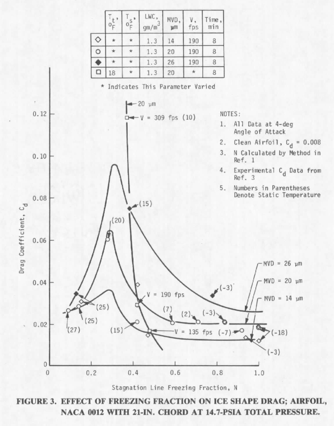
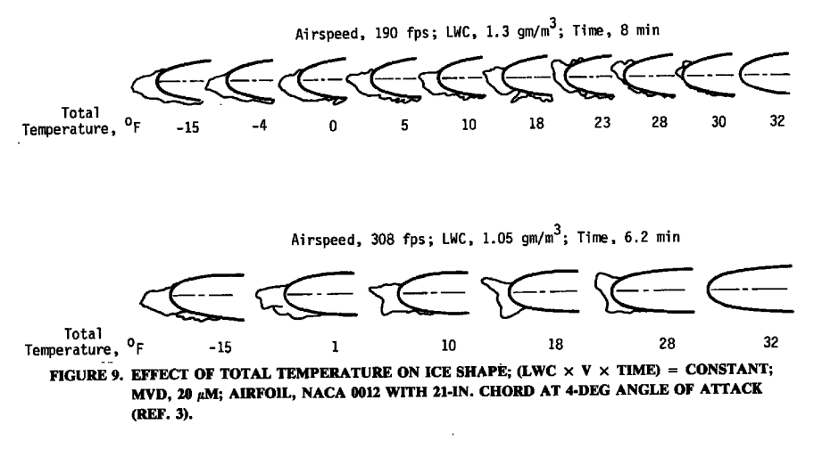

title: AEDC-TR-87-23  
category: icing tunnels  
status: draft  

###_"drag coefficient (Cd) was used as an index of similitude by quantitatively indicating how much the shape or ice surface changed"_  

  

#"An Empirical Look at Tolerances in Setting Icing Test Conditions with Particular Application to Icing Similitude" [^1]  

##Abstract  

>Often, engine icing tests cannot be conducted at conditions that are considered the critical
test points because of aircraft engine test facility operational constraints or the inability to
find the desired conditions in natural icing flight tests. The use of ice scaling laws may
circumvent this testing limitation. Earlier studies (Refs. 1 and 2) of the application of ice
scaling (similitude) to aircraft engine testing indicated that experimental data were needed
to determine to what extent icing test conditions [temperature (T), velocity (V), liquid water
content (LWC), median volume diameter (MVD), pressure (P)], could vary and still achieve
similar test results.
In this investigation, experimental data were gathered and analyzed to determine how
much each of the ice scaling parameters could vary without affecting similitude.
Also studied were the effects of changing the ice scaling parameters and the icing test
conditions on the resulting ice shapes. This effort used ice shape and associated drag coefficient
data collected during other studies as well as new ice shape data which was collected as a
part of this study.
The results of this study indicate that  
>1. Icing similitude criteria should be established in advance of the test in order to
focus attention on the critical components and critical icing test conditions.  
>2. Changes in the ice scaling parameters do not necessarily indicate a quantifiable
change in the ice shape (similitude).  
>3. Experimental data are useful in determining allowable changes in the icing test
conditions (T, LWC, MVD, V, time) and may be a useful indicator of similitude
in some icing regimes.  
>4.  Determination of allowable tolerances for the icing test parameters depend on
which icing regime one is operating in (e.g., rime or glaze ice). (Glaze ice accretions
are generally less tolerant to changes in test conditions.)  
>5. The scaling law used herein cannot solely be used to determine tolerances in setting
test conditions.  

##Discussion  

To me, this publication is as much about critical icing conditions selection as it is about 
icing wind tunnel test.  

The drag coefficient with ice is proposed as a similarity "goodness" indicator. 

>drag coefficient (Cd) was used
as an index of similitude by quantitatively indicating how much the shape or ice surface changed
as measured by this aerodynamic parameter. The question of how much Cd can be allowed
to change and still maintain similitude cannot be generalized since this would be dictated
by the particular application. However, this does not prevent using Cd as a similitude
"goodness" indicator or index.

  

Those ice shapes and others with measure Cd values were plotted versus 
calculated leading edge freezing fraction (and other parameters).

  

This suggests that for this airfoil and this range of conditions, 
there is a peak effect near a stagnation line freezing fraction of 0.3. 
Slightly different values of freezing fraction would put one in the regions to either side of steep slopes,
where a small difference in freezing fraction equals a large difference in Cd. 
Thus it is hard to determine a universal "close enough" tolerance on freezing fraction 
or any other variable.  

It is perhaps illustrative that the measurements shown in Figure 3 are not 
numerous enough to capture the peak Cd value with confidence 
(the lines drawn are speculative, not real curve fits). 
This is not because the tests were not planned well, 
but because it is hard to do.  

To find such a peak in detail, options include:  

1. have numerous, tightly spaced test points in the test plan   
2. have some pre-knowledge that there is a peak near certain conditions, and plan several closely space test points near that  
3. during a test, plot points and realize there is an apparent peak, and add more test points near the peak    

I would not say that for all airfoils and conditions there is a peak effect near freezing fraction of 0.3, 
but if you have no other information that might be a good place to start searching.  

Not every test measures section Cd with ice. 
There are technical challenges to measuring the section drag with either a balance or pressure rake. 
These add time and cost to a test. 
Also, while the section Cd measured may be a useful relative value, 
it is not clear that it relates directly and linearly to airplane level values. 

##Conclusions  

>CONCLUSIONS
A study was conducted to investigate the possibility of achieving approximate icing
similitude by comparing ice shapes against their corresponding icing scaling parameters. The
results of this investigation indicate that:  
>1. The criteria for establishing icing similitude should be specified in advance of
the simulation. Allowable similitude tolerances should also be specified.  
>2. A change in a particular icing scaling parameter may or may not indicate a change
in ice shape (similitude). The reason for this is the functional dependency of
a particular scaling parameter (0, Φ, N, Ac, Ko) on the icing test conditions (T,
LWC, MVD, V, P) that caused the change in the ice shape.  
>3. It may be more indicative of similitude to consider changes in ice shape brought
about by changes in the test conditions rather than changes of the icing scaling
parameters.  
>4. The allowable tolerance in setting icing test conditions will depend upon the
similitude application and the particular icing conditions at which the test is to
be conducted (e.g., rime versus glaze ice region).
>5. As long as the local icing conditions ensure rime ice accretions on the component
under consideration (N is approximately > 0.7), similitude is easier to accomplish.  
>6. For specific temperatures, the LWC term can be decreased to levels that cause
the icing surface thermodynamics to return to the rime ice accretion regime, and
thereby allows use of the (LWC x V x t) term to achieve approximate similitude.  
>7. The ice scaling laws of Ref. 1 cannot be used to determine allowable tolerances
in setting test conditions.  
>8. The effects of pressure (altitude) on icing similitude in the range studied herein
are negligible and can be ignored in these cases. This does not consider the effects
of icing due to pressure changes, internal to an engine, for example, nor does
it consider how changes in free-stream altitude pressure may change local icing
test conditions and, hence, affect ice shape.  
>9. Additional work is needed to develop other approaches to ice scaling. The ice
scaling code employed in this study may be too restrictive.  

It is perhaps illustrative that the measurements shown in Figure 3 are not 
numerous enough to capture the peak Cd value with confidence 
(the lines drawn are speculative, not real curve fits). 
This is not because the tests were not planned well, 
but because it is hard to do.  

To find such a peak in detail, options include:  

1. have numerous, tightly spaced test points in the test plan   
2. have some pre-knowledge that there is a peak near certain conditions, and plan several closely space test points near that  
3. during a test, plot points and realize there is an apparent peak, and add more test points near the peak    

I would not say that for all airfoils and conditions there is a peak effect near freezing fraction of 0.3, 
but if you have no other information that might be a good place to start searching.  

Not every test measures section Cd with ice. 
Cd measurements add time and cost to a test. 

There are technical challenges to measuring the section drag wih ice with either a force balance or pressure rake. 
Among the challenges is that the ice is not always uniform over the span. 

Also, while the measured section Cd with ice may be a useful relative value, 
it is not clear that it relates directly and linearly to airplane level values. 

##Citations  

AEDC-TR-87-23 cites seven publications:  

- Ruff, G. A. "Analysis and Verification of the Icing Scaling Equations, Vol. I." AEDC-TR-85-30, (AD-AI67976), November 1985.  
- Bartlett, C. S. "An Analytical Study of Icing Simifitude for Aircraft Engine Testing." AEDC-TR-86-26, DOT/FAA/CT-86/35, October 1986.  
- Olsen, W., Shaw, J., and Newton, J. "Ice Shapes and the Resulting Drag Increase for a NACA 0012 Airfoil." NASA-TM-83556, January 1984.  
- Flemming, R. J. and Lednicer, D. A. "High Speed Ice Accretion on Rotorcraft Airfoils." United Technologies Corporation, NASA-CR-3910, August 1985.  
- Langmuir, E. and Blodgett, K. B. "A Mathematical Investigation of Water Droplet Trajectories." General Electric Co., ATI 25 223, February 1946.  
- Willbanks, C. E. and Schulz, R. J. "Analytical Study of Icing Simulation for Turbine Engines in Altitude Test Cells." AEDC-TR-73-144 (AD-770069),November 1973.  
- Pheifer, G. D. and Maier, G. P. "Engineering Summary of Powerplant Technical Data." FFA-RD-77-76, July 1977.  

##Notes

[^1]: Bartlet, C. S.: "An Empirical Look at Tolerances in Setting Icing Test Conditions with Particular Application to Icing Similitude". AEDC-TR-87-23, DOT/FAA/CT-87-31, August, 1983.  
