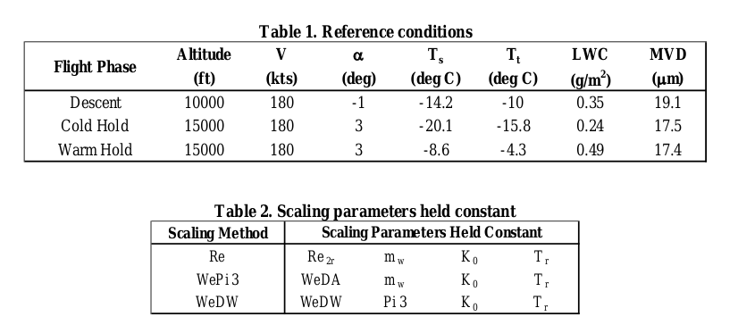
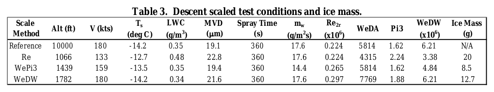
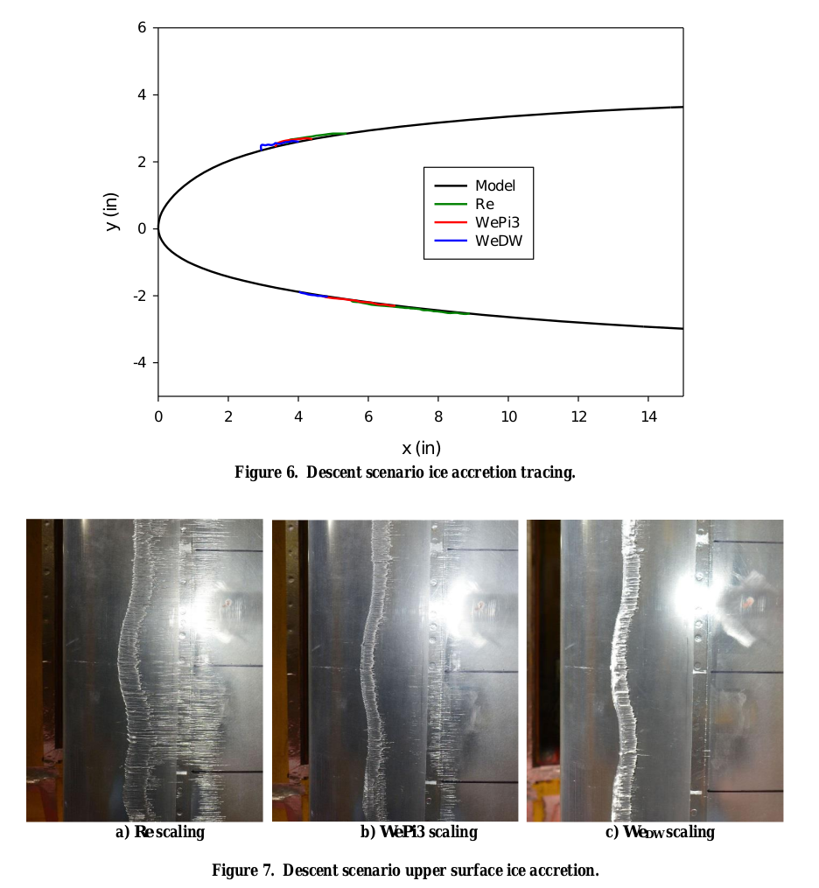
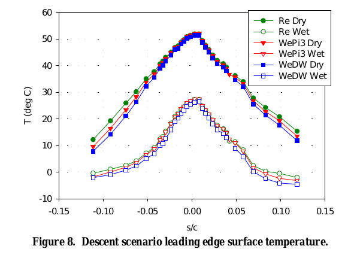
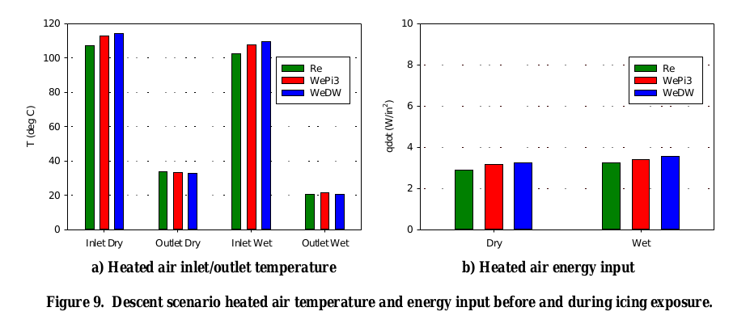
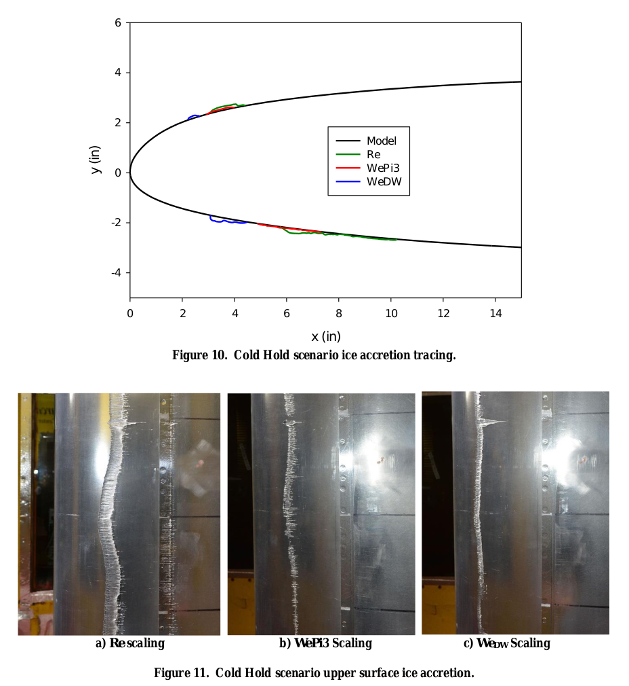

Title: AIAA-2017-3927  
Date: 2022-08-21 12:00  
category: icing tunnels  
tags: icing tunnel  

### _"With a thermal IPS, energy reduction can be achieved by operating in a ‘running wet’ mode under more extreme icing conditions."_  

  

# "Evaluation of Alternative Altitude Scaling Methods for Thermal Ice Protection System in NASA Icing Research Tunnel" [^1]  

## Summary  
A procedure for scaling conditions for ice protection tests is detailed. 

## Key Points  
1. Scaling methods for ice protection testing at sea level conditions were evaluated.  
2. The "WePi3" scaling method was recommended.  
3. The method requires in-test adjustments of heating to match reference surface temperatures.  
4. Test conditions for unheated areas will be different from those for heated areas.  

## Abstract  

>A test was conducted at NASA Icing Research Tunnel to evaluate altitude scaling methods
for thermal ice protection system. Two new scaling methods based on Weber number were
compared against a method based on Reynolds number. The results generally agreed with
the previous set of tests conducted in NRCC Altitude Icing Wind Tunnel where the three
methods of scaling were also tested and compared along with reference (altitude) icing
conditions. In those tests, the Weber number-based scaling methods yielded results much
closer to those observed at the reference icing conditions than the Reynolds number-based
icing conditions. The test in the NASA IRT used a much larger, asymmetric airfoil with an
ice protection system that more closely resembled designs used in commercial aircraft.
Following the trends observed during the AIWT tests, the Weber number based scaling
methods resulted in smaller runback ice than the Reynolds number based scaling, and the ice
formed farther upstream.
The results show that the new Weber number based scaling
methods, particularly the Weber number with water loading scaling, continue to show
promise for ice protection system development and evaluation in atmospheric icing tunnels.

## Discussion  

This is one of a series of studies on the test scaling of thermal systems. 
AIAA-2017-3927 outlines several prior tests that, for brevity, will not be detailed herein. 

### Comparison to unheated similarity

The heated scaling method has similarities to unheated ice test scaling (see [NASA-CR-2004-212875]({filename}NASA-CR-2004-212875.md) [^2]). 
The impingement parameter Ko is matched in both the heated and unheated methods. 
Stagnation line water catch rates and heat transfer are calculated using the same airfoil 
radius of curvature cylinder approximations. 
A Weber number is matched to determine test airspeed, but different Weber numbers (We_d in unheated, We_da (We_c) in heated). 

While the brief section on thermal ice-protection systems testing in [NASA-CR-2004-212875]({filename}NASA-CR-2004-212875.md) 
recommended matching the product β_o Ac (water catch rate, m_w below), 
the WePi3 method (detailed below) does not; in general, the water catch rate is scaled down in scaled test. 
It is not stated if heating would be scaled, so I assume that it would not be. 

### Heated similarity

There are significant differences from unheated scaling. 
Stagnation line freezing fraction n_o is not matched in the heated similarity. 
Recovery temperature is matched in the heated similarity, 
while Phi is matched to determine the air temperature static temperature in the unheated similarity. 
For the WePi3 method, liquid water content is selected to match a calculated ratio of stagnation line 
water catch rate to evaporation rate, referred to as Pi3. 

So, one will not have the same test conditions for unheated and heated runs 
of the same flight or reference condition. 

Heating is adjusted to match reference surface temperatures. 
This step is empirical, as detailed below. 
So, the test condition is not completely determined in advance 
(unlike unheated similarity), but requires adjustments in test. 

>B. Test Conditions  
Three flight icing scenarios served as the reference conditions for the study. These were:  
>   1) Descent  
>   2) Cold hold  
>   3) Warm Hold  

>The conditions for these scenarios are given in Table 1. These conditions were identical to those used in the AIWT
tests, except for the angle of attack. The asymmetric airfoil and IPS used in this test called for varying the angle of
attack to match the corresponding icing scenarios. The scaled conditions were obtained by reducing the altitudes
shown in Table 1 to the tunnel altitude and scaling the icing parameters while maintaining the parameters shown in
Table 2 constant. For the Re-based scaling method, the Reynolds number, water loading, modified inertia parameter,
and recovery temperature were kept constant. For the We_DA-based scaling method, air density based Weber number,
water loading, modified inertia parameter, and recovery temperature were kept constant. For the WePi3-based scaling
method, the air density-based Weber number, Pi3 mass ratio, modified inertia parameter, and recovery temperature
were kept constant.

  
There is apparently a typo in Table 2. 
I believe that what was intended is:  

| Scaling Method | Scaling Parameters Held Constant                         |
|----------------|----------------------------------------------------------|
| Re             | Re_2r &nbsp;&nbsp; m_w &nbsp;&nbsp; K_o &nbsp;&nbsp; T_r |
| WePi3          | We_DA &nbsp;&nbsp; Pi3 &nbsp;&nbsp; K_o &nbsp;&nbsp; T_r |
| We_DW          | We_DW &nbsp;&nbsp; m_w &nbsp;&nbsp; K_o &nbsp;&nbsp; T_r |

The test procedure was detailed:  
[Emphasis added]  
>D. Test Procedure  
For runback water to freeze in a manner similar to that at altitude, one of the conditions that needs to be met is that
model surface temperatures need to be similar to those occurring at altitude. With the IPS operating at the same heated
air mass flowrate and temperature, Reynolds number scaled conditions result in model surface temperatures nearly
identical to those during operation at altitude conditions. This is generally true for both dry air and icing conditions,
but more so for dry air. Because of this, the surface temperatures obtained at Re-scaled conditions could also be used
as reference values.  

>When operating at Weber number scaled conditions, however, convective cooling by the tunnel airstream is
elevated, resulting in a different model surface temperature profile. To compensate for the enhanced convective
cooling, IPS system output is increased in temperature, mass flow rate, or both, to obtain the correct model surface
temperature. __Therefore, Weber number scaling methods require two steps: first run at Reynolds number scaled
conditions to obtain the reference model surface temperatures, then run at Weber number scaled conditions adjusting
the IPS system to get the model surface temperatures obtained in step one. These two steps are performed with dry
air in the tunnel.__ The icing run may then commence at the Weber number scaled conditions to obtain runback icing
results similar to those that would be expected at altitude.  

>Once the IPS parameters for the test were obtained, tests were done using the various scaling methods described
in the introduction. The following describes the typical test procedure:  
>__1) Set IPS air mass flow rate and temperature to obtain “reference” (Re-scaled) model leading edge
temperature.__  
>&nbsp;2) Activate icing spray for a predetermined icing exposure time.  
>&nbsp;3) Shut tunnel down and document the ice accretion using photographs. Perform 2D ice tracings, ice
thickness measurements, and ice mass measurements. Record frozen rivulets using BIO-FOAM
impression block.  

  
  

Earlier test at the NRCC Altitude Icing Wind Tunnel (AIWT) 
(AIAA-2017-3926 [^3])
showed that the WePi3 scaling
matched a reference ice shape well, while Re scaling did not. 
A different airfoil and slightly different test conditions 
were used in that test.  

  
_from AIAA-2017-3926_

For this case, the scaling methods yielded slightly different results: 
  

The heated surface temperatures were well-matched over most of the heated surface.  
  

Different heating levels were required to match the surface temperatures.  
  

For another case, the scaling methods yielded different results: 
  

The advantages of the WePi3 method are discussed:  

>F. Further Discussion  
Three things can happen to water striking a heated aircraft surface in flight icing conditions: it can runback and
freeze on an unheated or insufficiently heated surface, it can be re-entrained into the airstream, or it can be evaporated.
The air pressure at flight altitudes affects all three of these modes of mass transport. Reynolds number scaling provides
the surface temperature conditions for freezing of runback water, but does not provide similitude in either liquid water
re-entrainment into the airstream or evaporation. The result is a great deal more ice being frozen on the surface than
would occur at altitude conditions. Weber number based on water density scaling, in conjunction with surface
temperature matching, provides the inertia to surface tension forces ratio needed to remove much of the excess water
that is frozen in the Reynolds number scaling method. Because convective cooling is, however, much enhanced
through the elevated Reynolds number generated by this method, excess ice can still result. The Weber number based
on air density and Pi3 method seeks to simulate all three modes of mass transport. Model surface temperature matching
creates the surface condition for the ice to freeze in the proper location. Weber number based on air density matching
generates ample inertia to surface tension forces to remove liquid water as would be the case at altitude, without 
over-enhancement of convective cooling through increased Reynolds number. 
Finally, the enhanced evaporation that occurs at altitude due to the decreased 
static pressure is addressed by reducing water loading in proportion to the
reduction in calculated water evaporation rate.  

I did not find further discuss of "surface tension forces to remove liquid water" from the surface. 
It is not clear to me if this was determined 
from observations of water leaving the surface, 
or if this is an assumption. 
Hopefully, this effect can be measured in the future. 

## Conclusions

[Emphasis added]
>IV. Conclusions  
A test was conducted at NASA Icing Research tunnel to evaluate altitude scaling methods for thermal ice
protection system. These methods were developed during a series of joint NASA/NRC-Canada tests at NRCC Altitude
Icing Wind Tunnel using a small symmetric airfoil model. The IRT allowed these scaling methods to be evaluated on
a larger asymmetric business jet airfoil with a more typical IPS design at higher Reynolds number.  
The results from the IRT test largely agreed with and supported the results from the AIWT tests. The We-based
scaling methods resulted in smaller runback ice mass than the Re-based scaling method. The Re-based scaling method
generated runback ice that formed farther downstream than the We-based methods. These results agreed with those
from the AIWT tests where the scale-method ice accretions were compared with reference (altitude) results. __The
Weber number based on air density coupled with surface temperature matching and water loading scaling produced
the most consistent results. While not perfect, this method appears to be the best available to scale thermal IPS icing
test conditions for altitude effects in an atmospheric icing wind tunnel.__ Moreover, they are not based on empirically-
generated scale factors, but on fundamental physics. What is left is to better determine the limits of the physical
relations used which can be accomplished by testing full-scale airfoil models in an altitude capable wind tunnel.

While the procedures used were sound for research purposes, 
they may be less practical for airplane design. 
It is impractical to have flight test reference case results 
before one designs and tests an ice protection system in an icing wind tunnel. 
One must also have an assessment of the Pi3 term for the reference case,
which requires an accurate heated surface leading edge temperature value in the icing condition. 

Here, the researchers used the Re scaled condition as a substitute for the 
reference condition to obtain surface temperatures. 
While that may be feasible for airplane system design development, 
it increases the number of test steps for a given flight condition simulation.
However, the reference heating is lower than the Re scaled by a small but unknown 
amount. 

>  
_from AIAA-2017-3926_  

With the WePi3 method, almost everything is scaled in test, 
except Weber number and surface temperature. 
While not explicitly addressed
(the test conditions all used the same test time as the reference condition), 
time is scaled, as water catch rate m_w is scaled. 
This may not be an issue for steady state operation, 
but it does lead to challenges for simulating transient operation 
(entering a cloud, activating the system, deicing, etc.).
  
The scaling of the heating may be a conceptual roadblock to some, 
as one may wonder what exactly is being tested relative to flight conditions. 
The heating required for the WePi3 method is generally higher than that of 
the flight condition, which some may view as "non-conservative",
if they do not understand the physics and testing of the scaling. 

For a few, "worst case" conditions to simulate the maximum power 
capacity of the system, it may not be possible to scale the power up. 
For that case, using the WePi3 test conditions but with nominal power 
would be conservative. 

### Comparisons to NASA/CR-2004-212875 calculations  

I used the methods from [NASA/CR-2004-212875]({filename}NASA-CR-2004-212875.md) 
[^2] to calculated similarity parameters. 

There appears to be a difference in the way the We_da values are calculated. 
Using the NASA/CR-2004-212875 methods, 
the calculated We_da values matched approximately, 
except for the WePi3 case (about 5% difference). 
This suggests that the WePi3 case was run at a slightly too high (about 3%) of
airspeed to match the Weber number. 
This may have had a rather small effect in the test, 
but is a challenge for those trying to reproduce the calculations. 

| Scale Method | We_Da (Table 3) | We_da (NASA/CR-2004-212875) |
|--------------|-----------------|-----------------------------|
| Reference    | 5814            | 5730                        |
| Re           | 4315            | 4351                        |
| WePi3        | 5814            | 6154                        |
| We_DW        | 7769            | 7808                        |

## Citations  

An online search [^4] found four citations of AIAA-2017-3927. 
I view this as under-valued for the excellent technical content.  

## Notes:  

[^1]: Lee, Sam, Addy, Harold E. Jr., Broeren, Andy P., and Orchard, David M.: 
"Evaluation of Alternative Altitude Scaling Methods for Thermal Ice Protection System in NASA Icing Research Tunnel." AIAA-2017-3927, 9th AIAA Atmospheric and Space Environments Conference. 2017. [ntrs](https://ntrs.nasa.gov/api/citations/20170007898/downloads/20170007898.pdf)  
[^2]: Anderson, David N.: Manual of scaling methods. No. E-14272, NASA/CR-2004-212875. 2004.  [ntrs.nasa.gov](https://ntrs.nasa.gov/api/citations/20040042486)   
[^3]: Orchard, D.M., Addy, H.E., Wright, W.B., and Tsao, J.: 
“Altitude Scaling of Thermal Ice Protection System in Running Wet Operation,”, AIAA-2017-3926. 9th AIAA Atmospheric and Space Environments Conference, May 5-9, 2017, Denver, CO. [ntrs.nasa.gov](https://ntrs.nasa.gov/citations/20180000400)  
[^4]: 
[scholar.google.com](https://scholar.google.com/scholar?hl=en&as_sdt=0%2C48&q=Evaluation+of+Alternative+Altitude+Scaling+Methods+for+Thermal+Ice+Protection+System&btnG=)  
