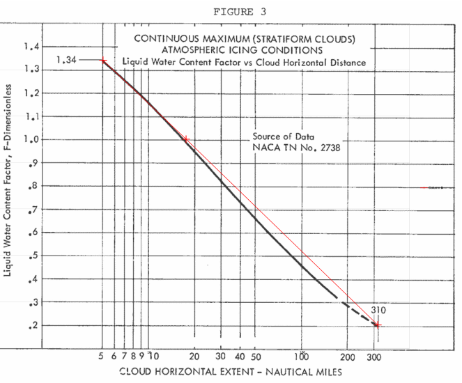

status: draft  
title: Digitized Figures for Appendix C  
tags: Jeck, Appendix C

### _"Modernized Appendix C - The Beauty & Benefits of Digitized Figures"_  
_Quote from an unpublished outline of topics by Richard Jeck._  

  

## Introduction  

The late Dr. Richard Jeck of the FAA [^1] in his [unpublished] "Icing Information Notes" advocated "New Replacement Figures for 14 CFR-25,29, Appendix C". 
He noted an advantage of "cleaner, sharper" appearance, compared to the published figures.    

That statement was true at the time (2005). 
As of this writing, the current figures [^2] are the same ones as from 60+ years ago. 
Here is the current Figure 1, which appears a little clearer than the ones I remember from circa 2005:  

  
_Public Domain image._    

The image is a transparent PNG, which is convenient for layering on other data for direct comparison (although it still has the old-school grid). 

The European Union Aviation Safety Agency (EASA) [^3] has "digitized" figures. 
That version of Appendix C Figure 1 is shown below:  

  
_Public Domain image._    

The EASA version incorporates one of Jeck's recommendations to use dual units ("English" and SI).  

Besides a sharper image, another advantage of digitized figures is that the 
numerical data is stored, and functions can be written to interpret within the figures. 
The advisory material is silent on how one should interpolate, so that is a matter of implementation. 
I have seen several implementations, some better than others.  

As computers require precise input to produce reliable output, 
this gives us a chance to note minor quirks and small errors in the figures, 
and how to deal with them.  

## Figure 1  

For continuous maximum icing conditions, 
FAA AC 20-73A [^4] defines temperature and LWC values at three MVD values:  

  
_Public Domain image._    

The source data NACA-TN-1855 [^5] is frankly short on details of how the values were selected. 
We can see an implied interpolation when it is compared to a "French" curve 
(a 1960s era Stewart 82-14 in this case, although I am sure that other models could provide a better match).  

  

The method of interpolating within values is not defined. 
I have seen many people "re-invent the wheel" many times, with slightly different results.  

If we use quadratic interpolation between defined MVD values, 
the shape of MVD curves for a given temperature differ from Figure 1.  

  

if we add points read from Figure 1 at intermediate MVD values (20, 30, 35), 
the curves can be well-reproduced:  

  

The redrawn version:  

  

If we use interpolation between the temperature lines, 
any value can be readily interpolated within the defined temperature and MVD values. 
We can also create a rearranged version of Figure 1.  

The result is sensitive to what interpolation is used between temperature lines. 
If linear interpolation is used, then the calculated LWC trends have discontinuous slopes. 
If cubic interpolation is used, the LWC values are anomalously low near 18 F. 
Quadratic interpolation yields the most believable interpolation in my opinion.  

  

Selecting quadratic interpolation, we have:  


We can now also add lines at 1F temperature and 1 μm MVD increments to Figure 1:  

  

Beauty is in the eye of the beholder. 
If one does not like this appearance, the Matplotlib [^6] software used to produce this plot offers many 
options to reformat it. 

## Figure 2  

Figure 2 is straight-forward to implement, as the corners are well-defined.  

  

Uses include determining if a condition is within Appendix C.  

## Figure 3   

There are two points defined on Figure 3, and it is also implied (from Figure 1) that at 17.4 nmi, F=1.0:  

```text
    nmi,  F
    5,    1.34  # end point
    17.4, 1     # implied point
    310,  0.2   # end point
```

These three points are co-linear on a log-linear plot.

If we plot the three points, we see that the Figure 3 line is almost log-linear. 
One can also see that the F value at 17.4 nmi is not quite 1.  
My closest reading is 0.985, but the width of the pixelated line when zoomed in makes it difficult to discern. 
The EASA version of the figure (not shown) is quite similar.  

  

I am not the first to notice this discrepancy, but I do not recall seeing it in print. 
Those who have noticed may have just elided over a 1.5% difference. 
It also may not be applied very often at distances near 17.4 nmi. 
However, slightly non-conservative (low) F values will result when using it near 17.4 nmi. 
As it is in the United States Code of Federal Regulations, it would take an Act of Congress to change it, 
even if everyone technically agrees that the value should be 1.00 at 17.4 nmi.  

One possible "fix" is to just use the log-linear line between the end points, the only explicitly defined points (as in the figure above). 
This yields 1.00 at 17.4 nmi. 
I have known people to do that, and it is probably "good enough" for many cases.   

However, if you want to replot Figure 3 as close as I can discern it, 
here is an implementation using 6 points, and quadratic interpolation:  

```text
    nmi, F
    5, 1.34     # end point
    10, 1.16    # intermediate point read from figure 3
    17.4, 0.985 # intermediate point read from figure 3
    50, 0.66    # intermediate point read from figure 3
    170, 0.32   # intermediate point read from figure 3
    310, 0.2    # end point
```

The redrawn figure:  

  

## Illustrations of interpolation   

We now have functions to interpolate within the Appendix C figures 1, 2, and 3.

Selecting an altitude of 16000 ft, 
the maximum temperature from Figure 2 can be found as 17.6 F:  

  

If we select MVD=18, the LWC value can be found from Figure 1:  

  

If one selects a horizontal distance of 120 nmi, the Liquid Water Content Factor F 
can be found from Figure 3:  

  

## Intermittent Maximum Icing  

The reader may implement functions for Appendix C, Figure 4, 5, and 6 using similar methods to those described above.  

Note that the X-axis of Figure 5 appears to be mislabeled. 
The highest altitude label on the axis should be 32000 ft, not 30000 ft. (Jeck corrected it as so in some of his works). 
If it truly were 30000 ft, some anomalous kink in the right-hand line would be required when plotted with a regular axis.  

  
_Public Domain image._    

The EASA version of Figure 5 (not shown) has a different axis scale, and avoids the labeling problem.  

## A mystery about Figure 1 values  

Jeck provided a table combining Figure 1 and Figure 3 LWC values as a function of MVW, temperature, and distance in DOT/FAA/AR-00/30 [^6].

  
_Public Domain image._    

The corresponding values for 17.4 nmi match the AC 20-73A Table 6 values, except for 14F, 15 MVD. 
Table 2 lists 0.59, while AC 20-73A Table 6 list 0.60 . 
Perhaps this is just a typo. 
However, the ratio 0.59/0.6=0.983, 
which is close the F value I read from Figure 3 for 17.4 nmi (0.985), 
perhaps indicating the LWC value was "corrected".
However, none of the other LWC values at 17.4 nmi had the adjustment.  
 
Jeck was very familiar with AC 20-73A and NACA-TN-1855 and cites them many times in his works. 
I am surprised that this small error exists as either a typo, or an unexplained adjustment.  

## What about spreadsheets?  

I find spreadsheets useful for displaying column data, 
and occasional simple arithmetic such as summing a column.  

In the past I have written complex spreadsheet routines to implement interpolations like those described. 
In general, I have found them to not be worth it. 
If you wish to implement them, then by all means go ahead.  

I have found that detailed analysis is best done in Python, 
driven by input data such as CSV and jason tables, 
or occasionally an SQL-type database where warranted. 
The most transportable output has proven to be CSV and jason tables, 
with PNG figures that can be conveniently included in text documents.  

If you want to just plot the line data for the figures in a spreadsheet, 
csv files are provided here.  

- For Figure 1, the MVD data is in 1 μm increments: [appendix_c_figure_1.csv](images/Jeck/appendix_c_figure_1.csv)  

- An example spreadsheet plot made in LibreOffice in the OpenDocument Format [^7] for Figure 1: [appendix_c_figure_1.ods](images/Jeck/appendix_c_figure_1.ods)  

- For Figure 2, the corner points are provided: [appendix_c_figure_2.csv](images/Jeck/appendix_c_figure_2.csv)  
 
- For Figure 3, the distance data is in 1 nmi increments: [appendix_c_figure_3.csv](images/Jeck/appendix_c_figure_3.csv)  

## Conclusions  

I hope that readers find the digitized figures useful, though few may find beauty in them. 
You can find the Python code that includes the interpolation functions at [github](). 

As Dr. Jeck wrote:  

> The purpose is solely to improve the appearance and utility of the Appendix C figure.  

This is the kind of thing that I would like to see in the Electronic Icing Handbook [^8] eventually.  

## Notes:  

[^1]: Dr. Jeck's obituary: [loudounfuneralchapel.com](https://www.loudounfuneralchapel.com/obituaries/richard-jeck/obituary)  
[^2]: CFR 14 Part 25 Appendix C [ecfr.gov](https://www.ecfr.gov/current/title-14/chapter-I/subchapter-C/part-25/appendix-Appendix%20C%20to%20Part%2025)  
[^3]: Appendix C to CS-25 [easa.europa.eu](https://www.easa.europa.eu/en/document-library/easy-access-rules/online-publications/easy-access-rules-large-aeroplanes-cs-25?page=67#)  
[^4]: FAA Advisory Circular AC No. 20-73: Aircraft Ice Protection. April 21, 1971. [faa.gov](https://www.faa.gov/documentLibrary/media/Advisory_Circular/AC_2--73.pdf)  
[^5]: [matplotlib.org](https://matplotlib.org)  
[^6]: Jones, Alun R., and Lewis, William: Recommended Values of Meteorological Factors to be Considered in the Design of Aircraft Ice-Prevention Equipment. NACA-TN-1855, 1949. [ntrs.nasa.gov](https://ntrs.nasa.gov/citations/19930082528)   
[^7]: Jeck, Richard K., Icing Design Envelopes (14 CFR Parts 25 and 29, Appendix C) Converted to a Distance-Based Format, DOT/FAA/AR-00/30, April, 2002. [ntrl.ntis.gov](https://ntrl.ntis.gov/NTRL/dashboard/searchResults/titleDetail/PB2002107034.xhtml)  
[^8]: OpenDocument [en.wikipedia.org](https://en.wikipedia.org/wiki/OpenDocument)   
[^9]: "Electronic Aircraft Icing Handbook"  
"This web page contains basic information on aircraft icing. Information placed on this page can be used to update or supplement information in the existing Aircraft Icing Handbook (AIHB). Update material can be printed out and inserted in the AIHB. The files on this page are referenced to those sections of the AIHB which they update or supplement, but are self-contained, not requiring consultation of the AIHB for their use. When appropriate the text information on this site is accompanied by spreadsheet or other files intended to enhance the value of the information to users."  
This includes format updates for DOT/FAA/CT-88/8-2 "Chapter III Ice Protection Methods", 
as well as files for analyzing water drop spectrum data, and a database of icing references circa 2007.  
This is mentioned in "Aircraft Ice Protection" AC 20-73A [faa.gov](https://www.faa.gov/documentLibrary/media/Advisory_Circular/AC_20-73A.pdf), 
but I could not find it on a current FAA website. 
You can view the version from 2007 at 
[web.archive.org](https://web.archive.org/web/20070813181929/http://aar400.tc.faa.gov/Programs/FlightSafety/icing/eaihbk.htm)  
